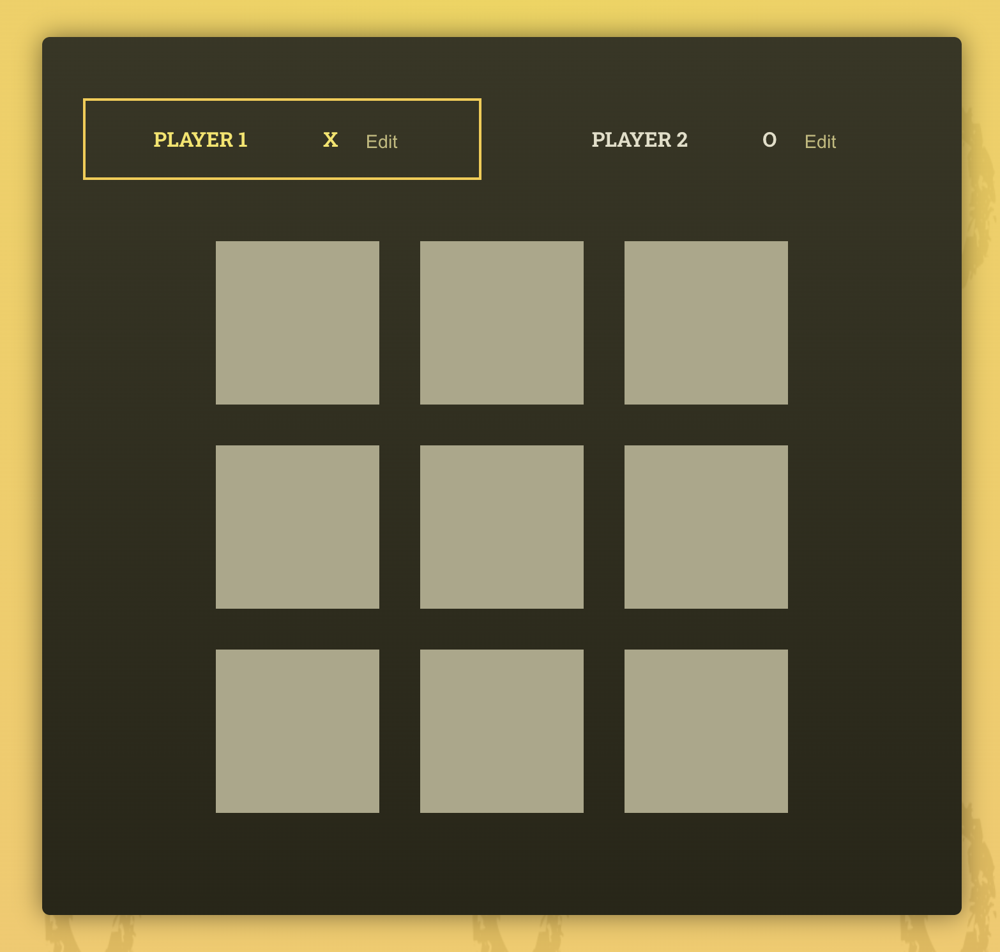
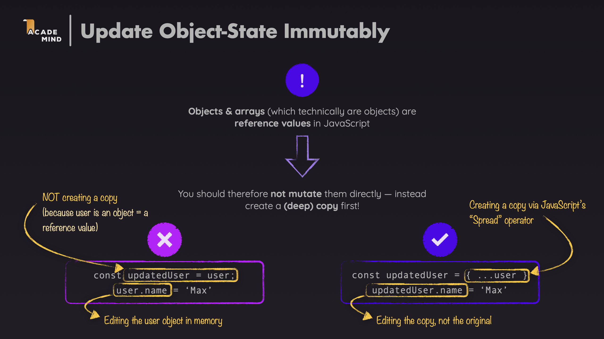
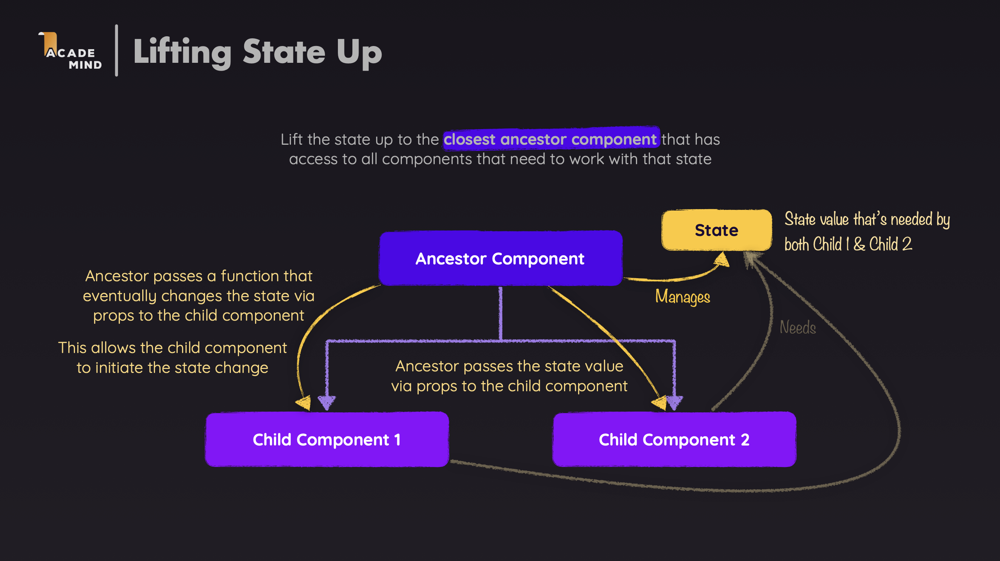

# Tic-Tac-Toe — React useState Deep Dive (TypeScript)

This project builds a classic Tic-Tac-Toe game to explore how React's `useState` actually works — the mental model, the common pitfalls, and the design decisions that follow from understanding state correctly. The project is written in **TypeScript + Vite**.

---

## 1. Problem Overview

### 1.1 The Game

Two players take turns marking X or O on a 3×3 board. The first player to place three marks in a row (horizontally, vertically, or diagonally) wins. If all 9 squares are filled with no winner, the game is a draw.



### 1.2 Technical Challenges

Building this game surfaces several concrete questions that require a correct mental model of React state to answer:

- How do we know whose turn it is?
- How do we update the board?
- Which component owns the data, which ones just display it?
- How do we let a player edit their name without affecting the running game?

---

## 2. useState Mental Model

Before examining design decisions, it's important to build a correct mental model of how `useState` works. Every design decision in this project follows directly from these four principles.

### 2.1 State is a snapshot of one render, not a live variable

`useState` does not return a variable you can reassign — it returns:

- A **frozen value** for this specific render
- A **setter function** to request a new render with a new value

```ts
type GameTurn = {
  square: { row: number; col: number };
  player: 'X' | 'O';
};

const [gameTurns, setGameTurns] = useState<GameTurn[]>([]);
```

`gameTurns` here is a local constant for this render — it does not change until the component renders again.

### 2.2 setState is a request, not an immediate update

Calling `setGameTurns(...)` does not change the current render's value. It tells React: "use this value for the *next* render." The current value stays unchanged until re-render.

```tsx
function handleSelectSquare(rowIndex: number, colIndex: number) {
  setGameTurns((prevGameTurns) => {
    // ...
    return updatedGameTurns;
  });
  // gameTurns here is still the OLD array — React has not re-rendered yet
}
```

**In this game:** After a player clicks a square, `setGameTurns` schedules a re-render. The current render's `gameTurns` does not change — the new value only appears in the next render cycle.

### 2.3 React remembers State — the Function component does not

On every render, the function component runs from scratch — all local variables are re-created from zero. React stores the actual state values **outside** the component, in its internal Fiber structure, keyed by the **order of hook calls**.

`useState([])` on subsequent renders does not re-initialize to `[]` — it asks React: *"what is the current value of hook N?"* and receives the stored value back, ignoring the initial argument entirely. This is why hooks cannot be called inside `if` statements or loops — React identifies which state belongs to which hook by position, not by variable name.

**In this game:** `useState<GameTurn[]>([])` for `gameTurns` does not reset the array on each render. React returns the accumulated turns from its internal storage — the component just reads it.

### 2.4 Functional update — when the new value depends on the previous one

When a state update depends on the previous value, use the callback form of the setter:

```tsx
setGameTurns((prevGameTurns) => {
  const currentPlayer = deriveActivePlayer(prevGameTurns);
  const updatedGameTurns: GameTurn[] = [
    { square: { row: rowIndex, col: colIndex }, player: currentPlayer },
    ...prevGameTurns,
  ];
  return updatedGameTurns;
});
```

React guarantees that `prevGameTurns` receives the **latest value from its update queue** — not whatever `gameTurns` the current closure holds. This prevents stale-value bugs when updates stack up.

| Principle | What it means in practice |
|---|---|
| State is a snapshot | `gameTurns` is frozen per render — derive everything else from it each render |
| setState is a request | The current render's values don't change — only the next render sees the update |
| React remembers state | The function re-runs every render; React's Fiber holds the real values |
| Functional update | Use `prev =>` when the new value depends on the current one |

---

## 3. Design Decisions

### 3.1 Derived State

**Question from Section 1.2:** *How do we know whose turn it is?*

Because state is a snapshot per render, we only store `gameTurns` as the single source of truth. Every other value — `activePlayer`, `gameBoard`, `winner` — is computed fresh from that snapshot each render. There is no risk of these values going out of sync because they are never stored independently.

**Derived State** is the concept of not storing values that can be calculated from existing data. Only store the "single source of truth" and compute other values from it.

**Example in this project:**

In the Tic-Tac-Toe project, we don't store `activePlayer` and `gameBoard` in state. Instead, they are calculated from `gameTurns` every time the component renders.

```ts
type PlayerSymbol = 'X' | 'O';
type GameTurn = {
  square: { row: number; col: number };
  player: PlayerSymbol;
};

function deriveActivePlayer(gameTurns: GameTurn[]): PlayerSymbol {
  if (gameTurns.length > 0 && gameTurns[0].player === 'X') {
    return 'O';
  }
  return 'X';
}
```

```ts
type SquareValue = PlayerSymbol | null;
type GameBoardState = SquareValue[][];

const gameBoard: GameBoardState = initialGameBoard.map((row) => [...row]);

for (const turn of gameTurns) {
  const { square, player } = turn;
  const { row, col } = square;
  gameBoard[row][col] = player;
}
```

**Explanation:**

- `activePlayer` is calculated from `gameTurns` using the `deriveActivePlayer()` function
- `gameBoard` is recalculated on each render based on `gameTurns`
- Only `gameTurns` is stored in state, this is the "single source of truth"

### 3.2 Immutable Updates (Don't Mutate Directly)

**Question from Section 1.2:** *How do we update the board without subtle bugs?*

React detects state changes by reference comparison. If you mutate an existing array or object in place, React sees the same reference and skips the re-render. Always create a new copy.

**Immutable Updates** is the principle of always creating a new copy for arrays/objects when updating state, not directly changing the old value.



**Example in this project:**

```ts
const updatedGameTurns: GameTurn[] = [
  { square: { row: rowIndex, col: colIndex }, player: currentPlayer },
  ...prevGameTurns,
];
return updatedGameTurns;
```

```ts
function handlePlayerNameChange(symbol: PlayerSymbol, newName: string) {
  setPlayers((prev) => ({ ...prev, [symbol]: newName }));
}
```

**Explanation:**

- `[...prevGameTurns]` creates a new array using the spread operator
- `{ ...prev, [symbol]: newName }` creates a new object with the updated property
- Never mutate directly: `prevGameTurns.push(...)` or `prev[symbol] = newName`

### 3.3 Functional State Updates

**Continuing from 3.2:** Once we commit to creating new arrays (never mutating), the next question is: *how do we make sure the new array is built from the latest state, not a stale closure value?*

This is where functional updates (see [2.4](#24-functional-update--when-the-new-value-depends-on-the-previous-one)) come in. Instead of reading `gameTurns` from the current closure, we let React pass the latest value directly into the setter callback.

**Functional State Updates** is a technique of using callback functions when updating state that depends on previous values. This helps avoid stale closure issues.

**Example in this project:** When adding a new turn, we need to rely on the current `gameTurns` to determine the next player:

```ts
function handleSelectSquare(rowIndex: number, colIndex: number) {
  setGameTurns((prevGameTurns) => {
    const currentPlayer = deriveActivePlayer(prevGameTurns);
    const updatedGameTurns: GameTurn[] = [
      { square: { row: rowIndex, col: colIndex }, player: currentPlayer },
      ...prevGameTurns,
    ];
    return updatedGameTurns;
  });
}
```

**Explanation:**

- `setGameTurns((prevGameTurns) => ...)` receives the previous state value as a parameter
- `deriveActivePlayer(prevGameTurns)` calculates the current player based on the old state
- Ensures we always use the latest state value, avoiding stale closures

**When to use:**

- When updating state depends on previous values
- When there are multiple consecutive state updates
- When you want to ensure state consistency

### 3.4 Lifting State Up & Callback Props

**Question from Section 1.2:** *Which component owns the data, which ones just display it?*

`GameBoard` needs the board data to render. `Log` needs the turn history. `Player` needs to know if it is the active player. All of this data flows from one source: `App`. Child components that need to trigger changes pass those changes back up via callback props.

**Lifting State Up** is a technique of managing shared state in a parent component and passing data down to child components via props. Child components can notify changes to the parent through callback functions.



**Example in this project:**

The `App` component manages all important state and passes it down to child components:

```tsx
return (
  <main>
    <div id="game-container">
      <ol id="players" className="highlight-player">
        <Player
          initialName="Player 1"
          symbol="X"
          isActive={activePlayer === 'X'}
          onChangeName={handlePlayerNameChange}
        />
        <Player
          initialName="Player 2"
          symbol="O"
          isActive={activePlayer === 'O'}
          onChangeName={handlePlayerNameChange}
        />
      </ol>
      {(winner || hasDraw) && (
        <GameOver winner={winner} onRestart={handleRestart} />
      )}
      <GameBoard onSelectSquare={handleSelectSquare} board={gameBoard} />
    </div>
    <Log turns={gameTurns} />
  </main>
);
```

**Explanation:**

- `App` manages: `players`, `gameTurns`, `gameBoard`, `winner`, `hasDraw`
- Passes callbacks down: `onSelectSquare` to `GameBoard`, `onChangeName` to `Player`
- Passes data down: `board` to `GameBoard`, `turns` to `Log`

**Component Tree:**

```text
App (state: players, gameTurns)
├── Player (X) - callback: onChangeName
├── Player (O) - callback: onChangeName
├── GameBoard - props: board, callback: onSelectSquare
├── GameOver - props: winner, callback: onRestart
└── Log - props: turns
```

### 3.5 Controlled Components & Two-Way Binding

**Question from Section 1.2:** *How do we let a player edit their name?*

The player name input needs to display the current value and update state on every keystroke. React's controlled component pattern achieves this: the input's `value` is driven by state, and `onChange` updates state on every keystroke — making React the single source of truth for the input value.

**Controlled Components** are input elements whose values are completely controlled by React state. This is how React implements "two-way binding" - state controls the UI and the UI updates state.

**Example in this project:**

The `Player` component uses a controlled input to edit player names:

```tsx
const [playerName, setPlayerName] = useState(initialName);
const [isEditing, setIsEditing] = useState(false);

const handleClick = () => {
  setIsEditing((prev) => !prev);
  if (isEditing) {
    onChangeName(symbol, playerName);
  }
};

const handleChange = (event: React.ChangeEvent<HTMLInputElement>) => {
  setPlayerName(event.target.value);
};

let playerNameContainer = <span className="player-name">{playerName}</span>;

if (isEditing) {
  playerNameContainer = (
    <input type="text" required value={playerName} onChange={handleChange} />
  );
}
```

**Explanation:**

- `value={playerName}` - input value is controlled by state
- `onChange={handleChange}` - every time the user types, state is updated
- `setPlayerName(event.target.value)` - updates state from input value
- This is "two-way binding": state → UI (via `value`) and UI → state (via `onChange`)
- `React.ChangeEvent<HTMLInputElement>` — TypeScript type for input change events

**Flow:**

1. User clicks "Edit" → `isEditing` becomes `true` → displays input
2. User types → `onChange` triggers → `setPlayerName()` updates state
3. State changes → React re-renders → input displays new value
4. User clicks "Save" → `onChangeName()` is called → updates state in `App`

### 3.6 Local State vs Shared State

**Question from Section 1.2:** *How do we let a player edit their name without affecting the running game?*

The `Player` component needs to manage whether it is in edit mode (`isEditing`) and what the draft name value is (`playerName`). These are purely UI concerns — no other component cares about them. They live as local state. Only when the user saves does the value get promoted to shared state in `App`.

**Local State** is state that is only used within one component. **Shared State** is state shared between multiple components and managed in a parent component.

**Example in this project:**

The `Player` component uses both local state and callbacks to sync with shared state:

```ts
const [playerName, setPlayerName] = useState<string>(initialName);
const [isEditing, setIsEditing] = useState<boolean>(false);
```

**Explanation:**

- `playerName` and `isEditing` are **local state** - only used in the `Player` component
- When pressing "Save", `onChangeName(symbol, playerName)` is called to update **shared state** in `App`
- Local state manages UI (displaying input or span), shared state manages game data (player names)

**When to use local state:**

- State only related to that component's UI (like `isEditing`)
- Temporary state that doesn't need to be shared (like input value while editing)

**When to use shared state:**

- Data needs to be shared between multiple components
- Data important for application logic (like `players`, `gameTurns`)

---

## 4. Supporting Techniques

These are the practical React mechanics that make the Section 3 design decisions work correctly. They are not architectural choices — they are tools.

### 4.1 Key Prop and Render Lists

**Key Prop** is a special property that helps React identify each element in a list. Keys must be unique and stable.

**Example in this project:**

```tsx
// src/components/Log.tsx
{turns.map((turn) => (
  <li key={`${turn.square.row}${turn.square.col}`}>
    {turn.player} selected {turn.square.row},{turn.square.col}
  </li>
))}
```

```tsx
// src/components/GameBoard.tsx
{board.map((row, rowIndex) => (
  <li key={rowIndex}>
    <ol>
      {row.map((playerSymbol, colIndex) => (
        <li key={colIndex}>
          <button
            onClick={() => onSelectSquare(rowIndex, colIndex)}
            disabled={playerSymbol !== null}
          >
            {playerSymbol}
          </button>
        </li>
      ))}
    </ol>
  </li>
))}
```

**Explanation:**

- `Log` uses a key combining `row` and `col` - unique and stable for each turn
- `GameBoard` uses `rowIndex` and `colIndex` - stable in the context of a static 3x3 grid
- Key helps React identify which element changed, was added, or removed

**Notes:**

- Don't use index as key if the list can change order
- Key must be unique within the same list
- Key should not change between renders

### 4.2 Event Handlers with Parameters

When you need to pass parameters to an event handler, we use arrow functions or bind.

**Example in this project:**

```tsx
// src/components/GameBoard.tsx
onClick={() => onSelectSquare(rowIndex, colIndex)}
disabled={playerSymbol !== null}
```

**Explanation:**

- `onClick={() => onSelectSquare(rowIndex, colIndex)}` - arrow function to pass `rowIndex` and `colIndex`
- Cannot write `onClick={onSelectSquare(rowIndex, colIndex)}` because it would call the function immediately
- Arrow function creates a new function on each render, but in this case it's acceptable

**Ways to pass parameters:**

```tsx
// Method 1: Arrow function (most common)
<button onClick={() => handleClick(id)}>Click</button>

// Method 2: Bind (less used)
<button onClick={handleClick.bind(null, id)}>Click</button>

// Method 3: Wrapper function
const handleClickWrapper = () => handleClick(id);
<button onClick={handleClickWrapper}>Click</button>
```

### 4.3 Separating Domain Logic

**Separation of Concerns** is the principle of separating business logic (domain logic) from components for easier maintenance and testing.

**Example in this project:**

Winning combinations are separated into a separate file with explicit TypeScript types:

```ts
// src/winning-combinations.ts
type WinningSquare = { row: number; column: number };

export const WINNING_COMBINATIONS: WinningSquare[][] = [
  [{ row: 0, column: 0 }, { row: 0, column: 1 }, { row: 0, column: 2 }],
  [{ row: 1, column: 0 }, { row: 1, column: 1 }, { row: 1, column: 2 }],
  [{ row: 2, column: 0 }, { row: 2, column: 1 }, { row: 2, column: 2 }],
  [{ row: 0, column: 0 }, { row: 1, column: 0 }, { row: 2, column: 0 }],
  [{ row: 0, column: 1 }, { row: 1, column: 1 }, { row: 2, column: 1 }],
  [{ row: 0, column: 2 }, { row: 1, column: 2 }, { row: 2, column: 2 }],
  [{ row: 0, column: 0 }, { row: 1, column: 1 }, { row: 2, column: 2 }],
  [{ row: 0, column: 2 }, { row: 1, column: 1 }, { row: 2, column: 0 }],
];
```

```ts
// src/App.tsx
let winner: string | undefined;
for (const combination of WINNING_COMBINATIONS) {
  const firstSquareSymbol = gameBoard[combination[0].row][combination[0].column];
  const secondSquareSymbol = gameBoard[combination[1].row][combination[1].column];
  const thirdSquareSymbol = gameBoard[combination[2].row][combination[2].column];

  if (
    firstSquareSymbol &&
    firstSquareSymbol === secondSquareSymbol &&
    firstSquareSymbol === thirdSquareSymbol
  ) {
    winner = players[firstSquareSymbol];
  }
}
```

**Explanation:**

- `WINNING_COMBINATIONS` contains domain data (8 winning combinations)
- `WinningSquare[][]` type makes the shape explicit and enforces correct usage
- Win checking logic is separated from the component
- Easy to test and reuse

---

## 5. App Flow

This section shows how the system works end-to-end. Each flow references the mental model and design decisions from earlier sections.

### 5.1 Initialization

```ts
type Players = Record<'X' | 'O', string>;

const [players, setPlayers] = useState<Players>({ X: 'Player 1', O: 'Player 2' });
const [gameTurns, setGameTurns] = useState<GameTurn[]>([]);
```

On first render:
- `players` holds default names
- `gameTurns` is an empty array (snapshot: `[]`)
- `gameBoard` is derived as all-null 3×3 grid
- `activePlayer` is derived as `'X'` (no turns yet)
- `winner` and `hasDraw` are both falsy — `GameOver` is not shown

### 5.2 Player Selects a Square (Main Flow)

```
1. Player clicks a square on GameBoard
2. onSelectSquare(rowIndex, colIndex) is called
3. handleSelectSquare calls setGameTurns(prev => ...)         [see 2.4, 3.3]
4. React schedules a re-render — gameTurns in current render unchanged   [see 2.2]
5. Re-render: React returns updated gameTurns from Fiber      [see 2.3]
6. gameBoard is re-derived from new gameTurns                 [see 3.1]
7. activePlayer is re-derived from new gameTurns              [see 3.1]
8. winner and hasDraw are re-computed from gameBoard          [see 4.3]
9. UI reflects new snapshot: board updates, active player switches  [see 2.1]
```

### 5.3 Player Edits Their Name

```
1. Player clicks "Edit" on Player component
2. setIsEditing(true) — local state, only Player re-renders  [see 3.6]
3. Input appears with value={playerName}                      [see 3.5]
4. Player types — each keystroke: handleChange → setPlayerName(event.target.value)
5. Player clicks "Save"
6. setIsEditing(false) — hides input, shows span
7. onChangeName(symbol, playerName) — callback to App        [see 3.4]
8. handlePlayerNameChange: setPlayers(prev => ({ ...prev, [symbol]: newName }))
9. App re-renders with updated player name                   [see 3.2]
```

### 5.4 Game End and Restart

```
1. After a turn, winner or hasDraw is derived during render  [see 3.1, 4.3]
2. (winner || hasDraw) === true → GameOver component renders
3. Player clicks "Restart"
4. handleRestart calls setGameTurns([])
5. gameTurns resets to empty snapshot []                     [see 2.1]
6. All derived values re-compute to initial state
7. GameOver unmounts, GameBoard clears
```

---

## Summary

| Mental Model | Design Decision | Technique |
|---|---|---|
| State is a snapshot (2.1) | Derived State (3.1) | Key Prop (4.1) |
| setState is a request (2.2) | Immutable Updates (3.2) | Event Handlers with params (4.2) |
| React remembers state (2.3) | Functional Updates (3.3) | Domain Logic separation (4.3) |
| Functional update (2.4) | Lifting State Up (3.4) | |
| | Controlled Components (3.5) | |
| | Local vs Shared State (3.6) | |

The mental model (Section 2) is the foundation. Every design decision (Section 3) follows from it. The supporting techniques (Section 4) are the tools that make those decisions work in React. Section 5 shows them all working together.
