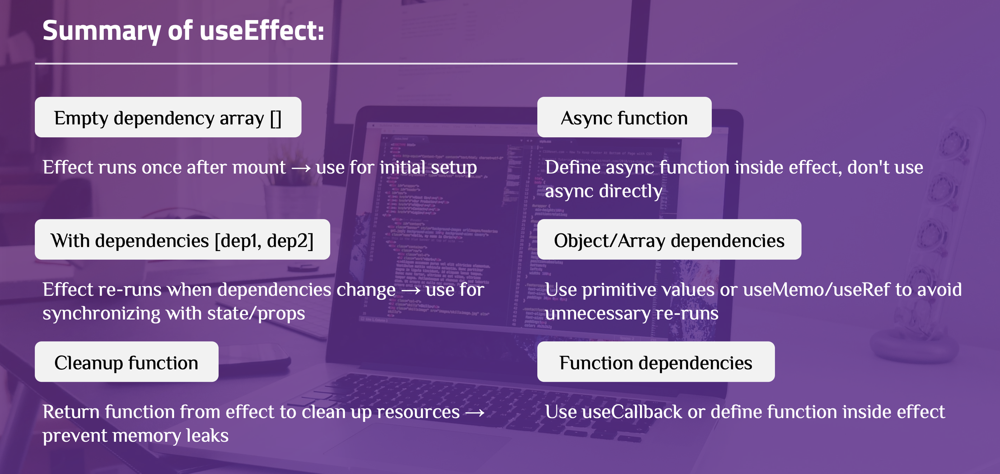

# PlacePicker — React useEffect Deep Dive

This project builds a place-collection app to explore how `useEffect` actually works — the mental model, the common pitfalls, and the design decisions that follow from understanding effects correctly.

---

## Side Effects & useEffect

### What are side effects?

React components have one job during render: compute and return JSX based on current state and props. Anything that reaches *outside* that computation — talking to a network, writing to the DOM directly, setting a timer, reading from a browser API — is a **side effect**.

Common side effects in React apps:

- **Data fetching** — API calls, loading data from external sources
- **Subscriptions** — WebSocket connections, event listeners, observables
- **Timers** — `setTimeout`, `setInterval`
- **DOM manipulation** — direct DOM updates, `dialog.showModal()`, focus, scroll
- **Browser storage** — reading/writing `localStorage` or `sessionStorage`

### How useEffect helps

Running side effects directly inside the render body is problematic: they repeat on every render, can trigger more state updates, and can cause infinite loops.

`useEffect` gives side effects a safe, controlled home:

- Runs **after** React has finished rendering and painting the UI — not during render
- Accepts a **dependency array** to control when it re-runs
- Accepts a **cleanup function** to undo the effect before the next run or on unmount


---

## 1. Problem Overview

### 1.1 The App

Users open the app, grant location access, and see a list of places sorted by distance from their current position. They can add places to a personal collection, and remove a place via a confirmation modal that auto-confirms after 3 seconds.

### 1.2 Technical Challenges

Building this app surfaces several concrete questions that require a correct mental model of `useEffect` to answer:

- **How do we get the user's location without blocking the first render?** → [Synchronization mental model](#21-useeffect--synchronization-not-run-code-at-a-time) and [Geolocation design decision](#31-geolocation-effect-not-inline-render-code)
- **How do we keep the `<dialog>` DOM state in sync with a React prop?** → [Modal DOM sync](#32-modal-bridging-react-state-and-a-dom-api)
- **Why does the countdown timer need a cleanup function, but the modal's `showModal`/`close` does not?** → [Cleanup = undo sync](#24-cleanup--undo-the-synchronization) and [Timer cleanup](#33-countdown-timer-effect-with-cleanup)
- **Can we sort places inside an effect and `setState` from it? What's wrong with that?** → [Anti-pattern: derived state](#34-anti-pattern-dont-use-effect-for-derived-state)
- **Why must `onConfirm` appear in `DeleteConfirmation`'s dependency array?** → [Effect is a closure](#22-effect-function-captures-a-renders-values) and [Dependency array is honest](#23-dependency-array-is-an-honest-declaration)

---

## 2. useEffect Mental Model

Before examining design decisions, build a correct mental model of `useEffect`. Every design decision in this project follows directly from these four principles.

### 2.1 useEffect = Synchronization, not "run code at a time"

The wrong mental model: *"this effect runs on mount"*, *"this effect runs when X changes."*

The right mental model:

> This effect keeps an external system (DOM API, network, subscription, timer, browser API...) in sync with the current state/props.

React decides when to re-run the effect to maintain that sync. You don't control the timing — you declare what the effect depends on.

**In this app:**

- The geolocation effect keeps `availablePlace` (sorted list) in sync with the user's current position. Position doesn't change during the session → sync once → `[]`.
- The modal effect keeps the `<dialog>` DOM element in sync with the `open` prop. Whenever `open` changes → re-sync the DOM → `[open]`.

Neither of these is "run code once on mount" or "run code when open changes" thinking. They are both synchronization declarations about an external system.

### 2.2 Effect function captures a render's values

This connects directly to the `useState` mental model: state is a snapshot per render. The effect function works the same way — it is created fresh each render and captures all values (state, props, variables) from that specific render, exactly like event handlers do.

```jsx
// Each render creates a new version of this effect,
// capturing the `open` and `dialog` values of that render
useEffect(() => {
  if (open) {
    dialog.current.showModal();
  } else {
    dialog.current.close();
  }
}, [open]);
```

**In this app:**

The timer effect in `DeleteConfirmation` captures `onConfirm` from its render's closure:

```jsx
useEffect(() => {
  const timer = setTimeout(() => {
    onConfirm(); // reads onConfirm from this render's closure
  }, TIMER);
  return () => clearTimeout(timer);
}, [onConfirm]);
```

If `onConfirm` were a different function reference on a subsequent render and was *missing* from the dependency array, the timer callback would call a stale, outdated version of `onConfirm`. Code runs without errors but produces wrong behavior — the hardest kind of bug to diagnose.

### 2.3 Dependency array is an honest declaration, not a trigger list

The dependency array is not *"a list of when I want this to re-run."* It is a truthful declaration of every value from the render scope that the effect reads.

```jsx
useEffect(() => {
  const timer = setTimeout(() => {
    onConfirm(); // reads onConfirm — it must be in the array
  }, TIMER);
  return () => clearTimeout(timer);
}, [onConfirm]); // honest: this effect reads onConfirm
```

- **Missing a dependency** → the effect holds a stale value. Code runs, produces wrong results, no error. These bugs are invisible at the point of failure.
- **Don't suppress the eslint exhaustive-deps warning** by removing items from the array. Fix the code so the effect doesn't need that dependency — for example, use a functional state update (`prev =>`) instead of reading state directly, or move a constant outside the component.

**In this app:**

| Effect | Dependency | Why honest |
|---|---|---|
| Geolocation | `[]` | Reads no render-scope values; `AVAILABLE_PLACES` is a module constant |
| Modal | `[open]` | Reads `open` from props |
| Timer | `[onConfirm]` | Reads `onConfirm` from props |

### 2.4 Cleanup = undo the synchronization

Cleanup is not "run once on unmount." It runs:

1. **Before each re-run** of the effect (when dependencies change)
2. **When the component unmounts** (final teardown)

```jsx
useEffect(() => {
  const timer = setTimeout(() => {
    onConfirm();
  }, TIMER);
  return () => clearTimeout(timer); // undo THIS timer before creating a new one
}, [onConfirm]);
```

Mental model: each effect run *sets up* a synchronization. The cleanup *tears down* that exact setup before the effect runs again. Without cleanup, multiple timers would stack up across re-runs — each still holding a reference to a potentially stale `onConfirm`.

**In this app:** The modal effect has no cleanup. `showModal()` and `close()` are stateless DOM calls — there is no ongoing resource to tear down between re-runs. Cleanup is only necessary when the effect creates something that persists: a timer, connection, subscription, or event listener.

| Principle | What it means in practice |
|---|---|
| Effect = synchronization | Declare what you're keeping in sync with, not when to run code |
| Effect is a closure | It captures the render's values — same stale-closure risk as event handlers |
| Dependency array is honest | List every render-scope value the effect reads — omitting one causes stale bugs |
| Cleanup = undo sync | Tears down the previous setup before re-running or unmounting |

---

## 3. Design Decisions

### 3.1 Geolocation: effect, not inline render code

**Question from Section 1.2:** *How do we get the user's location without blocking the first render?*

`navigator.geolocation.getCurrentPosition` is async and communicates with the browser — it is an external system. Calling it directly in the render body would run it on every render, and its callback would call `setAvailablePlace` asynchronously outside React's control.

```jsx
useEffect(() => {
  navigator.geolocation.getCurrentPosition((position) => {
    const sortedPlaces = sortPlacesByDistance(
      AVAILABLE_PLACES,
      position.coords.latitude,
      position.coords.longitude
    );
    setAvailablePlace(sortedPlaces);
  });
}, []);
```

`[]` is honest here: this effect reads no values from the render scope. `AVAILABLE_PLACES` and `sortPlacesByDistance` are module-level constants — not render-scope values. The app syncs with the user's position once at startup; position doesn't change mid-session, so there is no dependency to re-run on.

**Why not in an event handler?** Getting location is not triggered by user action — it needs to happen automatically as soon as the component is ready. Event handlers respond to user interactions; effects handle synchronization that should happen on their own.

### 3.2 Modal: bridging React state and a DOM API

**Question from Section 1.2:** *How do we keep the `<dialog>` DOM state in sync with a React prop?*

The `<dialog>` element's visibility is controlled by the browser DOM via `.showModal()` / `.close()` — an external system. The `open` prop is React state. An effect bridges the two:

```jsx
export default function Modal({ open, onClose, children }) {
  const dialog = useRef();

  useEffect(() => {
    if (open) {
      dialog.current.showModal();
    } else {
      dialog.current.close();
    }
  }, [open]); // honest: effect reads `open`

  return createPortal(
    <dialog className="modal" ref={dialog} onClose={onClose}>
      {open ? children : null}
    </dialog>,
    document.getElementById("modal")
  );
}
```

`[open]` is honest: the effect reads `open` inside. When `open` changes, React re-runs the effect to keep the DOM in sync.

**Why no cleanup?** `showModal()` and `close()` are point-in-time calls — they update DOM state once and are done. There is no ongoing resource (connection, subscription, timer) to tear down. The next effect run simply calls the appropriate method again.

**Why not just a `open` attribute on `<dialog>`?** The HTML `<dialog>` element's `open` attribute controls non-modal visibility. Showing a proper modal overlay requires calling `.showModal()` via JavaScript. This is exactly what effects are for: bridging React's declarative model and an imperative external API.

### 3.3 Countdown timer: effect with cleanup

**Question from Section 1.2:** *Why does the countdown timer need a cleanup function?*

`setTimeout` creates a timer in the browser's timer system — an external resource that outlives the render. If `DeleteConfirmation` unmounts before the timer fires (user clicks "No"), the callback would still call `onConfirm`.

```jsx
const TIMER = 3000;

export default function DeleteConfirmation({ onConfirm, onCancel }) {
  useEffect(() => {
    const timer = setTimeout(() => {
      onConfirm();
    }, TIMER);

    return () => {
      clearTimeout(timer); // undo: cancel THIS timer
    };
  }, [onConfirm]);

  return (
    <div id="delete-confirmation">
      <h2>Are you sure?</h2>
      <p>Do you really want to remove this place?</p>
      <div id="confirmation-actions">
        <button onClick={onCancel} className="button-text">No</button>
        <button onClick={onConfirm} className="button">Yes</button>
      </div>
      <ProgressBar />
    </div>
  );
}
```

The cleanup cancels the specific timer created in this effect run. If `onConfirm` changes reference (different render), the effect re-runs: cleanup cancels the old timer first, then a new 3-second countdown starts. This matches the mental model: cleanup undoes *this* sync before setting up the next.

**Why is `onConfirm` in the dependency array?** Because the effect reads it inside the `setTimeout` callback (see [2.2](#22-effect-function-captures-a-renders-values)). In this app, `handleRemovePlace` is wrapped in `useCallback` with `[]` deps — its reference never changes, so the timer effect runs only once on mount. But the dependency is still declared because it is still read.

### 3.4 Anti-pattern: don't use effect for derived state

**Question from Section 1.2:** *Can we sort places inside an effect and `setState` from it? What's wrong with that?*

Sorting is a pure calculation from existing data. It does not touch any external system.

```jsx
// ❌ Wrong — effect runs after paint, causes a second render,
//   and violates the "synchronization" mental model
const [sortedPlaces, setSortedPlaces] = useState([]);
useEffect(() => {
  const sorted = sortPlacesByDistance(places, lat, lng);
  setSortedPlaces(sorted);
}, [places, lat, lng]);

// ✅ Correct — compute directly during render, no effect needed
const sortedPlaces = sortPlacesByDistance(places, lat, lng);
```

The self-check before writing any `useEffect`:

> *"Am I synchronizing with something outside React — a DOM API, a network connection, a subscription, a timer, a browser API?"*

- **"No, I'm computing a value from existing state/props"** → calculate in render, no effect needed.
- **"No, I'm reacting to a user action"** → put logic in an event handler, not an effect.
- **"Yes, I'm keeping an external system in sync"** → that is when `useEffect` is the right tool.

---

## 4. Supporting Techniques

### 4.1 Async functions inside effects

`useEffect` cannot receive an async function directly — an async function returns a Promise, but `useEffect` expects either `undefined` or a cleanup function. Define the async function inside the effect and call it immediately:

```jsx
useEffect(() => {
  let cancelled = false;

  async function fetchUser() {
    try {
      const data = await fetch(`/api/users/${userId}`).then(r => r.json());
      if (!cancelled) setUser(data);
    } catch (err) {
      if (!cancelled) setError(err.message);
    }
  }

  fetchUser();
  return () => { cancelled = true; };
}, [userId]);
```

The `cancelled` flag prevents calling `setState` after the component has unmounted or after the effect re-ran with a new `userId`. This is a lightweight alternative to `AbortController` for most fetch patterns.

### 4.2 Object and array dependencies

Objects and arrays are compared by reference. `{}` created on render A and `{}` created on render B are different references even if their contents are identical — causing the effect to re-run on every render.

```jsx
// ❌ New object reference every render → effect re-runs every render
useEffect(() => { ... }, [{ query, page }]);

// ✅ Primitives are compared by value — stable across renders
useEffect(() => { ... }, [query, page]);
```

Prefer primitive values in the dependency array. If you must depend on an object, stabilize it with `useMemo` or move it outside the component.

### 4.3 Function dependencies

Functions defined inside a component are recreated on every render — a new reference each time.

```jsx
// ❌ New function reference every render → effect re-runs every render
function fetchData() { ... }
useEffect(() => { fetchData(); }, [fetchData]);

// ✅ Define the function inside the effect — no external dependency
useEffect(() => {
  async function fetchData() { ... }
  fetchData();
}, [userId]);

// ✅ Or stabilize with useCallback if the function must live outside
const fetchData = useCallback(() => { ... }, [userId]);
useEffect(() => { fetchData(); }, [fetchData]);
```

**In this app:** `handleRemovePlace` is wrapped in `useCallback` with `[]` deps precisely because `DeleteConfirmation` depends on it via `onConfirm`. A stable reference means the timer effect never re-runs mid-session.

---

## Summary

| Mental Model | Design Decision | Technique |
|---|---|---|
| Effect = synchronization (2.1) | Geolocation → effect, not render (3.1) | Async inside effect (4.1) |
| Effect is a closure (2.2) | Modal DOM sync (3.2) | Primitive dependencies (4.2) |
| Dependency array is honest (2.3) | Timer with cleanup (3.3) | Stable function refs (4.3) |
| Cleanup = undo sync (2.4) | Avoid effect for derived state (3.4) | |

The mental model (Section 2) is the foundation. Every design decision (Section 3) follows from it. The supporting techniques (Section 4) are tools that make those decisions work correctly. Section 5 shows them all working together.

Before writing any `useEffect`, ask: *"Am I synchronizing with something outside React?"* If yes — declare the effect, be honest about dependencies, write cleanup for anything that persists. If no — compute in render or handle in an event handler.


