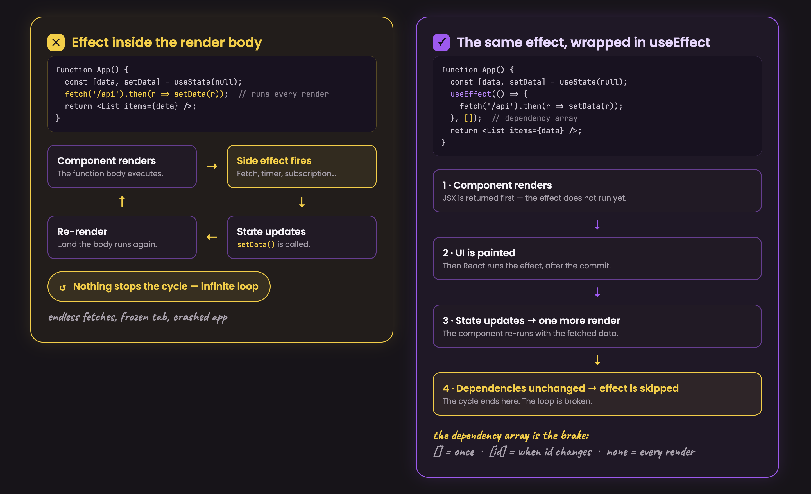
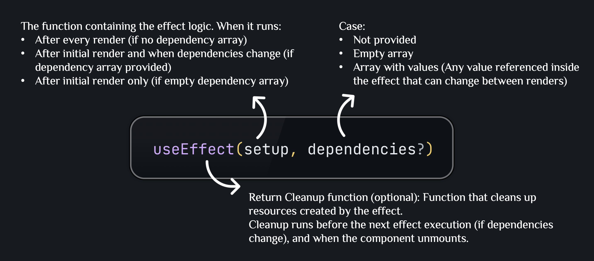

# useEffect — Mental Model & Practical Usage

Documentation-only notes on `useEffect`: the correct mental model, then the usage patterns worth knowing by heart, and the anti-patterns worth recognizing on sight.

---

## 1. Side Effects & useEffect

### What are side effects?

React components have one job during render: compute and return JSX from current state and props. Anything that reaches *outside* that computation — a network call, direct DOM manipulation, a timer, reading a browser API — is a **side effect**.

Common side effects in React apps:

- **Data fetching** — API calls, loading data from external sources
- **Subscriptions** — WebSocket connections, event listeners, observables
- **Timers** — `setTimeout`, `setInterval`
- **DOM manipulation** — direct DOM updates, `dialog.showModal()`, focus, scroll
- **Browser storage** — reading/writing `localStorage` or `sessionStorage`

### How useEffect helps

Running side effects directly inside the render body is problematic: they repeat on every render, can trigger more state updates, and can cause infinite loops.



**Syntax**



---

## 2. useEffect Mental Model

### 2.1 useEffect = synchronization, not "run code at a time"

The wrong mental model: *"this effect runs on mount"*, *"this effect runs when X changes."*

The right mental model:

> This effect keeps an external system (DOM API, network, subscription, timer, browser API...) in sync with the current state/props.

React decides when to re-run the effect to maintain that sync. You don't control the timing — you declare what the effect depends on.

**Why your effect runs twice in development:** React (in `StrictMode`) intentionally runs mount → cleanup → mount again on first render. This isn't a bug — it's React proving your cleanup actually undoes the setup. An effect that breaks under this double-invoke has a real bug that would otherwise surface later, in production, as a leak or a stale subscription.

### 2.2 Effect function captures a render's values

This connects directly to the `useState` mental model: state is a snapshot per render. The effect function works the same way — it is created fresh each render, so a callback inside it sees whatever `count` was *at that render*, not whatever `count` becomes later.

```jsx
useEffect(() => {
  const id = setTimeout(() => {
    console.log(`count was ${count} when this effect ran`); // frozen at this render
  }, 3000);
  return () => clearTimeout(id);
}, [count]);
```

Click a counter button repeatedly within 3 seconds and each timer still logs the `count` from its own render — not the latest value on screen.

### 2.3 Dependency array is an honest declaration, not a trigger list

The dependency array is not *"a list of when I want this to re-run."* It is a truthful declaration of every value from the render scope that the effect reads.

```jsx
useEffect(() => {
  const timer = setTimeout(() => {
    onConfirm(); // reads onConfirm — it must be in the array
  }, TIMER);
  return () => clearTimeout(timer);
}, [onConfirm]);
```

**Missing a dependency** → the effect holds a stale value, silently, with no error pointing back to it. Never suppress the eslint exhaustive-deps warning by deleting the item — fix the code instead:

**Strategy 1 — functional update:** reading state only to compute the next value? Use `prev =>` so the effect never reads the state variable directly.

```jsx
// ❌ reads `count` → must be in array → triggers infinite loop
useEffect(() => { setCount(count + 1); }, [count]);

// ✅ prev => means the effect never reads `count`
useEffect(() => { setCount(prev => prev + 1); }, []);
```

**Strategy 2 — hoist constants:** objects/arrays defined inside a component get a new reference every render, forcing the effect to re-run.

```jsx
// ❌ new object reference every render → effect re-runs every render
function MyComponent() {
  const options = { threshold: 0.5 };
  useEffect(() => { observe(options); }, [options]);
}

// ✅ module-level constant → stable reference → not a render-scope value
const options = { threshold: 0.5 };
function MyComponent() {
  useEffect(() => { observe(options); }, []);
}
```

### 2.4 Cleanup = undo the synchronization

Cleanup is not "run once on unmount." It runs:

1. **Before each re-run** of the effect (when dependencies change)
2. **When the component unmounts** (final teardown)

```jsx
useEffect(() => {
  const timer = setTimeout(() => onConfirm(), TIMER);
  return () => clearTimeout(timer); // undo THIS timer before creating a new one
}, [onConfirm]);
```

Each effect run *sets up* a synchronization; the cleanup *tears down* that exact setup before the effect runs again. Without cleanup, multiple timers would stack up across re-runs — each still holding a reference to a potentially stale callback.

Cleanup is only necessary when the effect creates something that persists: a timer, connection, subscription, or event listener. Point-in-time calls (e.g., updating DOM state once) leave nothing to tear down.

---

## 3. Notable Usage Patterns

The self-check before writing any `useEffect`:

> *"Am I synchronizing with something outside React — a DOM API, a network connection, a subscription, a timer, a browser API?"* If yes, an effect is the right tool. If no, see [Section 4](#4-anti-patterns).

### 3.1 Data fetching — guard against race conditions

Two fetches can land out of order (slow request for an old `userId` resolving after a newer one). A cancelled flag discards stale results:

```jsx
useEffect(() => {
  let cancelled = false;

  async function fetchUser() {
    try {
      const data = await fetch(`/api/users/${userId}`).then(r => r.json());
      if (!cancelled) setUser(data);
    } catch (err) {
      if (!cancelled) setError(err.message);
    }
  }

  fetchUser();
  return () => { cancelled = true; }; // discard this run's result if userId changes again
}, [userId]);
```

`useEffect` can't take an async function directly — it returns a Promise, not `undefined`/cleanup — so the async function is defined inside and invoked immediately. `AbortController` is the equivalent for actually cancelling the underlying network request rather than just ignoring its result.

### 3.2 Subscribing to a browser event

Any `addEventListener` is an external subscription — it must be removed, or it survives past the component that created it (a leak, and a source of stale closures).

```jsx
useEffect(() => {
  function handleResize() {
    setWidth(window.innerWidth);
  }

  window.addEventListener('resize', handleResize);
  return () => window.removeEventListener('resize', handleResize);
}, []);
```

### 3.3 Timer with cleanup

`setTimeout`/`setInterval` create a resource in the browser's timer system that outlives the render. Without cleanup, a component that unmounts before the timer fires still triggers the callback.

```jsx
const TIMER = 3000;

useEffect(() => {
  const timer = setTimeout(() => onConfirm(), TIMER);
  return () => clearTimeout(timer); // cancel THIS timer specifically
}, [onConfirm]);
```

If `onConfirm` changes reference between renders, the effect re-runs: cleanup cancels the old timer, then a new one starts. Wrapping the handler passed as `onConfirm` in `useCallback` keeps its reference stable so the timer effect only runs once.

### 3.4 Bridging React state and an imperative API

Some browser APIs are imperative and outside React's render model — a native `<dialog>`, a `<canvas>` drawing call, a chart library instance. An effect is what pushes React state into that imperative world.

```jsx
function Modal({ open, children }) {
  const dialogRef = useRef();

  useEffect(() => {
    if (open) {
      dialogRef.current.showModal();
    } else {
      dialogRef.current.close();
    }
  }, [open]);

  return <dialog ref={dialogRef}>{children}</dialog>;
}
```

No cleanup needed here: `showModal()`/`close()` are point-in-time calls, not persistent resources — the next effect run just calls the appropriate method again.

### 3.5 Debouncing a value

Wait for a value to settle before reacting to it (e.g., a search input) — the timer effect's cleanup naturally cancels the pending update whenever the value changes again before the delay elapses.

```jsx
function useDebouncedValue(value, delay) {
  const [debounced, setDebounced] = useState(value);

  useEffect(() => {
    const timer = setTimeout(() => setDebounced(value), delay);
    return () => clearTimeout(timer); // value changed again — discard the stale update
  }, [value, delay]);

  return debounced;
}
```

---

## 4. Anti-Patterns

### 4.1 Derived state

Sorting, filtering, formatting — pure calculations from existing data — don't touch any external system, so they don't belong in an effect.

```jsx
// ❌ Wrong — effect runs after paint, causes a second render,
//   and violates the "synchronization" mental model
const [sortedPlaces, setSortedPlaces] = useState([]);
useEffect(() => {
  setSortedPlaces(sortByDistance(places, lat, lng));
}, [places, lat, lng]);

// ✅ Correct — compute directly during render, no effect and no extra state
const sortedPlaces = sortByDistance(places, lat, lng);
```

### 4.2 Logic that belongs in an event handler

If the logic only needs to run in response to a specific user action, an effect is the wrong layer — it re-runs on every dependency change, not just the action you care about.

```jsx
// ❌ Wrong — runs whenever `submitted` becomes true, but also
//   whenever the effect re-runs for unrelated dependency changes
useEffect(() => {
  if (submitted) {
    postAnalyticsEvent('form_submitted');
  }
}, [submitted]);

// ✅ Correct — the event that triggers the behavior IS the handler
function handleSubmit() {
  postAnalyticsEvent('form_submitted');
  setSubmitted(true);
}
```

### 4.3 Resetting state when a prop changes

Resetting local state via an effect that watches a prop is a common workaround for a problem `key` already solves — remounting the component resets all its state for free, with no effect and no stale-render flash.

```jsx
// ❌ Wrong — effect runs after the stale state has already rendered once
useEffect(() => {
  setComment('');
}, [userId]);

// ✅ Correct — a new key forces React to unmount/remount with fresh state
<ProfilePage userId={userId} key={userId} />
```

---

## 5. Caveats

### 5.1 Effects only run on the client

Effects never run during server rendering — only after the component mounts in the browser. This is exactly why code touching `window`, `document`, or other browser-only APIs belongs inside an effect: it would crash if it ran during SSR.

### 5.2 useEffect vs useLayoutEffect (paint timing)

By default, React lets the browser paint the updated screen *before* running effects. If an effect does something visual — measuring a DOM node, positioning a tooltip — that delay can show up as a one-frame flicker.

```jsx
// ❌ useEffect: browser paints the unpositioned tooltip for one frame, then it snaps into place
useEffect(() => {
  const { height } = ref.current.getBoundingClientRect();
  setTooltipHeight(height);
}, []);

// ✅ useLayoutEffect: runs synchronously before paint — no flicker
useLayoutEffect(() => {
  const { height } = ref.current.getBoundingClientRect();
  setTooltipHeight(height);
}, []);
```

Default to `useEffect`. Reach for `useLayoutEffect` only when you can actually see the flicker — it blocks paint, so using it everywhere costs real performance.

---

## 6. Dependency Array Gotchas

### 6.1 Objects and arrays are compared by reference

`{}` created on render A and `{}` created on render B are different references even with identical contents — causing the effect to re-run every render.

```jsx
// ❌ New object reference every render → effect re-runs every render
useEffect(() => { ... }, [{ query, page }]);

// ✅ Primitives are compared by value — stable across renders
useEffect(() => { ... }, [query, page]);
```

Prefer primitive values in the dependency array. If you must depend on an object, stabilize it with `useMemo` or move it outside the component.

### 6.2 Function dependencies

Functions defined inside a component are recreated on every render — a new reference each time.

```jsx
// ❌ New function reference every render → effect re-runs every render
function fetchData() { ... }
useEffect(() => { fetchData(); }, [fetchData]);

// ✅ Define the function inside the effect — no external dependency
useEffect(() => {
  async function fetchData() { ... }
  fetchData();
}, [userId]);

// ✅ Or stabilize with useCallback if the function must live outside
const fetchData = useCallback(() => { ... }, [userId]);
useEffect(() => { fetchData(); }, [fetchData]);
```