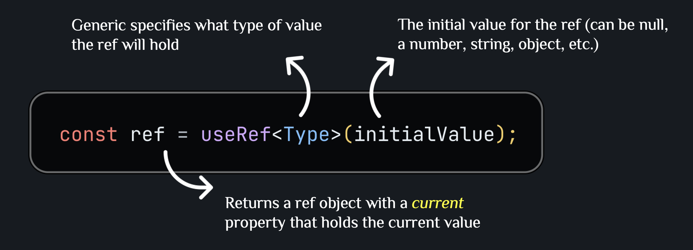
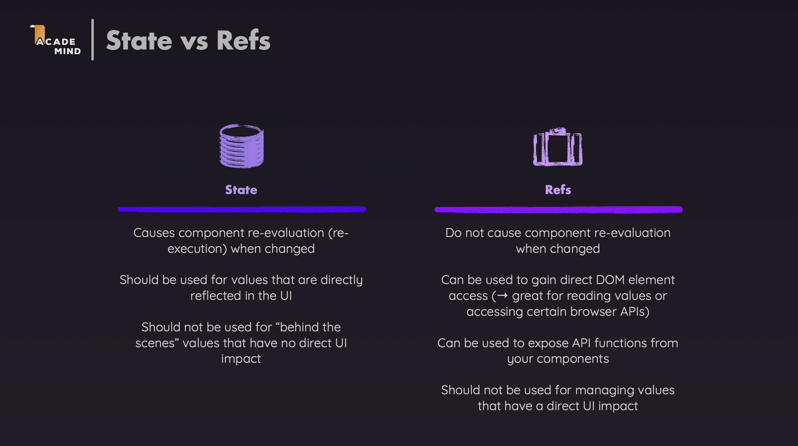
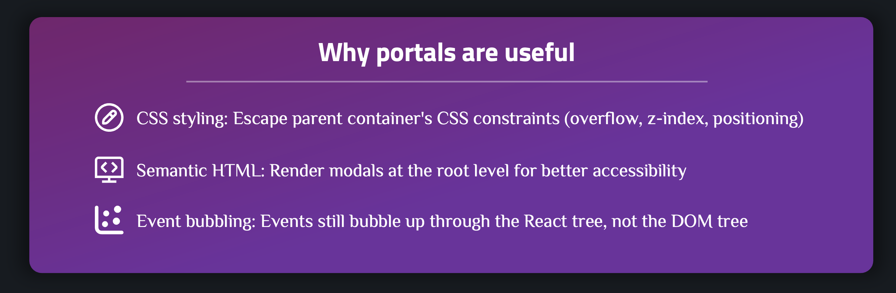
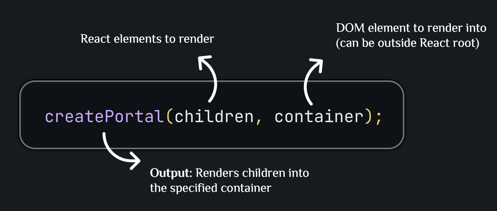

# Reaction Time Game — React useRef & Portal Deep Dive

This project builds a reaction time challenge game to explore how `useRef` actually works — the mental model, the two main use cases, and how Portals let components render outside the normal DOM hierarchy.

---

## Syntax Reference



---

## 1. Problem Overview

### 1.1 The Game

Players enter their name, then choose one of four difficulty levels (Easy to Pros Only) — each with a different target time. They start the timer, try to stop it as close to the target as possible, and see their score and result in a modal overlay.

### 1.2 Technical Challenges

Building this game surfaces several concrete questions that require a correct mental model of `useRef` to answer:

- **How do we read the player's input value on submit without re-rendering on every keystroke?** → [DOM ref use case](#23-two-main-use-cases)
- **How do we store the interval ID so we can clear it on stop, without triggering a re-render?** → [Mutable value ref](#23-two-main-use-cases)
- **Why is `timeRemaining` stored in state while the interval ID is stored in a ref?** → [The core distinction](#31-player-input-ref-not-controlled-state) and [Interval ID](#32-interval-id-ref-not-state)
- **How do we render the result modal outside the game's DOM hierarchy to avoid CSS constraints?** → [Portal](#33-result-modal-portal)

---

## 2. useRef Mental Model

Before examining design decisions, build a correct mental model of `useRef`. Every design decision in this project follows directly from these four principles.

### 2.1 useRef = a persistent mutable box, not a snapshot

`useRef` returns an object `{ current: ... }` that React keeps stable across the entire component lifetime. Two things make it fundamentally different from `useState`:

- **Changing `.current` never triggers a re-render**
- **Reading `.current` always gives the latest value** — there is no snapshot per render

```tsx
const countRef = useRef(0);
countRef.current = countRef.current + 1; // assign directly, no setter
console.log(countRef.current); // always the latest value
```



**In this game:** `timer` in `TimeChallenge` stores the interval ID. Assigning a new ID doesn't need to update the UI — the UI only cares about `timeRemaining`. `timeRemaining` is state because it must display on screen and drives `isTimerActive`.

### 2.2 .current is mutable — read/write directly, no stale issue

Unlike state (a snapshot frozen at the render that created the closure), a ref's `.current` is a live reference. Any code reading it — regardless of when that closure was created — always reads the current value.

```tsx
const timer = useRef<number | undefined>(undefined);

function handleStart() {
  timer.current = setInterval(() => { ... }, 10); // write directly
}

function handleStop() {
  clearInterval(timer.current); // always reads the live value — never stale
  timer.current = undefined;
}
```

**In this game:** `handleStop` safely reads `timer.current` with no stale-closure risk. If `timer` were state, `handleStop`'s closure could capture a stale value from a previous render. With ref, it always reads the interval ID that `handleStart` actually assigned.

### 2.3 Two main use cases

**a) Reference to a real DOM node**

```tsx
const inputRef = useRef<HTMLInputElement>(null);
// ...
<input ref={inputRef} />
// ...
inputRef.current?.focus();
inputRef.current?.value; // read value without controlled state
```

React sets `inputRef.current` to the DOM element after mount, and back to `null` on unmount. Use for: focus, scroll, measure (`getBoundingClientRect`), integrating third-party libraries that need direct DOM access (charts, maps, canvas, video players).

**b) Mutable value that survives renders without causing them**

```tsx
const timer = useRef<number | undefined>(undefined); // interval / timeout ID
const hasCalled = useRef(false);                     // one-time flag
const prevValue = useRef<number>(0);                 // previous prop/state for comparison
const wsRef = useRef<WebSocket | null>(null);         // external object instance
```

Use when the value is purely behind the scenes and the UI does not need to reflect changes to it.

**In this game:**
- `name` ref in `Player` → use case (a): DOM ref to read and clear input on click
- `timer` ref in `TimeChallenge` → use case (b): stores interval ID, no UI impact from changing it

### 2.4 Never read or write ref.current during render

Refs do not participate in React's render cycle. Reading `ref.current` directly in the render body (in JSX or when computing return values) gives an unstable result — React has no way to know when the ref changes, so it won't schedule a re-render at the right time. The UI silently falls out of sync.

```tsx
// ❌ Wrong — React doesn't track timer.current; isActive can be stale
//   without React knowing it needs to re-render
const isActive = timer.current !== undefined;

// ✅ Correct — derived from state, which React tracks
const isTimerActive = timeRemaining > 0 && timeRemaining < targetime * 1000;
```

Only touch `ref.current` inside **event handlers** or **`useEffect`** — never in the render body.

**In this game:** `isTimerActive` is derived from `timeRemaining` (state), not from `timer.current` (ref). Even though both encode "is the timer running," only state is tracked by React's render system.

Refs are React's **escape hatch from the declarative model** — a door to imperative operations like `.focus()`, `.play()`, `.getBoundingClientRect()`. Use as little as possible. Overuse breaks the data-driven rendering model and creates bugs React cannot track.

| Principle | What it means in practice |
|---|---|
| Persistent mutable box (not a snapshot) | Survives re-renders; changing it doesn't cause one |
| No stale value | Reading `.current` always gives the latest — no closure trap |
| Two use cases | DOM node reference, or mutable value storage |
| Not in render | Only read/write inside event handlers or `useEffect` |

---

## 3. Design Decisions

### 3.1 Player input: ref, not controlled state

**Question from Section 1.2:** *How do we read the player's input value on submit without re-rendering on every keystroke?*

A controlled input (`value={state}` + `onChange`) re-renders the component on every keystroke. For a simple "read once on submit" use case, that is unnecessary. A ref reads the value directly from the DOM when needed:

```tsx
export default function Player() {
  const name = useRef<HTMLInputElement>(null);
  const [playerName, setPlayerName] = useState<string>("Unknown");

  function handleClick() {
    if (name.current) {
      setPlayerName(name.current.value);
      name.current.value = ""; // clear input directly via DOM
    }
  }

  return (
    <section id="player">
      <h2>Welcome {playerName}</h2>
      <div>
        <input ref={name} type="text" />
        <button onClick={handleClick}>Set Name</button>
      </div>
    </section>
  );
}
```

The ref reads and clears the input in one event handler — no controlled state, no re-render per keystroke. `playerName` remains in state because it needs to display on screen.

**When to prefer controlled input:** If you need real-time validation, want to disable the button when the field is empty, or need to sync the value with other state — use controlled input. If you only need the value once on submit, uncontrolled + ref is simpler.

### 3.2 Interval ID: ref, not state

**Question from Section 1.2:** *How do we store the interval ID so we can clear it on stop, without triggering a re-render?*

`setInterval` returns a numeric ID needed later for `clearInterval`. This ID has no business being in state — changing it would uselessly re-render the component.

```tsx
export default function TimeChallenge({ title, targetime }: TimeChallengeProps) {
  const timer = useRef<number | undefined>(undefined);
  const [timeRemaining, setTimeRemaining] = useState<number>(targetime * 1000);

  const isTimerActive = timeRemaining > 0 && timeRemaining < targetime * 1000;

  function handleStart() {
    timer.current = setInterval(() => {
      setTimeRemaining((prev) => prev - 10);
    }, 10);
  }

  function handleStop() {
    clearInterval(timer.current);
    timer.current = undefined;
    // open result modal...
  }
}
```

`timer` — ref, because the UI doesn't care when the ID changes.
`timeRemaining` — state, because it drives the progress display and `isTimerActive`.

The self-check: *"Does the UI need to reflect this value changing?"*
- Yes → `useState`
- No, but it needs to persist across renders → `useRef`

### 3.3 Result modal: Portal

**Question from Section 1.2:** *How do we render the result modal outside the game's DOM hierarchy?*

Without a portal, a modal rendered inside the component tree inherits all its parent's CSS — `overflow: hidden`, `z-index` stacking contexts, transforms that affect `position: fixed`. This makes it difficult or impossible to cover the full viewport correctly.



`createPortal` lets a component render its output into any DOM node, regardless of where the component sits in the React tree:

```tsx
import { createPortal } from "react-dom";

function ResultModal({ targetTime, remainingTime, onReset }: ResultModalProps) {
  const dialog = useRef<HTMLDialogElement>(null);

  const modalContainer = document.getElementById("modal");
  if (!modalContainer) return null;

  return createPortal(
    <dialog ref={dialog} onClose={onReset}>
      {/* result content */}
    </dialog>,
    modalContainer
  );
}
```

```html
<!-- index.html -->
<div id="modal"></div>  <!-- portal target, at root level -->
<div id="root"></div>   <!-- React app -->
```

The dialog renders into `#modal` (at root level in the DOM), not inside the game's component hierarchy. React events still bubble normally through the component tree — only the physical DOM placement changes.



**Portal and ref work together:** The `dialog` ref attached to the `<dialog>` element inside the portal works exactly like any other DOM ref. The portal only changes where in the DOM tree the element is placed, not how React manages it.

---

## 4. Supporting Techniques: TypeScript Types for Refs

TypeScript requires knowing what type of value a ref holds in order to type-check `.current` access.

### DOM Element Refs

Always initialize with `null` — React sets `.current` to the DOM node after mount, and back to `null` on unmount.

```tsx
const inputRef    = useRef<HTMLInputElement>(null);
const dialogRef   = useRef<HTMLDialogElement>(null);
const divRef      = useRef<HTMLDivElement>(null);
const videoRef    = useRef<HTMLVideoElement>(null);
const formRef     = useRef<HTMLFormElement>(null);
const buttonRef   = useRef<HTMLButtonElement>(null);
const textareaRef = useRef<HTMLTextAreaElement>(null);
```

Because the initial value is `null`, TypeScript types `.current` as `HTMLInputElement | null`. Always guard before access:

```tsx
// Narrow with if
if (inputRef.current) {
  inputRef.current.focus();
}

// Optional chaining (preferred for one-liners)
inputRef.current?.focus();
```

### Value Refs

For refs that store non-DOM values, initialize with the actual starting value. `.current` will never be `null` unless you explicitly allow it.

```tsx
const timer     = useRef<number | undefined>(undefined); // interval / timeout ID
const countRef  = useRef<number>(0);
const prevValue = useRef<string>("");
const wsRef     = useRef<WebSocket | null>(null);
```

**In this game:**

```tsx
// Player.tsx
const name = useRef<HTMLInputElement>(null);         // DOM ref — input element

// TimeChallenge.tsx
const timer = useRef<number | undefined>(undefined); // value ref — interval ID
```

### Passing ref to a child component (React 19)

Before React 19, passing a ref down to a child component required wrapping the child in `forwardRef()` — a boilerplate-heavy API. In React 19, **`ref` is a regular prop** like any other:

```tsx
// ✅ React 19 — ref as a plain prop, no forwardRef needed
interface ChildProps {
  ref: React.Ref<HTMLDialogElement>;
  onClose: () => void;
}

function ResultModal({ ref, onClose }: ChildProps) {
  return <dialog ref={ref} onClose={onClose}>...</dialog>;
}

// In parent:
function Parent() {
  const dialogRef = useRef<HTMLDialogElement>(null);

  function handleOpen() {
    dialogRef.current?.showModal();
  }

  return (
    <>
      <button onClick={handleOpen}>Open</button>
      <ResultModal ref={dialogRef} onClose={handleClose} />
    </>
  );
}
```

Before React 19, the same child would have required:

```tsx
// ❌ React 18 and earlier — forwardRef boilerplate
const ResultModal = forwardRef<HTMLDialogElement, ChildProps>(
  function ResultModal({ onClose }, ref) {
    return <dialog ref={ref} onClose={onClose}>...</dialog>;
  }
);
```

React 19 removes the need for `forwardRef` entirely. The `ref` prop behaves like any other prop — define it in the interface, destructure it, pass it down.

---

## Summary

| Mental Model | Design Decision | Technique |
|---|---|---|
| Persistent mutable box (2.1) | Player input: ref not state (3.1) | TypeScript DOM refs (4) |
| No stale value (2.2) | Interval ID: ref not state (3.2) | TypeScript value refs (4) |
| Two use cases (2.3) | Result modal: Portal (3.3) | |
| Not in render (2.4) | | |

The mental model (Section 2) is the foundation. Every design decision (Section 3) follows from it.

Before reaching for `useRef`, ask: *"Does the UI need to reflect this value changing?"*

- **Yes** → `useState`
- **No, but it needs to persist across renders** → `useRef` (value ref)
- **It's a DOM node I need to manipulate imperatively** → `useRef` (DOM ref)

Refs are an escape hatch from React's declarative model. Use them as little as possible — overuse breaks the data-driven rendering model and creates bugs React cannot track.
