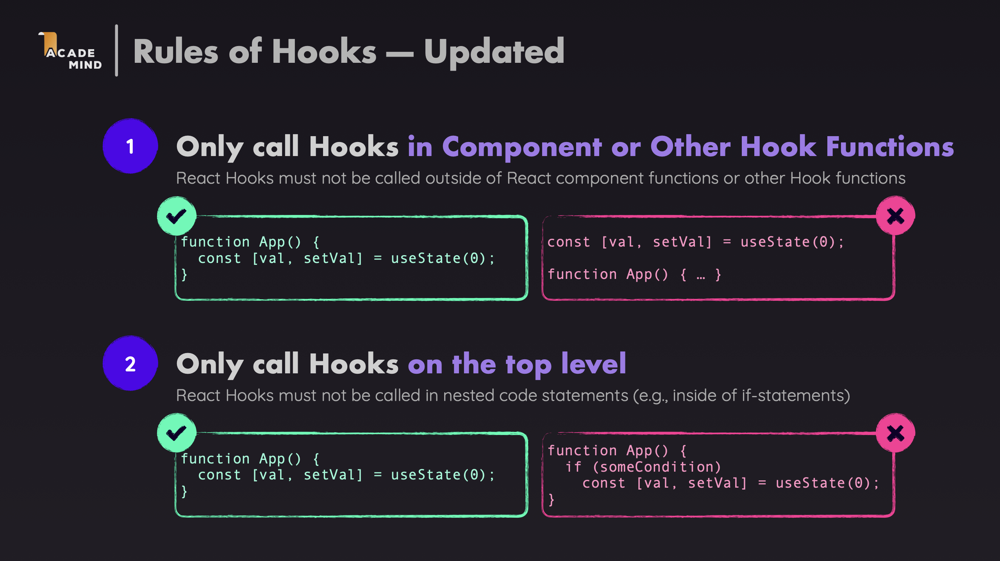
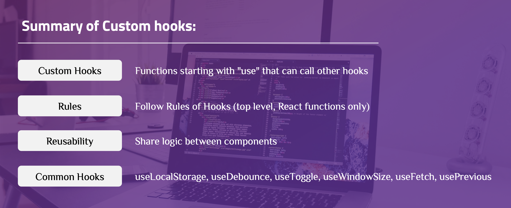

# Custom Hooks

**Custom Hooks** are JavaScript functions that start with `use` and can call other React Hooks inside. The purpose is to extract stateful logic out of components so it can be reused across multiple places without duplicating code. When logic using `useState`, `useEffect`, etc. appears in multiple components, that's a sign it should be extracted into a custom hook.

Besides writing your own, you can use popular hook libraries like **react-use**, **ahooks**, **usehooks-ts** — they provide dozens of ready-made hooks for common tasks.

---

## Rules of Hooks



### Why do these rules exist?

React stores each hook's value in an internal structure called **Fiber** — every component has its own Fiber node, which holds a linked list of all hook states in **call order**.

On every re-render, React does not reinitialize hook values from scratch. Instead, it walks the Fiber list and asks: *"what is hook #1? what is hook #2?"* — always in the same order as the initial render.

If a hook is called inside an `if`, a loop, or a nested function, the call order can change between renders. React would then read the wrong value from Fiber, leading to bugs that are hard to trace.

---

## Common Custom Hooks

### Example 1: useDebounce Hook

**When to use**: When you want to delay updating a value until after a specified delay (e.g., search inputs, API calls).

**File: `src/hooks/useDebounce.ts`**

```typescript
import { useState, useEffect } from "react";

function useDebounce<T>(value: T, delay: number): T {
  const [debouncedValue, setDebouncedValue] = useState<T>(value);

  useEffect(() => {
    const handler = setTimeout(() => {
      setDebouncedValue(value);
    }, delay);

    return () => {
      clearTimeout(handler);
    };
  }, [value, delay]);

  return debouncedValue;
}
```

**Explanation**:

- Takes a `value` and `delay` in milliseconds
- Creates a timeout that updates `debouncedValue` after the delay
- Cleans up timeout if `value` changes before delay completes
- Returns the debounced value

**Usage**:

```typescript
const [searchTerm, setSearchTerm] = useState("");
const debouncedSearchTerm = useDebounce(searchTerm, 500);

// searchTerm updates immediately
// debouncedSearchTerm updates 500ms after user stops typing
useEffect(() => {
  if (debouncedSearchTerm) {
    // Make API call with debouncedSearchTerm
  }
}, [debouncedSearchTerm]);
```

### Example 2: useToggle Hook

**When to use**: When you need to toggle a boolean value (modals, dropdowns, switches).

**File: `src/hooks/useToggle.ts`**

```typescript
import { useState, useCallback } from "react";

function useToggle(
  initialValue: boolean = false
): [boolean, () => void, (value: boolean) => void] {
  const [value, setValue] = useState<boolean>(initialValue);

  const toggle = useCallback(() => {
    setValue((prev) => !prev);
  }, []);

  return [value, toggle, setValue];
}
```

**Explanation**:

- Returns current value, toggle function, and setter function
- `toggle` function flips the boolean value
- `useCallback` memoizes toggle function to prevent unnecessary re-renders
- Can also set value directly using the setter

**Usage**:

```typescript
const [isOpen, toggle, setIsOpen] = useToggle(false);

// Toggle the value
toggle();

// Set specific value
setIsOpen(true);
```

### Example 3: useFetch Hook

**When to use**: When you need to fetch data from APIs with loading and error states.

**File: `src/hooks/useFetch.ts`**

```typescript
import { useState, useEffect } from "react";

interface UseFetchState<T> {
  data: T | null;
  loading: boolean;
  error: Error | null;
}

function useFetch<T = unknown>(
  url: string,
  options?: { skip?: boolean }
): UseFetchState<T> & { refetch: () => void } {
  const [state, setState] = useState<UseFetchState<T>>({
    data: null,
    loading: !options?.skip,
    error: null,
  });

  const fetchData = async () => {
    setState((prev) => ({ ...prev, loading: true, error: null }));

    try {
      const response = await fetch(url);
      if (!response.ok) {
        throw new Error(`HTTP error! status: ${response.status}`);
      }
      const data = await response.json();
      setState({ data, loading: false, error: null });
    } catch (error) {
      setState({
        data: null,
        loading: false,
        error:
          error instanceof Error
            ? error
            : new Error("An unknown error occurred"),
      });
    }
  };

  useEffect(() => {
    if (!options?.skip) {
      fetchData();
    }
  }, [url, options?.skip]);

  return { ...state, refetch: fetchData };
}
```

**Explanation**:

- Manages `data`, `loading`, and `error` states
- Fetches data when URL changes or component mounts
- Handles errors gracefully
- Returns `refetch` function to manually trigger fetch
- Supports `skip` option to prevent automatic fetching

**Usage**:

```typescript
const { data, loading, error, refetch } = useFetch<User>(
  "https://api.example.com/users/1"
);

if (loading) return <Spinner />;
if (error) return <Error message={error.message} />;
return <div>{data.name}</div>;
```

### Example 4: usePrevious Hook

**When to use**: When you need to track the previous value of a state or prop.

**File: `src/hooks/usePrevious.ts`**

```typescript
import { useRef, useEffect } from "react";

function usePrevious<T>(value: T): T | undefined {
  const ref = useRef<T>();

  useEffect(() => {
    ref.current = value;
  }, [value]);

  return ref.current;
}
```

**Explanation**:

- Uses `useRef` to store previous value without causing re-renders
- Updates ref in `useEffect` after render completes
- Returns previous value (undefined on first render)
- Useful for comparing current and previous values

**Usage**:

```typescript
const [count, setCount] = useState(0);
const previousCount = usePrevious(count);

// Detect change
if (previousCount !== undefined && count > previousCount) {
  console.log("Count increased!");
}
```

---

## Summary

Custom Hooks enable code reuse and logic extraction in React:



---

## References

- [React Custom Hooks Documentation](https://react.dev/learn/reusing-logic-with-custom-hooks)
- [Rules of Hooks](https://react.dev/reference/rules/rules-of-hooks)
- [react-use](https://github.com/streamich/react-use) | [ahooks](https://ahooks.js.org/) | [usehooks-ts](https://usehooks-ts.com/)
