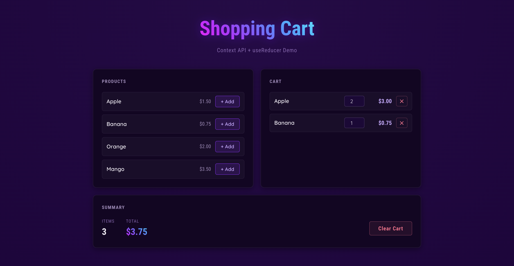
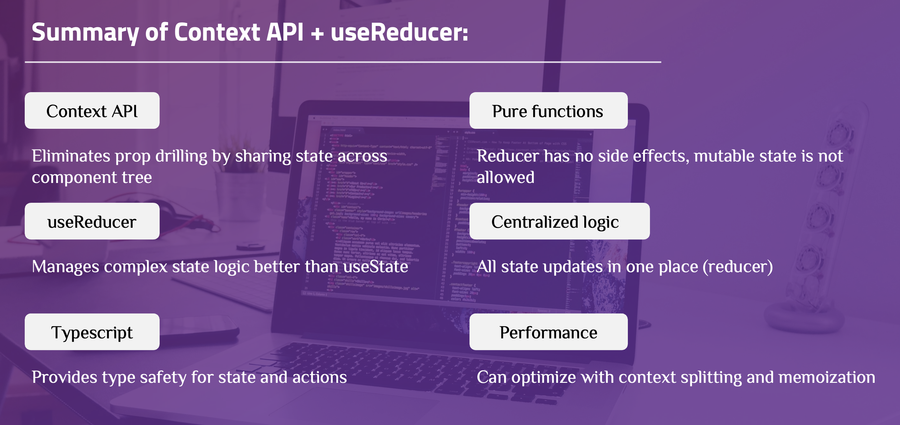

# Context API with useReducer — Shopping Cart

A demo application for managing a shopping cart using **Context API** combined with **useReducer** in React + TypeScript.



### The problem: prop drilling

When state lives in a top-level component, the only way to share it with deeply nested children is to pass it down as props through every layer in between — even layers that don't use it at all. This is called **prop drilling**.

```
App (holds cartItems, dispatch)
 └── Layout         ← receives cartItems, dispatch just to pass them down
      └── Sidebar   ← receives cartItems, dispatch just to pass them down
           └── CartSummary  ← finally uses them
```

Every intermediate component becomes coupled to data it doesn't care about. Renaming a prop or changing its shape means touching every layer. Adding a new consumer means threading the props through again.

**Context API** solves this by making state available to any component in the tree without manual prop passing. Combined with **useReducer**, it also consolidates all state update logic into a single, predictable function — rather than scattering multiple `useState` calls and their update handlers across components.

---

## Basic: Shopping Cart with Single Context

### Step 1: Define Types and State

**File: `src/context/CartContext.tsx`**

```typescript
export interface CartItem {
  id: string;
  name: string;
  price: number;
  quantity: number;
}

export interface CartState {
  items: CartItem[];  // source of truth
}

export type CartAction =
  | { type: "ADD_ITEM"; payload: Omit<CartItem, "quantity"> }
  | { type: "REMOVE_ITEM"; payload: string }           // id
  | { type: "UPDATE_QUANTITY"; payload: { id: string; quantity: number } }
  | { type: "CLEAR_CART" };
```

**Explanation:**

- `CartState` only stores `items`. The total price is **not stored** — it is always **derived** at render time.
- `CartAction` is a discriminated union: each variant has a literal `type` and a typed `payload` (or no payload at all). TypeScript uses the `type` field to narrow the payload type inside the reducer's `switch` — you get full autocomplete and compile-time safety.
- `Omit<CartItem, "quantity">` means the caller only provides `id`, `name`, and `price` when adding an item — the reducer always starts quantity at `1`.

### Step 2: Create the Reducer Function

A **reducer** is a pure function `(state, action) => newState`. It must never mutate the existing state — always return a new object.

**File: `src/context/CartContext.tsx`**

```typescript
function cartReducer(state: CartState, action: CartAction): CartState {
  switch (action.type) {
    case "ADD_ITEM": {
      const existing = state.items.find((i) => i.id === action.payload.id);
      if (existing) {
        // Item already in cart — increment quantity
        return {
          items: state.items.map((i) =>
            i.id === action.payload.id
              ? { ...i, quantity: i.quantity + 1 }
              : i
          ),
        };
      }
      // New item — append with quantity 1
      return { items: [...state.items, { ...action.payload, quantity: 1 }] };
    }
    case "REMOVE_ITEM":
      return { items: state.items.filter((i) => i.id !== action.payload) };

    case "UPDATE_QUANTITY":
      return {
        items: state.items.map((i) =>
          i.id === action.payload.id
            ? { ...i, quantity: action.payload.quantity }
            : i
        ),
      };

    case "CLEAR_CART":
      return { items: [] };

    default:
      return state;
  }
}
```

**Explanation:**

- `ADD_ITEM` checks for an existing item first. This is business logic that would be messy to express with plain `useState` — in a reducer it is a self-contained case, easy to read and test.
- Every case returns a new object using spread (`{ ...state, items: [...] }`).
- The `default` case returns the existing `state`. This is important for two reasons: TypeScript exhaustiveness checking works correctly, and unrecognised actions are safely ignored.

### Step 3: Create Context and Provider

#### 3.1. Create Context with `createContext`

`createContext` creates a Context object. Any component inside the matching `Provider` can read the current value using `useContext`.

```typescript
interface CartContextValue {
  state: CartState;
  dispatch: React.Dispatch<CartAction>;
}

const CartContext = createContext<CartContextValue | undefined>(undefined);
```

**Explanation:**

- The generic `<CartContextValue | undefined>` makes the default value `undefined`. This forces the custom hook (Step 4) to verify the component is actually inside a Provider, rather than silently receiving a stale default.

#### 3.2. Create Provider with `useReducer`

`useReducer` is the hook that wires the reducer to the component tree. It returns `[state, dispatch]` — the current state and a function to send actions to the reducer.

```typescript
export function CartProvider({ children }: { children: React.ReactNode }) {
  const [state, dispatch] = useReducer(cartReducer, { items: [] });

  return (
    <CartContext.Provider value={{ state, dispatch }}>
      {children}
    </CartContext.Provider>
  );
}
```

**Explanation:**

- `useReducer(cartReducer, { items: [] })` passes the reducer and initial state. React calls `cartReducer(state, action)` whenever `dispatch` is called and updates the state returned by the hook.
- `<CartContext.Provider value={{ state, dispatch }}>` makes both `state` and `dispatch` available to any descendant that calls `useContext(CartContext)`.

### Step 4: Create a Custom Hook

`useContext` reads the nearest Provider's value. Wrapping it in a custom hook adds the undefined guard and keeps component code clean.

```typescript
export function useCart(): CartContextValue {
  const context = useContext(CartContext);

  if (context === undefined) {
    throw new Error("useCart must be used within CartProvider");
  }

  return context;
}
```

**Explanation:**

- The `undefined` check ensures the hook is only called inside a Provider — if not, it throws a clear error immediately instead of a cryptic crash later.
- From the component's perspective: `const { state, dispatch } = useCart()` — one line, fully typed, no boilerplate.

### Step 5: Set Up Provider in App

```typescript
function App() {
  return (
    <CartProvider>
      <AddItemForm />
      <CartList />
      <CartSummary />
    </CartProvider>
  );
}
```

**Explanation:** The Provider must wrap every component that needs context. Placing it at the root of the feature (or the whole app) ensures all descendants can access it.

### Step 6: Consume Context in Components

**`AddItemForm`** — only dispatches actions:

```typescript
function AddItemForm() {
  const { dispatch } = useCart();

  return (
    <button onClick={() => dispatch({ type: "ADD_ITEM", payload: product })}>
      Add to Cart
    </button>
  );
}
```

**`CartList`** — reads state and dispatches:

```typescript
function CartList() {
  const { state, dispatch } = useCart();

  return (
    <ul>
      {state.items.map((item) => (
        <li key={item.id}>
          {item.name}
          <button onClick={() => dispatch({ type: "REMOVE_ITEM", payload: item.id })}>
            Remove
          </button>
        </li>
      ))}
    </ul>
  );
}
```

**`CartSummary`** — derives total from state:

```typescript
function CartSummary() {
  const { state, dispatch } = useCart();

  // Derived value — computed at render, not stored in state
  const total = state.items.reduce((sum, i) => sum + i.price * i.quantity, 0);

  return (
    <div>
      <p>Total: ${total.toFixed(2)}</p>
      <button onClick={() => dispatch({ type: "CLEAR_CART" })}>
        Clear Cart
      </button>
    </div>
  );
}
```

**Explanation:** All three components avoid prop drilling entirely. `CartSummary` is three levels away from the state — with props, every component in between would need to receive and forward `items` and `dispatch`. With Context, each component takes exactly what it needs.

---

**Note — Split State and Dispatch Contexts**

`dispatch` never changes — React always hands back the exact same function. `state` does change. The catch: grouping them into one object (`{ state, dispatch }`) creates a *brand new object* every time state changes — so even a component that only calls `dispatch` (and never reads `state`) re-renders, simply because it's holding onto half of an object that changed.

```tsx
// ❌ One object → any state change re-renders every consumer, dispatch-only or not
<MyContext.Provider value={{ state, dispatch }}>

// ✅ Two contexts → a dispatch-only component never re-renders
<StateContext.Provider value={state}>
  <DispatchContext.Provider value={dispatch}>
```

A component reading only `DispatchContext` skips re-renders entirely — what it's holding onto genuinely never changes.

In practice this rarely matters — the wasted re-renders are usually tiny. Needing this trick is often a sign to reach for **Zustand** or **Redux Toolkit** instead of stretching Context further.

---

## Summary



### useState vs useReducer

| | `useState` | `useReducer` |
|---|---|---|
| **State shape** | Single value or simple object | Object with multiple fields that change together |
| **Number of actions** | 1–2 (`setX`, `toggleX`) | 3+ distinct action types |
| **Update logic** | Inline in event handler | Centralised in reducer function |
| **Next state depends on previous** | `setState(prev => ...)` works fine | Natural fit — reducer always receives current state |
| **Multiple fields update together** | Multiple `setState` calls, easy to miss one | One action updates all fields atomically |
| **Testability** | Test by rendering the component | Test the reducer function directly, no rendering needed |
| **Readability at scale** | Handlers scatter across the file | All transitions in one place, easy to audit |

**Rule of thumb:** start with `useState`. Switch to `useReducer` when you notice any of these:
- You have 3 or more related `useState` calls that often update together
- Event handlers are growing complex because they need to read current state before updating
- You want to unit-test state logic without a component harness
- A new team member asks "what can happen to this state?" and the answer is spread across multiple files

---

**References:**
- [createContext](https://react.dev/reference/react/createContext)
- [useReducer](https://react.dev/reference/react/useReducer)
- [useContext](https://react.dev/reference/react/useContext)
- [TypeScript Handbook — Discriminated Unions](https://www.typescriptlang.org/docs/handbook/2/narrowing.html#discriminated-unions)
