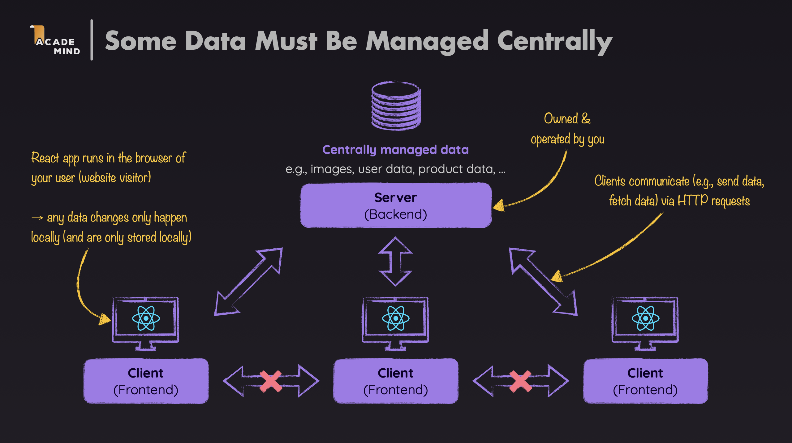
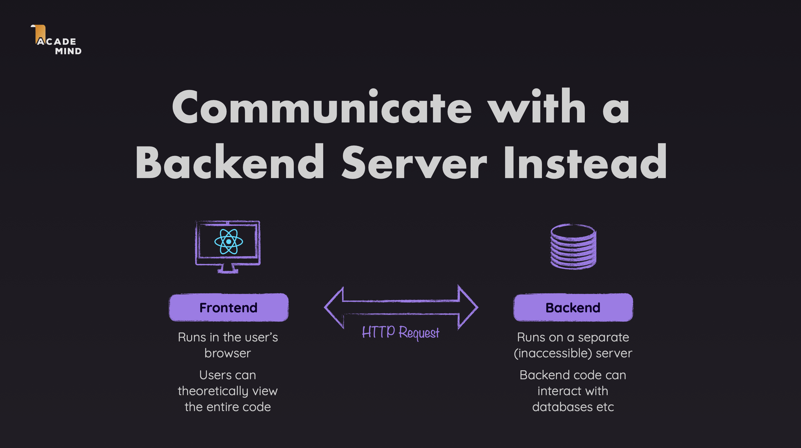
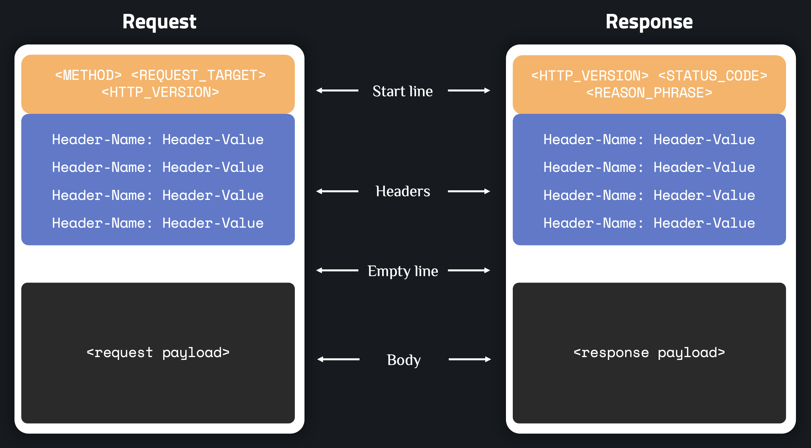
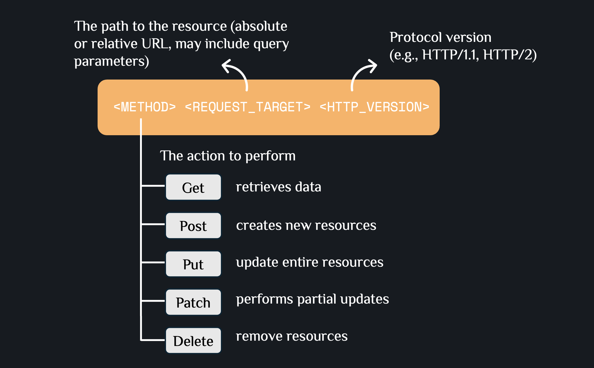
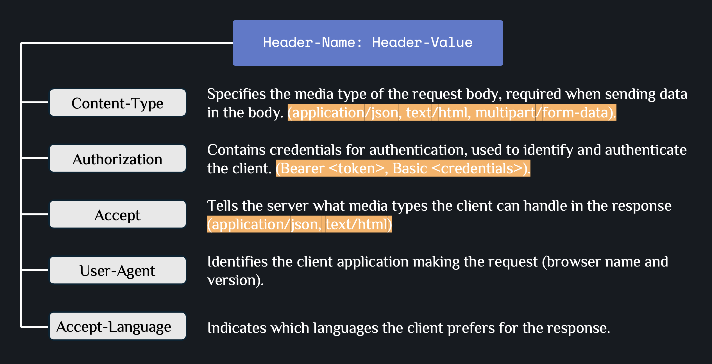
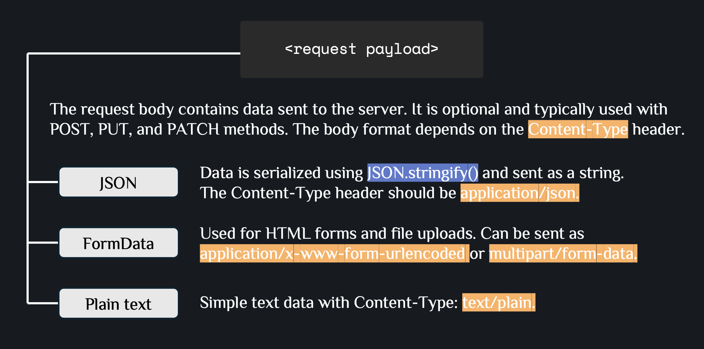
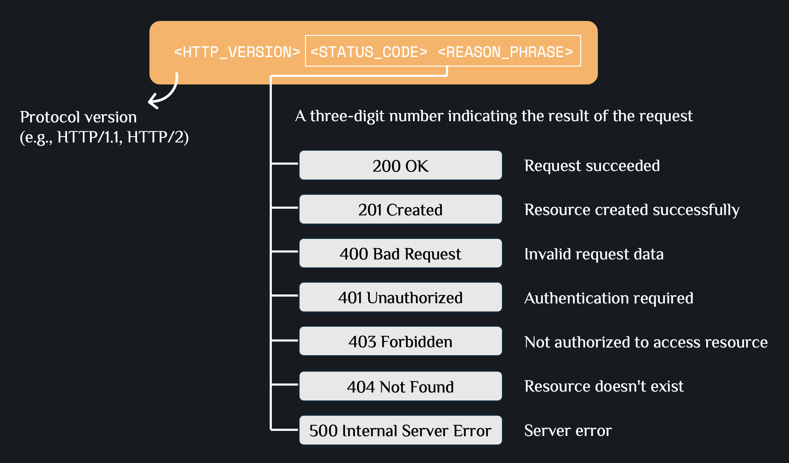
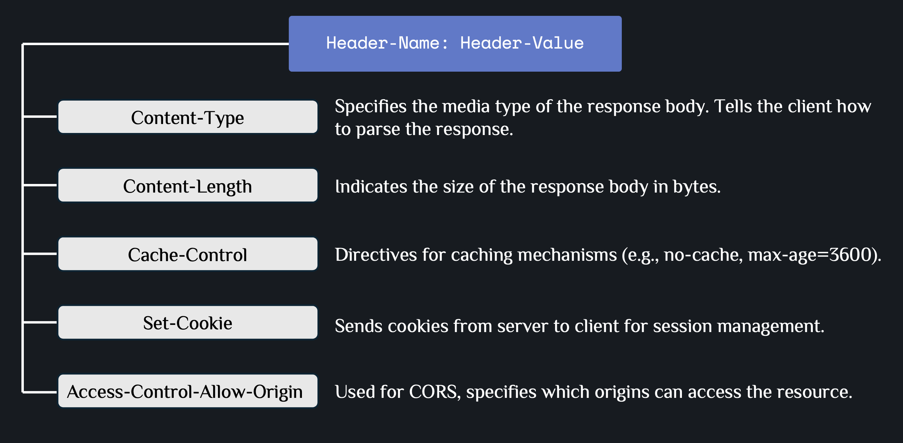
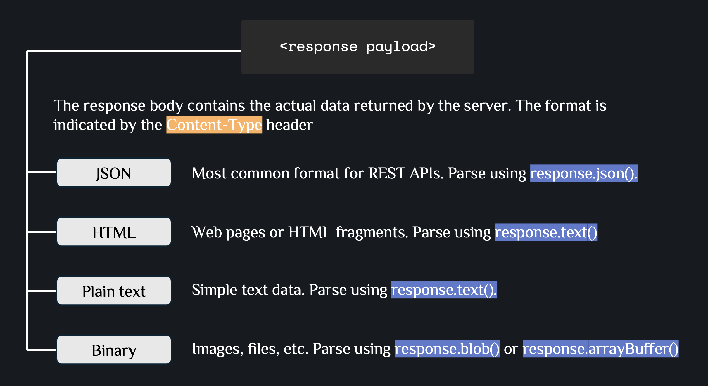
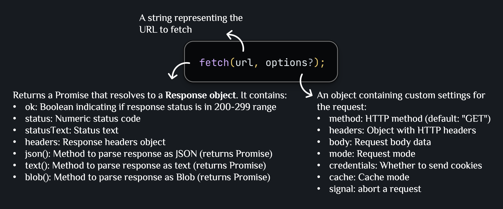

# Fetching Data

Documentation-only notes on fetching data from a backend API in React: HTTP fundamentals, the `fetch()` patterns worth knowing, and loading/error state handling.

## Core Terminology



### Backend

- The server-side part of an application that runs on a server (not in the browser) and processes requests from clients.
- Responsibilities include storing and retrieving data from databases, processing business logic, handling authentication and authorization, and serving API endpoints.

### Frontend

- The client-side part of an application that users interact with directly in their browsers.
- Responsibilities include displaying UI to users, handling user interactions, making HTTP requests to backend APIs, and managing client-side state.

### How Backend and Frontend communicate



- **HTTP Protocol**: Hypertext Transfer Protocol is the standard protocol for communication between frontend and backend. It defines how messages are formatted and transmitted.
- **Request-Response Cycle**: Client sends request → Server processes → Server sends response → Client receives response.
- **API Endpoints**: Backend exposes specific URLs (endpoints) that frontend can call to perform operations (GET, POST, PUT, PATCH, DELETE, etc.).
- **JSON Format**: Data is typically exchanged in JSON (JavaScript Object Notation) format, which is easy to parse in JavaScript.

### HTTP message

Both requests and responses share a similar structure:



- **Start line**: A single line that describes the HTTP version along with request method or the outcome of the request.
- **Headers**: An optional set of metadata that describes the message. For example, a request might include the allowed formats of that resource, while the response might include headers to indicate the actual format returned.
- **Body**: Optional data associated with the message. This might be POST data to send to the server in a request, or some resource returned to the client in a response.

### HTTP requests

**Request start-line**:



The start line of an HTTP request contains three parts: the **HTTP method**, the **request target** (usually a URL path), and the **HTTP version**. Example: `GET /user-places HTTP/1.1` means: use GET method to retrieve the resource at `/user-places` using HTTP version 1.1.

**Request Headers**:



Headers provide metadata about the request and the client making it. Common headers include `Content-Type`, `Authorization`, `Accept`, `User-Agent`, `Accept-Language`.

**Request Body**:



**Example with JSON body**:

```javascript
fetch("http://localhost:3000/user-places", {
  method: "PUT",
  headers: {
    "Content-Type": "application/json",
    "Authorization": "Bearer token123",
  },
  body: JSON.stringify({ places }),
});
```

**Example with FormData**:

```javascript
// Sending form data
const formData = new FormData();
formData.append("name", "Place Name");
formData.append("image", fileInput.files[0]);

fetch("http://localhost:3000/places", {
  method: "POST",
  body: formData,
});
```

> **Note**: Don't set `Content-Type` header for FormData - browser sets it automatically with boundary.

### HTTP responses

**Response start-line**:



The status line of an HTTP response contains three parts: the **HTTP version**, the **status code**, and the **reason phrase**. Example: `HTTP/1.1 200 OK` means: HTTP version 1.1, status code 200 (success), with reason phrase "OK".

**Example handling response**:

```javascript
const response = await fetch("http://localhost:3000/user-places");

if (!response.ok) {
  throw new Error("Failed to fetch data");
}

const data = await response.json();
console.log(data.places);
```

**Response Headers**:

Response headers provide metadata about the response and the server. Common headers include:



**Response Body**:



## Basic: Fetching Data and Handling States

This section guides you through the basic patterns for fetching data from APIs and handling different states (loading, success, error).

### fetch() Syntax

The `fetch()` function is a browser API for making HTTP requests. It returns a Promise that resolves to a Response object.



### Example 1: Basic API Call with fetch

**When to use**: When you need to fetch data from a backend API endpoint.

**File: `src/http.js`**

```javascript
export async function fetchSelectedPlace() {
  const response = await fetch("http://localhost:3000/user-places");

  if (!response.ok) {
    throw new Error("Failed to fetch selected place!");
  }

  const resData = await response.json();
  return resData.places;
}
```

### Example 2: POST/PUT Request with Body

**When to use**: When you need to send data to the backend to create or update resources.

**File: `src/http.js`**

```javascript
export async function updateUserPlace(places) {
  const response = await fetch("http://localhost:3000/user-places", {
    method: "PUT",
    body: JSON.stringify({ places }),
    headers: {
      "Content-Type": "application/json",
    },
  });

  if (!response.ok) {
    throw new Error("Failed to update user place!");
  }

  const resData = await response.json();
  return resData.message;
}
```

### Example 3: Loading, Error, and Custom Hook

**When to use**: When you need to handle loading, error states, and reuse fetching logic across components.

The pattern is: track `isFetching`/`error`/`data` state around the `fetch()` call, then extract that into a reusable hook so components don't each reimplement the same three `useState` calls. See **[`05_Custom_Hooks` → Example 3: useFetch Hook](../05_Custom_Hooks/README.md)** for the full generic implementation.

---

## Advanced: Data Fetching Patterns

### Example 1: Optimistic Updates

**When to use**: When you want to update UI immediately before the API call completes, providing instant feedback to users, then rollback if error occurs

**File: `src/App.jsx`**

```javascript
async function handleSelectPlace(selectedPlace) {
  // Optimistic update: update UI immediately
  setUserPlaces((prevPickedPlaces) => {
    if (!prevPickedPlaces) {
      prevPickedPlaces = [];
    }
    if (prevPickedPlaces.some((place) => place.id === selectedPlace.id)) {
      return prevPickedPlaces;
    }
    return [selectedPlace, ...prevPickedPlaces];
  });

  try {
    // Then sync with backend
    await updateUserPlace([selectedPlace, ...userPlaces]);
  } catch (error) {
    // Rollback on error
    setUserPlaces(userPlaces);
    setErrorUpdatingPlaces({
      message: error.message || "Failed to update places",
    });
  }
}
```

### Example 2: Request Cancellation

**When to use**: When you need to cancel an in-flight fetch request if the component unmounts before the response arrives.

```javascript
useEffect(() => {
  const controller = new AbortController();

  async function fetchData() {
    try {
      const response = await fetch(url, {
        signal: controller.signal,
      });
      const data = await response.json();
      setData(data);
    } catch (error) {
      if (error.name !== "AbortError") {
        setError(error);
      }
    }
  }

  fetchData();

  return () => {
    controller.abort();
  };
}, [url]);
```

**Documentation**: [MDN AbortController](https://developer.mozilla.org/en-US/docs/Web/API/AbortController)

### Example 3: CORS (Cross-Origin Resource Sharing)

**When to use**: When your frontend and backend are on different origins and the browser blocks requests.

- Browser security feature that restricts cross-origin requests
- Backend must set CORS headers to allow frontend requests

```javascript
app.use((req, res, next) => {
  res.setHeader("Access-Control-Allow-Origin", "*");
  res.setHeader("Access-Control-Allow-Methods", "GET, PUT, POST, DELETE");
  res.setHeader("Access-Control-Allow-Headers", "Content-Type");
  next();
});
```

**Documentation**: [MDN CORS](https://developer.mozilla.org/en-US/docs/Web/HTTP/CORS)

---

## References

- [MDN Fetch API](https://developer.mozilla.org/en-US/docs/Web/API/Fetch_API)
- [MDN HTTP Protocol](https://developer.mozilla.org/en-US/docs/Web/HTTP)
- [HTTP Status Codes](https://developer.mozilla.org/en-US/docs/Web/HTTP/Status)
