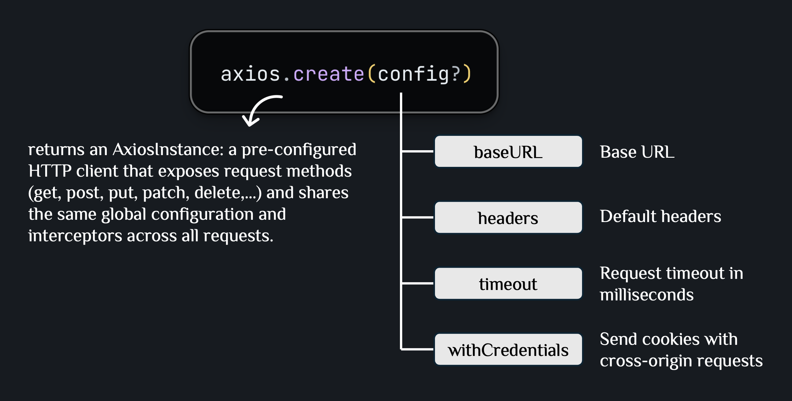
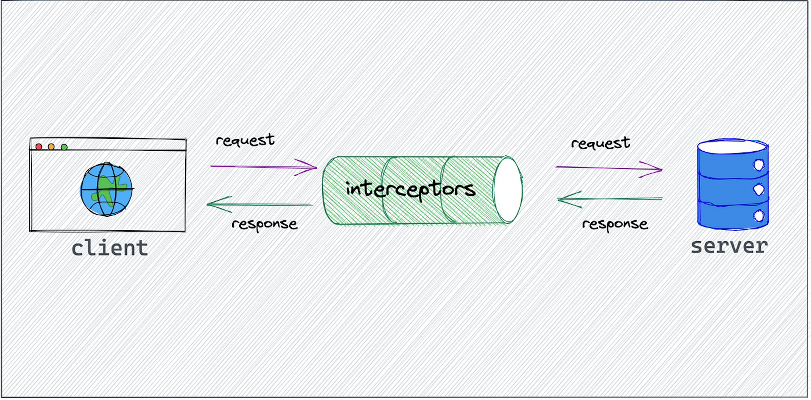
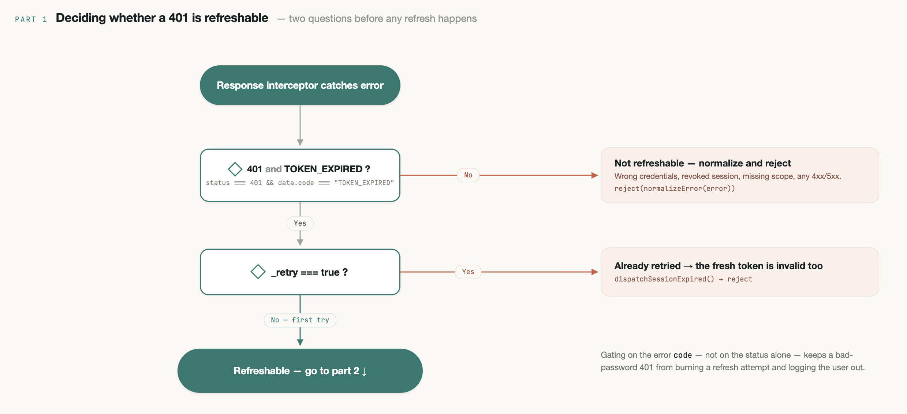
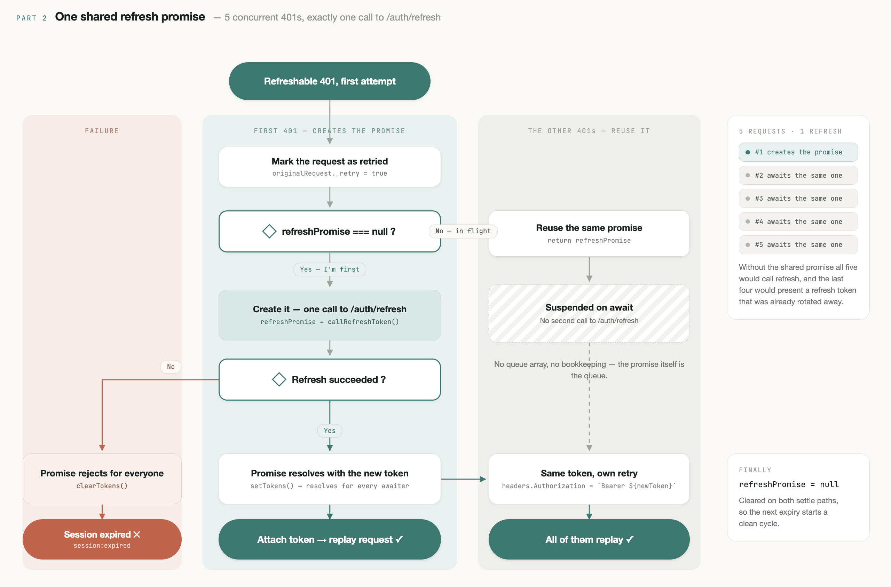

# Axios

A guide to using **Axios** as the HTTP client layer: instances, interceptors, error normalization, and token refresh — with TypeScript.

---

## Core Terminology

### Axios Instance & Config

Axios Instance is a reusable, pre-configured HTTP client created by `axios.create()`. It centralizes global settings (baseURL, headers, timeout) and interceptors, ensuring consistent request behavior and easier maintenance across the application.



**Example**:

```typescript
const axiosInstance = axios.create({
  baseURL: import.meta.env.VITE_API_URL,
  timeout: 10000,
  headers: {
    "Content-Type": "application/json",
  },
});
```

> Note: Axios config contains many fields, but not all are suitable for global configuration. Some options are method-specific (e.g., `data`, `params`) and should be defined per request to avoid unintended side effects.

**Global Config vs Per-request Config**:

| Aspect       | Global Config                                      | Per-request Config                                  |
| ------------ | --------------------------------------------------- | ----------------------------------------------------- |
| **Where**    | Set in `axios.create()`                            | Passed as second parameter to request methods         |
| **Scope**    | Applied to ALL requests made with the instance      | Applied to a SPECIFIC request only                     |
| **Purpose**  | Set defaults that every request should have         | Override or add config for specific requests           |
| **Example**  | `baseURL`, `timeout`, `headers`, `withCredentials`  | `params`, `data`, `method`, `url`, custom `timeout`     |
| **Use Case** | Common settings like API base URL, default headers  | Request-specific data, query params, custom headers    |

### Interceptors (Very Important)

Interceptors are functions from `axiosInstance` that run **before a request is sent** or **after a response is received**, allowing centralized side effects and logic reuse.



**Request Interceptor**:

- Executes before the HTTP request is sent.
- Common use cases: attach auth tokens, set headers, log requests, or modify config.
- Must return config or a Promise that resolves to config.

**Response Interceptor**:

- Executes after a response is received (success or error).
- Common use cases: normalize errors, handle token refresh, or global error handling.

### Axios vs Fetch API

| Aspect                              | Axios                                                      | Fetch API                                                           |
| ------------------------------------ | ------------------------------------------------------------ | ----------------------------------------------------------------------- |
| **Package**                         | External library (axios)                                    | Built-in browser API (fetch)                                            |
| **Request/Response**                | Automatically transforms JSON data                          | Requires manual `.json()` call                                          |
| **Error Handling**                  | Treats 4xx/5xx as errors automatically                      | Only rejects on network errors; 4xx/5xx are "successful" responses     |
| **Request Timeout**                 | Built-in timeout support                                    | Requires `AbortController` for timeout                                  |
| **Interceptors**                    | Built-in request/response interceptors                      | No built-in interceptors (need manual wrapper)                          |
| **Request Cancellation**            | Built-in with `AbortController`                             | Uses `AbortController`                                                  |
| **Instance & Config**               | Can create instances with default config                    | No instance concept; need to wrap in function                           |
| **TypeScript Support**              | Excellent TypeScript support                                 | Basic TypeScript support                                                |
| **Bundle Size**                     | ~13KB (minified + gzipped)                                   | 0KB (native API)                                                        |

---

## Setup

### Step 1: Token Helpers (`token.ts`)

Centralize all token read/write logic in a dedicated file. No need for a wrapper object — export each function directly for cleaner imports.

**File: `src/api/token.ts`**

```typescript
const ACCESS_TOKEN_KEY = "access_token";
const REFRESH_TOKEN_KEY = "refresh_token";

export const getAccessToken = (): string | null =>
  localStorage.getItem(ACCESS_TOKEN_KEY);

export const getRefreshToken = (): string | null =>
  localStorage.getItem(REFRESH_TOKEN_KEY);

export const setTokens = (accessToken: string, refreshToken?: string): void => {
  localStorage.setItem(ACCESS_TOKEN_KEY, accessToken);
  if (refreshToken) {
    localStorage.setItem(REFRESH_TOKEN_KEY, refreshToken);
  }
};

export const clearTokens = (): void => {
  localStorage.removeItem(ACCESS_TOKEN_KEY);
  localStorage.removeItem(REFRESH_TOKEN_KEY);
};
```

---

### Step 2: Configure Axios Instance (`axios-instance.ts`)

**File: `src/api/axios-instance.ts`**

Three key concepts are implemented inside the interceptors — all explained via comments in the full instance below:

- **AppError**: normalize all HTTP errors into one consistent shape so every `catch` block handles one type.
- **Single In-flight Refresh Promise**: All requests hitting a `401` share one refresh promise — first one triggers it, the rest just wait and reuse the result.
- **Session Expiry**: dispatch a custom event instead of `window.location.href` to avoid a full page reload in a React SPA.

#### Full Instance

```typescript
import axios, {
  AxiosInstance,
  InternalAxiosRequestConfig,
  AxiosResponse,
  AxiosError,
} from "axios";
import { getAccessToken, getRefreshToken, setTokens, clearTokens } from "./token";

// --- Types ---

interface RefreshTokenResponse {
  access_token: string;
  refresh_token?: string;
}

interface CustomAxiosRequestConfig extends InternalAxiosRequestConfig {
  _retry?: boolean;
}

// --- AppError ---

export class AppError extends Error {
  status: number;
  code: string;

  constructor(message: string, status: number, code = "UNKNOWN_ERROR") {
    super(message);
    this.name = "AppError";
    this.status = status;
    this.code = code;
  }
}

const normalizeError = (error: AxiosError): AppError => {
  const status = error.response?.status ?? 0;
  const data = error.response?.data as Record<string, unknown> | undefined;
  const message = (data?.message as string) || error.message || "Something went wrong";
  const code = (data?.code as string) || `HTTP_${status}`;
  return new AppError(message, status, code);
};

// --- Refresh token API call ---
// Use base axios (not the instance) to avoid interceptor loop

const callRefreshToken = async (): Promise<string> => {
  const refreshToken = getRefreshToken();
  if (!refreshToken) {
    throw new AppError("No refresh token", 401, "NO_REFRESH_TOKEN");
  }

  const response = await axios.post<RefreshTokenResponse>(
    `${import.meta.env.VITE_API_URL}/auth/refresh`,
    { refresh_token: refreshToken }
  );

  const { access_token, refresh_token } = response.data;
  setTokens(access_token, refresh_token);
  return access_token;
};

// --- Single in-flight refresh promise ---

let refreshPromise: Promise<string> | null = null;

const getRefreshedToken = (): Promise<string> => {
  if (!refreshPromise) {
    refreshPromise = callRefreshToken().finally(() => {
      refreshPromise = null;
    });
  }
  return refreshPromise;
};

// --- Session expiry ---

const dispatchSessionExpired = (): void => {
  clearTokens();
  window.dispatchEvent(new Event("session:expired"));
};

// --- Axios instance ---

const axiosInstance: AxiosInstance = axios.create({
  baseURL: import.meta.env.VITE_API_URL,
  timeout: 10_000,
  headers: { "Content-Type": "application/json" },
});

// Request interceptor — attach access token
axiosInstance.interceptors.request.use(
  (config: InternalAxiosRequestConfig) => {
    const token = getAccessToken();
    if (token) config.headers.Authorization = `Bearer ${token}`;
    return config;
  },
  (error: AxiosError) => Promise.reject(error)
);

// Response interceptor — handle 401 + token refresh
axiosInstance.interceptors.response.use(
  (response: AxiosResponse) => response,
  async (error: AxiosError) => {
    const originalRequest = error.config as CustomAxiosRequestConfig;
    const status = error.response?.status;
    const data = error.response?.data as Record<string, unknown> | undefined;
    const code = data?.code as string | undefined;

    // Only a 401 with code === "TOKEN_EXPIRED" means "access token expired,
    // safe to refresh". A bare 401 (wrong credentials, revoked session,
    // insufficient scope, ...) must NOT trigger a refresh attempt.
    const isTokenExpired = status === 401 && code === "TOKEN_EXPIRED";

    if (!isTokenExpired) {
      return Promise.reject(normalizeError(error));
    }

    // Already retried once → the refreshed token is also invalid
    if (originalRequest._retry) {
      dispatchSessionExpired();
      return Promise.reject(normalizeError(error));
    }

    originalRequest._retry = true;

    try {
      // Concurrent 401s all await the same in-flight promise here —
      // no manual queue bookkeeping needed.
      const newToken = await getRefreshedToken();
      originalRequest.headers!.Authorization = `Bearer ${newToken}`;
      return axiosInstance(originalRequest);
    } catch (refreshError) {
      dispatchSessionExpired();
      return Promise.reject(refreshError);
    }
  }
);

export default axiosInstance;
```

**Token Refresh Flow**:





---

### Step 3: Create API Functions with DTOs

**DTO (Data Transfer Object)**: TypeScript interfaces defining the shape of data exchanged with the API. They act as a contract between frontend and backend.

```typescript
// types/user.ts
export interface User {
  id: number;
  name: string;
  email: string;
}

export interface CreateUserDTO {
  name: string;
  email: string;
}

export interface UpdateUserDTO {
  name?: string;
  email?: string;
}
```

**File: `src/api/user.api.ts`**

```typescript
import axiosInstance from "./axios-instance";
import { User, CreateUserDTO, UpdateUserDTO } from "../types/user";

export const userApi = {
  getUsers: async (): Promise<User[]> => {
    const res = await axiosInstance.get<User[]>("/users");
    return res.data;
  },

  getUserById: async (id: number): Promise<User> => {
    const res = await axiosInstance.get<User>(`/users/${id}`);
    return res.data;
  },

  createUser: async (data: CreateUserDTO): Promise<User> => {
    const res = await axiosInstance.post<User>("/users", data);
    return res.data;
  },

  updateUser: async (id: number, data: UpdateUserDTO): Promise<User> => {
    const res = await axiosInstance.put<User>(`/users/${id}`, data);
    return res.data;
  },

  deleteUser: async (id: number): Promise<void> => {
    await axiosInstance.delete(`/users/${id}`);
  },
};
```

**File: `src/api/auth.api.ts`**

```typescript
import axiosInstance from "./axios-instance";
import { LoginDTO, AuthResponse } from "../types/auth";

export const authApi = {
  login: async (data: LoginDTO): Promise<AuthResponse> => {
    const res = await axiosInstance.post<AuthResponse>("/auth/login", data);
    return res.data;
  },

  logout: async (): Promise<void> => {
    await axiosInstance.post("/auth/logout");
  },
};
```

---

## References

- [Axios Documentation](https://axios-http.com/)
- [TypeScript Handbook](https://www.typescriptlang.org/docs/)
