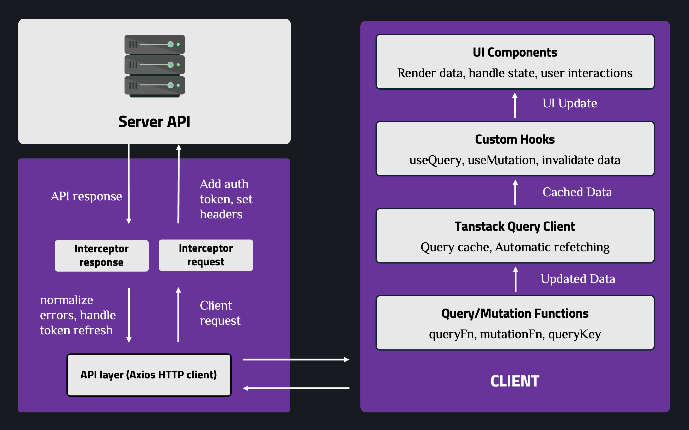

# Axios & TanStack Query

**Axios** handles the HTTP layer (instances, interceptors, error normalization). **TanStack Query** (React Query) sits on top of it to manage server state — caching, background sync, and mutations. Together they form the API layer of a React + TypeScript app.

- **[Axios](./AXIOS.md)** — instance & config, interceptors, token refresh, Axios vs Fetch
- **[TanStack Query](./TANSTACK_QUERY.md)** — query/mutation fundamentals, cache behavior, optimistic updates, infinite queries, dependent/parallel queries, cancellation, retry strategy, devtools

---

## Combining Axios + TanStack Query + TypeScript

TanStack Query never calls the network directly — its `queryFn`/`mutationFn` wraps an Axios call. Axios owns *how* a request is made (auth headers, retries at the transport level, error shape); TanStack Query owns *when* it's made and how the result is cached.

`AppError` (defined in the Axios instance) is the one error shape both layers speak — API functions throw it, and TanStack Query's `onError` / `isError` handling can rely on it consistently regardless of which endpoint failed.

---

## References

- [Axios Documentation](https://axios-http.com/)
- [TanStack Query Documentation](https://tanstack.com/query/latest)
- [TypeScript Handbook](https://www.typescriptlang.org/docs/)
