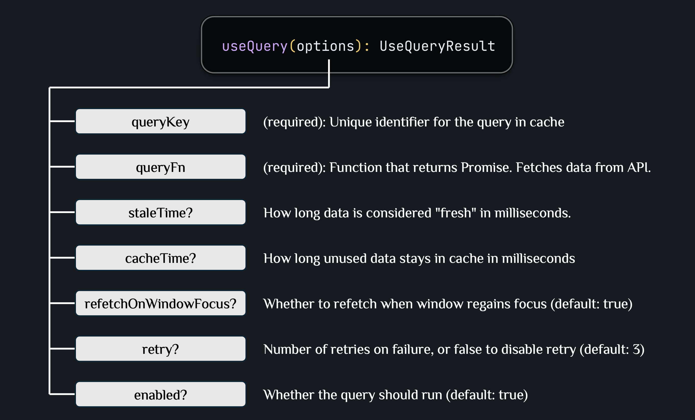
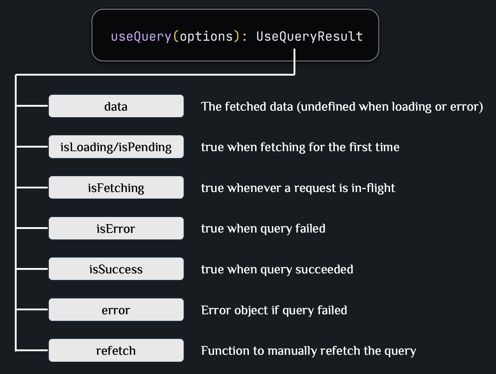
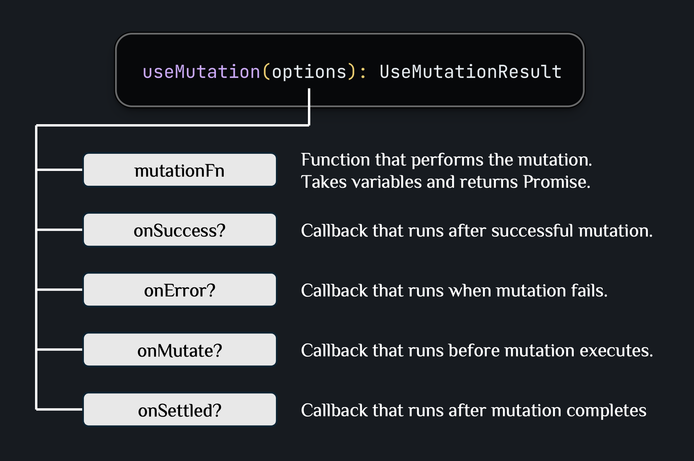
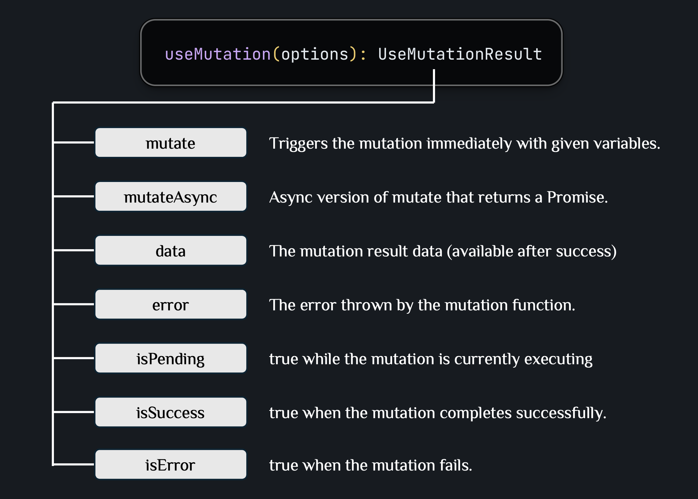
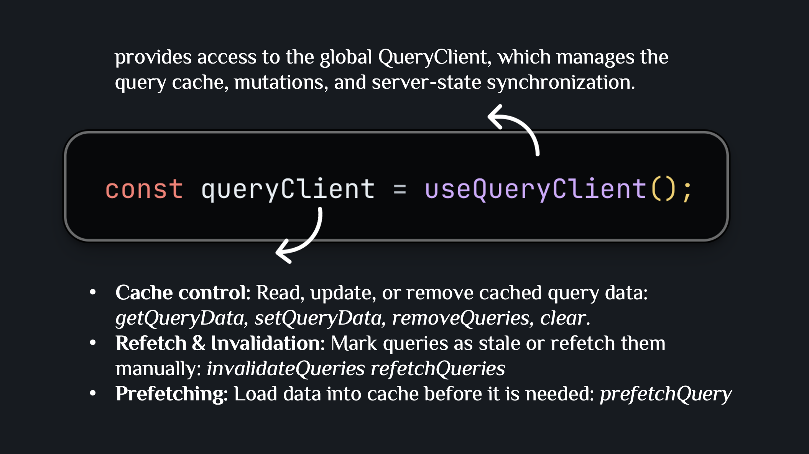

# TanStack Query

A guide to **TanStack Query** (React Query): caching, background sync, mutations, and common data-fetching use cases — built on top of an Axios instance.

---

## Core Terminology

### Server State vs Client State

| Aspect              | Server State                                        | Client/UI State                                         |
| -------------------- | ----------------------------------------------------- | ----------------------------------------------------------- |
| **Source**          | Data from server/API                                 | Data managed in component                                    |
| **Managed by**      | TanStack Query                                       | React state (useState, useReducer)                            |
| **Source of Truth** | Server is the source of truth                        | Component state is the source of truth                        |
| **Synchronization** | Needs sync with server, caching, background updates  | No sync needed, local only                                     |
| **Examples**        | Posts list, user profile, product data               | Form inputs, UI toggles, modal open/close, selected tab       |

### Query Fundamentals

**Query**: `useQuery` binds an async read operation to a unique cache key, manages its lifecycle, and exposes the result to React components.



**`staleTime` vs `cacheTime` (`gcTime` in v5)**

| Aspect | `staleTime` | `cacheTime` / `gcTime` |
| --- | --- | --- |
| **Question it answers** | How long is the data considered "fresh"? | How long does unused data stay in memory? |
| **Controls** | Whether a background refetch is triggered | Whether the cached data is garbage-collected |
| **Starts counting from** | The last successful fetch | The moment the query has zero active observers (all components unmount) |
| **Default** | `0` (stale immediately) | `300000` ms (5 minutes) |
| **When it expires** | Next remount/refocus triggers a silent background refetch | Cached data is deleted; next mount has nothing to show and must fetch from scratch |

Remounting the same query key behaves differently depending on where you are relative to both timers:

| Remount timing | Cached data shown instantly? | Background refetch triggered? |
| --- | --- | --- |
| Within `staleTime` (still fresh) | Yes, from cache | No |
| After `staleTime` but within `cacheTime` | Yes, from cache | Yes, refetches silently in the background |
| After `cacheTime` (cache garbage-collected) | No — shows loading state | Yes, fetches from scratch |

> `staleTime` only decides whether a background refetch happens — it never causes a loading spinner. What decides "instant data vs. loading spinner" is whether the cache entry still exists, i.e. whether `cacheTime`/`gcTime` has expired.



**`isPending` vs `isFetching` (v5)** — `isPending` means "no data yet" (`data === undefined`); `isFetching` means "a request is running right now." Caveats:

- A disabled/dependent query (`enabled: false`) is `isPending: true` even though nothing is fetching.
- A background refetch of stale data is `isPending: false` but `isFetching: true`, since the old data is still there.
- Guard `data` access with `isPending` (`if (isPending) return <Skeleton />`); use `isFetching` only for a non-blocking "updating…" indicator.

**Mutations**: `useMutation` manages write operations (create, update, delete) and their side effects on server state.





---

### Cache & Sync Terminology



**Cache Invalidation**: Marking cached data as stale so TanStack Query refetches it.

**Polling**: Automatically refetch data at regular intervals using `refetchInterval`.

**Deduplication**: When multiple components request the same query key simultaneously, only one HTTP request is made.

**Prefetch**: Fetch and cache data before the user navigates to it using `queryClient.prefetchQuery()`.

---

## Setup

### Step 1: Setup QueryClient

**File: `src/lib/queryClient.ts`**

```typescript
import { QueryClient } from "@tanstack/react-query";

export const queryClient = new QueryClient({
  defaultOptions: {
    queries: {
      staleTime: 1000 * 60 * 5,      // 5 minutes
      gcTime: 1000 * 60 * 10,        // 10 minutes
      refetchOnWindowFocus: false,
      refetchOnReconnect: true,
      retry: 3,
      retryDelay: (attemptIndex) => Math.min(1000 * 2 ** attemptIndex, 30000),
    },
    mutations: {
      retry: 1,
    },
  },
});
```

**File: `src/providers/react-query.provider.tsx`**

```typescript
import { QueryClientProvider } from "@tanstack/react-query";
import { ReactNode } from "react";
import { queryClient } from "../lib/queryClient";

export function ReactQueryProvider({ children }: { children: ReactNode }) {
  return (
    <QueryClientProvider client={queryClient}>{children}</QueryClientProvider>
  );
}
```

---

### Step 2: Query Keys Factory

**File: `src/constants/queryKeys.ts`**

```typescript
export const queryKeys = {
  users: {
    all: ["users"] as const,
    lists: () => [...queryKeys.users.all, "list"] as const,
    detail: (id: number) => [...queryKeys.users.all, "detail", id] as const,
  },
  auth: {
    all: ["auth"] as const,
    currentUser: () => [...queryKeys.auth.all, "currentUser"] as const,
  },
};
```

---

### Step 3: Query & Mutation Hooks

**File: `src/hooks/queries/useUserQuery.ts`**

```typescript
import { useQuery } from "@tanstack/react-query";
import { userApi } from "../../api/user.api";
import { queryKeys } from "../../constants/queryKeys";

export function useUsers() {
  return useQuery({
    queryKey: queryKeys.users.lists(),
    queryFn: userApi.getUsers,
  });
}

export function useUser(id: number) {
  return useQuery({
    queryKey: queryKeys.users.detail(id),
    queryFn: () => userApi.getUserById(id),
    enabled: !!id,
  });
}
```

**File: `src/hooks/mutations/useLoginMutation.ts`**

```typescript
import { useMutation, useQueryClient } from "@tanstack/react-query";
import { authApi } from "../../api/auth.api";
import { setTokens } from "../../api/token";
import { queryKeys } from "../../constants/queryKeys";
import { AppError } from "../../api/axios-instance";
import { LoginDTO } from "../../types/auth";

export function useLoginMutation() {
  const queryClient = useQueryClient();

  return useMutation({
    mutationFn: (data: LoginDTO) => authApi.login(data),
    onSuccess: (data) => {
      setTokens(data.accessToken, data.refreshToken);
      queryClient.invalidateQueries({ queryKey: queryKeys.auth.currentUser() });
    },
    onError: (error) => {
      if (error instanceof AppError) {
        console.error(`[${error.code}] ${error.message}`);
      }
    },
  });
}
```

**File: `src/hooks/mutations/useUpdateProfileMutation.ts`**

```typescript
import { useMutation, useQueryClient } from "@tanstack/react-query";
import { userApi } from "../../api/user.api";
import { queryKeys } from "../../constants/queryKeys";
import { AppError } from "../../api/axios-instance";
import { UpdateUserDTO } from "../../types/user";

export function useUpdateProfileMutation() {
  const queryClient = useQueryClient();

  return useMutation({
    mutationFn: ({ id, data }: { id: number; data: UpdateUserDTO }) =>
      userApi.updateUser(id, data),
    onSuccess: (_, { id }) => {
      queryClient.invalidateQueries({ queryKey: queryKeys.users.detail(id) });
      queryClient.invalidateQueries({ queryKey: queryKeys.users.lists() });
    },
    onError: (error) => {
      if (error instanceof AppError) {
        console.error(`[${error.code}] ${error.message} (HTTP ${error.status})`);
      }
    },
  });
}
```

---

### Step 4: Use in Components

**File: `src/components/user/UserList.tsx`**

```typescript
import { useUsers } from "../../hooks/queries/useUserQuery";
import { AppError } from "../../api/axios-instance";

export function UserList() {
  const { data: users, isPending, isError, error } = useUsers();

  if (isPending) return <div>Loading...</div>;

  if (isError) {
    const message = error instanceof AppError
      ? `[${error.code}] ${error.message}`
      : "Unexpected error";
    return <div>Error: {message}</div>;
  }

  return (
    <ul>
      {users?.map((user) => (
        <li key={user.id}>{user.name}</li>
      ))}
    </ul>
  );
}
```

**File: `src/components/user/UserProfile.tsx`**

```typescript
import { useUser } from "../../hooks/queries/useUserQuery";
import { useUpdateProfileMutation } from "../../hooks/mutations/useUpdateProfileMutation";
import { AppError } from "../../api/axios-instance";

export function UserProfile({ userId }: { userId: number }) {
  const { data: user, isPending, isError, error } = useUser(userId);
  const updateProfile = useUpdateProfileMutation();

  if (isPending) return <div>Loading...</div>;
  if (isError) return <div>{error instanceof AppError ? error.message : "Error"}</div>;

  const handleUpdate = async () => {
    try {
      await updateProfile.mutateAsync({ id: userId, data: { name: "New Name" } });
    } catch (error) {
      if (error instanceof AppError) {
        alert(`Failed (${error.status}): ${error.message}`);
      }
    }
  };

  return (
    <div>
      <h1>{user.name}</h1>
      <button onClick={handleUpdate} disabled={updateProfile.isPending}>
        {updateProfile.isPending ? "Updating..." : "Update Profile"}
      </button>
      {updateProfile.isError && updateProfile.error instanceof AppError && (
        <p style={{ color: "red" }}>{updateProfile.error.message}</p>
      )}
    </div>
  );
}
```

---

## Advanced Patterns

### 1. Optimistic Updates

```typescript
export function useUpdatePost() {
  const queryClient = useQueryClient();

  return useMutation({
    mutationFn: ({ id, data }: { id: number; data: UpdatePostDTO }) =>
      postsApi.updatePost(id, data),

    onMutate: async ({ id, data }) => {
      // Cancel in-flight queries to avoid overwriting the optimistic update
      await queryClient.cancelQueries({ queryKey: postKeys.detail(id) });
      const previousPost = queryClient.getQueryData<Post>(postKeys.detail(id));

      // Optimistically update the cache
      queryClient.setQueryData<Post>(postKeys.detail(id), (old) =>
        old ? { ...old, ...data } : old
      );

      return { previousPost };
    },

    onError: (_, { id }, context) => {
      // Roll back on failure
      if (context?.previousPost) {
        queryClient.setQueryData(postKeys.detail(id), context.previousPost);
      }
    },

    onSettled: (_, __, { id }) => {
      // Always sync with server after mutation
      queryClient.invalidateQueries({ queryKey: postKeys.detail(id) });
    },
  });
}
```

### 2. Prefetching

```typescript
export function usePrefetchPost() {
  const queryClient = useQueryClient();

  return (id: number) => {
    queryClient.prefetchQuery({
      queryKey: postKeys.detail(id),
      queryFn: () => postsApi.getPostById(id),
      staleTime: 1000 * 60 * 5,
    });
  };
}

// Usage — prefetch on hover before user navigates
<li onMouseEnter={() => prefetchPost(post.id)}>
  <Link to={`/posts/${post.id}`}>{post.title}</Link>
</li>
```

### 3. Infinite Query

`useInfiniteQuery` handles paginated data as an ever-growing list — perfect for "Load more" buttons or infinite scroll. Instead of `data`, it returns `data.pages` (each page from a separate fetch) plus helpers to trigger the next fetch.

**Key differences vs `useQuery`**:

| Concept              | `useQuery`               | `useInfiniteQuery`                                     |
| -------------------- | ------------------------ | ------------------------------------------------------ |
| **Return shape**     | `data: T`                | `data: { pages: T[]; pageParams: unknown[] }`          |
| **Page param**       | N/A                      | Passed to `queryFn` via `{ pageParam }`                |
| **Required in v5**   | —                        | `initialPageParam` + `getNextPageParam`                |
| **Fetch next page**  | `refetch()`              | `fetchNextPage()` + `hasNextPage` + `isFetchingNextPage` |

**API function** — accept a page param and return pagination metadata so the hook knows when to stop:

```typescript
// src/api/post.api.ts
export interface PostsPage {
  items: Post[];
  nextCursor: number | null; // null when no more pages
}

export const postsApi = {
  getPostsPage: async (cursor: number = 0, limit = 10): Promise<PostsPage> => {
    const res = await axiosInstance.get<PostsPage>("/posts", {
      params: { cursor, limit },
    });
    return res.data;
  },
};
```

**Hook**:

```typescript
// src/hooks/queries/usePostsInfinite.ts
import { useInfiniteQuery } from "@tanstack/react-query";
import { postsApi } from "../../api/post.api";
import { postKeys } from "../../constants/queryKeys";

export function usePostsInfinite() {
  return useInfiniteQuery({
    queryKey: postKeys.infinite(),
    queryFn: ({ pageParam }) => postsApi.getPostsPage(pageParam),
    initialPageParam: 0,
    getNextPageParam: (lastPage) => lastPage.nextCursor ?? undefined,
    // Optional: enable reverse pagination
    // getPreviousPageParam: (firstPage) => firstPage.prevCursor ?? undefined,
  });
}
```

Add the corresponding key to the factory:

```typescript
// src/constants/queryKeys.ts
posts: {
  all: ["posts"] as const,
  infinite: () => [...queryKeys.posts.all, "infinite"] as const,
},
```

**Component — "Load more" button**:

```typescript
export function PostsFeed() {
  const {
    data,
    fetchNextPage,
    hasNextPage,
    isFetchingNextPage,
    isPending,
    isError,
  } = usePostsInfinite();

  if (isPending) return <div>Loading...</div>;
  if (isError) return <div>Failed to load posts</div>;

  return (
    <>
      <ul>
        {data?.pages.flatMap((page) =>
          page.items.map((post) => <li key={post.id}>{post.title}</li>)
        )}
      </ul>

      <button
        onClick={() => fetchNextPage()}
        disabled={!hasNextPage || isFetchingNextPage}
      >
        {isFetchingNextPage ? "Loading more..." : hasNextPage ? "Load more" : "No more posts"}
      </button>
    </>
  );
}
```

**Component — infinite scroll with `IntersectionObserver`**:

```typescript
import { useEffect, useRef } from "react";

export function PostsInfiniteScroll() {
  const { data, fetchNextPage, hasNextPage, isFetchingNextPage } = usePostsInfinite();
  const sentinelRef = useRef<HTMLDivElement | null>(null);

  useEffect(() => {
    const node = sentinelRef.current;
    if (!node) return;

    const observer = new IntersectionObserver(([entry]) => {
      if (entry.isIntersecting && hasNextPage && !isFetchingNextPage) {
        fetchNextPage();
      }
    });

    observer.observe(node);
    return () => observer.disconnect();
  }, [fetchNextPage, hasNextPage, isFetchingNextPage]);

  return (
    <>
      {data?.pages.flatMap((page) =>
        page.items.map((post) => <article key={post.id}>{post.title}</article>)
      )}
      <div ref={sentinelRef} style={{ height: 1 }} />
      {isFetchingNextPage && <div>Loading more...</div>}
    </>
  );
}
```

**Common pitfalls**:

- Forgetting `initialPageParam` — required in v5, will throw at runtime.
- Returning `null` vs `undefined` from `getNextPageParam` — **must** be `undefined` to mark "no more pages"; `null` is treated as a valid page param.
- Flattening with `.map(page => page.items)` instead of `.flatMap(...)` — leaves nested arrays and breaks rendering.
- Mutating a single item requires updating the correct page in `queryClient.setQueryData`, not the whole cache.

### 4. Dependent & Parallel Queries

**Dependent query** — one query needs the result of another before it can run. Gate it with `enabled`:

```typescript
export function useUserOrders(userId?: number) {
  const { data: user } = useUser(userId!);

  return useQuery({
    queryKey: orderKeys.byUser(user?.id),
    queryFn: () => ordersApi.getOrdersByUser(user!.id),
    enabled: !!user?.id, // only runs once `user` is loaded
  });
}
```

Each query still gets its own `isPending`/`isError` — a dependent query stays `isPending: true` (not `isError`) while it waits, since `enabled: false` isn't a failure.

**Parallel queries — fixed number**: just call multiple `useQuery` hooks side by side; TanStack Query fires them concurrently, not sequentially.

```typescript
function Dashboard() {
  const users = useQuery({ queryKey: userKeys.lists(), queryFn: userApi.getUsers });
  const stats = useQuery({ queryKey: statsKeys.summary(), queryFn: statsApi.getSummary });
  // both requests fire immediately and independently
}
```

**Parallel queries — dynamic list**: when the number of queries depends on runtime data (e.g. one request per item in an array), use `useQueries` instead of calling `useQuery` in a loop (which breaks the rules of hooks):

```typescript
import { useQueries } from "@tanstack/react-query";

function useUsersByIds(ids: number[]) {
  return useQueries({
    queries: ids.map((id) => ({
      queryKey: userKeys.detail(id),
      queryFn: () => userApi.getUserById(id),
    })),
  });
}

// Usage
const results = useUsersByIds([1, 2, 3]);
const isPending = results.some((r) => r.isPending);
const users = results.map((r) => r.data).filter(Boolean);
```

### 5. Query Cancellation & `select`

**Cancellation** — TanStack Query passes an `AbortSignal` into `queryFn` as part of the context object. Forward it to Axios so an in-flight request is aborted when the query is cancelled (key changes, component unmounts, or a newer call to the same key supersedes it):

```typescript
export const postsApi = {
  getPostById: async (id: number, signal?: AbortSignal): Promise<Post> => {
    const res = await axiosInstance.get<Post>(`/posts/${id}`, { signal });
    return res.data;
  },
};

export function usePost(id: number) {
  return useQuery({
    queryKey: postKeys.detail(id),
    queryFn: ({ signal }) => postsApi.getPostById(id, signal),
  });
}
```

Without this, switching between detail pages quickly leaves stale requests running in the background that can still resolve and overwrite newer data.

**`select`** — transform or pick a slice of cached data without storing the transformed shape in the cache itself. The component only re-renders when the *selected* value changes, not on every change to the raw cached object:

```typescript
export function useUserName(id: number) {
  return useQuery({
    queryKey: userKeys.detail(id),
    queryFn: () => userApi.getUserById(id),
    select: (user) => user.name, // component re-renders only when `name` changes
  });
}
```

`select` is also useful for deriving view-specific data (e.g. counts, filtered lists) from one shared cache entry instead of duplicating fetch logic per component.

### 6. Error/Retry Strategy & Devtools

**Selective retry** — the default `retry: 3` (from [Step 1: Setup QueryClient](#step-1-setup-queryclient)) retries every failure, including ones that will never succeed (e.g. `404`, `401`, validation errors). Use a function to retry only what's worth retrying:

```typescript
export const queryClient = new QueryClient({
  defaultOptions: {
    queries: {
      retry: (failureCount, error) => {
        const status = error instanceof AppError ? error.status : 0;
        // Don't retry client errors — they won't fix themselves
        if (status >= 400 && status < 500) return false;
        // Retry network/server errors up to 3 times
        return failureCount < 3;
      },
      retryDelay: (attemptIndex) => Math.min(1000 * 2 ** attemptIndex, 30000),
    },
  },
});
```

Mutations usually should **not** retry blindly — retrying a `POST` that already succeeded server-side but timed out on the response can create duplicate records. Prefer `retry: 0` (or `1` at most) on mutations unless the endpoint is idempotent.

**Devtools** — inspect cache contents, query status, and refetch behavior live in the browser. Mount it once near the root, guarded to dev builds only:

```typescript
import { QueryClientProvider } from "@tanstack/react-query";
import { ReactQueryDevtools } from "@tanstack/react-query-devtools";
import { ReactNode } from "react";
import { queryClient } from "../lib/queryClient";

export function ReactQueryProvider({ children }: { children: ReactNode }) {
  return (
    <QueryClientProvider client={queryClient}>
      {children}
      {import.meta.env.DEV && <ReactQueryDevtools initialIsOpen={false} />}
    </QueryClientProvider>
  );
}
```

---

## References

- [TanStack Query Documentation](https://tanstack.com/query/latest)
- [React Query DevTools](https://tanstack.com/query/latest/docs/react/devtools)
