# React Hook Form + Zod

Notes on the mental model behind React Hook Form (RHF) + Zod

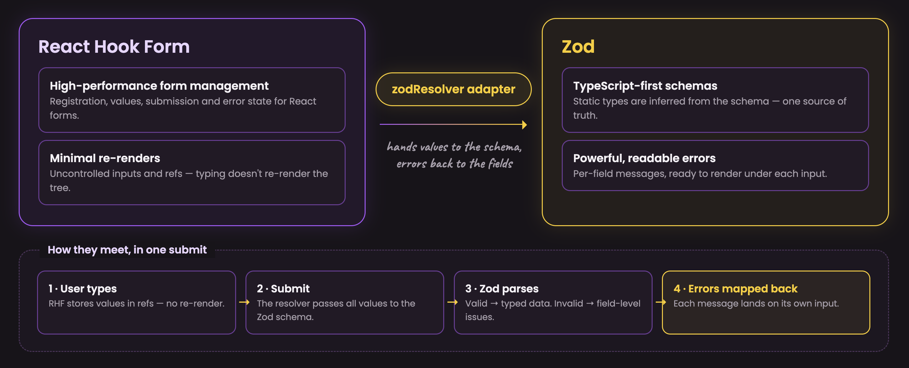

---

## 1. Mental Model

### 1.1 RHF is uncontrolled-first — that's the whole point

A controlled input (`value={state}` + `onChange`) re-renders the component on every keystroke, because state is what drives the input. `register()` takes a different approach: it wires the input to RHF via a **DOM ref**, so RHF reads the value directly from the DOM instead of storing it in React state. Typing doesn't trigger a re-render at all.

```tsx
<input {...register("name")} />
// register("name") returns { name, onChange, onBlur, ref }
```

This is the reason to reach for RHF over hand-rolled `useState` per field: performance and less code, at the cost of the input no longer being a React-state-driven value. When you need controlled behavior back (a third-party UI kit, real-time transforms), `Controller` is the escape hatch — see [3.1](#31-controller--bridging-controlled-components).

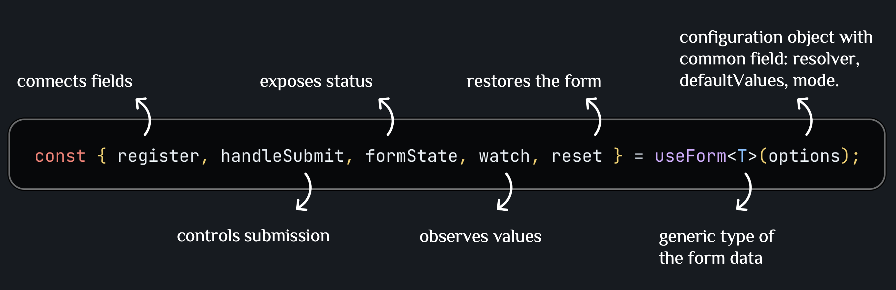

### 1.2 Zod is the single source of truth — for validation *and* types

```ts
const formSchema = z.object({
  name: z.string().min(2, "Name must be at least 2 characters"),
  email: z.email("Invalid email address"),
});

type FormData = z.infer<typeof formSchema>; // TypeScript type, derived, not hand-written
```

One schema does two jobs: it's the runtime validator, and `z.infer` derives the compile-time type from it. There's no second place to keep the shape in sync.

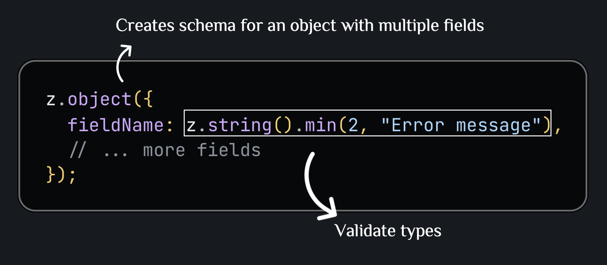

`useForm<T>` takes that inferred type as its generic — the same `T` could be hand-written, but deriving it from the schema is what keeps validation and types from drifting apart.

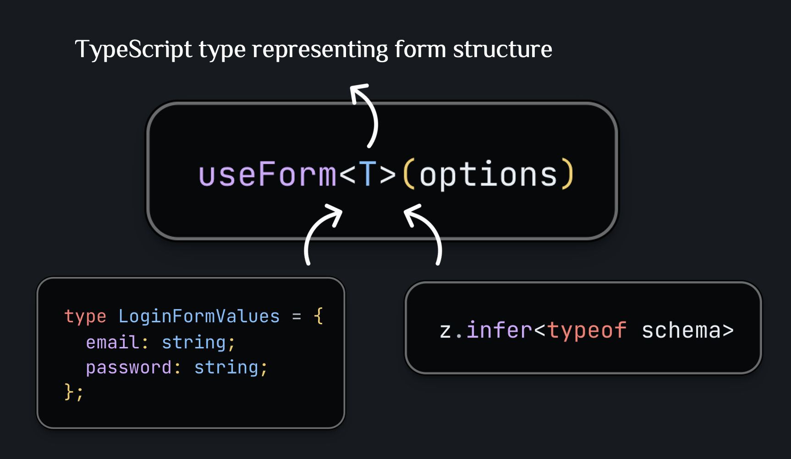

`zodResolver(formSchema)` is the adapter that connects the two libraries: on submit, RHF hands the raw form values to Zod's parser; any validation failures are mapped back onto the matching field paths and land in `formState.errors`.

```ts
useForm<FormData>({ resolver: zodResolver(formSchema) });
```

### 1.3 The submit loop

`handleSubmit(onValid)` wraps your submit handler: it runs the resolver first, and `onValid` only fires if validation passes. `formState.isSubmitting` tracks whether that handler's promise is still pending — enough to disable the submit button without extra state.

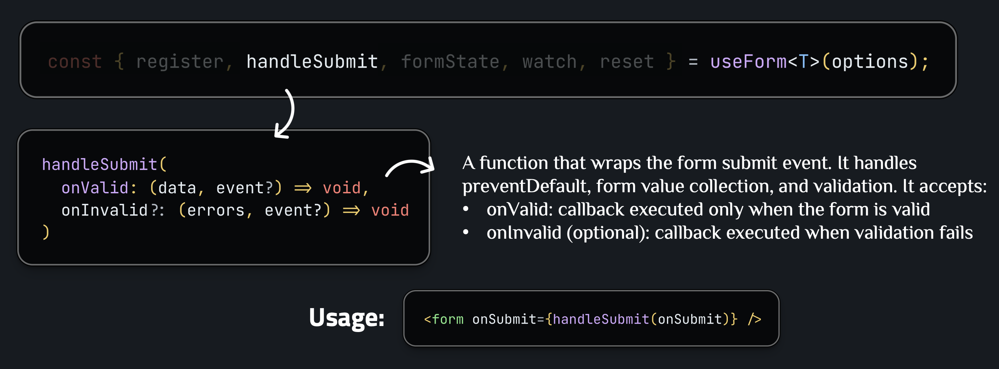
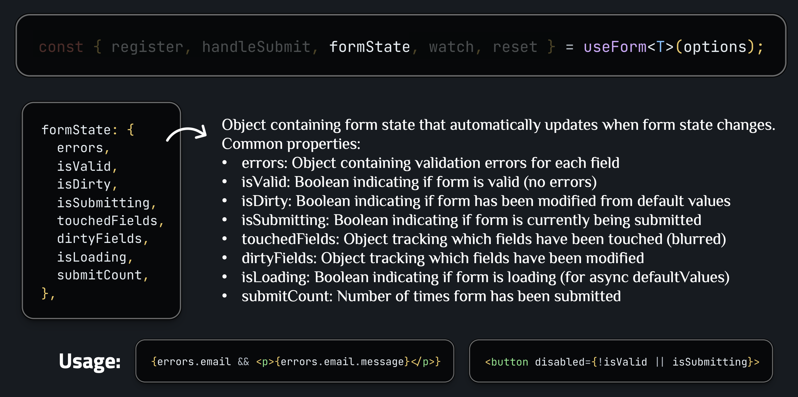

A successful submit doesn't clear the form on its own — call `reset()` inside `onValid` to restore default values and wipe `isDirty`/`isTouched`/`errors` back to their initial state:

```ts
const onSubmit = async (data: FormData) => {
  await api.save(data);
  reset(); // back to defaultValues, form marked clean again
};
```

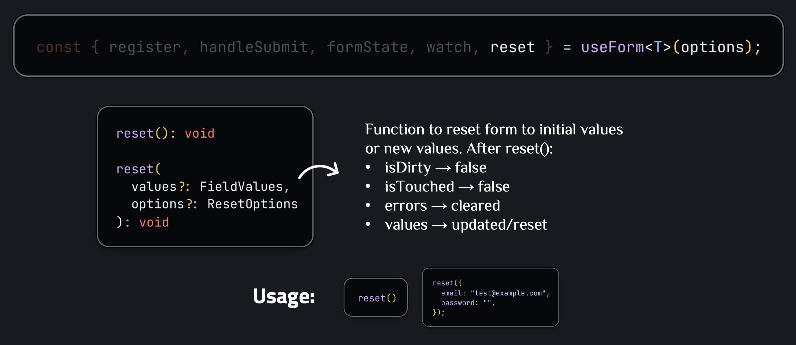

### 1.4 watch — opt-in re-rendering

`register` deliberately avoids re-rendering on every keystroke. `watch("field")` is the escape hatch when you *do* need that: it subscribes the component to a specific field and re-renders when it changes — useful for a live preview or for conditionally showing other fields. The tradeoff is explicit: only the fields you `watch()` cost you a re-render; everything else stays free.

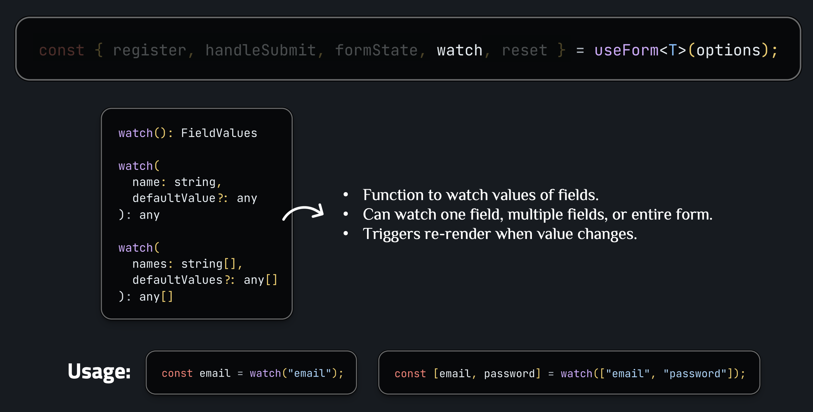

---

## 2. Basic Usage

### Example: Schema → Type → Form (the full loop from 1.1–1.3)

```tsx
import { useForm } from "react-hook-form";
import { zodResolver } from "@hookform/resolvers/zod";
import { z } from "zod";

const formSchema = z.object({
  name: z.string().min(2, "Name must be at least 2 characters"),
  email: z.email("Invalid email address"),
  age: z.number().min(18, "Age must be 18 or older"),
});

type FormData = z.infer<typeof formSchema>;

function BasicForm() {
  const {
    register,
    handleSubmit,
    formState: { errors, isSubmitting },
  } = useForm<FormData>({ resolver: zodResolver(formSchema) });

  const onSubmit = async (data: FormData) => {
    // API call...
  };

  return (
    <form onSubmit={handleSubmit(onSubmit)}>
      <input {...register("name")} />
      {errors.name && <span>{errors.name.message}</span>}

      <input type="number" {...register("age", { valueAsNumber: true })} />
      {errors.age && <span>{errors.age.message}</span>}

      <button type="submit" disabled={isSubmitting}>
        Submit
      </button>
    </form>
  );
}
```

Nested schemas (`z.object({ address: z.object({ street: z.string() }) })`) work the same way — register the dot-path directly: `register("address.street")`, and read the matching error at `errors.address?.street`.

### Example: watch — real-time value and conditional fields

Demonstrates the tradeoff from [1.4](#14-watch--opt-in-re-rendering): subscribing to a field on purpose.

```tsx
const { register, watch } = useForm<FormData>({ resolver: zodResolver(formSchema) });

const name = watch("name"); // re-renders this component when `name` changes

return (
  <form>
    <input {...register("name")} />
    {name && <p>Preview: {name}</p>}
  </form>
);
```

The same pattern extends to conditionally rendering entire fields (e.g. show a "company name" input only when `watch("accountType") === "business"`) — RHF registers/unregisters them automatically as they mount and unmount.

---

## 3. Advanced Usage

### 3.1 Controller — bridging controlled components

**When**: integrating a custom or third-party component (Material-UI, Ant Design, a date picker) that expects `value`/`onChange` props instead of a DOM ref.

```tsx
function FormWithCustomInput() {
  const { control, handleSubmit } = useForm<FormData>({
    resolver: zodResolver(formSchema),
  });

  return (
    <form onSubmit={handleSubmit(onSubmit)}>
      <Controller
        name="name"
        control={control}
        render={({ field, fieldState }) => (
          <CustomTextInput
            value={field.value ?? ""}
            onChange={field.onChange}
            onBlur={field.onBlur}
            error={fieldState.error?.message}
          />
        )}
      />
    </form>
  );
}
```

`Controller` is how RHF supports controlled components without abandoning its uncontrolled-first design elsewhere in the form — `field` gives you the `value`/`onChange` pair the component expects; `fieldState.error` gives you that field's validation result directly, without touching `formState.errors`.

### 3.2 useFieldArray — dynamic lists

**When**: the form has a variable-length list of items (addresses, line items).

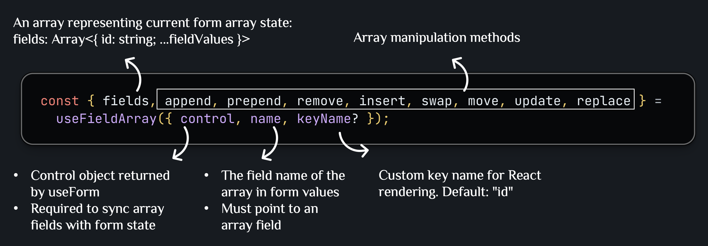

```tsx
const arraySchema = z.object({
  addresses: z.array(z.object({ street: z.string().min(5) })).min(1),
});

function ArrayForm() {
  const { register, control } = useForm<z.infer<typeof arraySchema>>({
    resolver: zodResolver(arraySchema),
    defaultValues: { addresses: [{ street: "" }] },
  });

  const { fields, append, remove } = useFieldArray({ control, name: "addresses" });

  return (
    <>
      {fields.map((field, index) => (
        <div key={field.id}>
          <input {...register(`addresses.${index}.street`)} />
          <button type="button" onClick={() => remove(index)}>Remove</button>
        </div>
      ))}
      <button type="button" onClick={() => append({ street: "" })}>Add</button>
    </>
  );
}
```

`fields` carries an auto-generated `id` per row — key on `field.id`, never on `index`, or React misattributes state to the wrong row when items are added/removed/reordered.

### 3.3 Cross-field validation with `.refine`

**When**: a rule spans more than one field (password confirmation) or needs an API round-trip (username availability).

```ts
const schema = z
  .object({
    password: z.string().min(8),
    confirmPassword: z.string(),
  })
  .refine((data) => data.password === data.confirmPassword, {
    message: "Passwords do not match",
    path: ["confirmPassword"], // attaches the error to this field specifically
  });
```

`.refine` receives the whole parsed object, so it's the tool for rules that no single field's schema can express alone; `path` is what lets a whole-object check still surface as a normal per-field error.

The same `.refine` accepts an `async` predicate for validation that needs a network call (e.g. checking if a username is taken). Pair it with `mode: "onBlur"` on `useForm` so the check runs once per blur instead of on every keystroke — `mode` controls when RHF re-validates in general, and `onSubmit` (the default) is the cheapest option when you don't need earlier feedback.

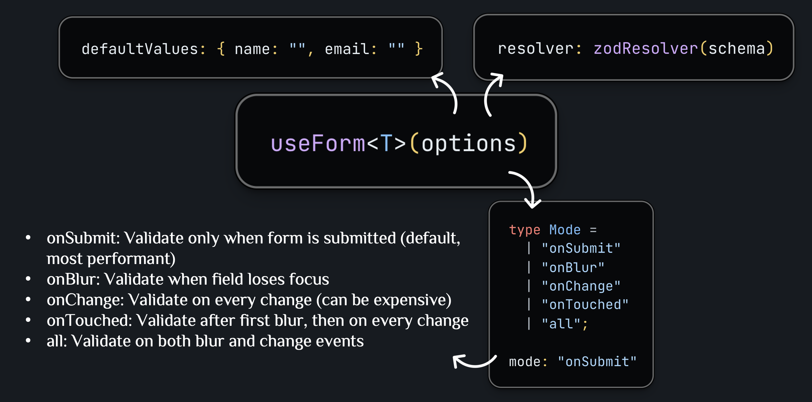

---

## Summary

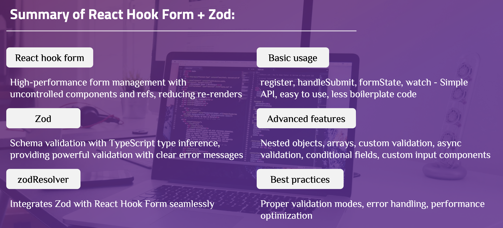

| Concept | Theory | Practice |
|---|---|---|
| Uncontrolled-first | 1.1 | `register` (2), `Controller` for the exception (3.1) |
| Schema = validation + types | 1.2 | Every example's `z.object` + `z.infer` |
| Submit loop | 1.3 | `handleSubmit` + `formState` (2) |
| Opt-in reactivity | 1.4 | `watch` (2) |
| Rules beyond one field | — | `.refine` + `path` (3.3) |
| Variable-length fields | — | `useFieldArray` (3.2) |

---

**References**:

- [React Hook Form Documentation](https://react-hook-form.com/)
- [Zod Documentation](https://zod.dev/)
- [@hookform/resolvers](https://github.com/react-hook-form/resolvers)
- [React Hook Form API Reference](https://react-hook-form.com/docs/useform)
