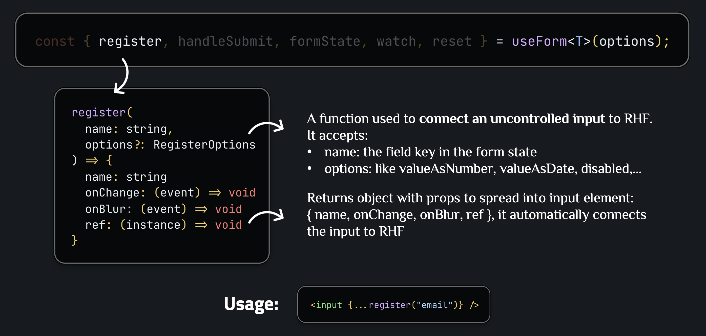

# React Hook Form + Zod

## Core terminology


**zodResolver**: Adapter from `@hookform/resolvers` that integrates Zod with React Hook Form — passes values to the schema, maps errors back to fields.

**Zod**:


Some common Zod validation types:

- `z.string()` – string type
- `z.email()` – valid email (Zod v4; `z.string().email()` is deprecated)
- `z.number()` – number type
- `z.object({ name: z.string() })` – object with fields (used for form schemas)
- `z.string().optional()` – string or undefined (makes field optional)

**useForm**:


**useForm Generic Type**:


**useForm Options**:


**register**:



**handleSubmit**:


**formState**:


**watch**:


**reset**:


---

## Basic: Basic Form Usage

This section guides you through using React Hook Form with Zod in the most basic scenarios.

### Example 1: Basic Form with Zod Schema

**When to use**: When you need a simple form with basic validation.

**Example**:

```typescript
import { useForm } from "react-hook-form";
import { zodResolver } from "@hookform/resolvers/zod";
import { z } from "zod";

// 1. Define Zod schema
const formSchema = z.object({
  name: z.string().min(2, "Name must be at least 2 characters"),
  email: z.string().email("Invalid email address"),
  age: z.number().min(18, "Age must be 18 or older"),
});

// 2. Infer TypeScript type from schema
type FormData = z.infer<typeof formSchema>;

function BasicForm() {
  // 3. Setup useForm with zodResolver
  const {
    register,
    handleSubmit,
    formState: { errors, isSubmitting },
  } = useForm<FormData>({
    resolver: zodResolver(formSchema),
  });

  // 4. Handle submit
  const onSubmit = async (data: FormData) => {
    console.log(data);
    // API call...
  };

  return (
    <form onSubmit={handleSubmit(onSubmit)}>
      <input {...register("name")} />
      {errors.name && <span>{errors.name.message}</span>}

      <input {...register("email")} />
      {errors.email && <span>{errors.email.message}</span>}

      <input type="number" {...register("age", { valueAsNumber: true })} />
      {errors.age && <span>{errors.age.message}</span>}

      <button type="submit" disabled={isSubmitting}>
        Submit
      </button>
    </form>
  );
}
```

### Example 2: Form with Watch - Real-time Updates

**When to use**: When you want to display field values in real-time or create conditional logic.

**Example**:

```typescript
function FormWithWatch() {
  const {
    register,
    handleSubmit,
    watch,
    formState: { errors },
  } = useForm<FormData>({
    resolver: zodResolver(formSchema),
  });

  // Watch one field
  const firstName = watch("firstName");

  // Watch multiple fields
  const [firstName, lastName] = watch(["firstName", "lastName"]);

  // Watch entire form
  const formData = watch();

  return (
    <form onSubmit={handleSubmit(onSubmit)}>
      <input {...register("firstName")} />
      {firstName && <div>Preview: {firstName}</div>}

      <input {...register("lastName")} />
      {firstName && lastName && (
        <div>
          Full name: {firstName} {lastName}
        </div>
      )}
    </form>
  );
}
```

### Example 3: Form with Nested Objects

**When to use**: When form has complex data structure with nested objects.

**Example**:

```typescript
const nestedFormSchema = z.object({
  personalInfo: z.object({
    firstName: z.string().min(2),
    lastName: z.string().min(2),
    email: z.email(),
  }),
  address: z.object({
    street: z.string().min(5),
    city: z.string().min(2),
    zipCode: z.string().regex(/^\d{5}$/),
  }),
});

type NestedFormData = z.infer<typeof nestedFormSchema>;

function NestedForm() {
  const {
    register,
    handleSubmit,
    formState: { errors },
  } = useForm<NestedFormData>({
    resolver: zodResolver(nestedFormSchema),
  });

  return (
    <form onSubmit={handleSubmit(onSubmit)}>
      {/* Nested object fields use dot notation */}
      <input {...register("personalInfo.firstName")} />
      {errors.personalInfo?.firstName && (
        <span>{errors.personalInfo.firstName.message}</span>
      )}

      <input {...register("address.street")} />
      {errors.address?.street && <span>{errors.address.street.message}</span>}
    </form>
  );
}
```

---

## Advanced: Advanced Form Usage

This section guides you through more complex patterns and advanced features.

### Example 1: Form with Custom Input Components

**When to use**: When you need to integrate React Hook Form with custom controlled components or third-party UI libraries (Material-UI, Ant Design, etc.).

**Controlled vs Uncontrolled Components**:

| Aspect               | Uncontrolled Components (using `register`)                               | Controlled Components (using `Controller`)                                    |
| -------------------- | ------------------------------------------------------------------------ | ----------------------------------------------------------------------------- |
| **State Management** | React Hook Form manages the form state internally                        | React state manages the component's value                                     |
| **Value Access**     | Uses native DOM refs to access input values                              | Component receives `value` and `onChange` props explicitly                    |
| **Performance**      | Better performance, less re-renders                                      | More re-renders (component re-renders on every value change)                  |
| **Use Case**         | Standard HTML inputs (`<input>`, `<select>`, `<textarea>`)               | Custom components or third-party UI libraries (Material-UI, Ant Design, etc.) |
| **Example**          | `<input {...register("name")} />`                                        | `<CustomInput value={value} onChange={onChange} />`                           |
| **Props**            | Spread `{...register("name")}` returns `{ name, onChange, onBlur, ref }` | Explicitly pass `value`, `onChange`, `onBlur` props                           |

**What is `control`?**: An object returned from `useForm()` — pass it to `Controller` to connect controlled components to React Hook Form's state.

**Example**:

```typescript
import { useForm, Controller } from "react-hook-form";
import { zodResolver } from "@hookform/resolvers/zod";
import { z } from "zod";

// Custom controlled component
interface CustomTextInputProps {
  value: string;
  onChange: (value: string) => void;
  onBlur: () => void;
  error?: string;
  label: string;
}

function CustomTextInput({
  value,
  onChange,
  onBlur,
  error,
  label,
}: CustomTextInputProps) {
  return (
    <div>
      <label>{label}</label>
      <input
        type="text"
        value={value}
        onChange={(e) => onChange(e.target.value)}
        onBlur={onBlur}
        className={error ? "error" : ""}
      />
      {error && <span>{error}</span>}
    </div>
  );
}

const formSchema = z.object({
  name: z.string().min(2, "Name must be at least 2 characters"),
  email: z.string().email("Invalid email address"),
});

type FormData = z.infer<typeof formSchema>;

function FormWithCustomInput() {
  const {
    control,
    handleSubmit,
    formState: { isSubmitting },
  } = useForm<FormData>({
    resolver: zodResolver(formSchema),
  });

  const onSubmit = async (data: FormData) => {
    console.log(data);
  };

  return (
    <form onSubmit={handleSubmit(onSubmit)}>
      <Controller
        name="name"
        control={control}
        render={({ field, fieldState }) => (
          <CustomTextInput
            value={field.value || ""}
            onChange={field.onChange}
            onBlur={field.onBlur}
            error={fieldState.error?.message}
            label="Name"
          />
        )}
      />

      <Controller
        name="email"
        control={control}
        render={({ field, fieldState }) => (
          <CustomTextInput
            value={field.value || ""}
            onChange={field.onChange}
            onBlur={field.onBlur}
            error={fieldState.error?.message}
            label="Email"
          />
        )}
      />

      <button type="submit" disabled={isSubmitting}>
        Submit
      </button>
    </form>
  );
}
```

**Explanation**:

- `Controller` provides `field` (`value`, `onChange`, `onBlur`, `ref`) and `fieldState` (`error`, `isTouched`, `isDirty`) via render prop
- Spread `{...field}` into the custom component to connect it automatically
- `field.value || ""` prevents uncontrolled-to-controlled warning

### Example 2: Form with Dynamic Arrays (useFieldArray)


**When to use**: When form has dynamic list of items (addresses, products, etc.).

**Example**:

```typescript
const arrayFormSchema = z.object({
  addresses: z
    .array(
      z.object({
        street: z.string().min(5),
        city: z.string().min(2),
        zipCode: z.string().regex(/^\d{5}$/),
      })
    )
    .min(1, "Must have at least 1 address"),
});

type ArrayFormData = z.infer<typeof arrayFormSchema>;

function ArrayForm() {
  const {
    register,
    handleSubmit,
    control,
    formState: { errors },
  } = useForm<ArrayFormData>({
    resolver: zodResolver(arrayFormSchema),
    defaultValues: {
      addresses: [{ street: "", city: "", zipCode: "" }],
    },
  });

  const { fields, append, remove } = useFieldArray({
    control,
    name: "addresses",
  });

  return (
    <form onSubmit={handleSubmit(onSubmit)}>
      {fields.map((field, index) => (
        <div key={field.id}>
          <input {...register(`addresses.${index}.street`)} />
          <input {...register(`addresses.${index}.city`)} />
          <input {...register(`addresses.${index}.zipCode`)} />
          {fields.length > 1 && (
            <button type="button" onClick={() => remove(index)}>
              Remove
            </button>
          )}
        </div>
      ))}

      <button
        type="button"
        onClick={() => append({ street: "", city: "", zipCode: "" })}
      >
        Add Address
      </button>
    </form>
  );
}
```

**Explanation**:

- `fields` contains auto-generated `id` per item — always use `key={field.id}`, not `key={index}`, for correct reconciliation when items are reordered
- `register(\`addresses.${index}.street\`)` dynamically creates field paths for each array item
- `defaultValues` must include the initial array structure so `useFieldArray` has data to work with

### Example 3: Form with Custom Validation

**When to use**: When you need complex validation rules not available in Zod or need cross-field validation.

**Example**:

```typescript
const customValidationSchema = z
  .object({
    password: z
      .string()
      .min(8, "Password must be at least 8 characters")
      .regex(/[A-Z]/, "Password must contain at least 1 uppercase letter")
      .regex(/[a-z]/, "Password must contain at least 1 lowercase letter")
      .regex(/[0-9]/, "Password must contain at least 1 number"),
    confirmPassword: z.string(),
  })
  .refine((data) => data.password === data.confirmPassword, {
    message: "Passwords do not match",
    path: ["confirmPassword"], // Error will be displayed on confirmPassword field
  });

function CustomValidationForm() {
  const {
    register,
    handleSubmit,
    formState: { errors },
  } = useForm({
    resolver: zodResolver(customValidationSchema),
  });

  return (
    <form onSubmit={handleSubmit(onSubmit)}>
      <input type="password" {...register("password")} />
      {errors.password && <span>{errors.password.message}</span>}

      <input type="password" {...register("confirmPassword")} />
      {errors.confirmPassword && <span>{errors.confirmPassword.message}</span>}
    </form>
  );
}
```

**Explanation**:

- `.refine()` receives the entire form object — use it for cross-field validation like password matching
- `path: ["confirmPassword"]` assigns the error to a specific field even though the check spans multiple fields

### Example 4: Form with Async Validation

**When to use**: When you need to validate with API call (check if username exists, email is already used, etc.).

**Example**:

```typescript
const checkUsernameExists = async (username: string): Promise<boolean> => {
  const response = await fetch(`/api/check-username?username=${username}`);
  const data = await response.json();
  return data.exists;
};

const asyncValidationSchema = z.object({
  username: z
    .string()
    .min(3, "Username must be at least 3 characters")
    .refine(
      async (username) => {
        const exists = await checkUsernameExists(username);
        return !exists;
      },
      {
        message: "Username already exists",
      }
    ),
});

function AsyncValidationForm() {
  const {
    register,
    handleSubmit,
    formState: { errors },
    trigger,
  } = useForm({
    resolver: zodResolver(asyncValidationSchema),
    mode: "onBlur", // Validate on blur to avoid too many validations
  });

  const handleUsernameBlur = async () => {
    await trigger("username"); // Trigger validation for username field
  };

  return (
    <form onSubmit={handleSubmit(onSubmit)}>
      <input {...register("username")} onBlur={handleUsernameBlur} />
      {errors.username && <span>{errors.username.message}</span>}
    </form>
  );
}
```

**Explanation**:

- `mode: "onBlur"` prevents validation on every keystroke — avoids excessive API calls
- `trigger("username")` manually runs validation for a specific field, useful when you need control over timing

### Example 5: Form with Conditional Fields

**When to use**: When some fields only display/required based on value of another field.

**Example**:

```typescript
const conditionalFormSchema = z
  .object({
    accountType: z.enum(["personal", "business"]),
    companyName: z.string().optional(),
    taxId: z.string().optional(),
    personalId: z.string().optional(),
  })
  .refine(
    (data) => {
      if (data.accountType === "business") {
        return data.companyName && data.companyName.length > 0;
      }
      return true;
    },
    {
      message: "Company name is required for business accounts",
      path: ["companyName"],
    }
  )
  .refine(
    (data) => {
      if (data.accountType === "personal") {
        return data.personalId && data.personalId.length > 0;
      }
      return true;
    },
    {
      message: "Personal ID is required for personal accounts",
      path: ["personalId"],
    }
  );

function ConditionalForm() {
  const {
    register,
    handleSubmit,
    watch,
    formState: { errors },
  } = useForm({
    resolver: zodResolver(conditionalFormSchema),
  });

  const accountType = watch("accountType");

  return (
    <form onSubmit={handleSubmit(onSubmit)}>
      <select {...register("accountType")}>
        <option value="personal">Personal</option>
        <option value="business">Business</option>
      </select>

      {accountType === "business" && (
        <>
          <input {...register("companyName")} />
          {errors.companyName && <span>{errors.companyName.message}</span>}

          <input {...register("taxId")} />
          {errors.taxId && <span>{errors.taxId.message}</span>}
        </>
      )}

      {accountType === "personal" && (
        <input {...register("personalId")} />
        {errors.personalId && <span>{errors.personalId.message}</span>}
      )}
    </form>
  );
}
```

**Explanation**:

- `watch("accountType")` drives conditional rendering — fields only mount when relevant, RHF handles registration automatically
- Each `.refine()` checks a condition at submit time and assigns the error to the correct field via `path`

---

## Summary


---

**References**:

- [React Hook Form Documentation](https://react-hook-form.com/)
- [Zod Documentation](https://zod.dev/)
- [@hookform/resolvers](https://github.com/react-hook-form/resolvers)
- [React Hook Form API Reference](https://react-hook-form.com/docs/useform)
