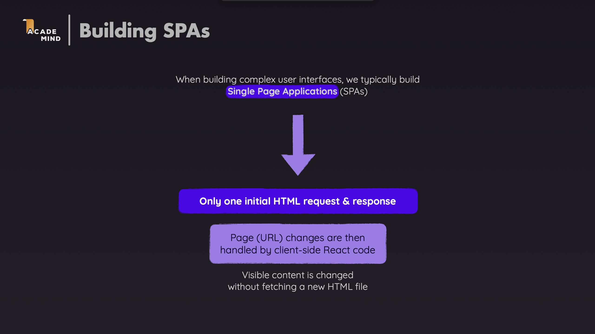

# React Router with TypeScript

A comprehensive demo application demonstrating **React Router v6** features with **TypeScript** for building single-page applications (SPAs) with client-side routing.



---

## Core Terminology

### BrowserRouter

`BrowserRouter` is a router component that uses the HTML5 history API (`pushState`, `replaceState`, `popState`) to keep your UI in sync with the URL. It enables client-side routing without full page reloads.

**Usage**:

```typescript
// main.tsx or App.tsx
import { BrowserRouter } from "react-router-dom";

function App() {
  return (
    <BrowserRouter>
      <Routes>{/* Your routes */}</Routes>
    </BrowserRouter>
  );
}
```

### Routes and Route

**Routes**: A container component that renders the first matching `Route` child.

**Route**: Defines a mapping between a URL path and a React component. When the URL matches the path, the component is rendered.

**Syntax**:

```typescript
import { Routes, Route } from "react-router-dom";

<Routes>
  <Route path="/path" element={<Component />} />
</Routes>;
```

**Route Props**:

- `path`: The URL path pattern to match (string)
- `element`: The React element to render when the path matches
- `index`: Boolean indicating this is an index route (default route for parent)

**Example**:

```typescript
<Routes>
  <Route path="/" element={<Home />} />
  <Route path="/about" element={<About />} />
  <Route path="/contact" element={<Contact />} />
</Routes>
```

### Link and NavLink

**Link**: A component for declarative navigation. It renders an anchor tag (`<a>`) but prevents the default browser navigation and uses client-side routing instead.

**Syntax**:

```typescript
import { Link } from "react-router-dom";

<Link to="/path">Link Text</Link>;
```

**Link Props**:

- `to`: The path to navigate to (string or object)
- `replace`: If true, replaces the current entry in history instead of adding a new one
- `state`: State to pass to the new location
- `reloadDocument`: If true, performs a full page reload instead of client-side navigation

**NavLink**: A special version of `Link` that adds styling attributes when it matches the current route. Useful for navigation menus.

**Syntax**:

```typescript
import { NavLink } from "react-router-dom";

<NavLink to="/path" className={({ isActive }) => (isActive ? "active" : "")}>
  Link Text
</NavLink>;
```

**NavLink Props**:

- All `Link` props, plus:
- `className`: Function that receives `{ isActive }` and returns className string
- `style`: Function that receives `{ isActive }` and returns style object
- `end`: If true, only matches when the pathname ends with the `to` path

### Navigate

`Navigate` is a component that redirects to a new location when rendered. It's useful for conditional redirects.

**Syntax**:

```typescript
import { Navigate } from "react-router-dom";

<Navigate to="/path" replace />;
```

**Navigate Props**:

- `to`: The path to redirect to
- `replace`: If true, replaces the current entry in history
- `state`: State to pass to the new location

### Outlet

`Outlet` is used in parent route components to render child route components. It's essential for nested routing.

**Syntax**:

```typescript
import { Outlet } from "react-router-dom";

function ParentComponent() {
  return (
    <div>
      <h1>Parent Content</h1>
      <Outlet /> {/* Child routes render here */}
    </div>
  );
}
```

---

## Advanced Routing Patterns

This section covers more complex routing patterns and features.

### Example 1: Dynamic Routes with URL Parameters using `useParams` and `useNavigate`

**When to use**: When you need to pass data through the URL (e.g., product IDs, user IDs).

**File: `src/App.tsx`**

```typescript
<Routes>
  <Route path="/products" element={<Products />} />
  <Route path="/products/:id" element={<ProductDetail />} />
</Routes>
```

**File: `src/pages/ProductDetail.tsx`**

```typescript
import { useParams, useNavigate } from "react-router-dom";

function ProductDetail() {
  const { id } = useParams<{ id: string }>();
  const navigate = useNavigate();

  return (
    <div>
      <h2>Product {id}</h2>
      <button onClick={() => navigate(-1)}>Go Back</button>
      <button onClick={() => navigate("/products")}>Back to Products</button>
    </div>
  );
}
```

**Explanation**:

- `:id` is a URL parameter (dynamic segment), `useParams()` hook extracts URL parameters
- TypeScript type `<{ id: string }>` ensures type safety
- `useNavigate()` returns a function for programmatic navigation
- `navigate(-1)` goes back in history, `navigate('/path')` navigates to a path

**URL Examples**:

- `/products/1` → `id = "1"`
- `/products/123` → `id = "123"`

### Example 2: Nested Routes with `Outlet` and `useParams`

**When to use**: When you have routes that share a common layout or parent component (e.g., user profile with tabs).

**File: `src/App.tsx`**

```typescript
<Routes>
  <Route path="/users/:userId" element={<UserProfile />}>
    <Route index element={<UserPosts />} />
    <Route path="settings" element={<UserSettings />} />
  </Route>
</Routes>
```

**File: `src/pages/UserProfile.tsx`**

```typescript
import { Outlet, NavLink, useParams } from "react-router-dom";

function UserProfile() {
  const { userId } = useParams<{ userId: string }>();

  return (
    <div>
      <h2>User {userId}</h2>
      <nav>
        <NavLink to={`/users/${userId}`} end>Posts</NavLink>
        <NavLink to={`/users/${userId}/settings`}>Settings</NavLink>
      </nav>
      <Outlet /> {/* Child routes render here */}
    </div>
  );
}
```

**Explanation**:

- Parent route `/users/:userId` wraps child routes; child paths are relative to the parent
- `index` route renders when the URL exactly matches the parent path (`/users/1`) — it's the default child
- `<Outlet />` is the placeholder where the matching child route renders
- `end` on `NavLink` ensures it's only active on an exact match — without it, the "Posts" link would stay active even when navigating to `/users/1/settings` (because `/users/1` is a prefix)

**URL Examples**:

- `/users/1` → Renders `UserProfile` with `UserPosts` (index route)
- `/users/1/settings` → Renders `UserProfile` with `UserSettings`

### Example 3: Protected Routes with `Navigate` and `useLocation`

**When to use**: When you need to restrict access to certain routes based on authentication or authorization.

**File: `src/components/ProtectedRoute.tsx`**

```typescript
import { Navigate, useLocation } from "react-router-dom";
import { ReactNode } from "react";

interface ProtectedRouteProps {
  children: ReactNode;
}

function ProtectedRoute({ children }: ProtectedRouteProps) {
  const isAuthenticated = localStorage.getItem("isAuthenticated") === "true";
  const location = useLocation();

  if (!isAuthenticated) {
    return <Navigate to="/login" state={{ from: location }} replace />;
  }

  return <>{children}</>;
}
```

**File: `src/App.tsx`**

```typescript
<Routes>
  <Route path="/login" element={<Login />} />
  <Route
    path="/dashboard"
    element={
      <ProtectedRoute>
        <Dashboard />
      </ProtectedRoute>
    }
  />
</Routes>
```

**File: `src/pages/Login.tsx`**

```typescript
import { useNavigate, useLocation } from "react-router-dom";

function Login() {
  const navigate = useNavigate();
  const location = useLocation();

  // Get the page user was trying to access
  const from =
    (location.state as { from?: Location })?.from?.pathname || "/dashboard";

  const handleLogin = () => {
    localStorage.setItem("isAuthenticated", "true");
    navigate(from, { replace: true });
  };

  return (
    <div>
      <h2>Login</h2>
      <button onClick={handleLogin}>Login</button>
    </div>
  );
}
```

**Explanation**:

- `ProtectedRoute` reads `isAuthenticated`; if false, it redirects to `/login` via `<Navigate>` and passes the current location as `state={{ from: location }}`
- `replace` replaces the current history entry so the user can't press Back to re-enter a protected route they haven't authenticated for
- In `Login.tsx`, `useLocation()` reads the state left by `Navigate` — `location.state.from.pathname` is the route the user originally tried to visit
- If no state exists (user went to `/login` directly), `from` falls back to `"/dashboard"` — the default index of the protected area
- After a successful login, `navigate(from, { replace: true })` sends the user to their intended destination

### Example 4: Query Parameters with `useSearchParams`

**When to use**: When you need to pass optional data through the URL (e.g., search queries, filters).

**File: `src/pages/Search.tsx`**

```typescript
import { useSearchParams } from "react-router-dom";

function Search() {
  const [searchParams, setSearchParams] = useSearchParams();

  const query = searchParams.get("q") || "";
  const category = searchParams.get("category") || "all";

  const handleSearch = (newQuery: string) => {
    setSearchParams({ q: newQuery, category });
  };

  const handleCategoryChange = (newCategory: string) => {
    setSearchParams({ q: query, category: newCategory });
  };

  return (
    <div>
      <input
        value={query}
        onChange={(e) => handleSearch(e.target.value)}
        placeholder="Search..."
      />
      <select
        value={category}
        onChange={(e) => handleCategoryChange(e.target.value)}
      >
        <option value="all">All</option>
        <option value="tutorial">Tutorial</option>
      </select>
    </div>
  );
}
```

**Explanation**:

- `useSearchParams()` returns `[searchParams, setSearchParams]` — like `useState` but reads/writes to the URL instead of component state
- `searchParams.get('key')` reads a query parameter value; returns `null` if not present
- `setSearchParams({ key: value })` rewrites the query string in the URL — because the URL itself changes, browser history (back/forward) works natively without extra handling
- Each handler preserves the other param (`category` in `handleSearch`, `q` in `handleCategoryChange`) to avoid losing data when only one field changes

**URL Examples**:

- `/search?q=react` → `query = "react"`
- `/search?q=react&category=tutorial` → `query = "react"`, `category = "tutorial"`

### Example 5: Programmatic Navigation with `useNavigate`

**When to use**: When you need to navigate based on user actions or conditions (e.g., after form submission, on button click).

**File: `src/pages/Contact.tsx`**

```typescript
import { useNavigate } from "react-router-dom";

function Contact() {
  const navigate = useNavigate();

  const handleSubmit = (e: React.FormEvent) => {
    e.preventDefault();
    navigate("/thank-you", { replace: true });
  };

  return (
    <form onSubmit={handleSubmit}>
      {/* Form fields */}
      <button type="submit">Submit</button>
    </form>
  );
}
```

**Explanation**:

- `useNavigate()` is for navigating conditionally or after an action (form submit, API call) — unlike `<Link>` which can only be used in JSX
- `replace: true` is appropriate after a form submit — the user should not be able to press Back and resubmit the form

### Example 6: Layout Routes with `Outlet`

**When to use**: When multiple routes share a common layout (header, sidebar, etc.).

**File: `src/App.tsx`**

```typescript
<Routes>
  <Route path="/" element={<Layout />}>
    <Route index element={<Home />} />
    <Route path="about" element={<About />} />
    <Route path="contact" element={<Contact />} />
  </Route>
</Routes>
```

**File: `src/components/Layout.tsx`**

```typescript
import { Outlet, NavLink } from "react-router-dom";

function Layout() {
  return (
    <div>
      <header>
        <nav>
          <NavLink to="/" end>Home</NavLink>
          <NavLink to="/about">About</NavLink>
          <NavLink to="/contact">Contact</NavLink>
        </nav>
      </header>
      <main>
        <Outlet />
      </main>
      <footer>Footer content</footer>
    </div>
  );
}
```

**Explanation**:

- This is the standard pattern for an app shell — `Layout` mounts once and stays in the DOM; only the `<Outlet />` content swaps on navigation, so header and footer never re-render
- `NavLink` is preferred over `Link` in nav menus because it provides active state styling out of the box
- `end` on the Home link prevents it from staying active on `/about` and `/contact` (since `/` is a prefix of all paths)

### Example 7: Catch-All Route (404) with `useNavigate`

**When to use**: To handle routes that don't match any defined route.

**File: `src/App.tsx`**

```typescript
<Routes>
  <Route path="/" element={<Home />} />
  <Route path="/about" element={<About />} />
  <Route path="*" element={<NotFound />} />
</Routes>
```

**File: `src/pages/NotFound.tsx`**

```typescript
import { Link, useNavigate } from "react-router-dom";

function NotFound() {
  const navigate = useNavigate();

  return (
    <div>
      <h2>404 - Page Not Found</h2>
      <button onClick={() => navigate(-1)}>Go Back</button>
      <Link to="/">Go to Home</Link>
    </div>
  );
}
```

**Explanation**:

- `path="*"` matches any route not matched by previous routes
- Must be placed last in the `Routes` component
- Useful for displaying 404 pages or redirecting to home

---

## Learn More

After mastering the basic and advanced concepts above, you can continue learning the following topics:

### 1. Route Configuration Objects

The object-based API (`createBrowserRouter` + `RouterProvider`) is the modern approach recommended by the React Router team. It's also required to use data APIs like loaders and actions.

**Example**:

```typescript
import { createBrowserRouter, RouterProvider } from "react-router-dom";

const router = createBrowserRouter([
  {
    path: "/",
    element: <Layout />,
    children: [
      { index: true, element: <Home /> },
      { path: "about", element: <About /> },
    ],
  },
]);

function App() {
  return <RouterProvider router={router} />;
}
```

**Documentation**: [createBrowserRouter](https://reactrouter.com/en/main/routers/create-browser-router)

### 2. Route Loaders and Actions (v6.4+)

Loaders fetch data before a route renders; actions handle form mutations. Both require `createBrowserRouter`.

**Example**:

```typescript
const router = createBrowserRouter([
  {
    path: "/products/:id",
    element: <ProductDetail />,
    loader: async ({ params }) => {
      const product = await fetchProduct(params.id);
      return product;
    },
  },
]);

// In component
import { useLoaderData } from "react-router-dom";

function ProductDetail() {
  const product = useLoaderData() as Product;
  return <div>{product.name}</div>;
}
```

**Documentation**: [React Router Loaders](https://reactrouter.com/en/main/route/loader)

### 3. Lazy Loading Routes

Load route components only when needed to reduce initial bundle size.

**Example**:

```typescript
import { lazy, Suspense } from "react";
import { Routes, Route } from "react-router-dom";

const Dashboard = lazy(() => import("./pages/Dashboard"));
const Settings = lazy(() => import("./pages/Settings"));

function App() {
  return (
    <Suspense fallback={<div>Loading...</div>}>
      <Routes>
        <Route path="/dashboard" element={<Dashboard />} />
        <Route path="/settings" element={<Settings />} />
      </Routes>
    </Suspense>
  );
}
```

**Documentation**: [React Code Splitting](https://react.dev/reference/react/lazy)

---
## References

- [React Router Documentation](https://reactrouter.com/)
- [React Router API Reference](https://reactrouter.com/en/main/routers/picking-a-router)
- [TypeScript with React Router](https://reactrouter.com/en/main/start/typescript)
- [React Router Examples](https://github.com/remix-run/react-router/tree/main/examples)
