# Redux Toolkit

## Basic: Implement Auth Feature

This section guides you through implementing a simple feature with Redux Toolkit, without async operations.

### Step 1: Create Auth Slice with `createSlice`

We create the slice first because the store setup needs to import the reducer from the slice. The flow is: define feature logic (slice) → combine reducers → setup store → use in components.

`createSlice` is a function that generates reducer, action creators and action types together. It reduces boilerplate code.

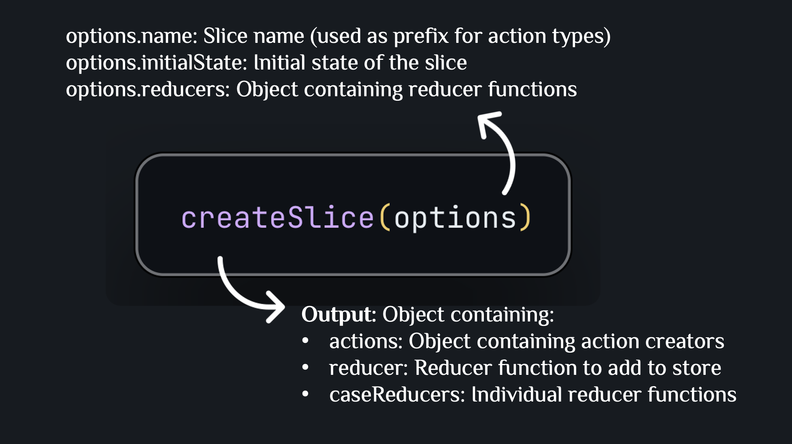

**Example**:

```typescript
import { createSlice, PayloadAction } from "@reduxjs/toolkit";
import { User } from "../../types";

export interface AuthState {
  isAuthenticated: boolean;
  user: User | null;
}

const initialState: AuthState = {
  isAuthenticated: false,
  user: null,
};

const authSlice = createSlice({
  name: "auth",
  initialState,
  reducers: {
    login: (state, action: PayloadAction<User>) => {
      state.isAuthenticated = true;
      state.user = action.payload;
    },
    logout: (state) => {
      state.isAuthenticated = false;
      state.user = null;
    },
  },
});

export const { login, logout } = authSlice.actions;
export default authSlice.reducer;
```

**Explanation**:

- `createSlice` automatically creates action types: `"auth/login"`, `"auth/logout"`
- Automatically creates action creators: `login(user)`, `logout()`
- Automatically creates reducer to handle those actions
- `PayloadAction<T>` helps TypeScript know the type of `action.payload`
- Can write "mutating" logic (like `state.isAuthenticated = true`) thanks to Immer automatically converting to immutable update

### Step 2: Setup Store

#### 2.1. Create Root Reducer with `combineReducers`

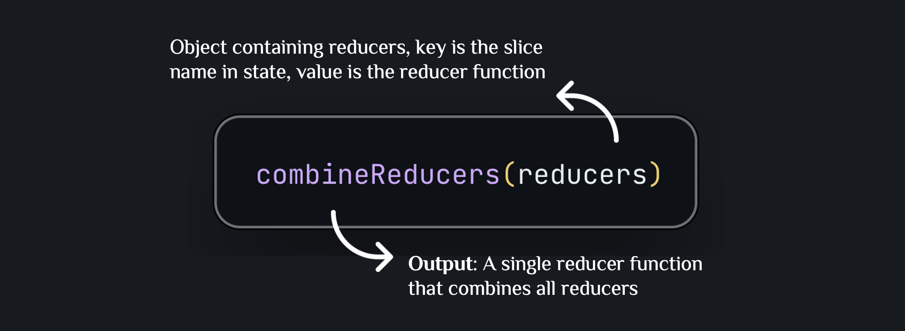

**Example**:

```typescript
import { combineReducers } from "@reduxjs/toolkit";
import authReducer from "../features/auth/authSlice";

export const rootReducer = combineReducers({
  auth: authReducer,
});
```

**Explanation**:

- `combineReducers` combines multiple reducers into a single reducer
- State will have the structure: `{ auth: {...} }`
- Each reducer only manages its own part of the state
- In simple cases you can skip this step and pass the reducers object directly to `configureStore` — see Step 2.2

#### 2.2. Create Store with `configureStore`

`configureStore` is a function that creates a store with good defaults. It replaces the older `createStore`.

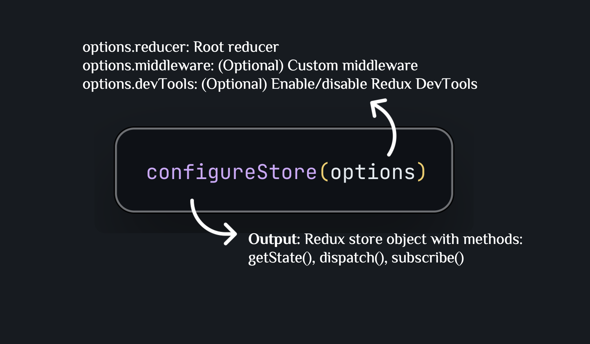

**Example**:

```typescript
import { configureStore } from "@reduxjs/toolkit";
import { rootReducer } from "./rootReducer";

export const store = configureStore({
  reducer: rootReducer,
  // Or skip combineReducers and pass the object directly:
  // reducer: { auth: authReducer }

  // Add custom middleware (thunk is always included by default):
  // middleware: (getDefaultMiddleware) =>
  //   getDefaultMiddleware().concat(logger, customMiddleware),
});

export type RootState = ReturnType<typeof store.getState>;
export type AppDispatch = typeof store.dispatch;
```

**Explanation**:

- `configureStore` includes **Redux Thunk** middleware by default — no extra setup needed for async thunks
- **Redux DevTools** is enabled automatically in development — install the [browser extension](https://github.com/reduxjs/redux-devtools-extension) to inspect actions, time-travel debug, and view state history
- Add custom middleware (e.g., `redux-logger`, `redux-persist`) via the `middleware` option using `getDefaultMiddleware().concat(...)` to preserve the defaults
- `RootState` and `AppDispatch` are derived from the store — never write them manually

#### 2.3. Setup Provider in App

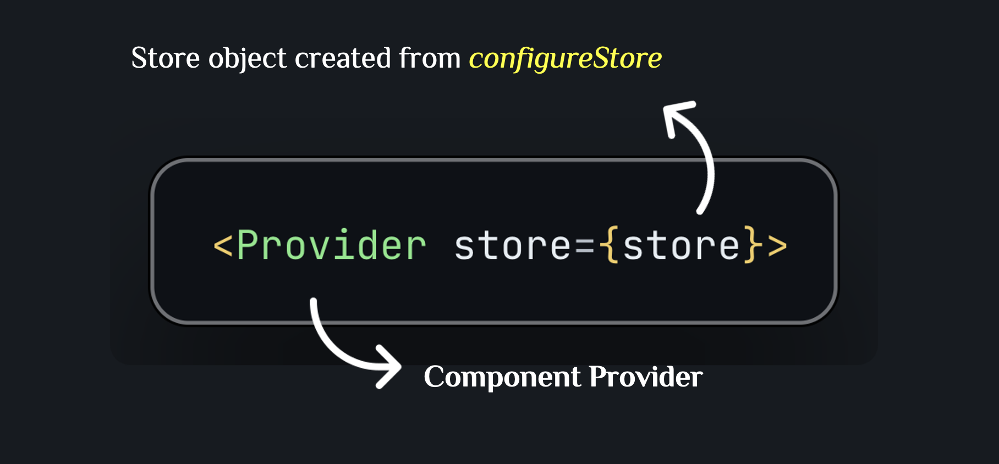

**Example**:

```typescript
import { Provider } from "react-redux";
import { store } from "./store";

ReactDOM.createRoot(document.getElementById("root")!).render(
  <Provider store={store}>
    <App />
  </Provider>
);
```

**Explanation**: Provider makes the store accessible from all child components

#### 2.4. Create Typed Hooks

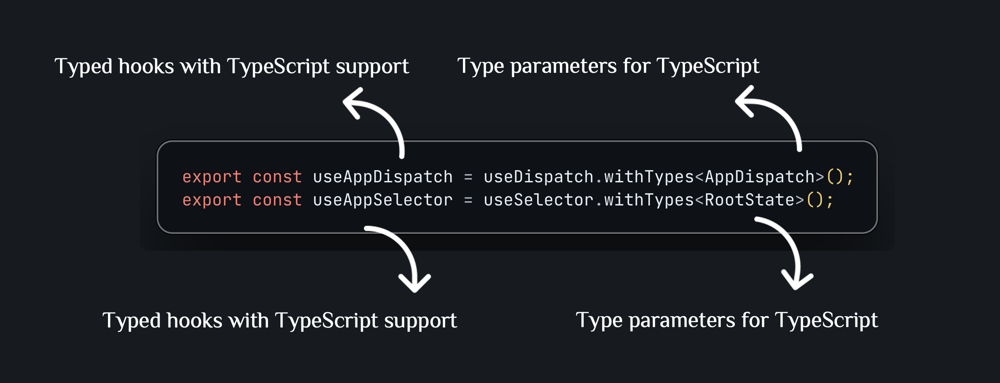

**Example**:

```typescript
import { useDispatch, useSelector } from "react-redux";
import type { RootState, AppDispatch } from "./index";

export const useAppDispatch = useDispatch.withTypes<AppDispatch>();
export const useAppSelector = useSelector.withTypes<RootState>();
```

**Explanation**:

- Helps TypeScript automatically suggest and check types when used
- Prevents type errors when dispatching actions or selecting state

### Step 3: Create Selectors

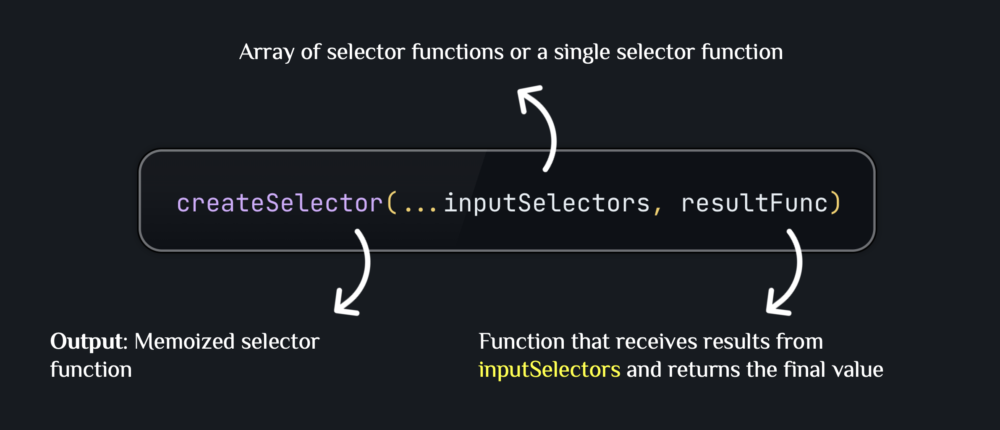

For simple state access, write plain selector functions — no need for `createSelector`:

```typescript
import { RootState } from "../../store";

export const selectIsAuthenticated = (state: RootState) => state.auth.isAuthenticated;
export const selectUser = (state: RootState) => state.auth.user;
```

Use `createSelector` when the result function does real computation (filtering, mapping, deriving new values). It memoizes the result and only recalculates when the inputs change:

```typescript
import { createSelector } from "@reduxjs/toolkit";
import { RootState } from "../../store";

export const selectUser = (state: RootState) => state.auth.user;

// Only recomputes when user changes
export const selectDisplayName = createSelector(
  [selectUser],
  (user) => (user ? `${user.name} (${user.email})` : "Guest")
);
```

**Explanation**:

- Plain selectors are fine for direct property reads — `createSelector` adds no benefit there
- `createSelector` is for derived state: only recalculates when input selectors return new values
- **Benefit**: Prevents unnecessary re-renders when unrelated state changes

### Step 4: Use in Component

#### 4.1. Dispatch Actions

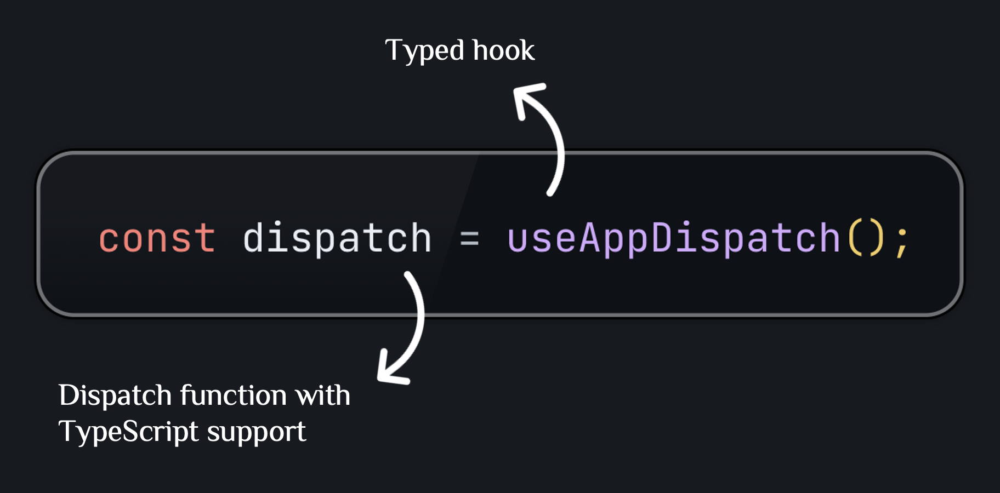

**Example**:

```typescript
import { useAppDispatch } from "../store/hooks";
import { login } from "../features/auth/authSlice";

const LoginPage = () => {
  const dispatch = useAppDispatch();

  const handleSubmit = (e: React.FormEvent) => {
    dispatch(
      login({
        id: Date.now(),
        username: "john",
        email: "john@example.com",
        name: "John Doe",
      })
    );
  };
};
```

**Explanation**:

- `dispatch(action)` sends action to store
- Action creator `login(user)` automatically creates action object with type `"auth/login"` and payload is user

#### 4.2. Select State

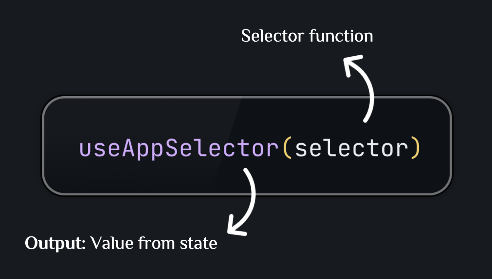

**Example**:

```typescript
import { useAppSelector } from "../store/hooks";
import {
  selectIsAuthenticated,
  selectUser,
} from "../features/auth/authSelectors";

const Component = () => {
  const isAuthenticated = useAppSelector(selectIsAuthenticated);
  const user = useAppSelector(selectUser);

  return <div>{isAuthenticated ? `Hello ${user?.name}` : "Please login"}</div>;
};
```

**Explanation**:

- `useAppSelector` automatically subscribes to state changes
- Component will re-render when value from selector changes
- Using memoized selector helps prevent re-render when value doesn't change

---

## Advanced: Implement Articles Feature

This section guides you through implementing a more complex feature with async operations and advanced selectors.

### Step 1: Create Async Thunks with `createAsyncThunk`

`createAsyncThunk` is a function that creates a thunk action for async operations. It automatically generates pending, fulfilled, and rejected actions.

`thunk` is a function that returns a function. It is used to handle asynchronous operations.

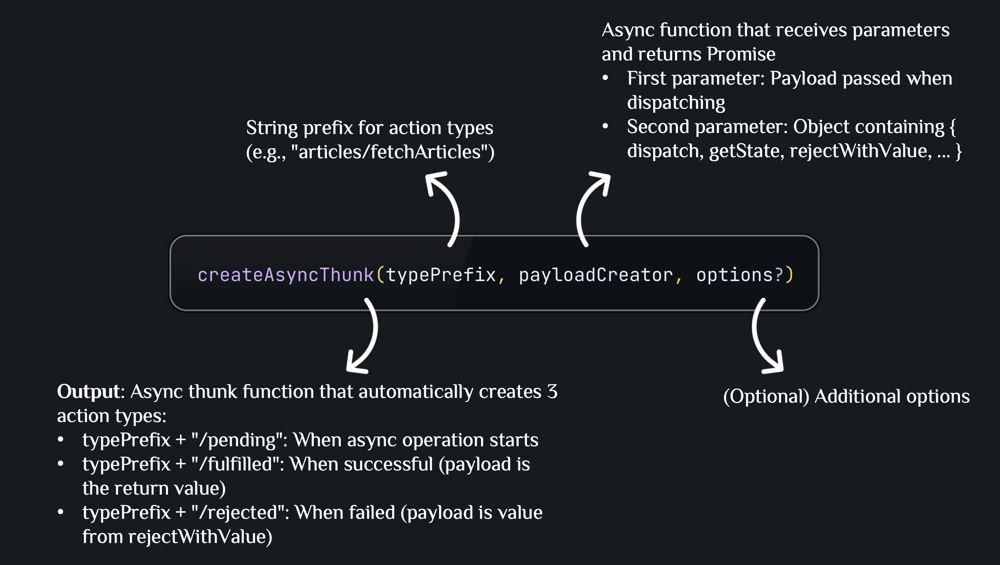

**Example**:

```typescript
import { createAsyncThunk } from "@reduxjs/toolkit";
import { newsApi } from "../../services/newsApi";

export const fetchArticles = createAsyncThunk(
  "articles/fetchArticles",
  async (
    params: {
      page: number;
      pageSize: number;
      filters?: {
        search?: string;
        category?: string;
        sortBy?: "date" | "title" | "author";
      };
    },
    { rejectWithValue }
  ) => {
    try {
      const response = await newsApi.fetchArticles(
        params.page,
        params.pageSize,
        params.filters
      );
      return response; // Return data → will be action.payload in fulfilled
    } catch (error: unknown) {
      const message = error instanceof Error ? error.message : "Failed to fetch articles";
      return rejectWithValue(message);
      // rejectWithValue → will be action.payload in rejected
    }
  }
);
```

**Explanation**:

- `createAsyncThunk` automatically creates 3 actions: `fetchArticles.pending`, `fetchArticles.fulfilled`, `fetchArticles.rejected`
- **Benefit**: No need to manually write action types and action creators for async operations
- `rejectWithValue` helps pass error message into action.payload instead of throwing error

### Step 2: Create Articles Slice with `extraReducers`

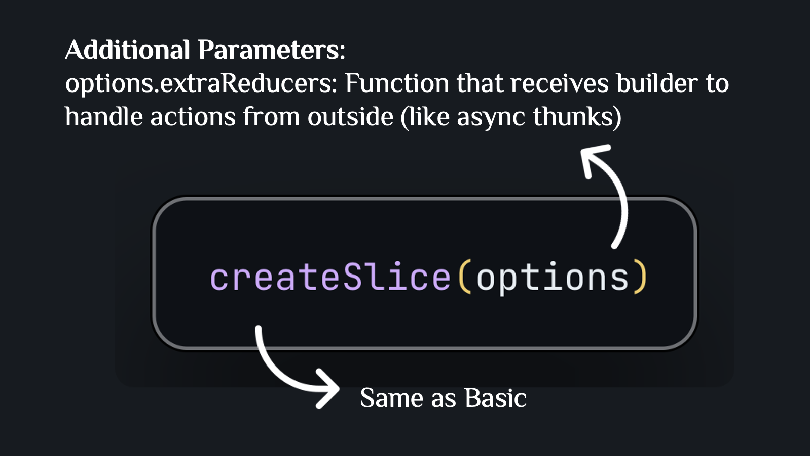

**Example**:

```typescript
import { createSlice, PayloadAction } from "@reduxjs/toolkit";
import { fetchArticles, fetchArticleById, searchArticles } from "./articlesApi";

const articlesSlice = createSlice({
  name: "articles",
  initialState,
  reducers: {
    // Synchronous reducers (same as Basic)
    setArticles: (state, action: PayloadAction<Article[]>) => {
      state.items = action.payload;
    },
    // ... other reducers
  },
  extraReducers: (builder) => {
    builder
      // Handle when fetchArticles.pending
      .addCase(fetchArticles.pending, (state) => {
        state.loading = true;
        state.error = null;
      })
      // Handle when fetchArticles.fulfilled
      .addCase(fetchArticles.fulfilled, (state, action) => {
        state.loading = false;
        state.items = action.payload.articles; // action.payload is the return value from async function
        state.pagination = action.payload.pagination;
        state.error = null;
      })
      // Handle when fetchArticles.rejected
      .addCase(fetchArticles.rejected, (state, action) => {
        state.loading = false;
        state.error = (action.payload as string) || "Failed to fetch articles";
        // action.payload is the value from rejectWithValue
      });
  },
});
```

**Explanation**:

- `extraReducers` is used to handle actions not created from `reducers` of this slice
- `builder.addCase(action, reducer)` adds a case handler for a specific action
- **Benefit**: Centralizes logic for handling async states (loading, error) in one place

### Step 3: Create Advanced Selectors

**Example with multiple input selectors**:

```typescript
import { createSelector } from "@reduxjs/toolkit";
import type { RootState } from "../../store";

// Base selector
const selectArticlesState = (state: RootState) => state.articles;

// Selector with 1 input
export const selectAllArticles = createSelector(
  [selectArticlesState],
  (articlesState) => articlesState.items
);

// Selector with multiple inputs (with parameters)
export const selectArticleById = createSelector(
  [selectAllArticles, (_state: RootState, id: number) => id],
  (articles, id) => articles.find((article) => article.id === id)
);

// Selector with filter
export const selectArticlesByCategory = createSelector(
  [selectAllArticles, (_state: RootState, category: string) => category],
  (articles, category) =>
    category === "All"
      ? articles
      : articles.filter((article) => article.category === category)
);
```

**Explanation**:

- Selector can receive multiple inputs: `[selector1, selector2, ...]`
- Selector can receive parameters: add function `(state, param) => param` to the inputs array
- **Benefit**: Create complex selectors with automatic memoization
- **Gotcha**: `createSelector` only caches the result of the last call. Calling `selectArticleById(state, 1)` then `selectArticleById(state, 2)` invalidates the cache. For selectors called with many different IDs (e.g., inside a list), consider using `weakMapMemoize` from RTK or creating a selector factory per ID.

### Step 4: Use Async Thunks in Component

**Example**:

```typescript
import { useAppDispatch, useAppSelector } from "../store/hooks";
import { fetchArticles } from "../features/articles/articlesApi";
import {
  selectAllArticles,
  selectArticlesLoading,
} from "../features/articles/articlesSelectors";

const HomePage = () => {
  const dispatch = useAppDispatch();
  const articles = useAppSelector(selectAllArticles);
  const loading = useAppSelector(selectArticlesLoading);

  useEffect(() => {
    dispatch(
      fetchArticles({
        page: 1,
        pageSize: 10,
        filters: {
          search: "react",
          category: "Technology",
          sortBy: "date",
        },
      })
    );
  }, [dispatch]);

  if (loading) return <div>Loading...</div>;
  return <div>{/* Render articles */}</div>;
};
```

**Explanation**:

- Dispatch async thunk is the same as dispatching a regular action
- Redux Toolkit automatically dispatches `pending` → `fulfilled`/`rejected`
- Component automatically re-renders when state changes (loading, articles, error)

---

## Summary

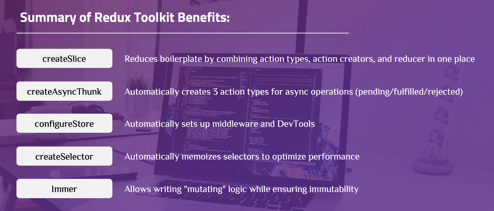

Redux Toolkit eliminates the boilerplate of traditional Redux by bundling `createSlice` (combines actions + reducers), `configureStore` (store setup with DevTools and middleware out of the box), `createAsyncThunk` (async action lifecycle), and `createSelector` (memoized derived state) into a single package.

## References

- [Redux Toolkit Documentation](https://redux-toolkit.js.org/)
- [Redux Essentials Tutorial](https://redux.js.org/tutorials/essentials/part-1-overview-concepts)
- [Redux Style Guide](https://redux.js.org/style-guide/)
