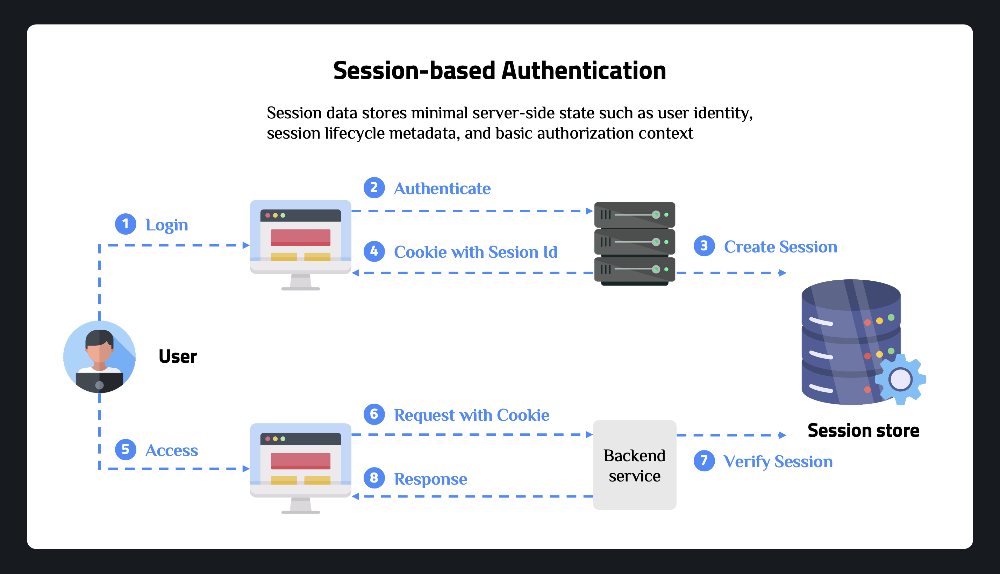
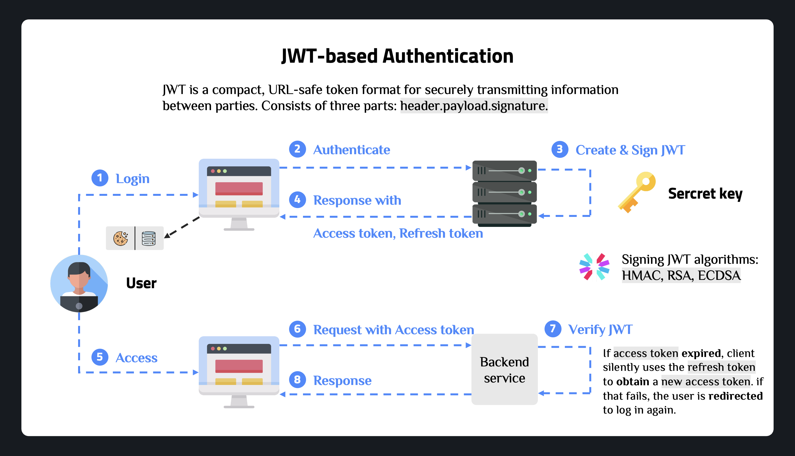
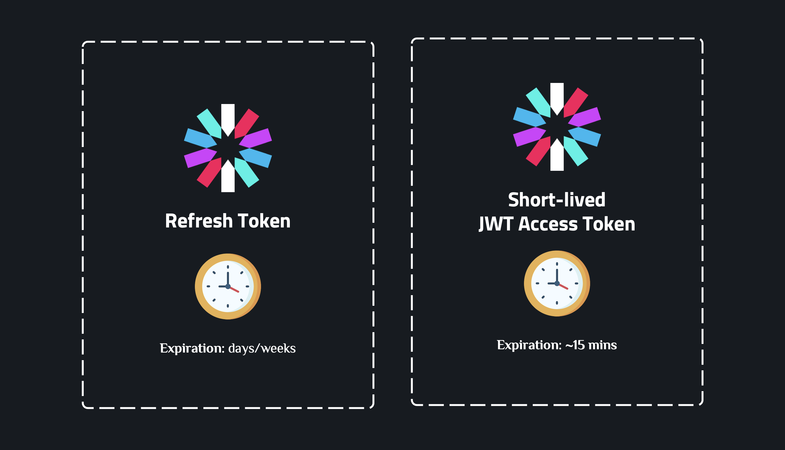

# Frontend Authentication

## Authentication vs Authorization

- **Authentication**: Verifying who the user is — "Who are you?" (login, verify identity)
- **Authorization**: Verifying what the user can access — "What can you do?" (permissions, roles)

---

## Authentication Strategies

### Session-based Authentication



The server creates a session after login and stores it in a session store (e.g., Redis). The session ID is sent to the client via a cookie and included in every subsequent request.

**When to use**: Traditional server-rendered apps where the server controls the full session lifecycle.

### JWT-based Authentication



The server issues a signed JWT after login. The client stores it and attaches it to every API request. The server verifies the signature without needing a session store — making it stateless and scalable.

A JWT has three parts: `header.payload.signature`. The payload carries user claims (id, role, expiry). The signature is created with a secret key (HMAC, RSA, or ECDSA) so it cannot be tampered with.

**When to use**: Stateless APIs, SPAs, and mobile apps where horizontal scaling is important.

### Access Token vs Refresh Token



| | Access Token | Refresh Token |
|---|---|---|
| **Expiry** | Short (~15 min) | Long (days / weeks) |
| **Purpose** | Authorize API requests | Obtain a new access token |
| **Storage** | In-memory (recommended) | httpOnly Cookie (recommended) |

When the access token expires, the client silently uses the refresh token to get a new one. If the refresh token is also expired or invalid, the user is redirected to login.

---

## Client-side Token Storage Strategies

Choosing where to store tokens is the most important security decision on the frontend. The core tradeoff is between **XSS** and **CSRF**:

- **XSS** (Cross-Site Scripting): malicious JS reads data from browser storage
- **CSRF** (Cross-Site Request Forgery): malicious site triggers requests using the browser's cookies

| | `localStorage` | `sessionStorage` | In-memory | `httpOnly` Cookie |
|---|---|---|---|---|
| **XSS risk** | High | High | None | None |
| **CSRF risk** | None | None | None | Requires protection |
| **Persists on refresh** | Yes | No | No | Yes |
| **Accessible to JS** | Yes | Yes | Yes | No |
| **Use for** | Dev / demo | Temporary data | Access token | Refresh token |

**Recommended production pattern**: store the **access token in-memory** (React state or a module-level variable) and the **refresh token in an httpOnly cookie** set by the server.

- Access token in-memory → invisible to XSS, lost on page refresh (intentional — short-lived anyway)
- Refresh token in httpOnly cookie → invisible to JS, used only to silently re-issue the access token on refresh
- Cookie must have `SameSite=Strict` or `SameSite=Lax` + CSRF token to mitigate CSRF

Understand more: [XSS Attacks](https://vercel.com/kb/guide/understanding-xss-attacks) · [CSRF Attacks](https://owasp.org/www-community/attacks/csrf)

---

## Frontend Auth Patterns

### Auth State Management

Manage auth state globally using **Context API + useReducer** (or Redux). Initialize from storage on mount, expose `login` / `logout` methods, and share state via `useAuth()` hook.

```typescript
const authReducer = (state: AuthState, action: AuthAction): AuthState => {
  switch (action.type) {
    case "LOGIN_SUCCESS":
      return { ...state, user: action.payload.user, isAuthenticated: true, isLoading: false };
    case "LOGOUT":
      return { ...state, user: null, isAuthenticated: false };
    default:
      return state;
  }
};

export const AuthProvider = ({ children }: { children: ReactNode }) => {
  const [state, dispatch] = useReducer(authReducer, initialState);

  const login = async (credentials: LoginCredentials) => {
    const response = await authApi.login(credentials);
    // access token stored in-memory (module variable or state), not here
    dispatch({ type: "LOGIN_SUCCESS", payload: { user: response.user } });
  };

  const logout = () => {
    dispatch({ type: "LOGOUT" });
  };

  return (
    <AuthContext.Provider value={{ state, login, logout }}>
      {children}
    </AuthContext.Provider>
  );
};
```

### Protected Routes

Wrap routes that require authentication with a `ProtectedRoute` component. See [React Router module](../10_React_Router/README.md) for the full pattern.

```typescript
export const ProtectedRoute = ({ children }: { children: ReactNode }) => {
  const { isAuthenticated, isLoading } = useAuth();
  const location = useLocation();

  if (isLoading) return <div>Loading...</div>;
  if (!isAuthenticated) return <Navigate to="/login" state={{ from: location }} replace />;
  return <>{children}</>;
};
```

### Role-Based Access Control (RBAC)

Layer a `RoleGuard` on top of `ProtectedRoute` to restrict access by role:

```typescript
export const RoleGuard = ({
  children,
  allowedRoles,
  fallbackPath = "/dashboard",
}: {
  children: ReactNode;
  allowedRoles: string[];
  fallbackPath?: string;
}) => {
  const { user, isAuthenticated } = useAuth();

  if (!isAuthenticated) return <Navigate to="/login" replace />;
  if (!allowedRoles.includes(user?.role ?? "")) return <Navigate to={fallbackPath} replace />;
  return <>{children}</>;
};
```

**Usage**: `<RoleGuard allowedRoles={["admin"]}><AdminPanel /></RoleGuard>`

---

## References

- [JWT Introduction](https://jwt.io/introduction)
- [OWASP: Auth Cheat Sheet](https://cheatsheetseries.owasp.org/cheatsheets/Authentication_Cheat_Sheet.html)
- [XSS Attacks](https://vercel.com/kb/guide/understanding-xss-attacks)
- [CSRF Attacks](https://owasp.org/www-community/attacks/csrf)
