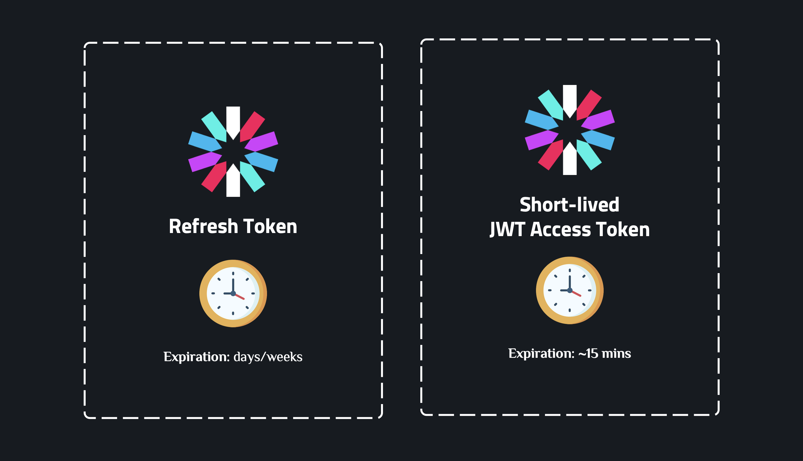
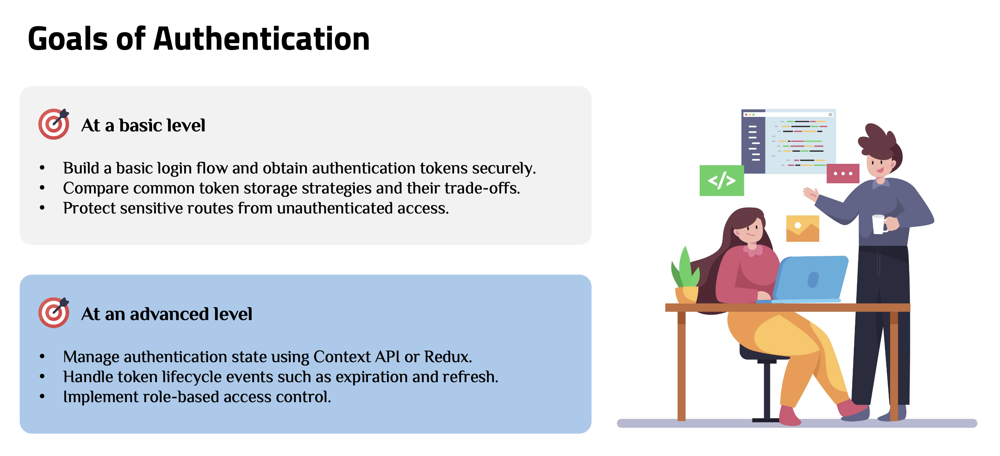

# Frontend Authentication with TypeScript

A comprehensive demo application demonstrating **Frontend Authentication** patterns and best practices in React with **TypeScript**, including token management, protected routes, role-based access control, and secure authentication flows.

---

## Core Terminology

### Authentication vs Authorization


### Session-based Authentication


**When to use**: Traditional web applications where server controls session lifecycle and security is critical.

### JWT-based Authentication


**When to use**: Token-based authentication is ideal for stateless APIs, SPAs, and mobile apps. It allows scalability without server-side session storage.



---

## Learning Objectives

Now that you have a high-level understanding of how Authentication works, we can clearly define the objectives of Authentication from a frontend perspective.



---

## Basic: Authentication Implementation

### Step 1: Create Login Form

**File: `src/components/Login.tsx`**

```typescript
function Login() {
  const navigate = useNavigate();
  const { login, error, isLoading } = useAuth();
  const [email, setEmail] = useState("");
  const [password, setPassword] = useState("");

  const handleSubmit = async (e: FormEvent) => {
    e.preventDefault();
    try {
      await login({ email, password });
      navigate("/dashboard");
    } catch (err) {
      console.error("Login failed:", err);
    }
  };

  return (
    <form onSubmit={handleSubmit}>
      <input
        type="email"
        value={email}
        onChange={(e) => setEmail(e.target.value)}
      />
      <input
        type="password"
        value={password}
        onChange={(e) => setPassword(e.target.value)}
      />
      {error && <div className="error">{error}</div>}
      <button type="submit" disabled={isLoading}>
        {isLoading ? "Logging in..." : "Login"}
      </button>
    </form>
  );
}
```

**Explanation**: Form collects credentials, calls `login` from `useAuth` hook, handles loading/error states, and navigates to dashboard on success.

### Step 2: Store Token

This project is a demo, so it uses `localStorage` to store tokens. Although `localStorage` has security risks (vulnerable to XSS attacks), it's suitable for learning and demo purposes because it's easy to use and debug.

**File: `src/utils/tokenStorage.ts`**

```typescript
export const tokenStorage = {
  getAccessToken: (): string | null => localStorage.getItem("access_token"),
  setAccessToken: (token: string): void =>
    localStorage.setItem("access_token", token),
  getRefreshToken: (): string | null => localStorage.getItem("refresh_token"),
  setRefreshToken: (token: string): void =>
    localStorage.setItem("refresh_token", token),
  getUser: (): any => {
    const user = localStorage.getItem("user");
    return user ? JSON.parse(user) : null;
  },
  setUser: (user: any): void =>
    localStorage.setItem("user", JSON.stringify(user)),
  clearAll: (): void => {
    localStorage.removeItem("access_token");
    localStorage.removeItem("refresh_token");
    localStorage.removeItem("user");
  },
};
```

**Storage Comparison**:

| Storage Type         | Pros                                     | Cons                                   | Best For                        |
| -------------------- | ---------------------------------------- | -------------------------------------- | ------------------------------- |
| **localStorage**     | Persists across tabs, easy to use        | Vulnerable to XSS, accessible to JS    | Development, non-sensitive data |
| **sessionStorage**   | Cleared on tab close, easy to use        | Vulnerable to XSS, accessible to JS    | Temporary data, single session  |
| **httpOnly Cookies** | Protected from XSS, not accessible to JS | Requires CSRF protection, server setup | Production, sensitive tokens    |

**Best Practice**: For production apps, use httpOnly cookies for refresh tokens and short-lived access tokens in memory or secure storage.

Understand more about [**XSS Attacks**](https://vercel.com/kb/guide/understanding-xss-attacks)

### Step 3: Protected Routes

**File: `src/components/ProtectedRoute.tsx`**

```typescript
import { ReactNode } from "react";
import { Navigate, useLocation } from "react-router-dom";
import { useAuth } from "../hooks/useAuth";

interface ProtectedRouteProps {
  children: ReactNode;
}

export const ProtectedRoute = ({ children }: ProtectedRouteProps) => {
  const { isAuthenticated, isLoading } = useAuth();
  const location = useLocation();

  if (isLoading) {
    return <div>Loading...</div>;
  }

  if (!isAuthenticated) {
    return <Navigate to="/login" state={{ from: location }} replace />;
  }

  return <>{children}</>;
};
```

**Usage**: Wrap protected routes with `<ProtectedRoute><Dashboard /></ProtectedRoute>`

**Explanation**: Checks authentication status, shows loading state, redirects to login if not authenticated, and preserves attempted location for redirect after login.

---

## Advanced: Advanced Authentication Patterns

This section covers more complex authentication patterns and features.

### Step 1: Context API + useReducer for Auth State

**File: `src/context/AuthContext.tsx`**

```typescript
const authReducer = (state: AuthState, action: AuthAction): AuthState => {
  switch (action.type) {
    case "LOGIN_SUCCESS":
      return {
        ...state,
        user: action.payload.user,
        isAuthenticated: true,
        isLoading: false,
      };
    case "LOGIN_FAILURE":
      return {
        ...state,
        isAuthenticated: false,
        isLoading: false,
        error: action.payload,
      };
    case "LOGOUT":
      return { ...state, user: null, isAuthenticated: false };
    // ... other cases
  }
};

export const AuthProvider = ({ children }: { children: ReactNode }) => {
  const [state, dispatch] = useReducer(authReducer, initialState);

  useEffect(() => {
    const token = tokenStorage.getAccessToken();
    const user = tokenStorage.getUser();
    if (token && user) {
      dispatch({ type: "SET_USER", payload: user });
    }
    dispatch({ type: "SET_LOADING", payload: false });
  }, []);

  const login = async (credentials: LoginCredentials) => {
    dispatch({ type: "LOGIN_START" });
    try {
      const response = await authApi.login(credentials);
      tokenStorage.setAccessToken(response.accessToken);
      tokenStorage.setUser(response.user);
      dispatch({ type: "LOGIN_SUCCESS", payload: { user: response.user } });
    } catch (error) {
      dispatch({ type: "LOGIN_FAILURE", payload: error.message });
    }
  };

  const logout = async () => {
    tokenStorage.clearAll();
    dispatch({ type: "LOGOUT" });
  };

  return (
    <AuthContext.Provider value={{ state, login, logout }}>
      {children}
    </AuthContext.Provider>
  );
};
```

**Explanation**: Centralized auth state with Context API and useReducer. Initializes from localStorage on mount, handles login/logout, and persists tokens. Use `useAuth()` hook to access auth state and methods.

### Step 2: Axios Interceptors for Token Management

**File: `src/api/axiosInstance.ts`**

```typescript
// Request interceptor - Attach token
axiosInstance.interceptors.request.use((config) => {
  const token = tokenStorage.getAccessToken();
  if (token && !isTokenExpired(token)) {
    config.headers.Authorization = `Bearer ${token}`;
  }
  return config;
});

// Response interceptor - Handle 401 and refresh token
axiosInstance.interceptors.response.use(
  (response) => response,
  async (error) => {
    const originalRequest = error.config;
    if (error.response?.status === 401 && !originalRequest._retry) {
      originalRequest._retry = true;
      try {
        const response = await axios.post("/auth/refresh", {
          refreshToken: tokenStorage.getRefreshToken(),
        });
        tokenStorage.setAccessToken(response.data.accessToken);
        originalRequest.headers.Authorization = `Bearer ${response.data.accessToken}`;
        return axiosInstance(originalRequest);
      } catch {
        tokenStorage.clearAll();
        window.location.href = "/login";
      }
    }
    return Promise.reject(error);
  }
);
```

**Explanation**: Request interceptor attaches access token automatically. Response interceptor handles 401 errors by refreshing token on-demand (only when needed), retries failed request, and logs out if refresh fails. This is the recommended approach for production.

### Step 3: Role-Based Access Control (RBAC)

**File: `src/components/RoleGuard.tsx`**

```typescript
import { ReactNode } from "react";
import { Navigate } from "react-router-dom";
import { useAuth } from "../hooks/useAuth";

interface RoleGuardProps {
  children: ReactNode;
  allowedRoles: ("admin" | "user" | "guest")[];
  fallbackPath?: string;
}

export const RoleGuard = ({
  children,
  allowedRoles,
  fallbackPath = "/dashboard",
}: RoleGuardProps) => {
  const { user, isAuthenticated } = useAuth();

  if (!isAuthenticated) {
    return <Navigate to="/login" replace />;
  }

  if (user && !allowedRoles.includes(user.role)) {
    return <Navigate to={fallbackPath} replace />;
  }

  return <>{children}</>;
};
```

**Usage**: `<RoleGuard allowedRoles={["admin"]}><AdminPanel /></RoleGuard>`

**Explanation**: Checks authentication first, verifies user role against allowed roles, and redirects unauthorized users. Can be combined with ProtectedRoute for layered protection.