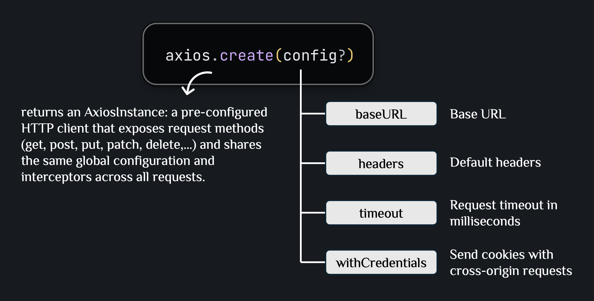
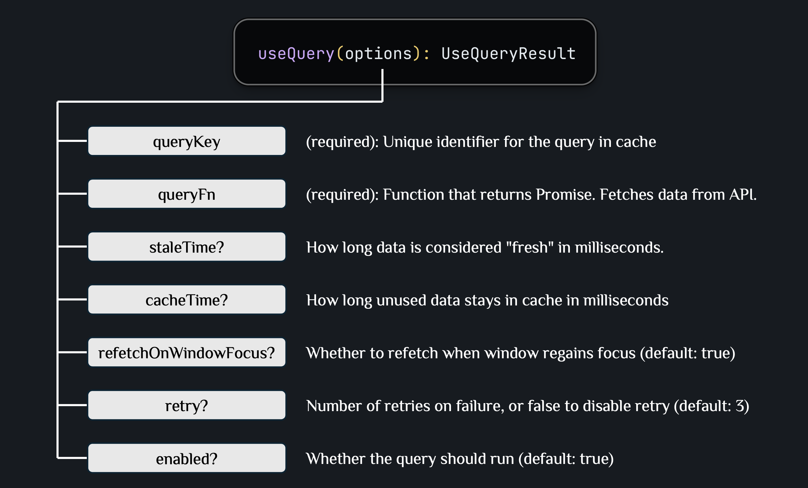
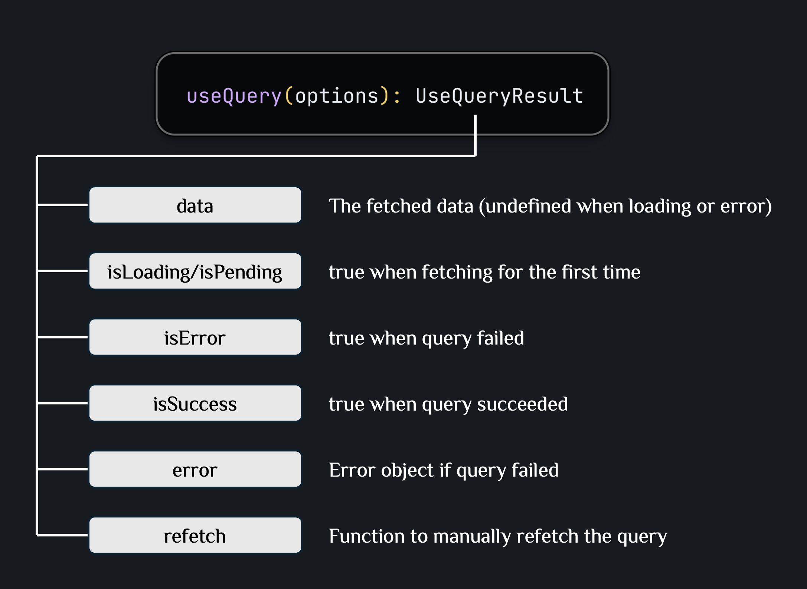
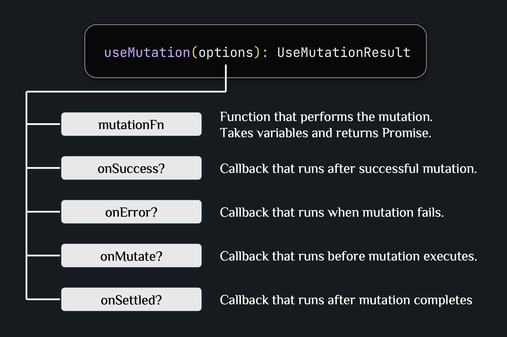
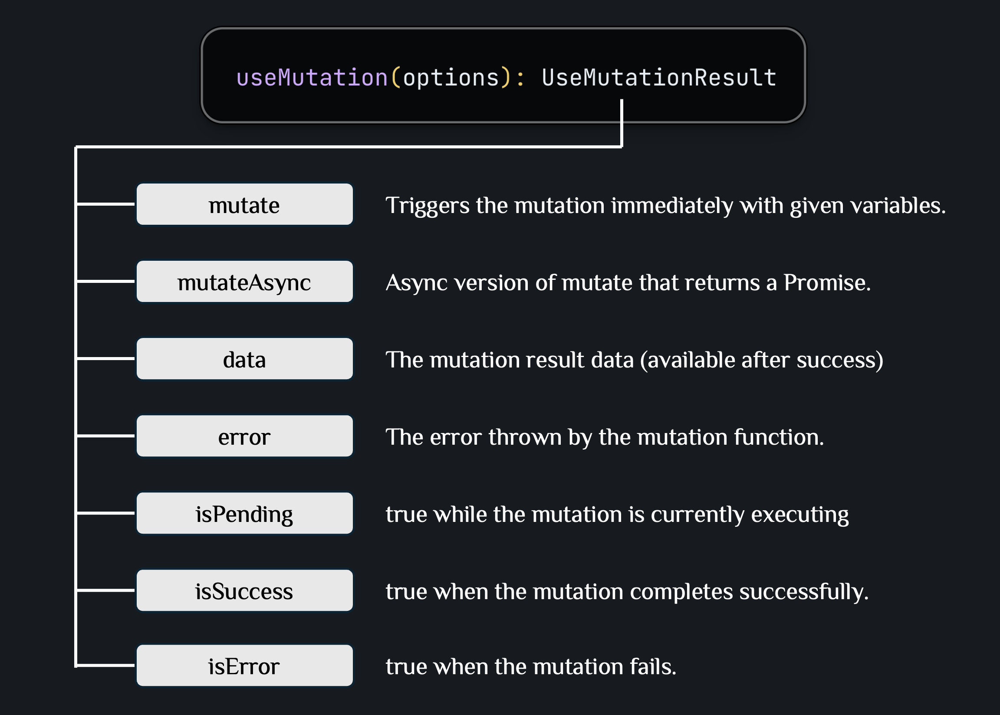
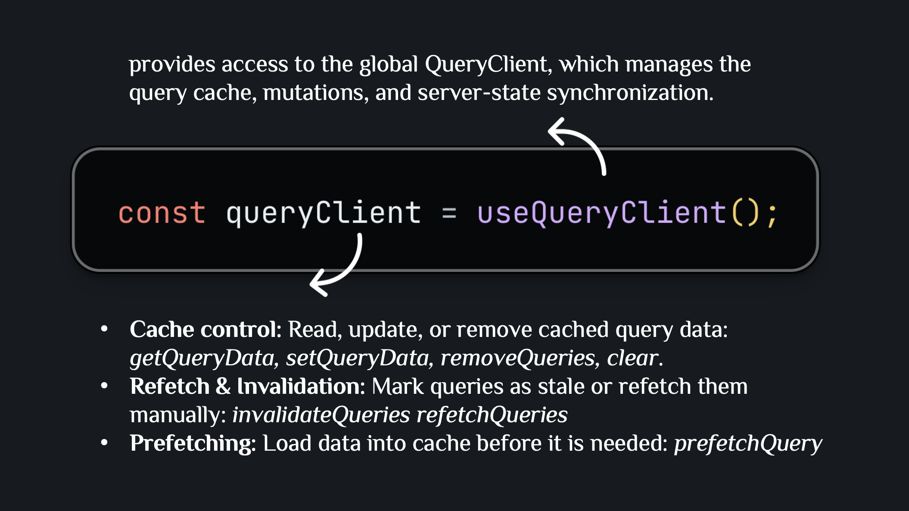
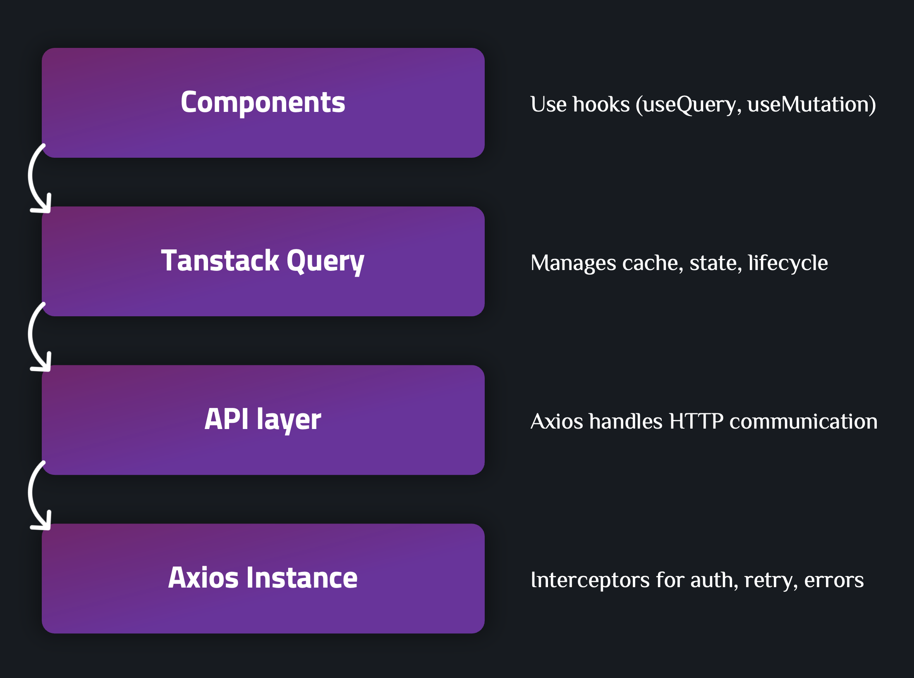

# Using Axios with TanStack Query

A comprehensive demo application demonstrating how to use **Axios** for HTTP requests combined with **TanStack Query** (React Query) for data fetching, caching, and state management in React + TypeScript.

---

## Core Terminology

### 1. Axios Terminology

#### Axios Instance & Config

Axios Instance is a reusable, pre-configured HTTP client created by axios.create(). It centralizes global settings (baseURL, headers, timeout) and interceptors, ensuring consistent request behavior and easier maintenance across the application.



**Example**:

```typescript
const axiosInstance = axios.create({
  baseURL: "http://localhost:3000",
  timeout: 10000,
  headers: {
    "Content-Type": "application/json",
  },
  withCredentials: false,
});
```

> Note: Axios config contains many fields, but not all are suitable for global configuration. Some options are method-specific (e.g., data, params, method, url) and should be defined per request to avoid unintended side effects.

**Global Config vs Per-request Config**:

| Aspect       | Global Config                                      | Per-request Config                                  |
| ------------ | -------------------------------------------------- | --------------------------------------------------- |
| **Where**    | Set in `axios.create()`                            | Passed as second parameter to request methods       |
| **Scope**    | Applied to ALL requests made with the instance     | Applied to a SPECIFIC request only                  |
| **Purpose**  | Set defaults that every request should have        | Override or add config for specific requests        |
| **Example**  | `baseURL`, `timeout`, `headers`, `withCredentials` | `params`, `data`, `method`, `url`, custom `timeout` |
| **Use Case** | Common settings like API base URL, default headers | Request-specific data, query params, custom headers |

#### Interceptors (Very Important)

Interceptors are functions from `axiosInstance` that run **before a request is sent** or **after a response is received**, allowing centralized side effects and logic reuse.

**Request Interceptor**:

- Request interceptor executes before the HTTP request is sent.
- Common use cases: attach auth tokens, set headers, log requests, or modify config.
- Must return config or Promise that resolves to config

**Example**:

```typescript
axiosInstance.interceptors.request.use(
  async (config) => {
    // Add auth token to every request
    const token = localStorage.getItem("token");
    if (token) {
      config.headers.Authorization = `Bearer ${token}`;
    }
    return config;
  },
  (error) => {
    return Promise.reject(error);
  }
);
```

**Response Interceptor**:

- Response interceptor executes **after a response is received** (success or error).
- Common use cases: unwrap response.data, normalize errors, handle token refresh, or global error handling.

**Example**:

```typescript
axiosInstance.interceptors.response.use(
  (response) => {
    // Success - can transform data here
    return response;
  },
  async (error) => {
    // Handle 401 - Refresh token flow
    if (error.response?.status === 401) {
      // Refresh token and retry original request
      const newToken = await refreshToken();
      error.config.headers.Authorization = `Bearer ${newToken}`;
      return axiosInstance(error.config);
    }
    return Promise.reject(error);
  }
);
```

#### Axios vs Fetch API

Before diving into Axios, let's understand why Axios is often preferred over the native Fetch API:

| Aspect                              | Axios                                                      | Fetch API                                                          |
| ----------------------------------- | ---------------------------------------------------------- | ------------------------------------------------------------------ |
| **Package**                         | External library (needs installation)                      | Built-in browser API (no installation)                             |
| **Request/Response**                | Automatically transforms JSON data                         | Requires manual `.json()` call                                     |
| **Error Handling**                  | Rejects only on network errors; treats 4xx/5xx as errors   | Only rejects on network errors; 4xx/5xx are "successful" responses |
| **Request Timeout**                 | Built-in timeout support                                   | Requires `AbortController` for timeout                             |
| **Interceptors**                    | Built-in request/response interceptors                     | No built-in interceptors (need manual wrapper)                     |
| **Request Cancellation**            | Built-in with `CancelToken` (v0.22+) or `AbortController`  | Uses `AbortController`                                             |
| **Progress Tracking**               | Built-in support for upload/download progress              | No built-in support                                                |
| **Automatic JSON**                  | Automatically stringifies request body and parses response | Manual `JSON.stringify()` and `.json()`                            |
| **Request/Response Transformation** | Built-in transform functions                               | Manual transformation needed                                       |
| **Instance & Config**               | Can create instances with default config                   | No instance concept; need to wrap in function                      |
| **Browser Support**                 | Works in Node.js and browsers                              | Browser-only (Node.js needs `node-fetch`)                          |
| **TypeScript Support**              | Excellent TypeScript support                               | Basic TypeScript support                                           |
| **Bundle Size**                     | ~13KB (minified + gzipped)                                 | 0KB (native API)                                                   |
| **Syntax**                          | More concise and intuitive                                 | More verbose                                                       |

**Example Comparison**:

```typescript
// Fetch API
fetch("http://localhost:3000/posts", {
  method: "POST",
  headers: {
    "Content-Type": "application/json",
    Authorization: `Bearer ${token}`,
  },
  body: JSON.stringify({ title: "New Post", body: "Content" }),
})
  .then((response) => {
    if (!response.ok) {
      throw new Error("Network response was not ok");
    }
    return response.json();
  })
  .then((data) => console.log(data))
  .catch((error) => console.error("Error:", error));

// Axios
axios
  .post(
    "http://localhost:3000/posts",
    {
      title: "New Post",
      body: "Content",
    },
    {
      headers: {
        Authorization: `Bearer ${token}`,
      },
    }
  )
  .then((response) => console.log(response.data))
  .catch((error) => console.error("Error:", error));
```

**When to use Axios:**

- Need interceptors for auth tokens, error handling, or request/response transformation
- Want built-in timeout, progress tracking, or request cancellation
- Prefer cleaner, more concise syntax
- Need consistent error handling across the application
- Working with TypeScript and want better type safety

**When to use Fetch:**

- Want zero external dependencies
- Simple requests without advanced features
- Bundle size is critical
- Only need basic HTTP requests

---

### 2. TanStack Query Terminology

#### Server State vs Client State

| Aspect              | Server State                                        | Client/UI State                                         |
| ------------------- | --------------------------------------------------- | ------------------------------------------------------- |
| **Source**          | Data from server/API                                | Data managed in component                               |
| **Managed by**      | TanStack Query                                      | React state (useState, useReducer)                      |
| **Source of Truth** | Server is the source of truth                       | Component state is the source of truth                  |
| **Synchronization** | Needs sync with server, caching, background updates | No sync needed, local only                              |
| **Examples**        | Posts list, user profile, product data              | Form inputs, UI toggles, modal open/close, selected tab |
| **Lifecycle**       | Persists across page refreshes (from server)        | Resets on page refresh (unless persisted)               |
| **Sharing**         | Shared across components via TanStack Query cache   | Local to component (unless lifted up or Context)        |
| **Updates**         | Invalidated and refetched when server data changes  | Updated directly via setState/dispatch                  |
| **Use Case**        | Data fetched from API, needs caching and sync       | UI interactions, temporary state, form state            |

#### Query Fundamentals

**Query**:

`useQuery` binds an async read operation to a unique cache key, manages its lifecycle, and exposes the result to React components. It takes an options object as input, some common properties are:



`useQuery` returns an object containing query state and data:



**Mutations**:

`useMutation` manages write operations (create, update, delete) and their side effects on server state. It takes an options object as input, some common properties are:



`useMutation` returns an object containing mutation state and methods:



---

### 3. Cache & Sync Terminology



**Cache Invalidation**:

Cache invalidation is the process of marking cached data as stale, which tells TanStack Query that the data may be outdated and needs to be refreshed. This is done using the `invalidateQueries()` method on the query client.

When you invalidate a query, TanStack Query automatically triggers a refetch of that data in the background, ensuring your UI stays synchronized with the server state. You can invalidate all queries matching a certain key pattern, or target specific queries precisely.

**Example**:

```typescript
// Invalidate all queries starting with ["posts"]
queryClient.invalidateQueries({ queryKey: ["posts"] });
// Invalidate specific query
queryClient.invalidateQueries({ queryKey: ["posts", "detail", 1] });
```

**Automatic Refetch**:

TanStack Query automatically refetches stale data to keep your application synchronized with the server. This automatic refetching happens in several scenarios:

- When a component mounts and the query is stale,
- When the browser window regains focus (user switches back to the tab),
- When the network reconnects after being offline,
- Or when a query is explicitly invalidated.

This ensures that users always see up-to-date data without manual intervention.

**Refetch on Window Focus**:

One of the most useful automatic refetch behaviors is refetching when the user returns to the tab. This is particularly valuable for applications where data changes frequently, as it ensures users see the latest information when they come back to your application.

However, if this behavior is not desired for your use case, you can disable it by setting `refetchOnWindowFocus: false` in your query options.

**Polling**:

Polling allows you to automatically refetch data at regular intervals, which is useful for real-time applications or dashboards that need to display frequently changing data.

By setting the `refetchInterval` option in your query configuration, TanStack Query will continuously refetch the data at the specified interval (in milliseconds). You can also control whether polling should continue when the browser tab is in the background using `refetchIntervalInBackground`.

**Example**:

```typescript
useQuery({
  queryKey: ["posts"],
  queryFn: fetchPosts,
  refetchInterval: 5000, // Refetch every 5 seconds
  refetchIntervalInBackground: false, // Don't poll when tab is in background
});
```

**Deduplication**:

Deduplication is a powerful feature that prevents unnecessary API calls when multiple components request the same data simultaneously. When several components use `useQuery` with the same query key at the same time, TanStack Query intelligently deduplicates these requests, making only one actual HTTP request to the server.

All components that requested the data will receive the same result, improving performance and reducing server load. For example, if three components call `useQuery({ queryKey: ["posts"], queryFn: fetchPosts })` at the same time, only one API request is made, and all three components receive the same data.

**Pagination / Infinite Query**:

Pagination and infinite queries allow you to load data incrementally, page by page, which is essential for handling large datasets efficiently. The `useInfiniteQuery` hook is specifically designed for this purpose, managing the loading of multiple pages of data and providing a seamless way to load more content as users scroll or interact with your application.

Like regular queries, infinite queries also benefit from automatic deduplication, ensuring that pages are not fetched multiple times unnecessarily. The hook provides a `getNextPageParam` function that determines when more pages are available and what the next page parameter should be.

**Example**:

```typescript
useInfiniteQuery({
  queryKey: ["posts", "infinite"],
  queryFn: ({ pageParam = 1 }) => fetchPosts({ page: pageParam }),
  getNextPageParam: (lastPage, allPages) => {
    return lastPage.hasNextPage ? allPages.length + 1 : undefined;
  },
  initialPageParam: 1,
});
```

**Prefetch**:

Prefetching is a performance optimization technique where data is fetched before the user actually needs it, making the application feel faster and more responsive. By prefetching data that users are likely to request next (such as when they hover over a link or button), you can have the data ready in the cache by the time they navigate to that page or component.

This eliminates loading states and creates a smoother user experience. Prefetching is done using `queryClient.prefetchQuery()`, which fetches and caches the data without triggering any loading states in components that might be using that query.

**Example**:

```typescript
// Prefetch on hover
const handleMouseEnter = () => {
  queryClient.prefetchQuery({
    queryKey: ["post", postId],
    queryFn: () => fetchPost(postId),
  });
};
```

---

### 4. Combining Axios + TanStack Query + TypeScript

When combining all three, you'll encounter these concepts frequently:

#### API Layer / Service Layer

- **Axios**: Responsible for HTTP communication
- **TanStack Query**: Responsible for cache + sync state
- **TypeScript**: Responsible for ensuring data contract

**Example Structure**:

```text
src/
  api/           # Axios layer - HTTP communication
    axiosConfig.ts    # Axios instance & interceptors
    usersApi.ts       # API functions
  hooks/         # TanStack Query layer - State management
    useUsers.ts       # Query & mutation hooks
  types/         # TypeScript layer - Type definitions
    api.types.ts      # API types
  utils/         # Utilities
    errorHandler.ts   # Error normalization
```

**Example API Layer**:

```typescript
// API layer - handles HTTP communication
export const usersApi = {
  getUsers: async (): Promise<User[]> => {
    const response = await axiosInstance.get<User[]>("/users");
    return response.data;
  },
  createUser: async (data: CreateUserDTO): Promise<User> => {
    const response = await axiosInstance.post<User>("/users", data);
    return response.data;
  },
};
```

#### Typed API Response

- Every API call should have typed response, prevents `any` types
- Ensures type safety throughout app

**Example**:

```typescript
// Typed response with generic
const response: AxiosResponse<User[]> = await axiosInstance.get<User[]>(
  "/users"
);
// response.data is typed as User[]
// response.status is typed as number
return response.data;
```

#### Error Normalization

- Convert all errors to consistent format
- Makes error handling easier
- Prevents inconsistent error types

**Example**:

```typescript
function normalizeError(error: unknown): ApiError {
  if (error instanceof AxiosError) {
    return {
      message: error.response?.data?.message || error.message,
      status: error.response?.status || 500,
    };
  }
  if (error instanceof Error) {
    return { message: error.message, status: 500 };
  }
  return { message: "An unknown error occurred", status: 500 };
}
```

#### DTO (Data Transfer Object)

DTOs (Data Transfer Objects) are TypeScript interfaces that define the structure of data transferred between frontend and backend API. They serve as contracts specifying required or optional fields for requests and expected response structures. DTOs are separate from domain models, focusing solely on API communication format, which allows transforming data without coupling business logic to API specifics.

DTOs provide type safety and maintainability by establishing explicit contracts enforced at compile-time. When API requirements change, updating the DTO definition allows TypeScript to highlight all affected code, making refactoring safer and faster than discovering mismatches at runtime.

**Example**:

```typescript
// DTOs define the contract for API communication
export interface CreateUserDTO {
  name: string;
  email: string;
  age: number;
}

export interface UpdateUserDTO {
  name?: string;
  email?: string;
  age?: number;
}

// Used in API calls
async function createUser(data: CreateUserDTO): Promise<User> {
  const response = await axiosInstance.post<User>("/users", data);
  return response.data;
}
```

---

## Basic Setup and Usage

### Step 1: Configure Axios Instance

**File: `src/api/axiosConfig.ts`**

```typescript
import axios, {
  AxiosError,
  AxiosResponse,
  InternalAxiosRequestConfig,
} from "axios";
import {
  tokenStorage,
  refreshAccessToken,
  isTokenExpired,
} from "../utils/auth";
import { createRetryLogic, defaultRetryCondition } from "../utils/retry";

// Create axios instance with default configuration
export const axiosInstance = axios.create({
  baseURL: "http://localhost:3000",
  timeout: 10000,
  headers: {
    "Content-Type": "application/json",
  },
});

// Request interceptor - Auth token injection
axiosInstance.interceptors.request.use(
  async (config: InternalAxiosRequestConfig) => {
    const token = tokenStorage.getToken();
    if (token && !isTokenExpired(token)) {
      config.headers.Authorization = `Bearer ${token}`;
    }
    return config;
  },
  (error: AxiosError) => Promise.reject(error)
);

// Response interceptor - Refresh token flow & retry logic
axiosInstance.interceptors.response.use(
  (response: AxiosResponse) => response,
  async (error: AxiosError) => {
    // Handle 401 - Refresh token
    if (error.response?.status === 401) {
      // Refresh token logic...
    }
    // Retry logic for network/5xx errors
    if (defaultRetryCondition(error)) {
      // Retry with exponential backoff...
    }
    return Promise.reject(error);
  }
);
```

### Step 2: Create API Functions with DTOs

**File: `src/api/postsApi.ts`**

```typescript
import { axiosInstance } from "./axiosConfig";
import { AxiosResponse } from "axios";

// DTOs
export interface Post {
  id: number;
  title: string;
  body: string;
  userId: number;
}

export interface CreatePostDTO {
  title: string;
  body: string;
  userId: number;
}

export interface UpdatePostDTO {
  title?: string;
  body?: string;
}

// API functions with typed responses
export const postsApi = {
  getPosts: async (): Promise<Post[]> => {
    const response: AxiosResponse<Post[]> = await axiosInstance.get<Post[]>(
      "/posts"
    );
    return response.data;
  },

  getPostById: async (id: number): Promise<Post> => {
    const response: AxiosResponse<Post> = await axiosInstance.get<Post>(
      `/posts/${id}`
    );
    return response.data;
  },

  createPost: async (data: CreatePostDTO): Promise<Post> => {
    const response: AxiosResponse<Post> = await axiosInstance.post<Post>(
      "/posts",
      data
    );
    return response.data;
  },
  // ...
};
```

### Step 3: Setup QueryClient and Wrap App with QueryClientProvider

> **Important**: You **MUST** wrap your application with `QueryClientProvider` to use TanStack Query hooks (`useQuery`, `useMutation`, etc.). Without wrapping, the hooks will throw an error when you try to use them.

**File: `src/main.tsx`**

```typescript
import React from "react";
import ReactDOM from "react-dom/client";
import { QueryClient, QueryClientProvider } from "@tanstack/react-query";
import App from "./App";
import "./index.css";

// Create QueryClient instance with default configuration
// QueryClient manages cache and state of all queries/mutations
const queryClient = new QueryClient({
  defaultOptions: {
    queries: {
      staleTime: 1000 * 60 * 5,
      gcTime: 1000 * 60 * 10,
      refetchOnWindowFocus: false,
      refetchOnReconnect: true,
      retry: 3,
      retryDelay: (attemptIndex) => Math.min(1000 * 2 ** attemptIndex, 30000),
    },
    mutations: {
      retry: 1,
    },
  },
});

// Wrap App with QueryClientProvider
ReactDOM.createRoot(document.getElementById("root")!).render(
  <React.StrictMode>
    <QueryClientProvider client={queryClient}>
      <App />
    </QueryClientProvider>
  </React.StrictMode>
);
```

**Explanation:**

- **`QueryClientProvider`**: Component wrapper that provides QueryClient context to your entire application. Must wrap your `App` component or root component.
- **`client={queryClient}`**: Prop that passes the QueryClient instance to the provider.
- **`QueryClient`**: Instance that manages cache, state, and lifecycle of all queries/mutations in your application.

### Step 4: Create Query Hooks

**File: `src/hooks/usePosts.ts`**

```typescript
import { useQuery, useMutation, useQueryClient } from "@tanstack/react-query";
import { postsApi, Post, CreatePostDTO } from "../api/postsApi";

// Query keys factory
export const postKeys = {
  all: ["posts"] as const,
  lists: () => [...postKeys.all, "list"] as const,
  detail: (id: number) => [...postKeys.all, "detail", id] as const,
};

// Query hook
export function usePosts() {
  return useQuery({
    queryKey: postKeys.lists(),
    queryFn: postsApi.getPosts,
    staleTime: 1000 * 60 * 5,
  });
}

// Mutation hook
export function useCreatePost() {
  const queryClient = useQueryClient();

  return useMutation({
    mutationFn: (data: CreatePostDTO) => postsApi.createPost(data),
    onSuccess: () => {
      queryClient.invalidateQueries({ queryKey: postKeys.lists() });
    },
  });
}
```

### Step 5: Use in Components

**File: `src/components/PostList.tsx`**

```typescript
import { usePosts } from "../hooks/usePosts";

export function PostList() {
  const { data: posts, isLoading, error, isError } = usePosts();

  if (isLoading) return <div>Loading...</div>;
  if (isError) return <div>Error: {error.message}</div>;

  return (
    <ul>
      {posts?.map((post) => (
        <li key={post.id}>{post.title}</li>
      ))}
    </ul>
  );
}
```

---

## Advanced Patterns

### 1. Optimistic Updates

**File: `src/hooks/usePosts.ts`**

```typescript
export function useUpdatePost() {
  const queryClient = useQueryClient();

  return useMutation({
    mutationFn: ({ id, data }: { id: number; data: UpdatePostDTO }) =>
      postsApi.updatePost(id, data),

    onMutate: async ({ id, data }) => {
      await queryClient.cancelQueries({ queryKey: postKeys.detail(id) });
      const previousPost = queryClient.getQueryData<Post>(postKeys.detail(id));

      queryClient.setQueryData<Post>(postKeys.detail(id), (old) => {
        if (!old) return old;
        return { ...old, ...data };
      });

      return { previousPost };
    },

    onError: (err, variables, context) => {
      if (context?.previousPost) {
        queryClient.setQueryData(
          postKeys.detail(variables.id),
          context.previousPost
        );
      }
    },

    onSettled: (data, error, variables) => {
      queryClient.invalidateQueries({
        queryKey: postKeys.detail(variables.id),
      });
    },
  });
}
```

### 2. Infinite Query / Pagination

**File: `src/hooks/usePosts.ts`**

```typescript
export function useInfinitePosts() {
  return useInfiniteQuery({
    queryKey: postKeys.infinite(),
    queryFn: ({ pageParam = 1 }) =>
      postsApi.getPosts({ page: pageParam, limit: 10 }),
    getNextPageParam: (lastPage, allPages) => {
      return allPages.length < 10 ? allPages.length + 1 : undefined;
    },
    initialPageParam: 1,
  });
}
```

### 3. Polling

**File: `src/hooks/usePosts.ts`**

```typescript
export function usePostsWithPolling(interval: number = 5000) {
  return useQuery({
    queryKey: postKeys.lists(),
    queryFn: postsApi.getPosts,
    refetchInterval: interval,
    refetchIntervalInBackground: false,
  });
}
```

### 4. Prefetching

**File: `src/hooks/usePosts.ts`**

```typescript
export function usePrefetchPost() {
  const queryClient = useQueryClient();

  return (id: number) => {
    queryClient.prefetchQuery({
      queryKey: postKeys.detail(id),
      queryFn: () => postsApi.getPostById(id),
      staleTime: 1000 * 60 * 5,
    });
  };
}
```

### 5. Error Normalization

**File: `src/utils/errorHandler.ts`**

```typescript
export function normalizeError(error: unknown): ApiError {
  if (error instanceof AxiosError) {
    return {
      message: error.response?.data?.message || error.message,
      status: error.response?.status || 500,
    };
  }
  if (error instanceof Error) {
    return { message: error.message, status: 500 };
  }
  return { message: "An unknown error occurred", status: 500 };
}
```

---

## Architecture Pattern



---

## References

- [Axios Documentation](https://axios-http.com/)
- [TanStack Query Documentation](https://tanstack.com/query/latest)
- [TypeScript Handbook](https://www.typescriptlang.org/docs/)
- [React Query DevTools](https://tanstack.com/query/latest/docs/react/devtools)
