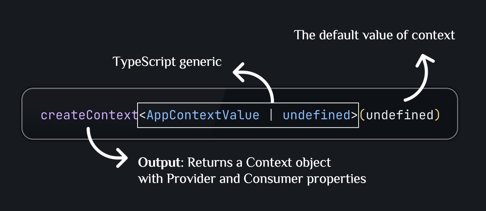
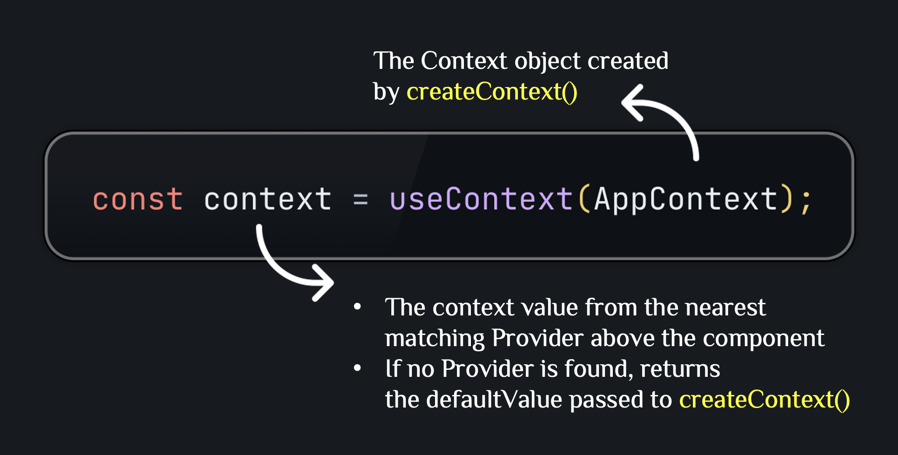
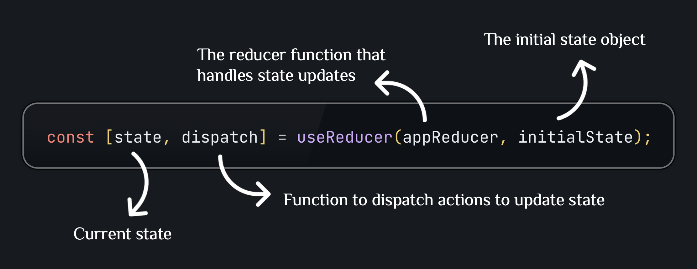
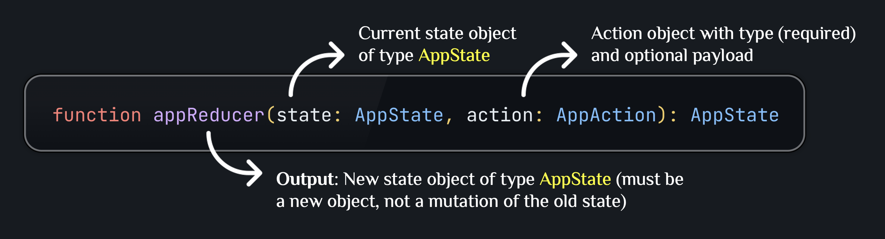
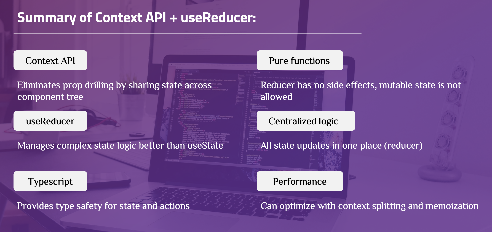

# CONTEXT API WITH useReducer

A demo application for managing UI preferences using **Context API** combined with **useReducer** in React + TypeScript.

## Core Terminology

**createContext**:

- Function that creates a Context object for sharing state between components.
- Avoids prop drilling by providing a way to pass data through the component tree.



**Provider**:

- Component that provides values to a Context.
- Wraps child components that need access to the Context.
- Receives a `value` prop containing the data to share.

**useContext**:

- Hook that consumes values from a Context.
- Returns the value provided by the nearest Provider.



**useReducer**:

- Hook for managing complex state, alternative to `useState`.
- Takes a reducer function and initial state.
- Returns current state and dispatch function.



**reducer**:

- Pure function that takes `(state, action)` and returns new state.
- Handles state updates based on action type.
- Must be immutable (no mutations).



**action**:

- Object describing "what happened".
- Has `type` (required) and optional `payload`.
- Dispatched to trigger state updates.

---

## Basic: Implement Dashboard Preferences Feature

This section guides you through implementing a simple feature with Context API and useReducer, managing UI preferences synchronously.

### Step 1: Define State Structure

**File: `src/context/appTypes.ts`**: Define the state structure and action types.

```typescript
// State structure
export interface AppState {
  theme: Theme;
  primaryColor: string;
  fontSize: FontSize;
  sidebarCollapsed: boolean;
  headerVisible: boolean;
  language: Language;
  animationsEnabled: boolean;
}

// Action types (enum or string literals)
export enum AppActionType {
  SET_THEME = 'SET_THEME',
  SET_PRIMARY_COLOR = 'SET_PRIMARY_COLOR',
  SET_FONT_SIZE = 'SET_FONT_SIZE',
  TOGGLE_SIDEBAR = 'TOGGLE_SIDEBAR',
  // ... other action types
}

// Action payloads
export interface SetThemeAction {
  type: AppActionType.SET_THEME;
  payload: Theme;
}

// Union type for all actions
export type AppAction = SetThemeAction | SetPrimaryColorAction | ...;
```

**Explanation**:

- Enum or string literals define action types
- Union type combines all possible actions
- **Benefit**: Prevents type errors and provides better IDE autocomplete

### Step 2: Create Reducer Function

**File: `src/context/appReducer.ts`**: Create reducer function to handle state updates.

**Example**:

```typescript
export function appReducer(state: AppState, action: AppAction): AppState {
  switch (action.type) {
    case AppActionType.SET_THEME:
      return { ...state, theme: action.payload };

    case AppActionType.TOGGLE_SIDEBAR:
      return { ...state, sidebarCollapsed: !state.sidebarCollapsed };

    default:
      return state;
  }
}
```

**Explanation**:

- `appReducer` is a pure function: receives current `state` and `action`, returns new state
- When `action.type` is `SET_THEME`, it returns a new state object with updated `theme` property using spread operator `{ ...state, theme: action.payload }`
- When `action.type` is `TOGGLE_SIDEBAR`, it returns a new state object with toggled `sidebarCollapsed` property
- The function never mutates the old state, always returns a new object

### Step 3: Create Context and Provider

#### 3.1. Create Context with `createContext`

**File: `src/context/AppContext.tsx`**

**Example**:

```typescript
// 1. Define Context Value type
export interface AppContextValue {
  state: AppState;
  dispatch: React.Dispatch<AppAction>;
}

// 2. Create Context
export const AppContext = createContext<AppContextValue | undefined>(undefined);
```

**Explanation**:

- `createContext<AppContextValue | undefined>(undefined)` creates a Context object for sharing state between components
- The generic type `<AppContextValue | undefined>` ensures type safety - TypeScript knows the context value can be `AppContextValue` or `undefined`
- `undefined` is passed as the default value, which will be returned by `useContext` if no Provider exists above a component
- The Context object (`AppContext`) has `Provider` property that will be used to provide the context value

#### 3.2. Create Provider with `useReducer`

**File: `src/context/AppContext.tsx`**

**Example**:

```typescript
// 3. Create Provider component
export function AppProvider({ children }: AppProviderProps) {
  const [state, dispatch] = useReducer(appReducer, initialState);

  const value: AppContextValue = {
    state,
    dispatch,
  };

  return <AppContext.Provider value={value}>{children}</AppContext.Provider>;
}
```

**Explanation**:

- `useReducer(appReducer, initialState)` manages state with the reducer function. It returns `[state, dispatch]` where `state` is the current state and `dispatch` is a function to update state by dispatching actions
- The `value` object contains both `state` and `dispatch`, which will be provided to all child components via the Context
- `<AppContext.Provider value={value}>` wraps child components and makes the context value accessible to all descendants through `useContext`

### Step 4: Create Custom Hook

**File: `src/hooks/useAppContext.ts`**

**Example**:

```typescript
export function useAppContext(): AppContextValue {
  const context = useContext(AppContext);

  if (context === undefined) {
    throw new Error("useAppContext must be used within AppProvider");
  }

  return context;
}
```

**Explanation**:

- `useContext(AppContext)` reads the context value from the nearest `AppContext.Provider` above this component
- If no Provider exists, it returns `undefined` (the default value from `createContext`)
- The custom hook checks if `context` is `undefined` and throws a helpful error message. This ensures components can only use the hook when wrapped by a Provider
- **Benefit**: Type-safe access, clearer error messages, cleaner component code

### Step 5: Setup Provider in App

**File: `src/App.tsx`**

```typescript
import { AppProvider } from "./context/AppContext";

function App() {
  return (
    <AppProvider>
      <div className="app-container">
        <Header />
        <Sidebar />
        <SettingsPanel />
        <Preview />
      </div>
    </AppProvider>
  );
}
```

**Explanation**: Provider must wrap all components that need access to Context, typically at root level

### Step 6: Use in Component

**File: `src/components/Header.tsx`**

```typescript
import { useAppContext } from "../hooks/useAppContext";
import { AppActionType } from "../context/appTypes";

export function Header() {
  // 1. Get state and dispatch from Context
  const { state, dispatch } = useAppContext();

  // 2. Read state for rendering
  const isVisible = state.headerVisible;
  const theme = state.theme;

  // 3. Dispatch actions to update state
  const handleToggle = () => {
    dispatch({ type: AppActionType.TOGGLE_HEADER });
  };

  const handleThemeChange = (newTheme: Theme) => {
    dispatch({ type: AppActionType.SET_THEME, payload: newTheme });
  };

  return (
    <header>
      <h1>Dashboard</h1>
      <button onClick={handleToggle}>Toggle Header</button>
      <button onClick={() => handleThemeChange("dark")}>Dark Mode</button>
    </header>
  );
}
```

**Explanation**:

- `useAppContext()` returns `{ state, dispatch }` from Context. The component automatically subscribes to context changes and re-renders when the context value changes
- `dispatch({ type: AppActionType.TOGGLE_HEADER })` sends an action without payload to the reducer. The reducer handles this action and returns a new state
- `dispatch({ type: AppActionType.SET_THEME, payload: newTheme })` sends an action with payload. The reducer uses `action.payload` to update the theme in the state

---

## Advanced: Performance Optimization and Multiple Contexts

This section covers advanced patterns for optimizing performance and managing multiple contexts.

### Example 1: Split Contexts for Performance

**Problem**: When Context value changes, all consumers re-render, even if they only use part of the state.

**Solution**: Split into multiple contexts:

**Example**:

```typescript
// Theme context (changes less frequently)
export const ThemeContext = createContext<ThemeContextValue | undefined>(
  undefined
);

// UI state context (changes more frequently)
export const UIStateContext = createContext<UIStateContextValue | undefined>(
  undefined
);

// Usage: Components only subscribe to contexts they need
function Header() {
  const { theme } = useContext(ThemeContext); // Only re-renders when theme changes
  // Doesn't re-render when sidebar state changes
}
```

**Explanation**:

- `createContext<ThemeContextValue | undefined>(undefined)` creates separate Context objects for different domains. Each context has its own Provider and consumers
- `useContext(ThemeContext)` reads only from `ThemeContext`, so the component only subscribes to theme-related state changes, not UI state changes
- By splitting contexts by update frequency, components only re-render when the specific context they use changes
- **Benefit**: Reduces unnecessary re-renders, improves performance

### Example 2: Memoize Context Value

**Problem**: Creating new object in Provider causes all consumers to re-render.

**Solution**: Memoize the context value:

**Example**:

```typescript
export function AppProvider({ children }: AppProviderProps) {
  const [state, dispatch] = useReducer(appReducer, initialState);

  // Memoize context value
  const value = useMemo(() => ({ state, dispatch }), [state, dispatch]);

  return <AppContext.Provider value={value}>{children}</AppContext.Provider>;
}
```

**Explanation**:

- `useMemo(() => ({ state, dispatch }), [state, dispatch])` memoizes the context value object
- The factory function `() => ({ state, dispatch })` creates a new object, but it only runs when `state` or `dispatch` changes
- `dispatch` from `useReducer` is stable (doesn't change between renders), so the value only changes when `state` changes
- Without `useMemo`, a new object would be created on every render, causing all consumers to re-render
- **Benefit**: Prevents unnecessary re-renders of consumer components

### Example 3: Create Selector Hooks

**Problem**: Components re-render when any part of state changes, even unused parts.

**Solution**: Create selector hooks that only subscribe to specific state slices:

```typescript
// Selector hook for theme
export function useTheme() {
  const { state } = useAppContext();
  return state.theme;
}

// Selector hook for sidebar state
export function useSidebarState() {
  const { state, dispatch } = useAppContext();
  return {
    collapsed: state.sidebarCollapsed,
    toggle: () => dispatch({ type: AppActionType.TOGGLE_SIDEBAR }),
  };
}

// Usage in component
function Header() {
  const theme = useTheme(); // Only re-renders when theme changes
  // Doesn't re-render when other state changes
}
```

**Explanation**:

- Selector hooks extract specific parts of state
- Components only re-render when selected state changes
- **Benefit**: Granular control over re-renders, better performance

### Example 4: Combine Multiple Contexts

**Example**: Managing both theme and user preferences:

```typescript
// Theme context
export const ThemeProvider = ({ children }) => {
  const [theme, setTheme] = useState("light");
  return (
    <ThemeContext.Provider value={{ theme, setTheme }}>
      {children}
    </ThemeContext.Provider>
  );
};

// User preferences context
export const PreferencesProvider = ({ children }) => {
  const [preferences, dispatch] = useReducer(preferencesReducer, initialState);
  return (
    <PreferencesContext.Provider value={{ preferences, dispatch }}>
      {children}
    </PreferencesContext.Provider>
  );
};

// Wrap app with multiple providers
function App() {
  return (
    <ThemeProvider>
      <PreferencesProvider>
        <Dashboard />
      </PreferencesProvider>
    </ThemeProvider>
  );
}
```

**Explanation**:

- Multiple contexts can be nested
- Each context manages its own domain
- **Benefit**: Separation of concerns, easier to maintain and test

---

## Summary



---

## Learn More

After mastering the basic and advanced concepts above, you can continue learning the following topics:

### 1. State Management Patterns

**Common Patterns**:

- **Single Context**: One context for entire app state
- **Multiple Contexts**: Split by domain (theme, user, UI state)
- **Context + useReducer**: For complex state logic
- **Context + useState**: For simple state

**Best Practices**:

- Keep contexts focused on specific domains
- Use custom hooks to abstract context usage
- Memoize context values to prevent unnecessary re-renders
- Split contexts when performance becomes an issue

### 2. Testing Context and Reducers

**Testing** includes:

- **Unit test** for reducers: Test state handling logic
- **Unit test** for context: Test Provider and value

**Supporting Tools**:

- `@testing-library/react`: Test React components
- Mock Provider for testing components in isolation
- Test reducer functions independently

**Documentation**: [Testing React Components](https://react.dev/learn/testing)

### 3. Performance Optimization Techniques

**Performance optimization** strategies:

- Split contexts by update frequency
- Memoize context values with `useMemo`
- Create selector hooks for granular subscriptions
- Use `React.memo` for components that consume context
- Avoid creating new objects in Provider on every render

**Documentation**: [React Performance](https://react.dev/learn/render-and-commit)

### 4. TypeScript Best Practices

**TypeScript** with Context API:

- Define proper types for Context value
- Use union types for actions
- Create typed custom hooks
- Use `ReturnType` to infer types from state

**Documentation**: [TypeScript Handbook](https://www.typescriptlang.org/docs/)

### 5. Error Handling in Context

**Error handling** strategies:

- Throw errors in custom hooks if context is undefined
- Provide default values for optional contexts
- Handle errors in reducer for invalid actions
- Use error boundaries for context-related errors

### 6. Persisting State with Context

**Persistence** techniques:

- Save state to localStorage in reducer
- Load state from localStorage on initialization
- Sync state changes to external storage
- Handle persistence errors gracefully

**Example**:

```typescript
// Load initial state from localStorage
const loadState = (): AppState => {
  const saved = localStorage.getItem("appState");
  return saved ? JSON.parse(saved) : initialState;
};

// Save state to localStorage
const saveState = (state: AppState) => {
  localStorage.setItem("appState", JSON.stringify(state));
};

// Use in reducer or effect
useEffect(() => {
  saveState(state);
}, [state]);
```

---

**References**:

- [React Context API](https://react.dev/reference/react/createContext)
- [useReducer Hook](https://react.dev/reference/react/useReducer)
- [TypeScript Handbook](https://www.typescriptlang.org/docs/)
- [React State Management Guide](https://react.dev/learn/managing-state)
