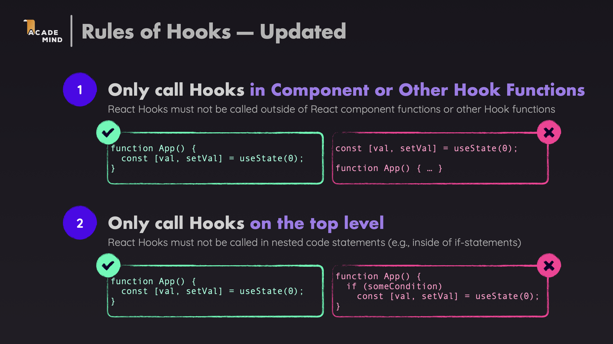
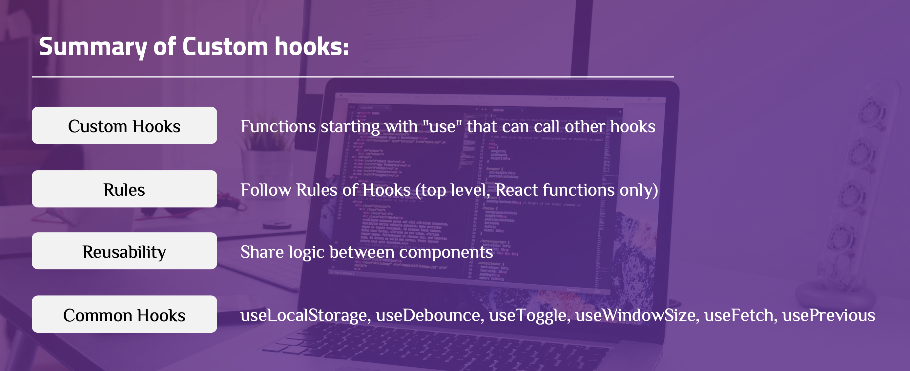

# Custom Hooks with TypeScript

A comprehensive demo application demonstrating how to create and use **Custom Hooks** in React with **TypeScript** to extract and reuse stateful logic across components.

---

## Core Terminology

### Custom Hooks

**Custom Hooks** are JavaScript functions that start with `use` and may call other React Hooks. They allow you to extract component logic into reusable functions.

**Rules of Hooks**:



### Benefits of Custom Hooks

1. **Code Reusability**: Share logic between multiple components
2. **Separation of Concerns**: Extract complex logic from components
3. **Testability**: Test hooks independently from components
4. **Readability**: Components become cleaner and easier to understand
5. **Maintainability**: Update logic in one place

---

## Common Custom Hooks

### Example 1: useLocalStorage Hook

**When to use**: When you need to persist state in localStorage and sync it with React state.

**File: `src/hooks/useLocalStorage.ts`**

```typescript
import { useState, useEffect } from "react";

function useLocalStorage<T>(
  key: string,
  initialValue: T
): [T, (value: T | ((val: T) => T)) => void] {
  // Initialize state from localStorage or use initialValue
  const [storedValue, setStoredValue] = useState<T>(() => {
    try {
      const item = window.localStorage.getItem(key);
      return item ? JSON.parse(item) : initialValue;
    } catch (error) {
      console.error(`Error reading localStorage key "${key}":`, error);
      return initialValue;
    }
  });

  // Wrapper function that persists to localStorage
  const setValue = (value: T | ((val: T) => T)) => {
    try {
      const valueToStore =
        value instanceof Function ? value(storedValue) : value;
      setStoredValue(valueToStore);
      window.localStorage.setItem(key, JSON.stringify(valueToStore));
    } catch (error) {
      console.error(`Error setting localStorage key "${key}":`, error);
    }
  };

  return [storedValue, setValue];
}
```

**Explanation**:

- Generic type `<T>` allows the hook to work with any type
- `useState` with function initializer reads from localStorage on first render
- `setValue` function handles both direct values and updater functions (like `useState`)
- Automatically saves to localStorage whenever value changes
- Returns tuple `[value, setValue]` matching `useState` API

**Usage**:

```typescript
const [name, setName] = useLocalStorage<string>("user-name", "");
const [count, setCount] = useLocalStorage<number>("count", 0);

// Use like useState
setName("John");
setCount((c) => c + 1);
```

### Example 2: useDebounce Hook

**When to use**: When you want to delay updating a value until after a specified delay (e.g., search inputs, API calls).

**File: `src/hooks/useDebounce.ts`**

```typescript
import { useState, useEffect } from "react";

function useDebounce<T>(value: T, delay: number): T {
  const [debouncedValue, setDebouncedValue] = useState<T>(value);

  useEffect(() => {
    const handler = setTimeout(() => {
      setDebouncedValue(value);
    }, delay);

    return () => {
      clearTimeout(handler);
    };
  }, [value, delay]);

  return debouncedValue;
}
```

**Explanation**:

- Takes a `value` and `delay` in milliseconds
- Creates a timeout that updates `debouncedValue` after the delay
- Cleans up timeout if `value` changes before delay completes
- Returns the debounced value

**Usage**:

```typescript
const [searchTerm, setSearchTerm] = useState("");
const debouncedSearchTerm = useDebounce(searchTerm, 500);

// searchTerm updates immediately
// debouncedSearchTerm updates 500ms after user stops typing
useEffect(() => {
  if (debouncedSearchTerm) {
    // Make API call with debouncedSearchTerm
  }
}, [debouncedSearchTerm]);
```

### Example 3: useToggle Hook

**When to use**: When you need to toggle a boolean value (modals, dropdowns, switches).

**File: `src/hooks/useToggle.ts`**

```typescript
import { useState, useCallback } from "react";

function useToggle(
  initialValue: boolean = false
): [boolean, () => void, (value: boolean) => void] {
  const [value, setValue] = useState<boolean>(initialValue);

  const toggle = useCallback(() => {
    setValue((prev) => !prev);
  }, []);

  return [value, toggle, setValue];
}
```

**Explanation**:

- Returns current value, toggle function, and setter function
- `toggle` function flips the boolean value
- `useCallback` memoizes toggle function to prevent unnecessary re-renders
- Can also set value directly using the setter

**Usage**:

```typescript
const [isOpen, toggle, setIsOpen] = useToggle(false);

// Toggle the value
toggle();

// Set specific value
setIsOpen(true);
```

### Example 4: useWindowSize Hook

**When to use**: When you need to track window dimensions for responsive design.

**File: `src/hooks/useWindowSize.ts`**

```typescript
import { useState, useEffect } from "react";

interface WindowSize {
  width: number;
  height: number;
}

function useWindowSize(): WindowSize {
  const [windowSize, setWindowSize] = useState<WindowSize>({
    width: window.innerWidth,
    height: window.innerHeight,
  });

  useEffect(() => {
    function handleResize() {
      setWindowSize({
        width: window.innerWidth,
        height: window.innerHeight,
      });
    }

    window.addEventListener("resize", handleResize);
    handleResize(); // Call immediately to set initial size

    return () => window.removeEventListener("resize", handleResize);
  }, []);

  return windowSize;
}
```

**Explanation**:

- Initializes state with current window dimensions
- Adds resize event listener on mount
- Updates state when window is resized
- Removes event listener on cleanup
- Returns object with `width` and `height`

**Usage**:

```typescript
const { width, height } = useWindowSize();

// Conditional rendering based on window size
{
  width < 768 && <MobileView />;
}
{
  width >= 768 && <DesktopView />;
}
```

### Example 5: useFetch Hook

**When to use**: When you need to fetch data from APIs with loading and error states.

**File: `src/hooks/useFetch.ts`**

```typescript
import { useState, useEffect } from "react";

interface UseFetchState<T> {
  data: T | null;
  loading: boolean;
  error: Error | null;
}

function useFetch<T = unknown>(
  url: string,
  options?: { skip?: boolean }
): UseFetchState<T> & { refetch: () => void } {
  const [state, setState] = useState<UseFetchState<T>>({
    data: null,
    loading: !options?.skip,
    error: null,
  });

  const fetchData = async () => {
    setState((prev) => ({ ...prev, loading: true, error: null }));

    try {
      const response = await fetch(url);
      if (!response.ok) {
        throw new Error(`HTTP error! status: ${response.status}`);
      }
      const data = await response.json();
      setState({ data, loading: false, error: null });
    } catch (error) {
      setState({
        data: null,
        loading: false,
        error:
          error instanceof Error
            ? error
            : new Error("An unknown error occurred"),
      });
    }
  };

  useEffect(() => {
    if (!options?.skip) {
      fetchData();
    }
  }, [url, options?.skip]);

  return { ...state, refetch: fetchData };
}
```

**Explanation**:

- Manages `data`, `loading`, and `error` states
- Fetches data when URL changes or component mounts
- Handles errors gracefully
- Returns `refetch` function to manually trigger fetch
- Supports `skip` option to prevent automatic fetching

**Usage**:

```typescript
const { data, loading, error, refetch } = useFetch<User>(
  "https://api.example.com/users/1"
);

if (loading) return <Spinner />;
if (error) return <Error message={error.message} />;
return <div>{data.name}</div>;
```

### Example 6: usePrevious Hook

**When to use**: When you need to track the previous value of a state or prop.

**File: `src/hooks/usePrevious.ts`**

```typescript
import { useRef, useEffect } from "react";

function usePrevious<T>(value: T): T | undefined {
  const ref = useRef<T>();

  useEffect(() => {
    ref.current = value;
  }, [value]);

  return ref.current;
}
```

**Explanation**:

- Uses `useRef` to store previous value without causing re-renders
- Updates ref in `useEffect` after render completes
- Returns previous value (undefined on first render)
- Useful for comparing current and previous values

**Usage**:

```typescript
const [count, setCount] = useState(0);
const previousCount = usePrevious(count);

// Detect change
if (previousCount !== undefined && count > previousCount) {
  console.log("Count increased!");
}
```

---

## Summary

Custom Hooks enable code reuse and logic extraction in React:



---

## Learn More

After mastering the basic and advanced concepts above, you can continue learning the following topics:

### 1. Testing Custom Hooks

**Testing Strategies**:

- Use `@testing-library/react-hooks` (now part of `@testing-library/react`)
- Test hook behavior independently
- Test with different inputs and scenarios

**Example**:

```typescript
import { renderHook, act } from "@testing-library/react";
import useToggle from "./useToggle";

test("toggles value", () => {
  const { result } = renderHook(() => useToggle(false));

  expect(result.current[0]).toBe(false);

  act(() => {
    result.current[1](); // toggle
  });

  expect(result.current[0]).toBe(true);
});
```

**Documentation**: [Testing React Hooks](https://react.dev/reference/react/testing)

### 2. Performance Optimization

**Optimization Techniques**:

- Use `useMemo` and `useCallback` in hooks
- Memoize expensive calculations
- Debounce/throttle expensive operations
- Avoid unnecessary re-renders

**Example**:

```typescript
function useExpensiveCalculation(data: Data[]) {
  const result = useMemo(() => {
    return expensiveCalculation(data);
  }, [data]);

  return result;
}
```

### 3. Error Handling in Hooks

**Error Handling Patterns**:

- Try-catch blocks in async operations
- Error state management
- Error boundaries for hook errors
- Graceful degradation

**Example**:

```typescript
function useSafeLocalStorage<T>(key: string, initialValue: T) {
  const [value, setValue] = useState<T>(initialValue);
  const [error, setError] = useState<Error | null>(null);

  useEffect(() => {
    try {
      const item = localStorage.getItem(key);
      if (item) setValue(JSON.parse(item));
    } catch (err) {
      setError(err instanceof Error ? err : new Error("Unknown error"));
    }
  }, [key]);

  return [value, setValue, error] as const;
}
```

### 4. Custom Hooks Libraries

**Popular Libraries**:

- **react-use**: Collection of essential React hooks
- **ahooks**: High-quality React hooks library
- **usehooks-ts**: TypeScript-first React hooks library
- **swr**: Data fetching hook with caching

**Example with react-use**:

```typescript
import { useLocalStorage, useDebounce } from "react-use";

const [value, setValue] = useLocalStorage("key", "default");
const debouncedValue = useDebounce(value, 500);
```

**Documentation**: [react-use](https://github.com/streamich/react-use) | [ahooks](https://ahooks.js.org/)

### 5. Hook Lifecycle Management

**Lifecycle Patterns**:

- Cleanup in useEffect
- Canceling requests
- Managing subscriptions
- Memory leak prevention

**Example**:

```typescript
function useSubscription<T>(
  subscribe: (callback: (data: T) => void) => () => void
) {
  const [data, setData] = useState<T | null>(null);

  useEffect(() => {
    const unsubscribe = subscribe((newData) => {
      setData(newData);
    });

    return unsubscribe; // Cleanup subscription
  }, [subscribe]);

  return data;
}
```

---

## References

- [React Custom Hooks Documentation](https://react.dev/learn/reusing-logic-with-custom-hooks)
- [Rules of Hooks](https://react.dev/reference/rules/rules-of-hooks)
- [TypeScript Handbook](https://www.typescriptlang.org/docs/)
- [React Hooks API Reference](https://react.dev/reference/react)
- [Testing React Hooks](https://react.dev/reference/react/testing)
