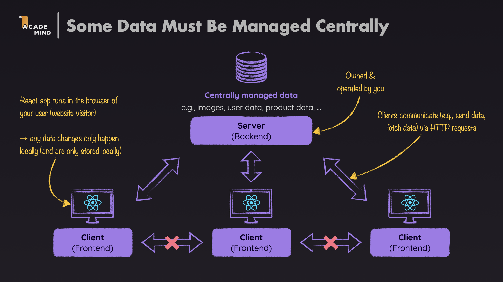
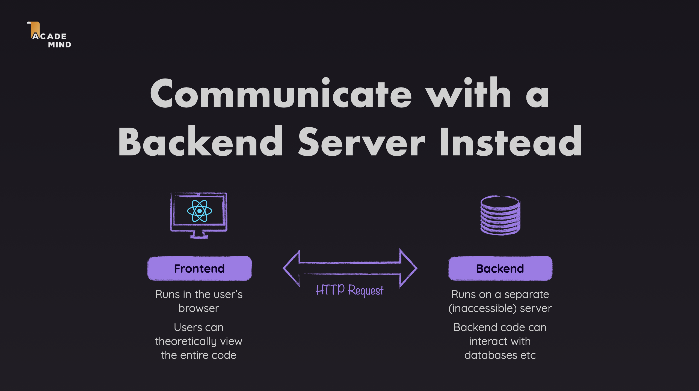
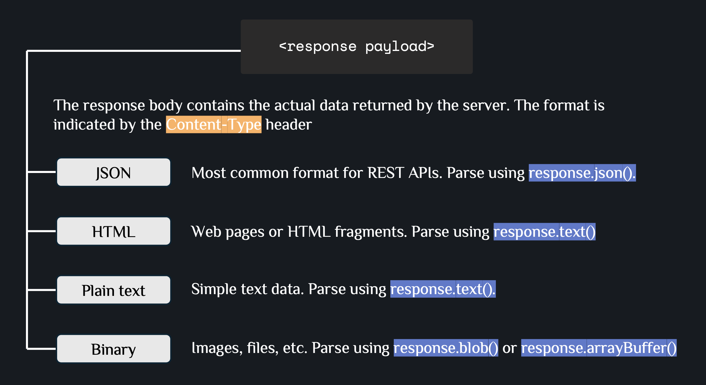
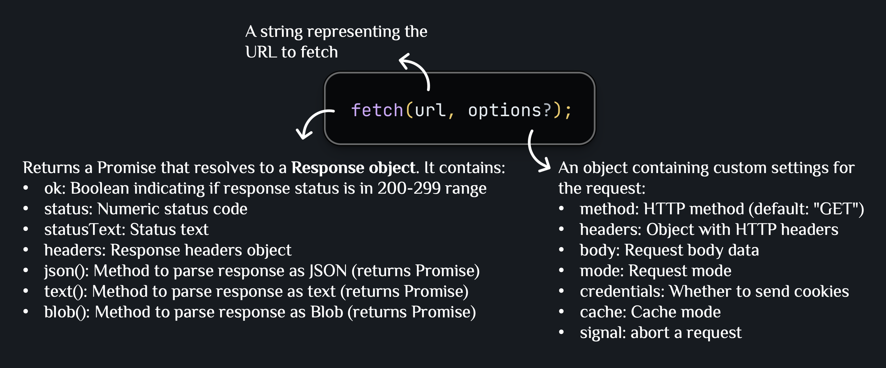

# FETCHING DATA WITH API

A demo application demonstrating how to fetch data from a backend API, handle loading and error states, and create custom hooks for data fetching in React.

## Core Terminology



### Backend

- The server-side part of an application that handles business logic, database operations, and API endpoints.
- Runs on a server (not in the browser) and processes requests from clients.
- Responsibilities include storing and retrieving data from databases, processing business logic, handling authentication and authorization, and serving API endpoints for frontend applications.

### Frontend

- The client-side part of an application that users interact with directly in their browsers.
- Built with React and runs in the browser.
- Responsibilities include displaying UI to users, handling user interactions, making HTTP requests to backend APIs, and managing client-side state.

### How Backend and Frontend Communicate



- **HTTP Protocol**: Hypertext Transfer Protocol is the standard protocol for communication between frontend and backend. It defines how messages are formatted and transmitted. HTTP is stateless (each request is independent).
- **Request-Response Cycle**: Client sends request → Server processes → Server sends response → Client receives response.
- **API Endpoints**: Backend exposes specific URLs (endpoints) that frontend can call to perform operations (GET, POST, PUT, PATCH, DELETE, etc.).
- **JSON Format**: Data is typically exchanged in JSON (JavaScript Object Notation) format, which is easy to parse in JavaScript.

### HTTP message

Both requests and responses share a similar structure:


- **Start line** is a single line that describes the HTTP version along with request method or the outcome of the request.
- An optional set of HTTP headers containing metadata that describes the message. For example, a request for a resource might include the allowed formats of that resource, while the response might include headers to indicate the actual format returned.
- An empty line indicating the metadata of the message is complete.
- An optional body containing data associated with the message. This might be POST data to send to the server in a request, or some resource returned to the client in a response. Whether a message contains a body or not is determined by the start-line and HTTP headers.

The start-line and headers of the HTTP message are collectively known as the `head` of the requests, and the part afterwards that contains its content is known as the `body`.

### HTTP requests


The start line of an HTTP request contains three parts: the **HTTP method**, the **request target** (usually a URL path), and the **HTTP version**. Example: `GET /user-places HTTP/1.1` means: use GET method to retrieve the resource at `/user-places` using HTTP version 1.1.

**Request Headers**:


Headers provide metadata about the request and the client making it. Common headers include `Content-Type`, `Authorization`, `Accept`, `User-Agent`, `Accept-Language`.

> **Note**: Headers can be categorized into different types (request headers, representation headers, etc.), but for most web development tasks, knowing the common headers and how to use them is sufficient.

**Example with headers**:

```javascript
fetch("http://localhost:3000/user-places", {
  method: "PUT",
  body: JSON.stringify({ places: places }),
  headers: {
    "Content-Type": "application/json",
    Authorization: "Bearer token123",
  },
});
```

**Request Body**:


**Example with JSON body**:

```javascript
// Sending JSON data
fetch("http://localhost:3000/user-places", {
  method: "PUT",
  body: JSON.stringify({ places: places }),
  headers: {
    "Content-Type": "application/json",
  },
});
```

**Example with FormData**:

```javascript
// Sending form data
const formData = new FormData();
formData.append("name", "Place Name");
formData.append("image", fileInput.files[0]);

fetch("http://localhost:3000/places", {
  method: "POST",
  body: formData,
  // Don't set Content-Type header - browser sets it automatically with boundary
});
```

### HTTP responses


The status line of an HTTP response contains three parts: the **HTTP version**, the **status code**, and the **reason phrase**. Example: `HTTP/1.1 200 OK` means: HTTP version 1.1, status code 200 (success), with reason phrase "OK".

**Response Headers**:

Response headers provide metadata about the response and the server. Common headers include:


**Response Body**:



**Example handling response**:

```javascript
const response = await fetch("http://localhost:3000/user-places");
const data = await response.json(); // Parse JSON response body

if (!response.ok) {
  throw new Error("Failed to fetch data");
}

// Use the data
console.log(data.places);
```

**Example checking status code**:

```javascript
const response = await fetch("http://localhost:3000/user-places");

if (response.status === 200) {
  const data = await response.json();
  // Handle success
} else if (response.status === 404) {
  // Handle not found
} else if (response.status >= 500) {
  // Handle server error
}
```

## Basic: Fetching Data and Handling States

This section guides you through the basic patterns for fetching data from APIs and handling different states (loading, success, error).

### fetch() Syntax

The `fetch()` function is a browser API for making HTTP requests. It returns a Promise that resolves to a Response object.



### Example 1: Basic API Call with fetch

**When to use**: When you need to fetch data from a backend API endpoint.

**File: `src/http.js`**

```javascript
export async function fetchSelectedPlace() {
  const response = await fetch("http://localhost:3000/user-places");
  const resData = await response.json();

  if (!response.ok) {
    throw new Error("Failed to fetch selected place!");
  }

  return resData.places;
}
```

**Explanation**:

- `fetch("http://localhost:3000/user-places")` sends a GET request to the backend endpoint
- `await response.json()` parses the response body as JSON
- `response.ok` checks if the status code is in the 200-299 range (success)
- If `response.ok` is `false`, throw an error to be caught by error handling
- Return the data (`resData.places`) if the request succeeds

### Example 2: POST/PUT Request with Body

**When to use**: When you need to send data to the backend to create or update resources.

**File: `src/http.js`**

```javascript
export async function updateUserPlace(places) {
  const response = await fetch("http://localhost:3000/user-places", {
    method: "PUT",
    body: JSON.stringify({ places: places }),
    headers: {
      "Content-Type": "application/json",
    },
  });

  const resData = await response.json();
  if (!response.ok) {
    throw new Error("Failed to update user place!");
  }

  return resData.message;
}
```

**Explanation**:

- `method: "PUT"` specifies the HTTP method (PUT for updating)
- `body: JSON.stringify({ places: places })` converts JavaScript object to JSON string to send in the request body
- `headers: { "Content-Type": "application/json" }` tells the server that we're sending JSON data
- The server receives the JSON, processes it, and returns a response

### Example 3: Handling Loading State

**When to use**: When you need to show a loading indicator while fetching data.

**File: `src/components/Places.jsx`**

```javascript
export default function Places({
  title,
  places,
  fallbackText,
  onSelectPlace,
  isLoading,
  loadingText,
}) {
  return (
    <section className="places-category">
      <h2>{title}</h2>
      {isLoading && <p className="fallback-text">{loadingText}</p>}
      {!isLoading && places.length === 0 && (
        <p className="fallback-text">{fallbackText}</p>
      )}
      {!isLoading && places.length > 0 && (
        <ul className="places">
          {places.map((place) => (
            <li key={place.id} className="place-item">
              {/* Render place item */}
            </li>
          ))}
        </ul>
      )}
    </section>
  );
}
```

**Explanation**:

- `isLoading` prop indicates whether data is currently being fetched
- `{isLoading && <p>{loadingText}</p>}` conditionally renders loading message when `isLoading` is `true`
- `{!isLoading && places.length === 0 && ...}` shows fallback text when not loading and no data
- `{!isLoading && places.length > 0 && ...}` renders the actual data when loading is complete and data exists
- **Benefit**: Provides user feedback during data fetching, improves UX

### Example 4: Handling Error State

**When to use**: When you need to display error messages when API calls fail.

**File: `src/components/AvailablePlaces.jsx`**

```javascript
export default function AvailablePlaces({ onSelectPlace }) {
  const {
    isFetching,
    fetchedData: availablePlaces,
    error,
  } = useFetch(fetchSortedPlaces, []);

  if (error) {
    return <ErrorPage title="An error occured!" message={error.message} />;
  }

  return (
    <Places
      title="Available Places"
      places={availablePlaces}
      isLoading={isFetching}
      loadingText="Fetching place data..."
      fallbackText="No places available."
      onSelectPlace={onSelectPlace}
    />
  );
}
```

**Explanation**:

- `error` from `useFetch` contains error information if the API call fails
- `if (error) { return <ErrorPage ... /> }` early returns error UI if error exists
- `error.message` displays the error message to the user
- **Benefit**: Graceful error handling, prevents app crashes, informs users of issues

### Example 5: Custom Hook for Data Fetching

**When to use**: When you want to reuse data fetching logic across multiple components.

**File: `src/hooks/useFetch.js`**

```javascript
import { useEffect, useState } from "react";

export function useFetch(fetchFunction, initialValue) {
  const [isFetching, setIsFetching] = useState();
  const [error, setError] = useState();
  const [fetchedData, setFetchedData] = useState(initialValue);

  useEffect(() => {
    async function fetchingSelectedPlaces() {
      setIsFetching(true);
      try {
        const data = await fetchFunction();
        setFetchedData(data);
      } catch (error) {
        setError({
          message: error.message || "Failed to fetch data",
        });
      }
      setIsFetching(false);
    }

    fetchingSelectedPlaces();
  }, [fetchFunction]);

  return {
    isFetching,
    fetchedData,
    setFetchedData,
    error,
  };
}
```

**Explanation**:

- `useFetch` is a custom hook that encapsulates data fetching logic
- Takes `fetchFunction` (the API function to call) and `initialValue` (initial state for data)
- Manages three states: `isFetching` (loading), `error` (error state), `fetchedData` (the fetched data)
- `useEffect` runs the fetch function when component mounts or `fetchFunction` changes
- `setIsFetching(true)` before fetch, `setIsFetching(false)` after fetch completes
- `try-catch` block handles errors: if fetch fails, set error state instead of crashing
- Returns an object with all states and `setFetchedData` for updating data
- **Benefit**: Reusable logic, consistent error handling, cleaner component code

**Usage in Component**:

```javascript
const {
  isFetching,
  fetchedData: userPlaces,
  setFetchedData: setUserPlaces,
  error,
} = useFetch(fetchSelectedPlace, []);
```

**Explanation**:

- Call `useFetch` with the API function (`fetchSelectedPlace`) and initial value (`[]`)
- Destructure returned values with custom names (`fetchedData: userPlaces`)
- Use `isFetching` to show loading state, `error` to show errors, `userPlaces` to render data
- **Benefit**: Components don't need to manage fetching logic, cleaner and more maintainable

---

## Advanced: Advanced Data Fetching Patterns

This section covers more advanced patterns for handling data fetching, including optimistic updates and error recovery.

### Example 1: Optimistic Updates

**When to use**: When you want to update UI immediately before the API call completes, providing instant feedback to users.

**File: `src/App.jsx`**

```javascript
async function handleSelectPlace(selectedPlace) {
  // Optimistic update: update UI immediately
  setUserPlaces((prevPickedPlaces) => {
    if (!prevPickedPlaces) {
      prevPickedPlaces = [];
    }
    if (prevPickedPlaces.some((place) => place.id === selectedPlace.id)) {
      return prevPickedPlaces;
    }
    return [selectedPlace, ...prevPickedPlaces];
  });

  try {
    // Then sync with backend
    await updateUserPlace([selectedPlace, ...userPlaces]);
  } catch (error) {
    // Rollback on error
    setUserPlaces(userPlaces);
    setErrorUpdatingPlaces({
      message: error.message || "Failed to updating places",
    });
  }
}
```

**Explanation**:

- Update state (`setUserPlaces`) immediately before the API call - this is the "optimistic" update
- UI updates instantly, providing better user experience
- Then call `updateUserPlace` to sync with backend
- If API call fails (`catch` block), rollback the state to previous value (`setUserPlaces(userPlaces)`)
- Show error message to inform user that update failed
- **Benefit**: Instant UI feedback, better perceived performance

### Example 2: Conditional Data Fetching

**When to use**: When you need to fetch data only under certain conditions or with parameters.

**File: `src/components/AvailablePlaces.jsx`**

```javascript
async function fetchSortedPlaces() {
  const places = await fetchAvailable();

  return new Promise((resolve) => {
    navigator.geolocation.getCurrentPosition((position) => {
      const sortedPlaces = sortPlacesByDistance(
        places,
        position.coords.latitude,
        position.coords.longitude
      );
      resolve(sortedPlaces);
    });
  });
}

export default function AvailablePlaces({ onSelectPlace }) {
  const {
    isFetching,
    fetchedData: availablePlaces,
    error,
  } = useFetch(fetchSortedPlaces, []);
  // ...
}
```

**Explanation**:

- `fetchSortedPlaces` first fetches places from API (`fetchAvailable()`)
- Then uses browser geolocation API to get user's location
- Sorts places by distance from user's location
- Returns sorted places as a Promise
- `useFetch` handles the async operation and states
- **Benefit**: Combines multiple async operations, handles complex data processing

### Example 4: Updating Data After Fetch

**When to use**: When you need to update fetched data locally and sync with backend.

**File: `src/App.jsx`**

```javascript
const handleRemovePlace = useCallback(
  async function handleRemovePlace() {
    // Update local state
    setUserPlaces((prevPickedPlaces) =>
      prevPickedPlaces.filter((place) => place.id !== selectedPlace.current.id)
    );

    try {
      // Sync with backend
      await updateUserPlace(
        userPlaces.filter((place) => place.id !== selectedPlace.current.id)
      );
    } catch (error) {
      // Rollback on error
      setUserPlaces(userPlaces);
      setErrorUpdatingPlaces({
        message: error.message || "Failed to delete place",
      });
    }
    setModalIsOpen(false);
  },
  [userPlaces, setUserPlaces]
);
```

**Explanation**:

- `setUserPlaces` updates local state immediately (optimistic update)
- Filter out the removed place from the array
- Call `updateUserPlace` to sync changes with backend
- If backend update fails, rollback to previous state
- `useCallback` memoizes the function to prevent unnecessary re-renders
- **Benefit**: Consistent state management, error recovery, performance optimization

---

## Summary of Data Fetching Patterns

1. **HTTP Protocol**: Standard protocol for frontend-backend communication
2. **fetch API**: Browser API for making HTTP requests
3. **Loading States**: Show loading indicators during data fetching
4. **Error Handling**: Catch and display errors gracefully
5. **Custom Hooks**: Reusable logic for data fetching (`useFetch`)
6. **Optimistic Updates**: Update UI immediately, sync with backend later
7. **Error Recovery**: Allow users to dismiss errors and retry
8. **Centralized API Functions**: Keep API calls in separate files (`http.js`)

---

## Learn More

After mastering the basic and advanced concepts above, you can continue learning the following topics:

### 1. Request Headers and Authentication

**Common Headers**:

- **Content-Type**: Type of data being sent (`application/json`, `text/html`)
- **Authorization**: Authentication token (Bearer token, API key)
- **Accept**: What response format client accepts

**Example with Authentication**:

```javascript
const response = await fetch("http://localhost:3000/protected", {
  headers: {
    "Content-Type": "application/json",
    Authorization: `Bearer ${token}`,
  },
});
```

**Documentation**: [MDN HTTP Headers](https://developer.mozilla.org/en-US/docs/Web/HTTP/Headers)

### 2. Error Handling Strategies

**Error Handling Patterns**:

- **Try-Catch**: Catch errors in async functions
- **Error Boundaries**: React components that catch errors in child components
- **Retry Logic**: Automatically retry failed requests
- **Error Logging**: Log errors to monitoring service

**Example with Retry Logic**:

```javascript
async function fetchWithRetry(url, retries = 3) {
  for (let i = 0; i < retries; i++) {
    try {
      const response = await fetch(url);
      if (response.ok) return await response.json();
    } catch (error) {
      if (i === retries - 1) throw error;
      await new Promise((resolve) => setTimeout(resolve, 1000 * (i + 1)));
    }
  }
}
```

### 3. Data Fetching Libraries

**Popular Libraries**:

- **Axios**: Promise-based HTTP client with interceptors
- **SWR**: Data fetching with caching and revalidation
- **React Query (TanStack Query)**: Powerful data synchronization library
- **Apollo Client**: GraphQL client

**Example with Axios**:

```javascript
import axios from "axios";

const response = await axios.get("http://localhost:3000/places");
const data = response.data;
```

**Documentation**: [Axios](https://axios-http.com/) | [SWR](https://swr.vercel.app/) | [React Query](https://tanstack.com/query/latest)

### 4. Caching and Revalidation

**Caching Strategies**:

- **Browser Cache**: HTTP cache headers
- **Memory Cache**: Store data in component state or context
- **SWR/React Query**: Automatic caching and revalidation
- **localStorage**: Persist data in browser storage

**Example with localStorage Cache**:

```javascript
async function fetchWithCache(url) {
  const cached = localStorage.getItem(url);
  if (cached) {
    const { data, timestamp } = JSON.parse(cached);
    if (Date.now() - timestamp < 5 * 60 * 1000) {
      return data; // Return cached data if less than 5 minutes old
    }
  }

  const response = await fetch(url);
  const data = await response.json();
  localStorage.setItem(url, JSON.stringify({ data, timestamp: Date.now() }));
  return data;
}
```

### 5. Request Cancellation

**Canceling Requests**:

- **AbortController**: Cancel fetch requests
- **Cleanup in useEffect**: Cancel requests when component unmounts

**Example**:

```javascript
useEffect(() => {
  const controller = new AbortController();

  async function fetchData() {
    try {
      const response = await fetch(url, {
        signal: controller.signal,
      });
      const data = await response.json();
      setData(data);
    } catch (error) {
      if (error.name !== "AbortError") {
        setError(error);
      }
    }
  }

  fetchData();

  return () => {
    controller.abort(); // Cancel request on unmount
  };
}, [url]);
```

**Documentation**: [MDN AbortController](https://developer.mozilla.org/en-US/docs/Web/API/AbortController)

### 6. Form Data and File Uploads

**Sending Form Data**:

- **FormData**: For file uploads and form submissions
- **multipart/form-data**: For file uploads

**Example**:

```javascript
const formData = new FormData();
formData.append("name", "Place Name");
formData.append("image", fileInput.files[0]);

const response = await fetch("http://localhost:3000/places", {
  method: "POST",
  body: formData,
  // Don't set Content-Type header - browser sets it automatically
});
```

### 7. CORS (Cross-Origin Resource Sharing)

**CORS**:

- Browser security feature that restricts cross-origin requests
- Backend must set CORS headers to allow frontend requests
- Common headers: `Access-Control-Allow-Origin`, `Access-Control-Allow-Methods`

**Example Backend CORS Setup**:

```javascript
app.use((req, res, next) => {
  res.setHeader("Access-Control-Allow-Origin", "*");
  res.setHeader("Access-Control-Allow-Methods", "GET, PUT, POST, DELETE");
  res.setHeader("Access-Control-Allow-Headers", "Content-Type");
  next();
});
```

**Documentation**: [MDN CORS](https://developer.mozilla.org/en-US/docs/Web/HTTP/CORS)

### 8. Testing API Calls

**Testing Strategies**:

- **Mock fetch**: Mock the global `fetch` function
- **MSW (Mock Service Worker)**: Mock API at network level
- **Test API responses**: Test error handling, loading states

**Example**:

```javascript
global.fetch = jest.fn(() =>
  Promise.resolve({
    ok: true,
    json: async () => ({ places: [] }),
  })
);

test("fetches places", async () => {
  const places = await fetchSelectedPlace();
  expect(places).toEqual([]);
});
```

**Documentation**: [MSW](https://mswjs.io/) | [Testing Library](https://testing-library.com/)

---

## References

- [MDN Fetch API](https://developer.mozilla.org/en-US/docs/Web/API/Fetch_API)
- [MDN HTTP Protocol](https://developer.mozilla.org/en-US/docs/Web/HTTP)
- [React useEffect Documentation](https://react.dev/reference/react/useEffect)
- [Custom Hooks](https://react.dev/learn/reusing-logic-with-custom-hooks)
- [HTTP Status Codes](https://developer.mozilla.org/en-US/docs/Web/HTTP/Status)
- [Express.js Documentation](https://expressjs.com/)
