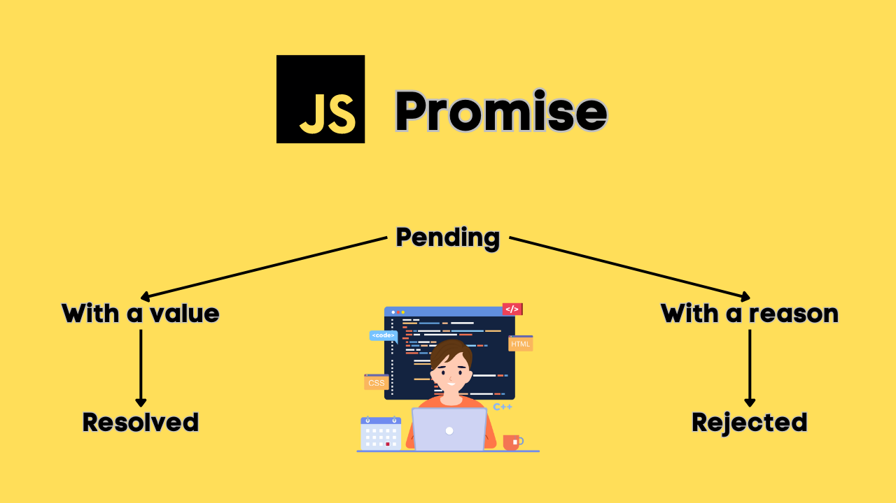
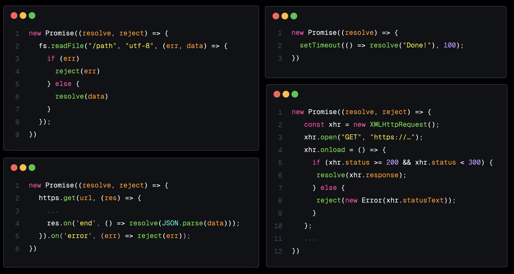

# JavaScript Promises - Deep Dive

## Introduction

Promises in JavaScript are known to be a little daunting. But once you understand what happens under the hood, they're actually not that complicated. This document walks through promise execution and what happens behind the scenes when we interact and work with promises.

## What is Promise

A **Promise** is a special object in JavaScript that represents the eventual completion (or failure) of an asynchronous operation and its resulting value. Essentially, a Promise is a placeholder for a value that is not yet available but will be in the future.

Think of a Promise like ordering a pizza: you dont't get it right away, but the delivery person promises to bring it to you later. You don't know exactly when, but you know the outcome will either be "pizza delivered" or "something went wrong".

### Promise States:

A Promise can be in one of three states:

- **Pending**: The initial state, where the asynchronous operation is still running.
- **Fullfilled**: The operation completed successfully, and the Promise is now resolved with a value.
- **Rejected**: The operation failed, and the Promise is settled with a reason (usually an error).



When you order the pizza, you're in the pending state, hungry and hopeful. If the pizza arrives hot and cheesy, you've entered the fullfilled state. But if the restaurant calls to say they've dropped yours pizza on floor, you're in the rejected state.

Regardless of whether your dinner ends in joy or disappointment, once there's a final outcome, the Promise is considered **settled**.

## Creating a Promise: The Promise Constructor

One way to create a promise is by using the **new Promise constructor**. This constructor receives an **executor function**.

```javascript
new Promise((resolve, reject) => {});
```

### What happens when the constructor is executed

When the `new Promise` constructor is executed, a **new promise object is created in memory**. This object contains some **internal slots**:

- **Promise State**: The current state of the promise (`pending`, `fulfilled`, `rejected`)
- **Promise Result**: The result value of the promise (the value that we pass to `resolve` or `reject`)
- **Promise Fulfill Reactions**: List of handlers for fulfillment (`.then`)
- **Promise Reject Reactions**: List of handlers for rejection (`.catch`)
- **Promise Is Handled**: Whether the promise has handlers (`true` or `false`)

We also get some additional functionality to either **resolve** or **reject** this promise.

### Resolving a Promise

We can resolve this promise by calling `resolve`, which is made available to us by the executor function.

```javascript
new Promise((resolve, reject) => {
  resolve("done");
});
```

When we call `resolve`:

- **Promise State** is set to `fulfilled`
- **Promise Result** is set to the value that we pass to `resolve` (the string "done" in this case)

### Rejecting a Promise

Similarly, we can reject the promise by calling `reject`.

```javascript
new Promise((resolve, reject) => {
  reject("fail");
});
```

When we call `reject`:

- **Promise State** is set to `rejected`
- **Promise Result** is set to the value that we passed to `reject` (the string "fail")

> Note: Whether a promise is resolved or rejected, it is considered handled, so **PromiseIsHandled** becomes `true`.

### So What's Special?

Cool, nothing special here. We're just calling a function to change some object property. So what's so special about promises?

That's actually in those two fields we skipped so far: **Promise Fulfill Reactions** and **Promise Reject Reactions**. These fields contain something called **Promise Reaction Records**.

## Promise Reaction Records

We can create a promise reaction record by chaining a **then** or a **catch** method to the promise. Whenever we chain `then`, the `then` method is responsible for creating that **promise reaction record**.

```javascript
promise.then(callback);
```

### Promise reaction record structure

Among many other fields, this reaction record contains a **handler**, and this has some code—that code is that **callback that we passed to `then`**.

### What happens when we resolve

When we resolve the promise (call `resolve`):

1. `resolve` is added to the call stack
2. Promise state is set to `fulfilled`
3. Promise result is set to the value we pass to `resolve`
4. The promise reaction record's handler **receives** that promise result (the string "done" in this case)
5. The handler is now added to the microtask queue

**This is where the asynchronous part of promises comes into play.**

### Quick Refresher: Microtask Queue

Whenever the call stack is empty:

- The event loop **first checks** the microtask queue
- When this queue is empty, it goes to the task queue (also called the callback queue, macrotask queue)

**What's important**: The **microtask queue gets priority**.

## Asynchronous Tasks in Promises

So far we've only been calling `resolve` and `reject` synchronously (right in the promise constructor). Usually, you want to **initiate some kind of asynchronous task** in this constructor.

### What is an Asynchronous Task?

By asynchronous task, we mean **anything off the main thread** (e.g. reading something from a file system, a network request, a timer, etc.). Whenever they return that data, we can use their callback function to either **resolve** with the data that they returned or **reject** if an error occurred.



## Example: Promise with setTimeout

Let's see how the execution goes for this promise constructor:

```javascript
new Promise((resolve) => {
  setTimeout(() => resolve("done"), 100);
}).then((result) => console.log(result));
```

### Step-by-Step Execution

**Step 1**: `new Promise` constructor is added to the call stack

- Creates the promise object
- Executor function is called

**Step 2**: First line: `setTimeout`

- `setTimeout` is added to the call stack
- Responsible for scheduling that timer (100 milliseconds)
- Has that callback that we passed to `setTimeout` (the function that eventually calls `resolve`)

**Step 3**: Next line: the `then` handler

- `then` is added to the call stack
- Responsible for creating that **promise reaction record**
- Creates a promise reaction record with the callback we provided as its handler
- `then` is popped off the call stack

**Step 4**: Let's imagine those 100 milliseconds are up

- The callback that we passed to `setTimeout` is now added to the **task queue**
- Nothing on the call stack anymore (script is finished)
- It can now go from the task queue to the call stack

**Step 5**: Callback now calls `resolve`

- Changes the promise state to `fulfilled`
- Promise result to the string "done"
- **Schedules that handler to the microtask queue**
- `resolve` is popped off the call stack
- The callback is popped off

**Step 6**: Nothing on the call stack again

- Event loop first checks the **microtask queue**
- Our handler is waiting there
- Handler is added to the call stack
- Console logs the promise result, which is the string "done"

### Why the Microtask Queue is Nice

The nice thing about the fact that it's added to the microtask queue is that **in the meantime our script can just keep running**. It can keep performing important tasks and stays interactive. Only when the call stack is empty (when there's nothing important to do) does it get added to the call stack from the microtask queue.

## Chaining Then Methods

Another cool thing is that **`then` itself also returns a promise**. Besides just creating that promise reaction record, it also creates a promise object. This allows us to **chain those `then`s to each other** and have this incremental promise result handling.

### Example: Chaining Multiple Then Calls

```javascript
Promise.resolve(1)
  .then((result) => result * 2)
  .then((result) => result * 2)
  .then((result) => console.log(result));
```

### Step-by-Step Execution

**Step 1**: `Promise.resolve(1)`

- Creates the promise object
- Immediately resolves with `1`
- State is set to `fulfilled`
- Promise result is `1`

**Step 2**: First `then` handler

- Creates a promise reaction record with the handler being `result => result * 2` (result being that promise result, which is `1`)
- Returns `result * 2` (result being `1`, so `1 * 2 = 2`)
- Also creates a promise object
- This is now set to `fulfilled` because we returned `result * 2`
- Result is `2`

**Step 3**: Second `then` handler

- Creates a promise reaction record again with the exact same handler (`result * 2`)
- This time result being `2`
- `2 * 2 = 4`
- Promise result is now `4`

**Step 4**: Final `then` handler

- Just logs that value
- State is set to `fulfilled`
- Result is `undefined` (because we didn't return a value, we're only logging it)
- In the console you will see **4**

### Real-World Use Case

That's just something to keep in mind: we can **chain those `then`s together** and incrementally handle that promise result in a non-blocking way.

In a real application, you won't use numbers like this. Instead, you want to **incrementally handle that promise result**. For example, you might want to take a series of incremental steps that modify an image's appearance through operations like resizing, applying filters, adding watermarks, etc.

```javascript
function loadImage(src) {
  return new Promise((resolve, reject) => {
    const img = new Image();
    img.onload = () => resolve(img);
    img.onerror = reject;
    img.src = src;
  });
}

loadImage(src)
  .then((image) => resizeImage(image))
  .then((image) => applyGrayscaleFilter(image))
  .then((image) => addWatermark(image));
```

These types of tasks often involve async operations, which makes promises a good choice for managing this in a non-blocking way.

## Advanced Promise Methods

### Promise.all()

This method accepts an array of Promises and returns a new Promise that resolves once all the Promises are fulfilled. If any Promise is rejected, `Promise.all()` will immediately reject. However, even if rejection occurs, the Promises continue to execute. When handling a large number of Promises, especially in batch processing, using this function can strain the system's memory.

```javascript
const { setTimeout: delay } = require("node:timers/promises");

const fetchData1 = delay(1000).then(() => "Data from API 1");
const fetchData2 = delay(2000).then(() => "Data from API 2");

Promise.all([fetchData1, fetchData2])
  .then((results) => {
    console.log(results); // ["Data from API 1", "Data from API 2"]
  })
  .catch((error) => {
    console.error("Error:", error);
  });
```

### Promise.allSettled()

This method waits for all promises to either resolve or reject and returns an array of objects that describe the outcome of each Promise.

```javascript
const promise1 = Promise.resolve("Success");
const promise2 = Promise.reject("Failed");

Promise.allSettled([promise1, promise2]).then((results) => {
  console.log(results);
  // [ { status: 'fulfilled', value: 'Success' }, { status: 'rejected', reason: 'Failed' } ]
});
```

Unlike `Promise.all()`, `Promise.allSettled()` does not short-circuit on failure. It waits for all promises to settle, even if some reject. This provides better error handling for batch operations, where you may want to know the status of all tasks, regardless of failure.

### Promise.race()

This method resolves or rejects as soon as the first Promise settles, whether it resolves or rejects. Regardless of which promise settles first, all promises are fully executed.

```javascript
const { setTimeout: delay } = require("node:timers/promises");

const task1 = delay(2000).then(() => "Task 1 done");
const task2 = delay(1000).then(() => "Task 2 done");

Promise.race([task1, task2]).then((result) => {
  console.log(result);
  // 'Task 2 done' (since task2 finishes first)
});
```

## Key Takeaways

### Promise Object Internal Slots

- Promise State (pending/fulfilled/rejected)
- Promise Result (the resolved/rejected value)
- Promise Fulfill Reactions (handlers for `.then`)
- Promise Reject Reactions (handlers for `.catch`)
- Promise Is Handled (tracking handler attachment)

### Promise Reaction Records

- Created when chaining `.then()` or `.catch()`
- Contains a handler (the callback function)
- Receives the promise result when the promise settles

### Asynchronous Execution

- Handlers are added to the **microtask queue**, not executed immediately
- Allows non-blocking handling of promise results
- Script continues running while promises settle
- Handlers execute only when call stack is empty

### Chaining Promises

- `.then()` returns a new promise
- Allows incremental processing of results
- Each `.then()` can transform the value for the next `.then()`
- Enables clean, readable asynchronous code flow

### Execution Order

- Synchronous code in executor runs immediately
- `resolve()`/`reject()` schedules handlers to microtask queue
- Remaining synchronous code completes first
- Microtask queue executes when call stack is empty
