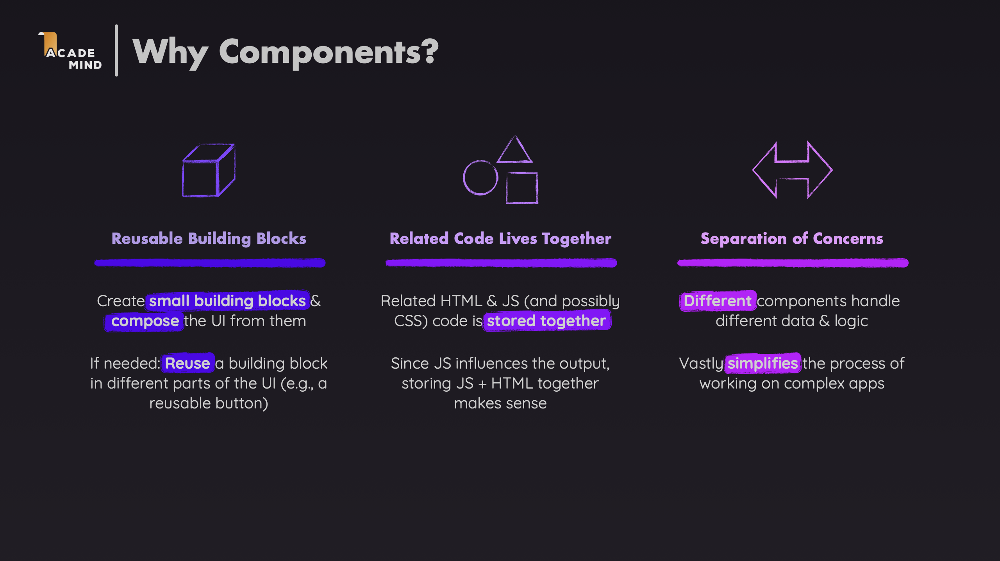
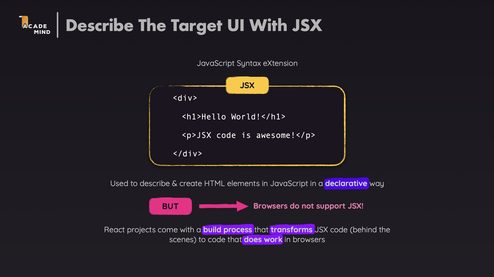
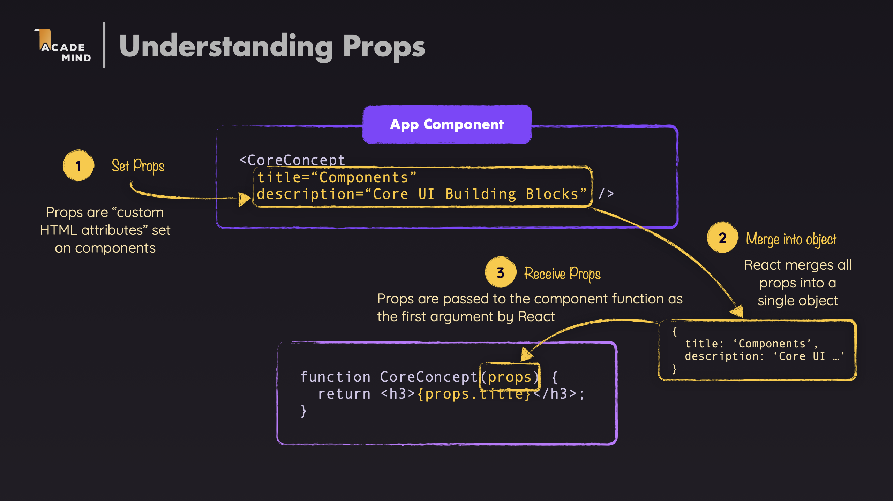
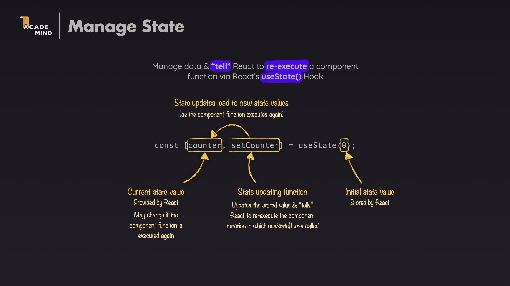
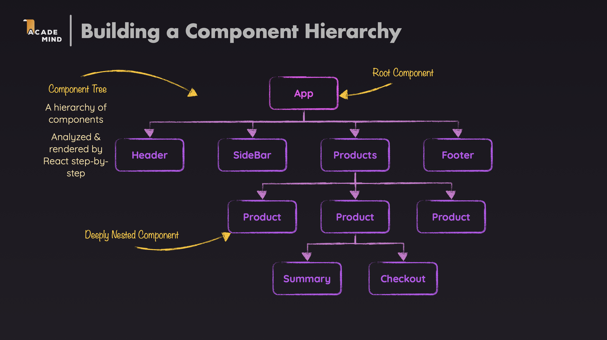
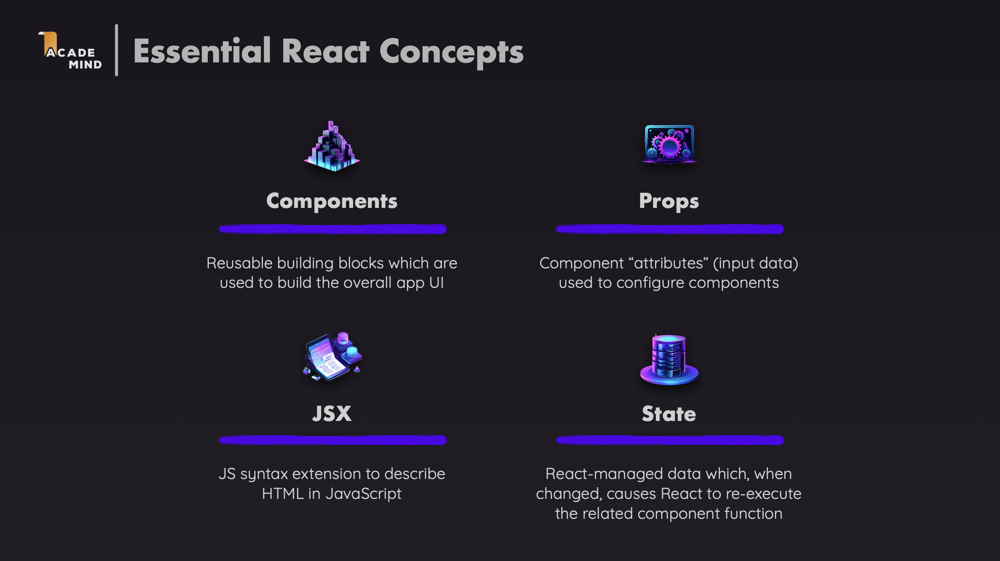

# React Core Concepts - Learning Documentation

This documentation helps you understand the most fundamental concepts of React through practical examples in this project.

---

## 1. Core Concepts

React is built on 4 core concepts:

### 1.1. Components

**Components** are the basic building blocks of React applications. Each component is an independent, reusable module (HTML + CSS + JavaScript).


**Examples in this project:**

- `Header.jsx` - Component that displays the header
- `CoreConcept.jsx` - Component that displays a concept
- `TabButton.jsx` - Tab button component
- `App.jsx` - Main component that contains everything



### 1.2. JSX (JavaScript XML)

**JSX** is a JavaScript syntax extension that allows you to write HTML-like code in JavaScript.

**Example:**

```jsx
return (
  <div>
    <h1>Hello, World!</h1>
    <p>Welcome to React!</p>
  </div>
);
```



### 1.3. Props (Properties)

**Props** are a way to pass data from parent components to child components. Props are like function parameters.

**Examples in this project:**

- `CoreConcept` receives props: `image`, `title`, `description`
- `TabButton` receives props: `children`, `onSelect`, `isSelected`

**Characteristics:**

- Props are read-only
- Props allow components to be reusable with different data
- Props are passed from parent components to child components



### 1.4. State

**State** is data managed by React. When state changes, the component automatically re-renders to update the UI.



---

## 2. How React Works

### 2.1. Basic Process

1. **Initialize the application:**

   - React finds the `root` element in HTML (`index.html`)
   - Renders the `App` component into that element

2. **Render component:**

   - React reads JSX and converts it into DOM elements
   - Displays them on the screen

3. **Update UI:**
   - When state changes, React automatically re-renders
   - Only updates the parts that changed (efficient)

### 2.2. Component Tree



Each component can contain other child components, forming a component tree.

### 2.3. Data Flow

- **Props Down:** Data flows from parent components to child components
- **Events Up:** Events from child components flow up to parent components through callback functions

---

## 3. Examples

Let's analyze the code in this project to understand how the concepts above are applied.

### 3.1. Components and JSX

#### Example 1: Header Component

```1:23:src/components/Header/Header.jsx
import reactImg from '../../assets/react-core-concepts.png';
import './Header.css';

const reactDescriptions = ['Fundamental', 'Crucial', 'Core'];

function genRandomInt(max) {
  return Math.floor(Math.random() * (max + 1));
}

export default function Header() {
  const description = reactDescriptions[genRandomInt(2)];

  return (
    <header>
      
      <h1>React Essentials</h1>
      <p>
        {description} React concepts you will need for almost any app you are
        going to build!
      </p>
    </header>
  );
}
```

**Explanation:**

- `Header` is a function component
- The component returns JSX (HTML-like code)
- Uses JavaScript variables in JSX: `{description}`
- Components can contain JavaScript logic (the `genRandomInt` function)

#### Example 2: CoreConcept Component

```1:9:src/components/CoreConcept.jsx
export default function CoreConcept({ image, title, description }) {
  return (
    <li>
      
      <h3>{title}</h3>
      <p>{description}</p>
    </li>
  );
}
```

**Explanation:**

- Component receives 3 props: `image`, `title`, `description`
- Uses destructuring to get props: `{ image, title, description }`
- Props are used directly in JSX

### 3.2. Props - Passing Data

#### Example: Passing props from App to CoreConcept

```34:40:src/App.jsx
        <section id="core-concepts">
          <h2>Core Concepts</h2>
          <ul>
            {CORE_CONCEPTS.map((conceptItem) => (
              <CoreConcept key={conceptItem.title} {...conceptItem} />
            ))}
          </ul>
        </section>
```

**Explanation:**

- `CORE_CONCEPTS` is an array containing data (see `data.js`)
- `.map()` iterates through each element and creates a component
- `{...conceptItem}` is the spread operator, passing all properties of `conceptItem` as props
- `key={conceptItem.title}` helps React identify each element (required when using `.map()`)

**Data in `data.js`:**

```6:31:src/data.js
export const CORE_CONCEPTS = [
  {
    image: componentsImg,
    title: 'Components',
    description:
      'The core UI building block - compose the user interface by combining multiple components.',
  },
  {
    image: jsxImg,
    title: 'JSX',
    description:
      'Return (potentially dynamic) HTML(ish) code to define the actual markup that will be rendered.',
  },
  {
    image: propsImg,
    title: 'Props',
    description:
      'Make components configurable (and therefore reusable) by passing input data to them.',
  },
  {
    image: stateImg,
    title: 'State',
    description:
      'React-managed data which, when changed, causes the component to re-render & the UI to update.',
  },
];
```

When rendering, React creates 4 `CoreConcept` components, each receiving an object from the array as props.

### 3.3. State - Managing State

#### Example: Using useState to manage the selected topic

```9:14:src/App.jsx
function App() {
  const [selectedTopic, setSelectedTopic] = useState();

  function handleSelect(selectedButton) {
    setSelectedTopic(selectedButton);
  }
```

**Explanation:**

- `useState()` is a React hook to create state
- `selectedTopic` is the current value of state (can be `undefined`, `"components"`, `"jsx"`, `"props"`, or `"state"`)
- `setSelectedTopic` is a function to change the state value
- When calling `setSelectedTopic("components")`, state changes and the component automatically re-renders

**How it works:**

1. Initially `selectedTopic = undefined`
2. User clicks on the "Components" tab
3. `handleSelect("components")` is called
4. `setSelectedTopic("components")` updates the state
5. React re-renders the `App` component
6. UI updates to display the corresponding content

### 3.4. Conditional Rendering

#### Example: Displaying content based on state

```16:28:src/App.jsx
  let tabContent = <p>Please select a topic.</p>;

  if (selectedTopic) {
    tabContent = (
      <div id="tab-content">
        <h3>{EXAMPLES[selectedTopic].title}</h3>
        <p>{EXAMPLES[selectedTopic].description}</p>
        <pre>
          <code>{EXAMPLES[selectedTopic].code}</code>
        </pre>
      </div>
    );
  }
```

**Explanation:**

- **Conditional Rendering** is a way to display different content based on conditions
- Initially `tabContent` is a default text paragraph
- If `selectedTopic` has a value (truthy), `tabContent` is assigned new JSX
- The new JSX retrieves data from the `EXAMPLES` object based on `selectedTopic`

**Other conditional rendering methods:**

```jsx
// Method 1: Using if-else
if (condition) {
  return <ComponentA />;
} else {
  return <ComponentB />;
}

// Method 2: Using ternary operator
{
  condition ? <ComponentA /> : <ComponentB />;
}

// Method 3: Using && operator
{
  condition && <ComponentA />;
}
```

### 3.5. Event Handling - Handling Events

#### Example: Handling click event on TabButton

```45:70:src/App.jsx
          <menu>
            <TabButton
              isSelected={selectedTopic === "components"}
              onSelect={() => handleSelect("components")}
            >
              Components
            </TabButton>
            <TabButton
              isSelected={selectedTopic === "jsx"}
              onSelect={() => handleSelect("jsx")}
            >
              JSX
            </TabButton>
            <TabButton
              isSelected={selectedTopic === "props"}
              onSelect={() => handleSelect("props")}
            >
              Props
            </TabButton>
            <TabButton
              isSelected={selectedTopic === "state"}
              onSelect={() => handleSelect("state")}
            >
              State
            </TabButton>
          </menu>
```

**Explanation:**

- Each `TabButton` receives 2 props:
  - `isSelected`: boolean to determine which tab is selected
  - `onSelect`: callback function called when clicking the button
- `selectedTopic === "components"` compares state with string, returns `true` or `false`
- `() => handleSelect("components")` is an arrow function, when clicked it calls `handleSelect` with parameter `"components"`

#### TabButton Component handling the event

```1:10:src/components/TabButton.jsx
export default function TabButton({ children, onSelect, isSelected }) {
  return (
    <li>
      <button className={isSelected ? 'active' : undefined} onClick={onSelect}>
        {children}
      </button>
    </li>
  );
}
```

**Explanation:**

- `onClick={onSelect}` assigns the `onSelect` function (from props) to the click event
- When the button is clicked, the `onSelect` function is called
- `children` is a special prop containing content between opening and closing tags: `<TabButton>Components</TabButton>`
- `className={isSelected ? 'active' : undefined}` applies CSS class if the tab is selected

**Event handling flow:**

1. User clicks the "Components" button
2. `onClick` triggers, calling `onSelect()` (which is `handleSelect("components")`)
3. `handleSelect` calls `setSelectedTopic("components")`
4. State changes → React re-renders
5. `selectedTopic === "components"` returns `true`
6. TabButton receives `isSelected={true}` → button has `active` class
7. `tabContent` is updated with new content

### 3.6. Summary: Application Flow

#### Step 1: Initialization

```1:8:src/index.jsx
import ReactDOM from "react-dom/client";

import App from "./App.jsx";
import "./index.css";

const entryPoint = document.getElementById("root");
ReactDOM.createRoot(entryPoint).render(<App />);
```

- React finds the element with `id="root"` in HTML
- Renders the `App` component into it

#### Step 2: First Render

```30:74:src/App.jsx
  return (
    <div>
      <Header />
      <main>
        <section id="core-concepts">
          <h2>Core Concepts</h2>
          <ul>
            {CORE_CONCEPTS.map((conceptItem) => (
              <CoreConcept key={conceptItem.title} {...conceptItem} />
            ))}
          </ul>
        </section>

        <section id="examples">
          <h2>Examples</h2>
          <menu>
            <TabButton
              isSelected={selectedTopic === "components"}
              onSelect={() => handleSelect("components")}
            >
              Components
            </TabButton>
            <TabButton
              isSelected={selectedTopic === "jsx"}
              onSelect={() => handleSelect("jsx")}
            >
              JSX
            </TabButton>
            <TabButton
              isSelected={selectedTopic === "props"}
              onSelect={() => handleSelect("props")}
            >
              Props
            </TabButton>
            <TabButton
              isSelected={selectedTopic === "state"}
              onSelect={() => handleSelect("state")}
            >
              State
            </TabButton>
          </menu>
          {tabContent}
        </section>
      </main>
    </div>
  );
```

**On first render:**

- `selectedTopic = undefined` (no tab selected yet)
- All `TabButton` components have `isSelected={false}`
- `tabContent = <p>Please select a topic.</p>`

#### Step 3: User Interaction

- User clicks on the "JSX" tab
- `handleSelect("jsx")` is called
- `setSelectedTopic("jsx")` updates the state
- React re-renders the component

#### Step 4: Re-render

- `selectedTopic = "jsx"`
- TabButton "JSX" has `isSelected={true}` → has `active` class
- `tabContent` is updated with content from `EXAMPLES["jsx"]`
- UI displays the title, description, and code example for JSX

---

## 📝 Summary



### Important Notes

1. **Props are read-only**: Cannot change props from child components
2. **State only changes with setter**: Always use setter functions (like `setSelectedTopic`) to change state
3. **Key prop**: Always need `key` when rendering lists with `.map()`
4. **Event handlers**: Pass function, don't call function (don't use `onClick={handleSelect()}`)
