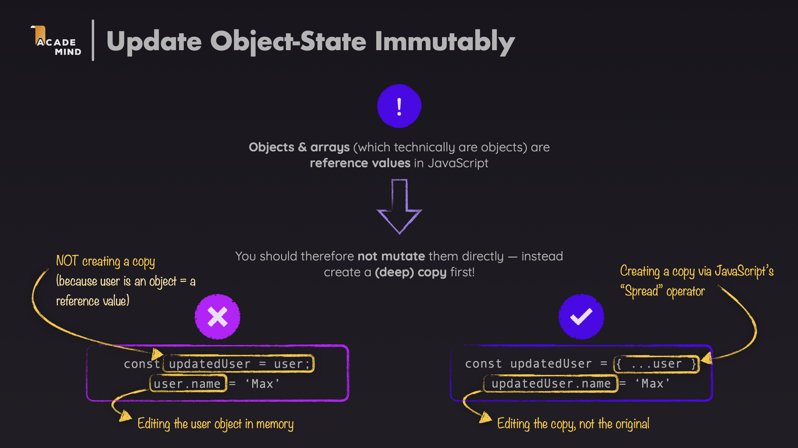
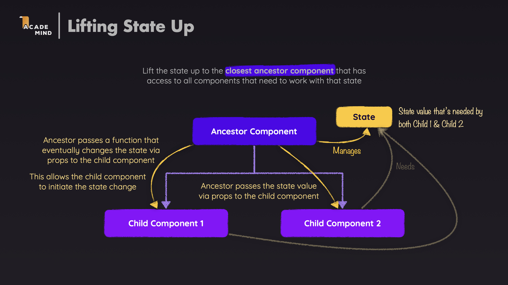

# Tic-Tac-Toe – React Advanced Concepts Summary (Deep Dive)

This documentation summarizes advanced React concepts through the Tic-Tac-Toe project. This project demonstrates important concepts such as derived state, functional updates, immutable updates, lifting state up, controlled components, and many other techniques.

---

## 1. Core Concepts

### 1.1. Derived State (Avoid Storing Redundant State)

**Derived State** is the concept of not storing values that can be calculated from existing data. Only store the "single source of truth" and compute other values from it.

**Example in this project:**

In the Tic-Tac-Toe project, we don't store `activePlayer` and `gameBoard` in state. Instead, they are calculated from `gameTurns` every time the component renders.

```15:21:src/App.js
function deriveActivePlayer(gameTurns) {
  let currentPlayer = "X";
  if (gameTurns.length > 0 && gameTurns[0].player === "X") {
    currentPlayer = "O";
  }
  return currentPlayer;
}
```

```27:34:src/App.js
  let gameBoard = [...initialGameBoard.map((innerArray) => [...innerArray])];
  let winner;

  for (const turn of gameTurns) {
    const { square, player } = turn;
    const { row, col } = square;
    gameBoard[row][col] = player;
  }
```

**Explanation:**

- `activePlayer` is calculated from `gameTurns` using the `deriveActivePlayer()` function
- `gameBoard` is recalculated on each render based on `gameTurns`
- Only `gameTurns` is stored in state, this is the "single source of truth"

**Benefits:**

- Reduces risk of state desynchronization (state not in sync)
- Simplifies state updates
- Easier to debug because there's only one main data source

### 1.2. Functional State Updates (Avoid Stale Closures)

**Functional State Updates** is a technique of using callback functions when updating state that depends on previous values. This helps avoid stale closure issues.

**Example in this project:**

When adding a new turn, we need to rely on the current `gameTurns` to determine the next player:

```57:67:src/App.js
  function handleSelectSquare(rowIndex, colIndex) {
    setGameTurns((preGameTurns) => {
      const currentPlayer = deriveActivePlayer(preGameTurns);

      const updatedGameTurns = [
        { square: { row: rowIndex, col: colIndex }, player: currentPlayer },
        ...preGameTurns,
      ];
      return updatedGameTurns;
    });
  }
```

**Explanation:**

- `setGameTurns((preGameTurns) => ...)` receives the previous state value as a parameter
- `deriveActivePlayer(preGameTurns)` calculates the current player based on the old state
- Ensures we always use the latest state value, avoiding stale closures

**When to use:**

- When updating state depends on previous values
- When there are multiple consecutive state updates
- When you want to ensure state consistency

### 1.3. Immutable Updates (Don't Mutate Directly)

**Immutable Updates** is the principle of always creating a new copy for arrays/objects when updating state, not directly changing the old value.



**Example in this project:**

```61:65:src/App.js
      const updatedGameTurns = [
        { square: { row: rowIndex, col: colIndex }, player: currentPlayer },
        ...preGameTurns,
      ];
      return updatedGameTurns;
```

```73:80:src/App.js
  function handlePlayerNameChange(symbol, newName) {
    setPlayers((prevPlayer) => {
      return {
        ...prevPlayer,
        [symbol]: newName,
      };
    });
  }
```

**Explanation:**

- `[...preGameTurns]` creates a new array using the spread operator
- `{ ...prevPlayer, [symbol]: newName }` creates a new object with the updated property
- Never mutate directly: `preGameTurns.push(...)` or `prevPlayer[symbol] = newName`

**Benefits:**

- React can detect changes and re-render
- Avoids hard-to-detect bugs
- Better support for features like time-travel debugging

### 1.4. Lifting State Up & Callback Props

**Lifting State Up** is a technique of managing shared state in a parent component and passing data down to child components via props. Child components can notify changes to the parent through callback functions.



**Example in this project:**

The `App` component manages all important state and passes it down to child components:

```82:105:src/App.js
  return (
    <main>
      <div id="game-container">
        <ol id="players" className="highlight-player">
          <Player
            initialName="Player 1"
            symbol="X"
            isActive={activePlayer === "X"}
            onChangeName={handlePlayerNameChange}
          />
          <Player
            initialName="Player 2"
            symbol="O"
            isActive={activePlayer === "O"}
            onChangeName={handlePlayerNameChange}
          />
        </ol>
        {(winner || hasDraw) && (
          <GameOver winner={winner} onRestart={handleRestart} />
        )}
        <GameBoard onSelectSquare={handleSelectSquare} board={gameBoard} />
      </div>
      <Log turns={gameTurns} />
    </main>
  );
```

**Explanation:**

- `App` manages: `players`, `gameTurns`, `gameBoard`, `winner`, `hasDraw`
- Passes callbacks down: `onSelectSquare` to `GameBoard`, `onChangeName` to `Player`
- Passes data down: `board` to `GameBoard`, `turns` to `Log`

**Component Tree:**

```text
App (state: players, gameTurns)
├── Player (X) - callback: onChangeName
├── Player (O) - callback: onChangeName
├── GameBoard - props: board, callback: onSelectSquare
├── GameOver - props: winner, callback: onRestart
└── Log - props: turns
```

### 1.5. Controlled Components & Two-Way Binding

**Controlled Components** are input elements whose values are completely controlled by React state. This is how React implements "two-way binding" - state controls the UI and the UI updates state.

**Example in this project:**

The `Player` component uses a controlled input to edit player names:

```9:29:src/components/Player.js
  const [playerName, setPlayerName] = useState(initialName);
  const [isEditting, setIsEditting] = useState(false);

  const handleClick = () => {
    setIsEditting((prevIsEditting) => !prevIsEditting);
    if (isEditting) {
      onChangeName(symbol, playerName);
    }
  };

  const handleChange = (event) => {
    setPlayerName(event.target.value);
  };

  let playerNameContainer = <span className="player-name">{playerName}</span>;

  if (isEditting) {
    playerNameContainer = (
      <input type="text" required value={playerName} onChange={handleChange} />
    );
  }
```

**Explanation:**

- `value={playerName}` - input value is controlled by state
- `onChange={handleChange}` - every time the user types, state is updated
- `setPlayerName(event.target.value)` - updates state from input value
- This is "two-way binding": state → UI (via `value`) and UI → state (via `onChange`)

**Flow:**

1. User clicks "Edit" → `isEditting` becomes `true` → displays input
2. User types → `onChange` triggers → `setPlayerName()` updates state
3. State changes → React re-renders → input displays new value
4. User clicks "Save" → `onChangeName()` is called → updates state in `App`

### 1.6. Local State vs Shared State

**Local State** is state that is only used within one component. **Shared State** is state shared between multiple components and managed in a parent component.

**Example in this project:**

The `Player` component uses both local state and callbacks to sync with shared state:

```9:10:src/components/Player.js
  const [playerName, setPlayerName] = useState(initialName);
  const [isEditting, setIsEditting] = useState(false);
```

**Explanation:**

- `playerName` and `isEditting` are **local state** - only used in the `Player` component
- When pressing "Save", `onChangeName(symbol, playerName)` is called to update **shared state** in `App`
- Local state manages UI (displaying input or span), shared state manages game data (player names)

**When to use local state:**

- State only related to that component's UI (like `isEditting`)
- Temporary state that doesn't need to be shared (like input value while editing)

**When to use shared state:**

- Data needs to be shared between multiple components
- Data important for application logic (like `players`, `gameTurns`)

---

## 2. Advanced Techniques

### 2.1. Conditional Rendering & Dynamic Classes

**Conditional Rendering** is a technique to display different content based on conditions. **Dynamic Classes** is applying CSS classes dynamically based on state or props.

**Example in this project:**

```99:101:src/App.js
        {(winner || hasDraw) && (
          <GameOver winner={winner} onRestart={handleRestart} />
        )}
```

```32:32:src/components/Player.js
    <li className={isActive ? "active" : undefined}>
```

**Explanation:**

- `{(winner || hasDraw) && <GameOver />}` - only displays `GameOver` when the game ends
- `className={isActive ? "active" : undefined}` - adds `active` class when it's that player's turn
- The `&&` operator and ternary operator are used for conditional rendering

**Conditional rendering methods:**

```jsx
// Method 1: && operator
{
  condition && <Component />;
}

// Method 2: Ternary operator
{
  condition ? <ComponentA /> : <ComponentB />;
}

// Method 3: if-else in function
function renderContent() {
  if (condition) return <ComponentA />;
  return <ComponentB />;
}
```

### 2.2. Key Prop and Render Lists

**Key Prop** is a special property that helps React identify each element in a list. Keys must be unique and stable.

**Example in this project:**

```4:8:src/components/Log.js
      {turns.map((turn) => (
        <li key={`${turn.square.row}${turn.square.col}`}>
          {turn.player} select {turn.square.row},{turn.square.col}
        </li>
      ))}
```

```4:18:src/components/GameBoard.js
      {board.map((row, rowIndex) => (
        <li key={rowIndex}>
          <ol>
            {row.map((playerSymbol, colIndex) => (
              <li key={colIndex}>
                <button
                  onClick={() => onSelectSquare(rowIndex, colIndex)}
                  disabled={playerSymbol !== null}
                >
                  {playerSymbol}
                </button>
              </li>
            ))}
          </ol>
        </li>
      ))}
```

**Explanation:**

- `Log` uses a key combining `row` and `col` - unique and stable for each turn
- `GameBoard` uses `rowIndex` and `colIndex` - stable in the context of a static 3x3 grid
- Key helps React identify which element changed, was added, or removed

**Notes:**

- Don't use index as key if the list can change order
- Key must be unique within the same list
- Key should not change between renders

### 2.3. Event Handlers with Parameters

When you need to pass parameters to an event handler, we use arrow functions or bind.

**Example in this project:**

```9:10:src/components/GameBoard.js
                  onClick={() => onSelectSquare(rowIndex, colIndex)}
                  disabled={playerSymbol !== null}
```

**Explanation:**

- `onClick={() => onSelectSquare(rowIndex, colIndex)}` - arrow function to pass `rowIndex` and `colIndex`
- Cannot write `onClick={onSelectSquare(rowIndex, colIndex)}` because it would call the function immediately
- Arrow function creates a new function on each render, but in this case it's acceptable

**Ways to pass parameters:**

```jsx
// Method 1: Arrow function (most common)
<button onClick={() => handleClick(id)}>Click</button>

// Method 2: Bind (less used)
<button onClick={handleClick.bind(null, id)}>Click</button>

// Method 3: Wrapper function
const handleClickWrapper = () => handleClick(id);
<button onClick={handleClickWrapper}>Click</button>
```

### 2.4. Disabled State

**Disabled State** is an HTML attribute that disables an element, commonly used for buttons and inputs.

**Example in this project:**

```11:11:src/components/GameBoard.js
                  disabled={playerSymbol !== null}
```

**Explanation:**

- Button is disabled when `playerSymbol !== null` (square already selected)
- Prevents players from selecting squares that already have a symbol
- Disabled buttons cannot be clicked and have different styling (usually dimmed)

### 2.5. Separating Domain Logic

**Separation of Concerns** is the principle of separating business logic (domain logic) from components for easier maintenance and testing.

**Example in this project:**

Winning combinations are separated into a separate file:

```1:42:src/winning-combination.js
export const WINNING_COMBINATIONS = [
  [
    { row: 0, column: 0 },
    { row: 0, column: 1 },
    { row: 0, column: 2 },
  ],
  [
    { row: 1, column: 0 },
    { row: 1, column: 1 },
    { row: 1, column: 2 },
  ],
  [
    { row: 2, column: 0 },
    { row: 2, column: 1 },
    { row: 2, column: 2 },
  ],
  [
    { row: 0, column: 0 },
    { row: 1, column: 0 },
    { row: 2, column: 0 },
  ],
  [
    { row: 0, column: 1 },
    { row: 1, column: 1 },
    { row: 2, column: 1 },
  ],
  [
    { row: 0, column: 2 },
    { row: 1, column: 2 },
    { row: 2, column: 2 },
  ],
  [
    { row: 0, column: 0 },
    { row: 1, column: 1 },
    { row: 2, column: 2 },
  ],
  [
    { row: 0, column: 2 },
    { row: 1, column: 1 },
    { row: 2, column: 0 },
  ],
];
```

```38:53:src/App.js
  for (const combination of WINNING_COMBINATIONS) {
    const firstSquareSymbol =
      gameBoard[combination[0].row][combination[0].column];
    const secondSquareSymbol =
      gameBoard[combination[1].row][combination[1].column];
    const thirdSquareSymbol =
      gameBoard[combination[2].row][combination[2].column];

    if (
      firstSquareSymbol &&
      firstSquareSymbol === secondSquareSymbol &&
      firstSquareSymbol === thirdSquareSymbol
    ) {
      winner = players[firstSquareSymbol];
    }
  }
```

**Explanation:**

- `WINNING_COMBINATIONS` contains domain data (8 winning combinations)
- Win checking logic is separated from the component
- Easy to test and reuse

**Benefits:**

- Code is easier to read and maintain
- Logic can be tested independently
- Can be reused elsewhere

### 2.6. Win Detection Algorithm and Draw Handling

**Game Logic** includes checking win conditions and handling draw cases.

**Example in this project:**

```38:55:src/App.js
  for (const combination of WINNING_COMBINATIONS) {
    const firstSquareSymbol =
      gameBoard[combination[0].row][combination[0].column];
    const secondSquareSymbol =
      gameBoard[combination[1].row][combination[1].column];
    const thirdSquareSymbol =
      gameBoard[combination[2].row][combination[2].column];

    if (
      firstSquareSymbol &&
      firstSquareSymbol === secondSquareSymbol &&
      firstSquareSymbol === thirdSquareSymbol
    ) {
      winner = players[firstSquareSymbol];
    }
  }

  const hasDraw = gameTurns.length === 9 && !winner;
```

**Explanation:**

- Iterate through 8 winning combinations (3 rows, 3 columns, 2 diagonals)
- Check if 3 squares have the same symbol and are not null → there's a winner
- If there are 9 turns and no winner → draw

**Win conditions:**

- Three squares in the same row have the same symbol
- Three squares in the same column have the same symbol
- Three squares in a diagonal have the same symbol

**Draw condition:**

- There have been 9 turns (`gameTurns.length === 9`)
- No winner (`!winner`)

---

## 3. Examples

Let's analyze the code in this project to understand how the concepts above are applied.

### 3.1. Component Structure

#### Example 1: App Component - Managing Main State

```23:36:src/App.js
function App() {
  const [players, setPlayers] = useState({ X: "Player 1", O: "Player 2" });
  const [gameTurns, setGameTurns] = useState([]);

  let gameBoard = [...initialGameBoard.map((innerArray) => [...innerArray])];
  let winner;

  for (const turn of gameTurns) {
    const { square, player } = turn;
    const { row, col } = square;
    gameBoard[row][col] = player;
  }

  const activePlayer = deriveActivePlayer(gameTurns);
```

**Explanation:**

- `App` is the main component managing all game state
- Only stores `players` and `gameTurns` in state
- `gameBoard`, `winner`, `activePlayer` are calculated from state (derived state)

#### Example 2: Player Component - Controlled Input

```3:40:src/components/Player.js
export default function Player({
  initialName,
  symbol,
  isActive,
  onChangeName,
}) {
  const [playerName, setPlayerName] = useState(initialName);
  const [isEditting, setIsEditting] = useState(false);

  const handleClick = () => {
    setIsEditting((prevIsEditting) => !prevIsEditting);
    if (isEditting) {
      onChangeName(symbol, playerName);
    }
  };

  const handleChange = (event) => {
    setPlayerName(event.target.value);
  };

  let playerNameContainer = <span className="player-name">{playerName}</span>;

  if (isEditting) {
    playerNameContainer = (
      <input type="text" required value={playerName} onChange={handleChange} />
    );
  }

  return (
    <li className={isActive ? "active" : undefined}>
      <span className="player">
        {playerNameContainer}
        <span className="player-symbol">{symbol}</span>
      </span>
      <button onClick={handleClick}>{isEditting ? "Save" : "Edit"}</button>
    </li>
  );
}
```

**Explanation:**

- Uses local state (`playerName`, `isEditting`) to manage UI
- Controlled input with `value={playerName}` and `onChange={handleChange}`
- Conditional rendering to display input or span
- Callback `onChangeName` to sync with shared state in `App`

#### Example 3: GameBoard Component - Render Nested Lists

```1:22:src/components/GameBoard.js
export default function GameBoard({ onSelectSquare, board }) {
  return (
    <ol id="game-board">
      {board.map((row, rowIndex) => (
        <li key={rowIndex}>
          <ol>
            {row.map((playerSymbol, colIndex) => (
              <li key={colIndex}>
                <button
                  onClick={() => onSelectSquare(rowIndex, colIndex)}
                  disabled={playerSymbol !== null}
                >
                  {playerSymbol}
                </button>
              </li>
            ))}
          </ol>
        </li>
      ))}
    </ol>
  );
}
```

**Explanation:**

- Renders nested lists (2D array) with nested `.map()`
- Key prop for both row and col
- Event handler with parameters via arrow function
- Disabled state to prevent selecting squares that already have a symbol

### 3.2. Application Flow

#### Step 1: Initialization

```23:25:src/App.js
  const [players, setPlayers] = useState({ X: "Player 1", O: "Player 2" });
  const [gameTurns, setGameTurns] = useState([]);
```

- `players` is initialized with default names
- `gameTurns` is an empty array
- `gameBoard` is calculated from `gameTurns` (all null)
- `activePlayer` is "X" (first player)

#### Step 2: Player Selects Square

1. Player clicks on a square on `GameBoard`
2. `onSelectSquare(rowIndex, colIndex)` is called
3. `handleSelectSquare` is executed:

```57:67:src/App.js
  function handleSelectSquare(rowIndex, colIndex) {
    setGameTurns((preGameTurns) => {
      const currentPlayer = deriveActivePlayer(preGameTurns);

      const updatedGameTurns = [
        { square: { row: rowIndex, col: colIndex }, player: currentPlayer },
        ...preGameTurns,
      ];
      return updatedGameTurns;
    });
  }
```

4. `gameTurns` state is updated with the new turn
5. React re-renders the component

#### Step 3: Calculate Derived State

After state changes, React re-renders and recalculates:

- `gameBoard` is recalculated from `gameTurns`
- `activePlayer` is recalculated from `gameTurns`
- `winner` is checked from `gameBoard`
- `hasDraw` is checked if there are 9 turns

#### Step 4: Update UI

- `GameBoard` displays the new symbol
- `Player` component has `isActive` updated
- `Log` displays the new turn
- If there's a `winner` or `hasDraw`, `GameOver` is displayed

### 3.3. Example: Editing Player Name

#### Flow

1. **Player clicks "Edit":**

   - `handleClick()` is called
   - `setIsEditting(true)` → displays input

2. **Player types new name:**

   - `handleChange(event)` is called on each keystroke
   - `setPlayerName(event.target.value)` updates local state
   - Input displays new value (controlled component)

3. **Player clicks "Save":**

   - `handleClick()` is called again
   - `setIsEditting(false)` → hides input
   - `onChangeName(symbol, playerName)` is called
   - `handlePlayerNameChange` in `App` updates shared state

4. **State is synced:**
   - `players` state in `App` is updated
   - New name is displayed everywhere `players` is used

---

## 📝 Summary

1. **Single Source of Truth**: Only store necessary data, calculate the rest
2. **Functional Updates**: Always use callbacks when updating state depends on previous values
3. **Immutable Updates**: Never mutate state directly
4. **Controlled Components**: Always use `value` and `onChange` for inputs
5. **Key Prop**: Always need unique and stable key when rendering lists
6. **Event Handlers**: Pass function, don't call function (use arrow function)

---
