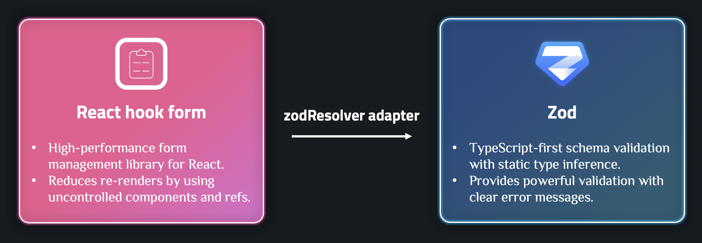
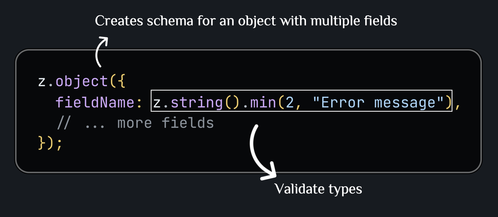
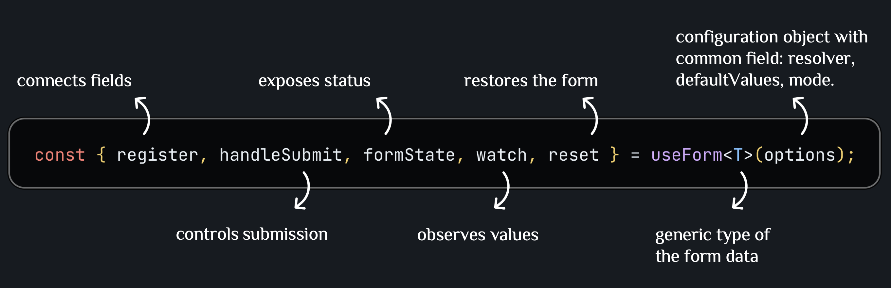
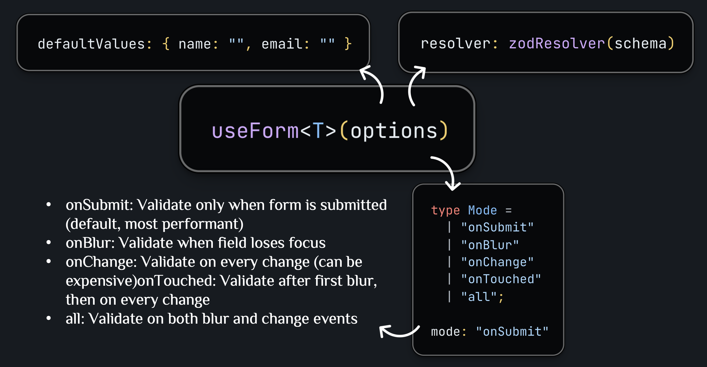
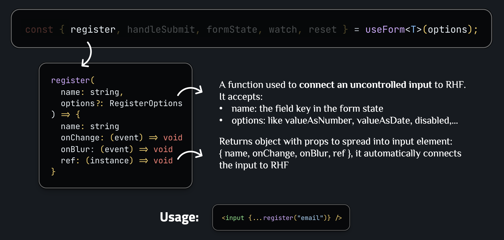
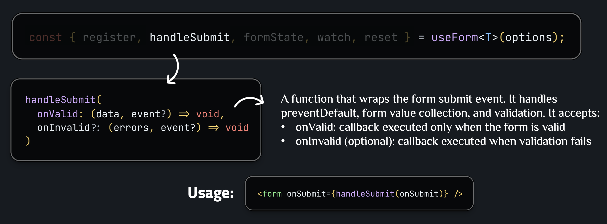
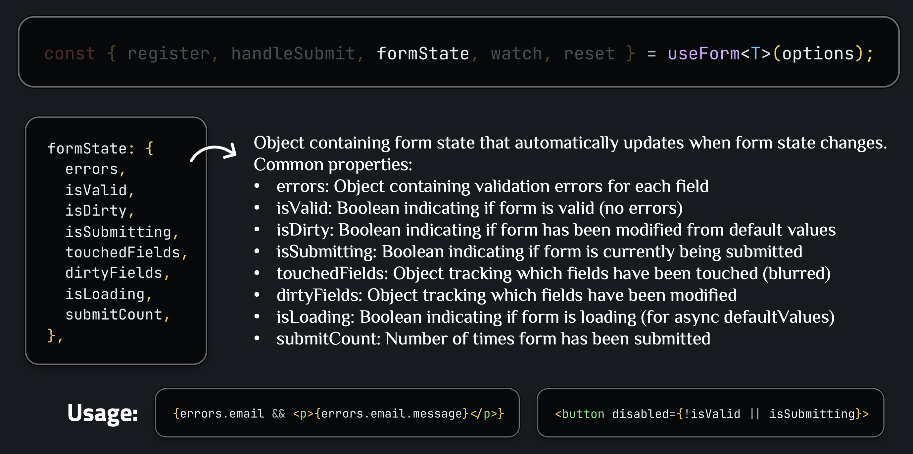
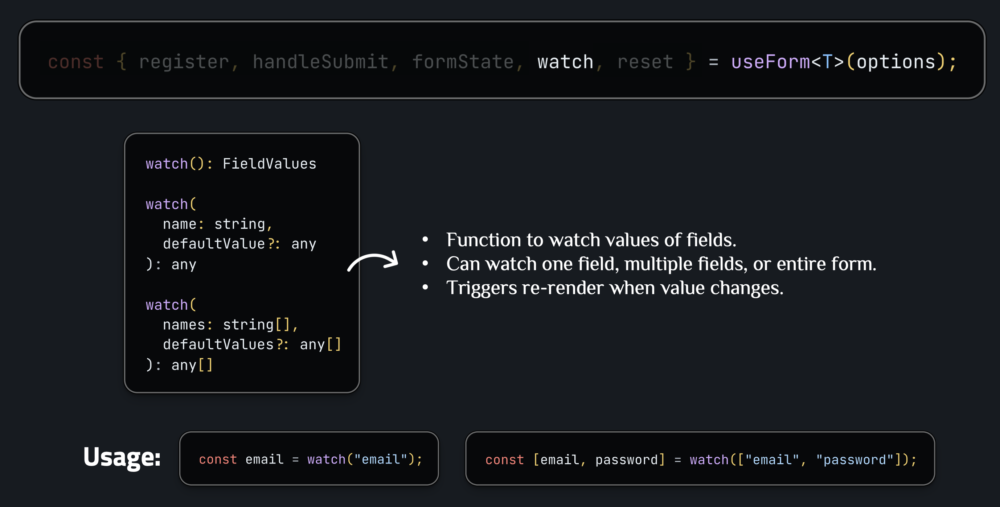
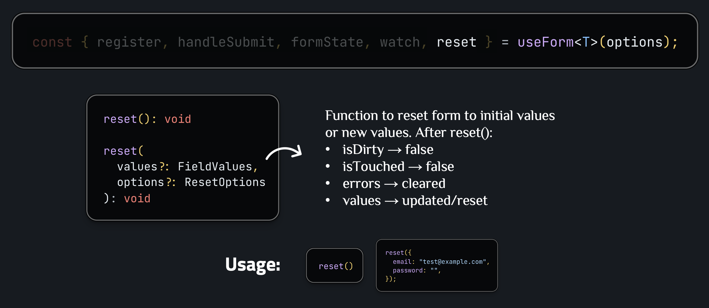
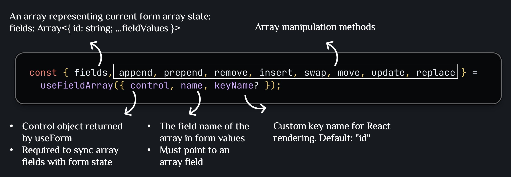

# REACT HOOK FORM + ZOD

## Core terminology



**zodResolver**:

- Adapter from `@hookform/resolvers` to integrate Zod with React Hook Form.
- Converts Zod schema into format that React Hook Form understands.
- Automatically maps Zod errors to React Hook Form errors.
- Syntax: `zodResolver(schema)` where `schema` is a Zod schema object.

**Zod**:



Some common Zod validation types:

- `z.string()` – string type
- `z.string().email()` – string must be a valid email
- `z.number()` – number type
- `z.object({ name: z.string() })` – object with fields (used for form schemas)
- `z.string().optional()` – string or undefined (makes field optional)

**useForm**:



**useForm Generic Type**: Type safety for form values, autocomplete for field names, compile-time error checking


**useForm Options**:

- `resolver` (optional): Validation resolver function. Integrates external validation library (Zod, Yup, etc.) with React Hook Form. When validation fails, errors are automatically populated in `formState.errors`.

- `defaultValues` (optional): Initial form values. Sets initial values for form fields when component mounts. `isDirty` in `formState` will be `false` if form hasn't changed from default values.

- `mode` (optional): Validation mode - when validation should trigger.



**register**:



**handleSubmit**:



**formState**:



**watch**:



**reset**:



---

## Basic: Basic Form Usage

This section guides you through using React Hook Form with Zod in the most basic scenarios.

### Example 1: Basic Form with Zod Schema

**When to use**: When you need a simple form with basic validation.

**Example**:

```typescript
import { useForm } from "react-hook-form";
import { zodResolver } from "@hookform/resolvers/zod";
import { z } from "zod";

// 1. Define Zod schema
const formSchema = z.object({
  name: z.string().min(2, "Name must be at least 2 characters"),
  email: z.string().email("Invalid email address"),
  age: z.number().min(18, "Age must be 18 or older"),
});

// 2. Infer TypeScript type from schema
type FormData = z.infer<typeof formSchema>;

function BasicForm() {
  // 3. Setup useForm with zodResolver
  const {
    register,
    handleSubmit,
    formState: { errors, isSubmitting },
  } = useForm<FormData>({
    resolver: zodResolver(formSchema),
  });

  // 4. Handle submit
  const onSubmit = async (data: FormData) => {
    console.log(data);
    // API call...
  };

  return (
    <form onSubmit={handleSubmit(onSubmit)}>
      <input {...register("name")} />
      {errors.name && <span>{errors.name.message}</span>}

      <input {...register("email")} />
      {errors.email && <span>{errors.email.message}</span>}

      <input type="number" {...register("age", { valueAsNumber: true })} />
      {errors.age && <span>{errors.age.message}</span>}

      <button type="submit" disabled={isSubmitting}>
        Submit
      </button>
    </form>
  );
}
```

**Explanation**:

- `register("name")` returns `{ name: "name", onChange, onBlur, ref }` which is spread into the input element, connecting it to React Hook Form
- `register("age", { valueAsNumber: true })` converts the input value from string to number automatically
- `formState: { errors, isSubmitting }` destructures specific form state properties:
  - `errors`: Used to display validation error messages (`errors.name?.message`)
  - `isSubmitting`: Used to disable submit button and show loading state during submission
- `handleSubmit(onSubmit)` wraps the submit handler, automatically validates form before calling `onSubmit`, and prevents default form submission
- Error messages come from Zod schema validation and are automatically mapped to `formState.errors`

### Example 2: Form with Watch - Real-time Updates

**When to use**: When you want to display field values in real-time or create conditional logic.

**Example**:

```typescript
function FormWithWatch() {
  const {
    register,
    handleSubmit,
    watch,
    formState: { errors },
  } = useForm<FormData>({
    resolver: zodResolver(formSchema),
  });

  // Watch one field
  const firstName = watch("firstName");

  // Watch multiple fields
  const [firstName, lastName] = watch(["firstName", "lastName"]);

  // Watch entire form
  const formData = watch();

  return (
    <form onSubmit={handleSubmit(onSubmit)}>
      <input {...register("firstName")} />
      {firstName && <div>Preview: {firstName}</div>}

      <input {...register("lastName")} />
      {firstName && lastName && (
        <div>
          Full name: {firstName} {lastName}
        </div>
      )}
    </form>
  );
}
```

**Explanation**:

- `watch("firstName")` returns the current value of `firstName` field and subscribes component to changes, causing re-render when value changes
- `watch(["firstName", "lastName"])` returns an array `[firstNameValue, lastNameValue]` and subscribes to both fields
- The watched values (`firstName`, `fullName`) are used in JSX to display real-time preview
- Component automatically re-renders whenever any watched field value changes
- `register()` still works normally - watching doesn't interfere with form registration

### Example 3: Form with Nested Objects

**When to use**: When form has complex data structure with nested objects.

**Example**:

```typescript
const nestedFormSchema = z.object({
  personalInfo: z.object({
    firstName: z.string().min(2),
    lastName: z.string().min(2),
    email: z.string().email(),
  }),
  address: z.object({
    street: z.string().min(5),
    city: z.string().min(2),
    zipCode: z.string().regex(/^\d{5}$/),
  }),
});

type NestedFormData = z.infer<typeof nestedFormSchema>;

function NestedForm() {
  const {
    register,
    handleSubmit,
    formState: { errors },
  } = useForm<NestedFormData>({
    resolver: zodResolver(nestedFormSchema),
  });

  return (
    <form onSubmit={handleSubmit(onSubmit)}>
      {/* Nested object fields use dot notation */}
      <input {...register("personalInfo.firstName")} />
      {errors.personalInfo?.firstName && (
        <span>{errors.personalInfo.firstName.message}</span>
      )}

      <input {...register("address.street")} />
      {errors.address?.street && <span>{errors.address.street.message}</span>}
    </form>
  );
}
```

**Explanation**:

- `register("personalInfo.firstName")` uses dot notation to register nested field - the returned props still work the same way when spread into input
- Error access uses optional chaining: `errors.personalInfo?.firstName?.message` to safely access nested error messages
- The generic type `useForm<NestedFormData>` ensures type safety for nested structure - TypeScript knows about `personalInfo.firstName` path
- Form data structure matches schema: `{ personalInfo: { firstName: "...", ... }, address: { street: "...", ... } }`

---

## Advanced: Advanced Form Usage

This section guides you through more complex patterns and advanced features.

### Example 1: Form with Custom Input Components

**When to use**: When you need to integrate React Hook Form with custom controlled components or third-party UI libraries (Material-UI, Ant Design, etc.).

**Controlled vs Uncontrolled Components**:

| Aspect               | Uncontrolled Components (using `register`)                               | Controlled Components (using `Controller`)                                    |
| -------------------- | ------------------------------------------------------------------------ | ----------------------------------------------------------------------------- |
| **State Management** | React Hook Form manages the form state internally                        | React state manages the component's value                                     |
| **Value Access**     | Uses native DOM refs to access input values                              | Component receives `value` and `onChange` props explicitly                    |
| **Performance**      | Better performance, less re-renders                                      | More re-renders (component re-renders on every value change)                  |
| **Use Case**         | Standard HTML inputs (`<input>`, `<select>`, `<textarea>`)               | Custom components or third-party UI libraries (Material-UI, Ant Design, etc.) |
| **Example**          | `<input {...register("name")} />`                                        | `<CustomInput value={value} onChange={onChange} />`                           |
| **Props**            | Spread `{...register("name")}` returns `{ name, onChange, onBlur, ref }` | Explicitly pass `value`, `onChange`, `onBlur` props                           |

**What is `control`?**:

- `control` is an object returned from `useForm()` that contains methods and state for managing form fields
- It connects React Hook Form's internal state management with controlled components
- Pass `control` to `Controller` component to register custom components with React Hook Form
- `control` enables React Hook Form to track field values, validation, and errors for controlled components

**Example**:

```typescript
import { useForm, Controller } from "react-hook-form";
import { zodResolver } from "@hookform/resolvers/zod";
import { z } from "zod";

// Custom controlled component
interface CustomTextInputProps {
  value: string;
  onChange: (value: string) => void;
  onBlur: () => void;
  error?: string;
  label: string;
}

function CustomTextInput({
  value,
  onChange,
  onBlur,
  error,
  label,
}: CustomTextInputProps) {
  return (
    <div>
      <label>{label}</label>
      <input
        type="text"
        value={value}
        onChange={(e) => onChange(e.target.value)}
        onBlur={onBlur}
        className={error ? "error" : ""}
      />
      {error && <span>{error}</span>}
    </div>
  );
}

const formSchema = z.object({
  name: z.string().min(2, "Name must be at least 2 characters"),
  email: z.string().email("Invalid email address"),
});

type FormData = z.infer<typeof formSchema>;

function FormWithCustomInput() {
  const {
    control,
    handleSubmit,
    formState: { isSubmitting },
  } = useForm<FormData>({
    resolver: zodResolver(formSchema),
  });

  const onSubmit = async (data: FormData) => {
    console.log(data);
  };

  return (
    <form onSubmit={handleSubmit(onSubmit)}>
      <Controller
        name="name"
        control={control}
        render={({ field, fieldState }) => (
          <CustomTextInput
            value={field.value || ""}
            onChange={field.onChange}
            onBlur={field.onBlur}
            error={fieldState.error?.message}
            label="Name"
          />
        )}
      />

      <Controller
        name="email"
        control={control}
        render={({ field, fieldState }) => (
          <CustomTextInput
            value={field.value || ""}
            onChange={field.onChange}
            onBlur={field.onBlur}
            error={fieldState.error?.message}
            label="Email"
          />
        )}
      />

      <button type="submit" disabled={isSubmitting}>
        Submit
      </button>
    </form>
  );
}
```

**Explanation**:

- `control` from `useForm()` is passed to `Controller` - it connects the custom component to React Hook Form's state management
- `Controller` component wraps custom components and provides `field` and `fieldState` through render prop
- `field` object contains:
  - `value`: Current field value
  - `onChange`: Handler to update field value
  - `onBlur`: Handler for blur event
  - `ref`: Ref for the input (if needed)
- `fieldState` object contains:
  - `error`: Validation error object
  - `isTouched`: Whether field has been touched
  - `isDirty`: Whether field value has changed
- Spread `{...field}` into custom component props to connect `value`, `onChange`, `onBlur` automatically
- `field.value || ""` ensures controlled component always has a value (prevents uncontrolled to controlled warning)
- Custom components receive props explicitly, making them fully controlled by React Hook Form

### Example 2: Form with Dynamic Arrays (useFieldArray)



**When to use**: When form has dynamic list of items (addresses, products, etc.).

**Example**:

```typescript
const arrayFormSchema = z.object({
  addresses: z
    .array(
      z.object({
        street: z.string().min(5),
        city: z.string().min(2),
        zipCode: z.string().regex(/^\d{5}$/),
      })
    )
    .min(1, "Must have at least 1 address"),
});

type ArrayFormData = z.infer<typeof arrayFormSchema>;

function ArrayForm() {
  const {
    register,
    handleSubmit,
    control,
    formState: { errors },
  } = useForm<ArrayFormData>({
    resolver: zodResolver(arrayFormSchema),
    defaultValues: {
      addresses: [{ street: "", city: "", zipCode: "" }],
    },
  });

  const { fields, append, remove } = useFieldArray({
    control,
    name: "addresses",
  });

  return (
    <form onSubmit={handleSubmit(onSubmit)}>
      {fields.map((field, index) => (
        <div key={field.id}>
          <input {...register(`addresses.${index}.street`)} />
          <input {...register(`addresses.${index}.city`)} />
          <input {...register(`addresses.${index}.zipCode`)} />
          {fields.length > 1 && (
            <button type="button" onClick={() => remove(index)}>
              Remove
            </button>
          )}
        </div>
      ))}

      <button
        type="button"
        onClick={() => append({ street: "", city: "", zipCode: "" })}
      >
        Add Address
      </button>
    </form>
  );
}
```

**Explanation**:

- `control` from `useForm` is passed to `useFieldArray` - it connects the field array to the form instance
- `fields` array contains objects with unique `id` property (auto-generated) plus the field data
- `register(\`addresses.${index}.street\`)` uses template literal to dynamically create field paths for array items
- `key={field.id}` uses the unique `id` from `useFieldArray` (not array `index`) - this is important for React's reconciliation when items are added/removed/reordered
- `append({ street: "", city: "", zipCode: "" })` adds a new address object - structure must match schema
- `remove(index)` removes item at that index - form state automatically updates
- `defaultValues` must include initial array structure: `addresses: [{ ... }]` so `useFieldArray` has initial data

### Example 3: Form with Custom Validation

**When to use**: When you need complex validation rules not available in Zod or need cross-field validation.

**Example**:

```typescript
const customValidationSchema = z
  .object({
    password: z
      .string()
      .min(8, "Password must be at least 8 characters")
      .regex(/[A-Z]/, "Password must contain at least 1 uppercase letter")
      .regex(/[a-z]/, "Password must contain at least 1 lowercase letter")
      .regex(/[0-9]/, "Password must contain at least 1 number"),
    confirmPassword: z.string(),
  })
  .refine((data) => data.password === data.confirmPassword, {
    message: "Passwords do not match",
    path: ["confirmPassword"], // Error will be displayed on confirmPassword field
  });

function CustomValidationForm() {
  const {
    register,
    handleSubmit,
    formState: { errors },
  } = useForm({
    resolver: zodResolver(customValidationSchema),
  });

  return (
    <form onSubmit={handleSubmit(onSubmit)}>
      <input type="password" {...register("password")} />
      {errors.password && <span>{errors.password.message}</span>}

      <input type="password" {...register("confirmPassword")} />
      {errors.confirmPassword && <span>{errors.confirmPassword.message}</span>}
    </form>
  );
}
```

**Explanation**:

- `.refine()` receives entire form data object (not just single field) - allows comparing multiple fields like `password` and `confirmPassword`
- The `path: ["confirmPassword"]` option assigns the error to `confirmPassword` field even though validation checks both fields
- Error appears in `formState.errors.confirmPassword.message` when passwords don't match
- Multiple `.refine()` calls can be chained for multiple cross-field validations
- `register()` works normally - validation happens automatically on submit or when `trigger()` is called

### Example 4: Form with Async Validation

**When to use**: When you need to validate with API call (check if username exists, email is already used, etc.).

**Example**:

```typescript
const checkUsernameExists = async (username: string): Promise<boolean> => {
  const response = await fetch(`/api/check-username?username=${username}`);
  const data = await response.json();
  return data.exists;
};

const asyncValidationSchema = z.object({
  username: z
    .string()
    .min(3, "Username must be at least 3 characters")
    .refine(
      async (username) => {
        const exists = await checkUsernameExists(username);
        return !exists;
      },
      {
        message: "Username already exists",
      }
    ),
});

function AsyncValidationForm() {
  const {
    register,
    handleSubmit,
    formState: { errors },
    trigger,
  } = useForm({
    resolver: zodResolver(asyncValidationSchema),
    mode: "onBlur", // Validate on blur to avoid too many validations
  });

  const handleUsernameBlur = async () => {
    await trigger("username"); // Trigger validation for username field
  };

  return (
    <form onSubmit={handleSubmit(onSubmit)}>
      <input {...register("username")} onBlur={handleUsernameBlur} />
      {errors.username && <span>{errors.username.message}</span>}
    </form>
  );
}
```

**Explanation**:

- `trigger("username")` manually triggers validation for the `username` field - returns a Promise that resolves to `true` if valid, `false` if invalid
- `onBlur={handleUsernameBlur}` custom handler calls `trigger()` when field loses focus - this gives control over when async validation runs
- `mode: "onBlur"` prevents validation on every keystroke (which would cause too many API calls) - validation only happens on blur or submit
- The async validation in `.refine()` runs when `trigger()` is called - the Promise is awaited, and error is set if validation fails
- `formState.errors.username` will contain the error message if async validation fails

### Example 5: Form with Conditional Fields

**When to use**: When some fields only display/required based on value of another field.

**Example**:

```typescript
const conditionalFormSchema = z
  .object({
    accountType: z.enum(["personal", "business"]),
    companyName: z.string().optional(),
    taxId: z.string().optional(),
    personalId: z.string().optional(),
  })
  .refine(
    (data) => {
      if (data.accountType === "business") {
        return data.companyName && data.companyName.length > 0;
      }
      return true;
    },
    {
      message: "Company name is required for business accounts",
      path: ["companyName"],
    }
  )
  .refine(
    (data) => {
      if (data.accountType === "personal") {
        return data.personalId && data.personalId.length > 0;
      }
      return true;
    },
    {
      message: "Personal ID is required for personal accounts",
      path: ["personalId"],
    }
  );

function ConditionalForm() {
  const {
    register,
    handleSubmit,
    watch,
    formState: { errors },
  } = useForm({
    resolver: zodResolver(conditionalFormSchema),
  });

  const accountType = watch("accountType");

  return (
    <form onSubmit={handleSubmit(onSubmit)}>
      <select {...register("accountType")}>
        <option value="personal">Personal</option>
        <option value="business">Business</option>
      </select>

      {accountType === "business" && (
        <>
          <input {...register("companyName")} />
          {errors.companyName && <span>{errors.companyName.message}</span>}

          <input {...register("taxId")} />
          {errors.taxId && <span>{errors.taxId.message}</span>}
        </>
      )}

      {accountType === "personal" && (
        <input {...register("personalId")} />
        {errors.personalId && <span>{errors.personalId.message}</span>}
      )}
    </form>
  );
}
```

**Explanation**:

- `watch("accountType")` subscribes to `accountType` field - component re-renders when this value changes
- Conditional rendering `{accountType === "business" && ...}` shows/hides fields based on watched value
- Fields are conditionally registered: `register("companyName")` only runs when `accountType === "business"` - React Hook Form handles this gracefully
- Zod `.refine()` validation checks condition at submit time - if `accountType === "business"` but `companyName` is empty, error is set
- The `path` option in `.refine()` assigns error to the correct field even though validation checks `accountType` first
- `formState.errors` will contain errors for conditionally required fields if validation fails

**Syntax**:

- **Input**: `watch("fieldName")` → Current value of field
- **Output**: Conditional rendering and validation based on value

---

## Summary of React Hook Form + Zod Benefits

1. **Performance**: React Hook Form uses uncontrolled components and refs, reducing re-renders
2. **Type Safety**: Zod schema automatically infers TypeScript types, ensuring type safety
3. **Validation**: Zod provides powerful validation with clear error messages
4. **Developer Experience**: Simple API, easy to use, less boilerplate code
5. **Flexibility**: Supports nested objects, arrays, conditional validation, async validation
6. **Integration**: `zodResolver` integrates Zod with React Hook Form seamlessly

---

## Learn More

After mastering the basic and advanced concepts above, you can continue learning the following topics:

### 1. Form Validation Modes

**Validation modes** in React Hook Form:

- **`onSubmit`** (default): Validate when submitting form
- **`onBlur`**: Validate when blurring from field
- **`onChange`**: Validate every time value changes
- **`onTouched`**: Validate after first blur, then validate onChange
- **`all`**: Validate on both blur and change

**Example**:

```typescript
const { register, handleSubmit } = useForm({
  resolver: zodResolver(schema),
  mode: "onBlur", // Validate on blur
  reValidateMode: "onChange", // Re-validate on change after first time
});
```

**Documentation**: [React Hook Form Validation Modes](https://react-hook-form.com/get-started#Applyvalidation)

### 2. Advanced Zod Features

**Advanced Zod features**:

- **`.transform()`**: Transform value after validation
- **`.superRefine()`**: Custom validation with multiple errors
- **`.parseAsync()`**: Async parsing
- **`.safeParse()`**: Parse without throwing error, returns result object
- **Discriminated unions**: Validation for complex union types

**Example**:

```typescript
const schema = z.object({
  age: z.string().transform((val) => parseInt(val)),
  email: z
    .string()
    .email()
    .transform((val) => val.toLowerCase()),
});

// Safe parse
const result = schema.safeParse(data);
if (result.success) {
  console.log(result.data);
} else {
  console.log(result.error);
}
```

**Documentation**: [Zod Documentation](https://zod.dev/)

### 3. Form with File Upload

**Handling file upload**:

- Use `FileList` type in Zod
- Validate file size, type, etc.
- Preview file before upload

**Example**:

```typescript
const fileSchema = z.object({
  avatar: z
    .instanceof(FileList)
    .refine((files) => files.length > 0, "Please select a file")
    .refine(
      (files) => files[0]?.size <= 5 * 1024 * 1024,
      "File must be smaller than 5MB"
    )
    .refine(
      (files) => ["image/jpeg", "image/png"].includes(files[0]?.type),
      "Only JPEG or PNG files are accepted"
    ),
});
```

### 4. Form with Multi-step/Wizard

**Creating multi-step form**:

- Manage step state
- Validate each step before moving to next step
- Save data from previous steps

**Example**:

```typescript
function MultiStepForm() {
  const [step, setStep] = useState(1);
  const { register, handleSubmit, trigger, formState } = useForm({
    resolver: zodResolver(schema),
  });

  const nextStep = async () => {
    const isValid = await trigger(); // Validate current step
    if (isValid) {
      setStep(step + 1);
    }
  };

  return (
    <form>
      {step === 1 && <Step1 register={register} />}
      {step === 2 && <Step2 register={register} />}
      {step === 3 && <Step3 register={register} />}
      <button type="button" onClick={nextStep}>
        Next
      </button>
    </form>
  );
}
```

### 5. Form with Dependent Fields

**Fields dependent on each other**:

- Use `watch()` to watch value of another field
- Update field options based on value of another field
- Dynamic validation rules

**Example**:

```typescript
function DependentFieldsForm() {
  const { register, watch } = useForm();
  const country = watch("country");

  return (
    <form>
      <select {...register("country")}>
        <option value="vn">Vietnam</option>
        <option value="us">United States</option>
      </select>

      {country === "vn" && (
        <select {...register("city")}>
          <option value="hanoi">Hanoi</option>
          <option value="hcm">Ho Chi Minh</option>
        </select>
      )}

      {country === "us" && (
        <select {...register("state")}>
          <option value="ny">New York</option>
          <option value="ca">California</option>
        </select>
      )}
    </form>
  );
}
```

### 6. Performance Optimization

**Performance optimization**:

- Use `React.memo` for form components
- Avoid unnecessary re-renders with `shouldUnregister`
- Use `useMemo` for expensive calculations
- Debounce validation for async validation

**Example**:

```typescript
const { register } = useForm({
  resolver: zodResolver(schema),
  shouldUnregister: true, // Unregister fields when unmount
});

// Debounce async validation
const debouncedCheck = useMemo(
  () =>
    debounce(async (value) => {
      return await checkUsername(value);
    }, 500),
  []
);
```

### 7. Testing Forms

**Testing** forms with React Hook Form:

- Test validation errors
- Test form submission
- Test conditional fields
- Mock async validation

**Example**:

```typescript
import { render, screen, fireEvent } from "@testing-library/react";
import { zodResolver } from "@hookform/resolvers/zod";

test("shows validation error", async () => {
  render(<Form />);
  const input = screen.getByLabelText("Email");
  fireEvent.blur(input);
  expect(await screen.findByText("Invalid email address")).toBeInTheDocument();
});
```

**Documentation**: [Testing React Hook Form](https://react-hook-form.com/advanced-usage#TestingForm)

### 8. Integration with UI Libraries

**Integrating with UI libraries**:

- Material-UI: Use `Controller` with MUI components
- Ant Design: Integrate with Form.Item
- Chakra UI: Use with FormControl
- React Select: Controller with react-select

**Example with Material-UI**:

```typescript
import { Controller } from "react-hook-form";
import { TextField } from "@mui/material";

<Controller
  name="email"
  control={control}
  render={({ field, fieldState }) => (
    <TextField
      {...field}
      error={!!fieldState.error}
      helperText={fieldState.error?.message}
    />
  )}
/>;
```

---

## Summary

1. **React Hook Form**: High-performance form management with uncontrolled components
2. **Zod**: Schema validation with TypeScript type inference
3. **zodResolver**: Integrates Zod with React Hook Form
4. **Basic usage**: `register`, `handleSubmit`, `formState`, `watch`
5. **Advanced features**: Nested objects, arrays, custom validation, async validation, conditional fields
6. **Best practices**: Proper validation modes, error handling, performance optimization

---

**References**:

- [React Hook Form Documentation](https://react-hook-form.com/)
- [Zod Documentation](https://zod.dev/)
- [@hookform/resolvers](https://github.com/react-hook-form/resolvers)
- [React Hook Form API Reference](https://react-hook-form.com/docs/useform)
