# React Behind The Scenes

This project helps you understand deeper how React works internally, including important concepts about performance, Virtual DOM, and state management mechanisms.

---

## 1. Optimizing Component Re-renders

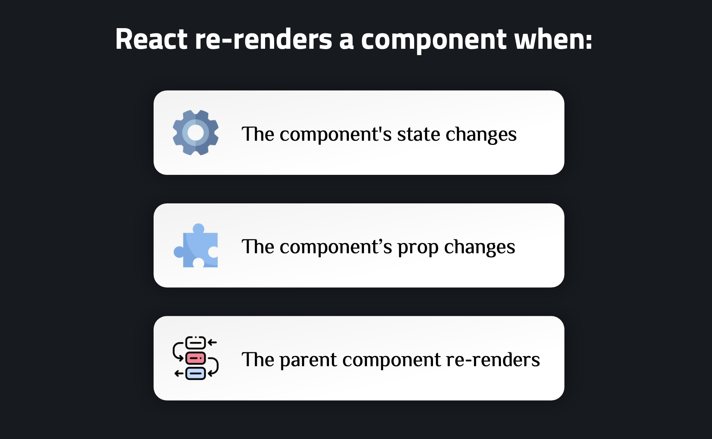

Unnecessary re-renders can reduce application performance. Below are techniques to optimize.

### React.memo

**Purpose**: Prevent component re-render when props don't change.

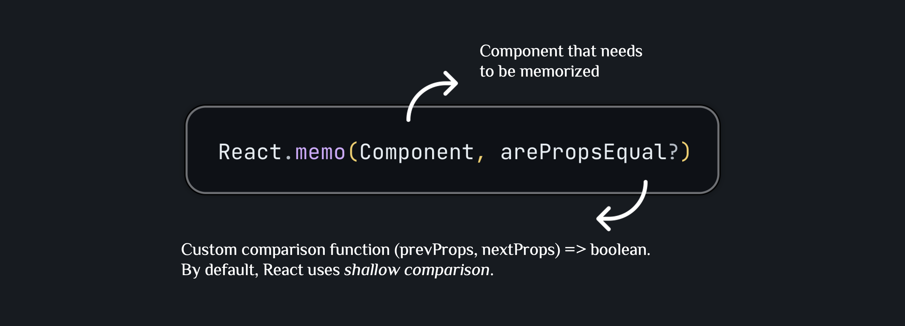

**How it works:**

1. React.memo wraps the component and creates a "memoized version"
2. When the parent component re-renders, React checks the props of the memoized component
3. If props don't change (according to shallow comparison or the `arePropsEqual` function), React skips re-rendering and uses the previous render result
4. If props change, the component will re-render normally

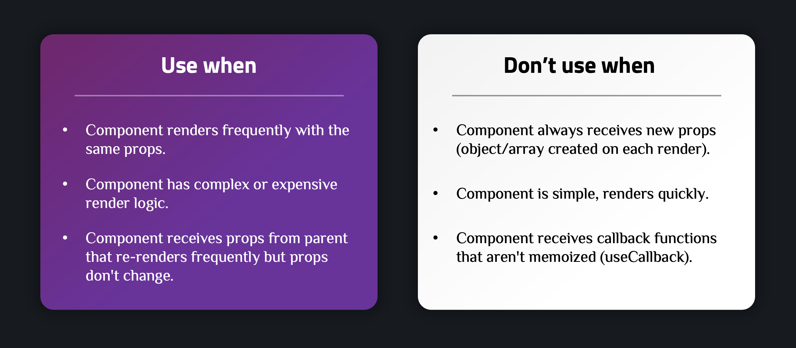

**Example in project:**

```javascript
import { memo } from "react";
import { log } from "../../log.js";

const IconButton = memo(function IconButton({ children, icon, ...props }) {
  log("<IconButton /> rendered", 2);

  const Icon = icon;
  return (
    <button {...props} className="button">
      <Icon className="button-icon" />
      <span className="button-text">{children}</span>
    </button>
  );
});
export default IconButton;
```

`IconButton` is wrapped with `memo` to avoid unnecessary re-renders when the parent component (`Counter`) re-renders but `IconButton`'s props don't change.

---

### Component Composition

**Purpose**: Reduce re-renders by moving state down to child components, avoiding unnecessary prop passing.

**How it works:**

Instead of passing many props down to child components, you can:

1. **Move state down to child components**: State only affects the child component, doesn't cause parent to re-render
2. **Use children prop**: Parent component only renders the unchanged part, dynamic parts are passed via `children`
3. **Split components**: Separate frequently changing parts into separate components

**When to use:**

- Parent component re-renders frequently but only part of UI needs updating
- Want to reduce the number of props passed down
- Need to separate logic and UI

**Example:**

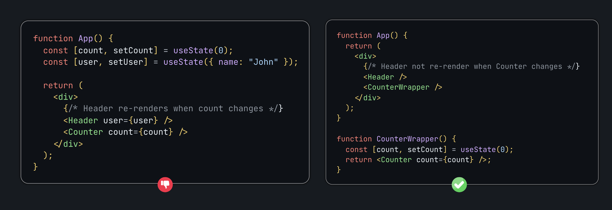

---

### useCallback

**Purpose**: Memoize callback functions to avoid creating new functions on each render, helping `React.memo` work correctly.

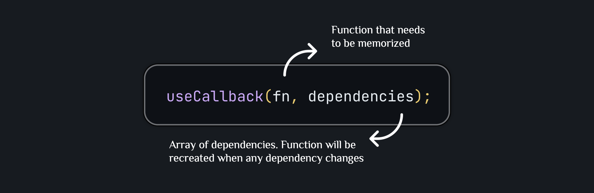

**How it works:**

1. First render: `useCallback` returns the `fn` function and stores it in memory
2. Subsequent renders:
   - If dependencies don't change: Returns the stored function (same reference)
   - If dependencies change: Creates a new function and stores it

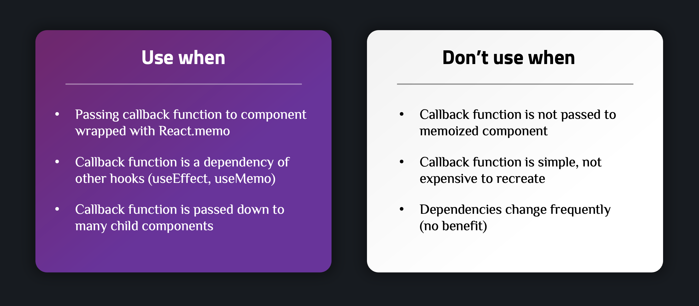

**Example in project:**

```javascript
const handleDecrement = useCallback(function handleDecrement() {
  setCounterChangers((prevCounter) => [
    { value: -1, id: Math.random() * 1000 },
    ...prevCounter,
  ]);
}, []);

const handleIncrement = useCallback(function handleIncrement() {
  setCounterChangers((prevCounter) => [
    { value: 1, id: Math.random() * 1000 },
    ...prevCounter,
  ]);
}, []);
```

`handleDecrement` and `handleIncrement` are memoized with `useCallback` and an empty dependency array `[]`, meaning they are only created once and never change. This ensures `IconButton` (wrapped with `memo`) doesn't re-render unnecessarily.

---

### useMemo

**Purpose**: Memoize the result of complex calculations to avoid recalculating on each render.

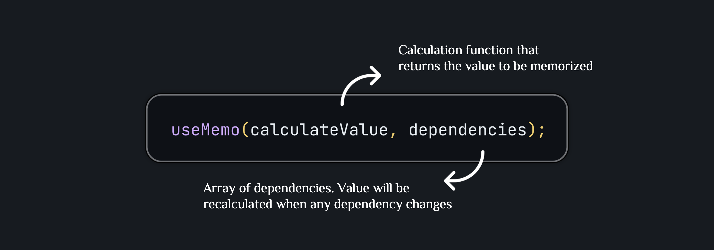

**How it works:**

1. First render: Executes `calculateValue()`, stores result in memory
2. Subsequent renders:
   - If dependencies don't change: Returns stored value (no recalculation)
   - If dependencies change: Executes `calculateValue()` again and stores new result

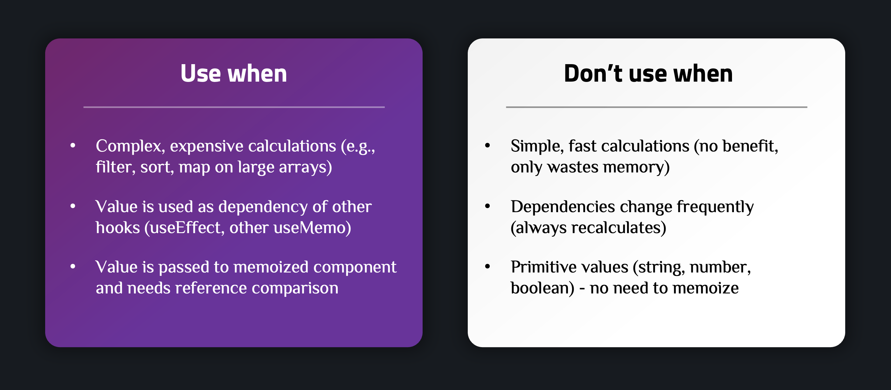

**Example in project:**

```javascript
function isPrime(number) {
  log("Calculating if is prime number", 2, "other");
  if (number <= 1) {
    return false;
  }

  const limit = Math.sqrt(number);

  for (let i = 2; i <= limit; i++) {
    if (number % i === 0) {
      return false;
    }
  }

  return true;
}

const Counter = function Counter({ initialCount }) {
  log("<Counter /> rendered", 1);
  const initialCountIsPrime = useMemo(
    () => isPrime(initialCount),
    [initialCount]
  );
};
```

The `isPrime` function is a complex calculation. `useMemo` ensures `isPrime(initialCount)` is only calculated when `initialCount` changes, not on every component re-render.

---

## 2. Virtual DOM

### Observations When Working with React

When working with React, you may notice:

- Component functions are executed every time state or props change.
- JSX is recreated every time a component re-renders.
- But the real DOM is not updated entirely—only the parts that changed are updated.

**Why this matters:** If React updated the entire real DOM every time a change occurred, this would cause poor performance, because the real DOM is a heavy structure, and manipulating it is very slow.

### How React Efficiently Handles Updates with Virtual DOM

**Virtual DOM** is a lightweight representation (copy) of the real DOM, stored in memory.

**Goal**: Compare changes between the new version and the previous version to decide what needs to be changed in the real DOM.


### React's Workflow with Virtual DOM

**Initial Render**: When a React application is loaded for the first time:

1. **React creates the component tree from JSX**

   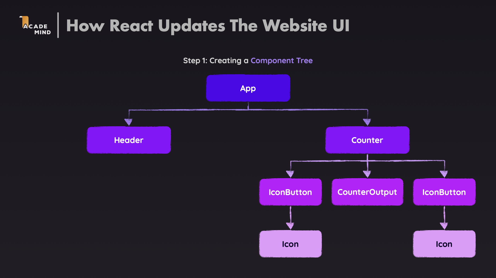

2. **Creates a Virtual DOM snapshot**—representing the state of the DOM

   

3. **From Virtual DOM, compares the new snapshot with the old snapshot**

   

4. **Then, identifies and performs necessary changes to the Real DOM**

   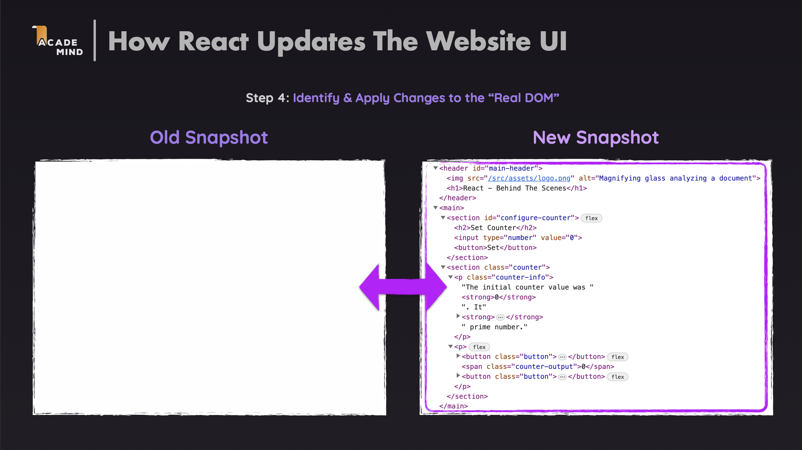

**Updates**: When users interact or state/props change:

1. **React re-runs component functions to create new JSX**

   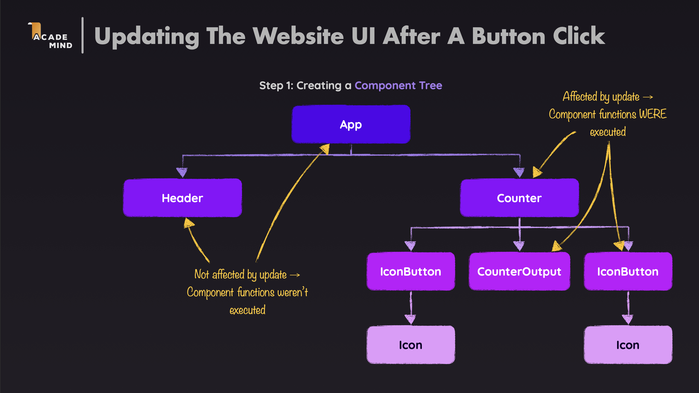

2. **Creates a new Virtual DOM snapshot from that JSX**

   

3. **Compares the new Virtual DOM with the old snapshot**

   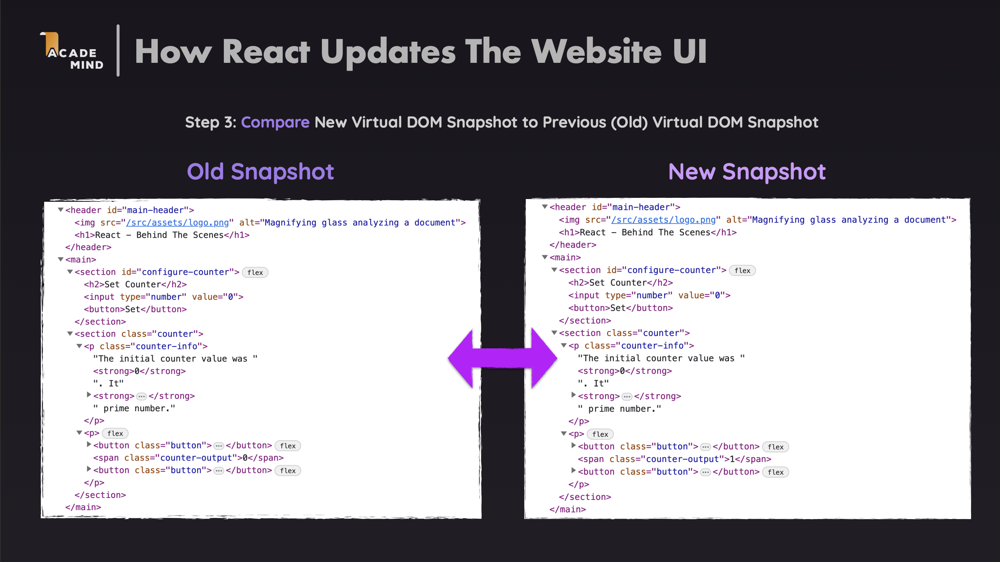

4. **Identifies what changed using the Diffing algorithm. Only changes the corresponding parts in the real DOM**

   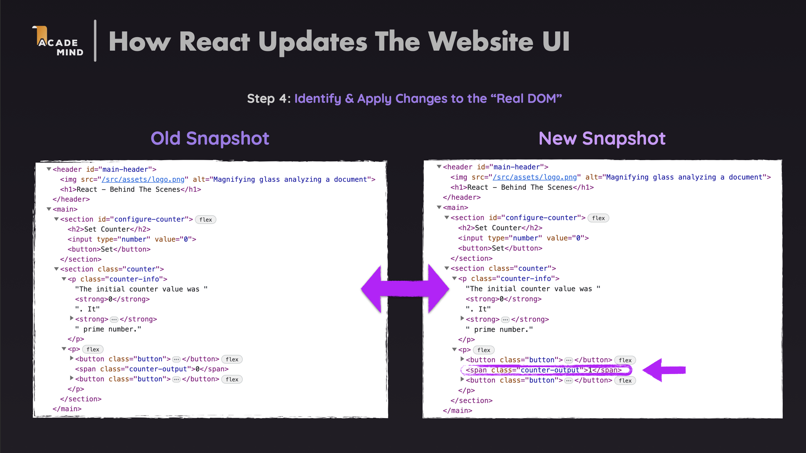

### Diffing Algorithm

React uses the Diffing algorithm to efficiently compare Virtual DOM trees:

1. **Compare by element type**: If types differ → Unmount old component, mount new component. If types are the same → Only update props/attributes.

2. **Compare by key**: Key helps React identify which element corresponds to which element.

3. **Compare by level**: React compares each level of the tree, doesn't compare the entire tree.

### Benefits of Virtual DOM

- **Performance**: Only updates parts of the DOM that actually changed
- **Optimize batch updates**: React can batch multiple state updates into a single DOM update
- **Simplify logic**: Developers don't need to worry about manually updating the DOM

---

## 3. Keys in React

### What are Keys?

**Key** is a special prop that React uses to identify elements in a list. Keys help React know which element has changed, been added, or removed. When rendering lists, React needs a way to distinguish elements. Without keys, React will use index as the default key, which can cause problems:

1. **Inefficient re-renders**: React may re-render the entire list
2. **State confusion**: Component state may be preserved on the wrong element
3. **Poor performance**: Cannot optimize updates

**How it works:**

1. **First render**: React creates a mapping between keys and elements
2. **Re-render**: React compares keys:
   - New key → Create new element
   - Old key no longer exists → Unmount element
   - Key remains → Only update props if needed

### Key Usage Rules

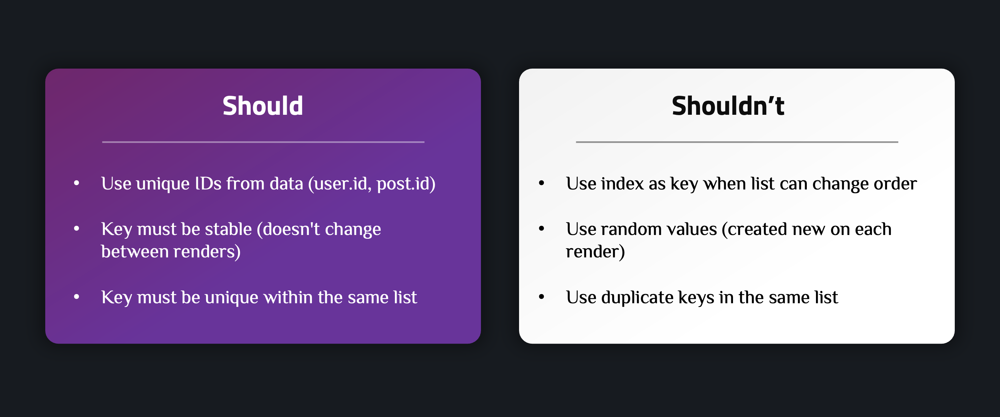

**Example in project:**

```javascript
export default function CounterHistory({ history }) {
  log("<CounterHistory /> rendered", 2);

  return (
    <ol>
      {history.map((count) => (
        <HistoryItem key={count.id} count={count.value} />
      ))}
    </ol>
  );
}
```

`CounterHistory` uses `count.id` as the key. Each item in `history` has a unique `id` created when added.

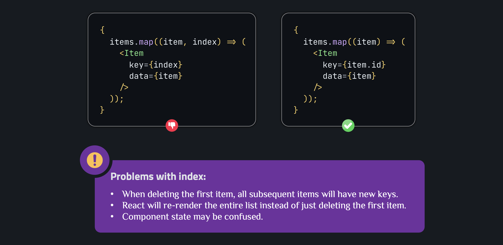

### Keys and Component Reset

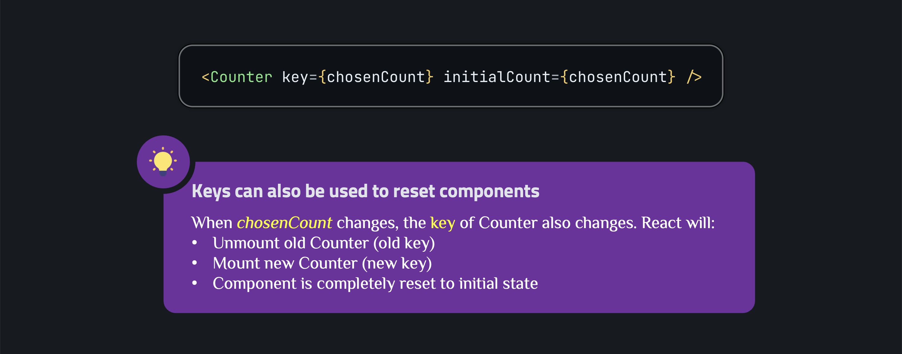

---

## 4. State Update Scheduling and Execution Mechanism

### Batching

React automatically batches multiple state updates into a single re-render to optimize performance. In React 18, all state updates are automatically batched, even in:

- Event handlers
- Promises
- setTimeout
- Native event handlers

**Example:**

```javascript
function handleClick() {
  setCount1((c) => c + 1); // Doesn't trigger re-render immediately
  setCount2((c) => c + 1); // Doesn't trigger re-render immediately
  setCount3((c) => c + 1); // Doesn't trigger re-render immediately
  // All 3 updates are batched into 1 re-render
}
```

### State Update Queue

React maintains a queue for each component to process state updates.

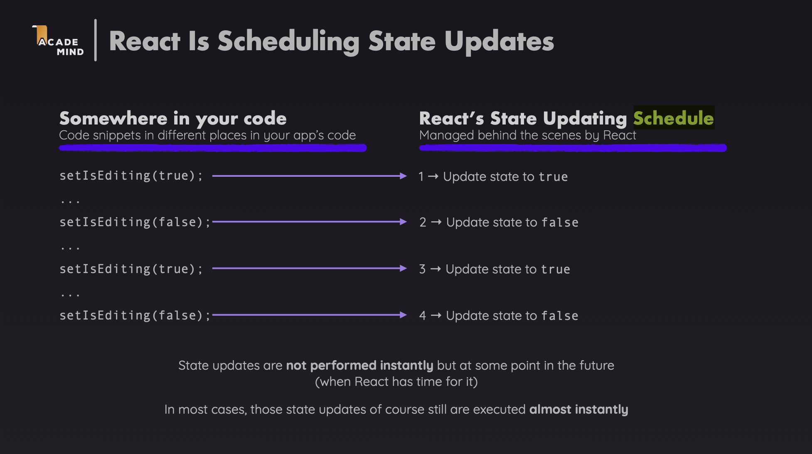

**How it works:**

1. **When calling setState**: Update is added to queue
2. **After event handler ends**: React processes all updates in queue
3. **Re-render**: Component re-renders with new state

### Functional Updates

When state update depends on previous state, should use functional form:

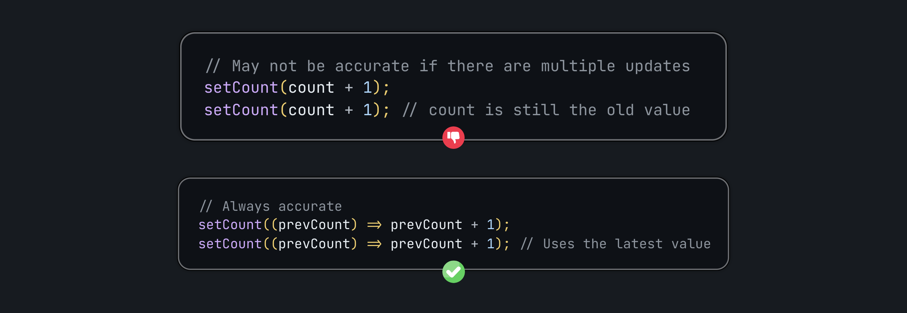

### Execution Order

1. **Synchronous code**: Runs immediately
2. **State updates**: Queued and processed later
3. **Re-render**: Occurs after all updates are processed
4. **Effects**: Run after render completes

### Example illustrating execution order

```javascript
function Component() {
  const [count, setCount] = useState(0);

  console.log("1. Render:", count);

  useEffect(() => {
    console.log("3. Effect:", count);
  }, [count]);

  function handleClick() {
    console.log("2. Before update:", count);
    setCount((c) => c + 1);
    console.log("2. After update (still old):", count);
    // count is still the old value because update hasn't been processed
  }

  return <button onClick={handleClick}>Count: {count}</button>;
}
```

**Output when clicked:**

```text
2. Before update: 0
2. After update (still old): 0
1. Render: 1
3. Effect: 1
```

---

## Summary

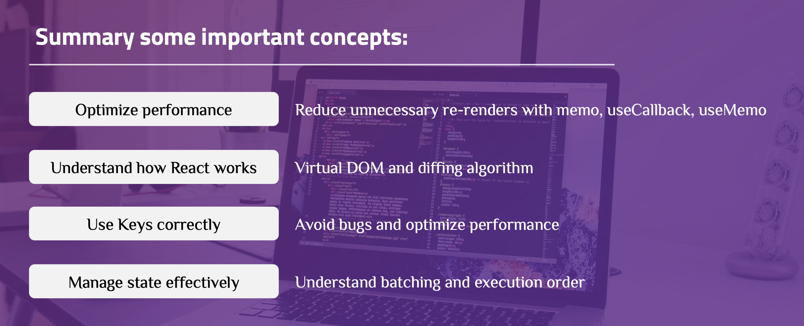
