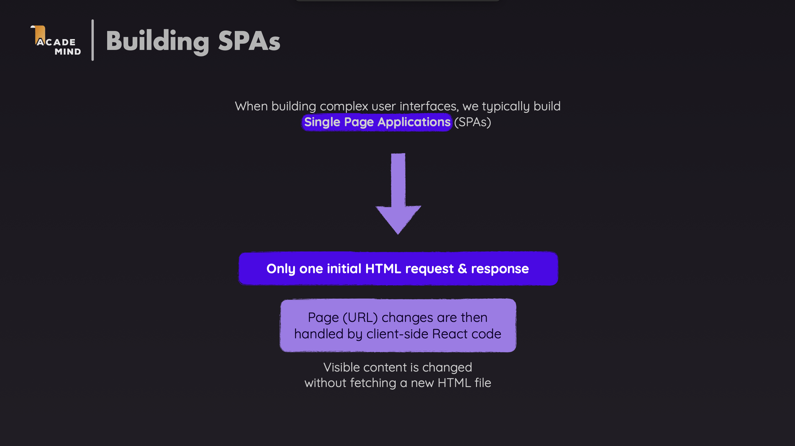

# React Router with TypeScript

A comprehensive demo application demonstrating **React Router v6** features with **TypeScript** for building single-page applications (SPAs) with client-side routing.



---

## Core Terminology

### BrowserRouter

`BrowserRouter` is a router component that uses the HTML5 history API (`pushState`, `replaceState`, `popState`) to keep your UI in sync with the URL. It enables client-side routing without full page reloads.

**Syntax**:

```typescript
import { BrowserRouter } from "react-router-dom";

<BrowserRouter>{/* Your app components */}</BrowserRouter>;
```

**When to use**: Wrap your entire application with `BrowserRouter` at the root level. This enables all routing features throughout your app.

**Example**:

```typescript
// main.tsx or App.tsx
import { BrowserRouter } from "react-router-dom";

function App() {
  return (
    <BrowserRouter>
      <Routes>{/* Your routes */}</Routes>
    </BrowserRouter>
  );
}
```

### Routes and Route

**Routes**: A container component that renders the first matching `Route` child.

**Route**: Defines a mapping between a URL path and a React component. When the URL matches the path, the component is rendered.

**Syntax**:

```typescript
import { Routes, Route } from "react-router-dom";

<Routes>
  <Route path="/path" element={<Component />} />
</Routes>;
```

**Route Props**:

- `path`: The URL path pattern to match (string)
- `element`: The React element to render when the path matches
- `index`: Boolean indicating this is an index route (default route for parent)

**Example**:

```typescript
<Routes>
  <Route path="/" element={<Home />} />
  <Route path="/about" element={<About />} />
  <Route path="/contact" element={<Contact />} />
</Routes>
```

### Link and NavLink

**Link**: A component for declarative navigation. It renders an anchor tag (`<a>`) but prevents the default browser navigation and uses client-side routing instead.

**Syntax**:

```typescript
import { Link } from "react-router-dom";

<Link to="/path">Link Text</Link>;
```

**Link Props**:

- `to`: The path to navigate to (string or object)
- `replace`: If true, replaces the current entry in history instead of adding a new one
- `state`: State to pass to the new location
- `reloadDocument`: If true, performs a full page reload instead of client-side navigation

**NavLink**: A special version of `Link` that adds styling attributes when it matches the current route. Useful for navigation menus.

**Syntax**:

```typescript
import { NavLink } from "react-router-dom";

<NavLink to="/path" className={({ isActive }) => (isActive ? "active" : "")}>
  Link Text
</NavLink>;
```

**NavLink Props**:

- All `Link` props, plus:
- `className`: Function that receives `{ isActive }` and returns className string
- `style`: Function that receives `{ isActive }` and returns style object
- `end`: If true, only matches when the pathname ends with the `to` path

### Navigate

`Navigate` is a component that redirects to a new location when rendered. It's useful for conditional redirects.

**Syntax**:

```typescript
import { Navigate } from "react-router-dom";

<Navigate to="/path" replace />;
```

**Navigate Props**:

- `to`: The path to redirect to
- `replace`: If true, replaces the current entry in history
- `state`: State to pass to the new location

### Outlet

`Outlet` is used in parent route components to render child route components. It's essential for nested routing.

**Syntax**:

```typescript
import { Outlet } from "react-router-dom";

function ParentComponent() {
  return (
    <div>
      <h1>Parent Content</h1>
      <Outlet /> {/* Child routes render here */}
    </div>
  );
}
```

**When to use**: When you have nested routes, the parent component must include `<Outlet />` to render child routes.

---

## Basic: Basic Routing Usage

### Step 1: Setup BrowserRouter

**File: `src/App.tsx`**

```typescript
import { BrowserRouter, Routes, Route } from "react-router-dom";
import Home from "./pages/Home";
import About from "./pages/About";
import Contact from "./pages/Contact";

function App() {
  return (
    <BrowserRouter>
      <Routes>
        <Route path="/" element={<Home />} />
        <Route path="/about" element={<About />} />
        <Route path="/contact" element={<Contact />} />
      </Routes>
    </BrowserRouter>
  );
}

export default App;
```

**Explanation**:

- `BrowserRouter` wraps the entire app, enabling routing
- `Routes` contains all route definitions
- Each `Route` maps a path to a component
- `path="/"` is the root/home route
- When URL matches a path, the corresponding component renders

### Step 2: Create Navigation Links

**File: `src/components/Layout.tsx`**

```typescript
import { Link, NavLink } from "react-router-dom";

function Layout() {
  return (
    <nav>
      <Link to="/">Home</Link>
      <NavLink to="/about">About</NavLink>
      <NavLink to="/contact">Contact</NavLink>
    </nav>
  );
}
```

**Explanation**:

- `Link` creates navigation links without styling
- `NavLink` automatically adds `active` class when the route matches
- Clicking links navigates without page reload (client-side routing)
- Browser URL updates, but only the matching component re-renders

### Step 3: Create Page Components

**File: `src/pages/Home.tsx`**

```typescript
import { Link } from "react-router-dom";

function Home() {
  return (
    <div>
      <h2>Home Page</h2>
      <p>Welcome to the React Router Demo!</p>
      <Link to="/about">Go to About</Link>
    </div>
  );
}

export default Home;
```

**Explanation**:

- Each page is a regular React component
- Can use `Link` to navigate to other pages
- Component only renders when the route matches

---

## Advanced: Advanced Routing Patterns

This section covers more complex routing patterns and features.

### Example 1: Dynamic Routes with URL Parameters using `useParams` and `useNavigate`

**When to use**: When you need to pass data through the URL (e.g., product IDs, user IDs).

**File: `src/App.tsx`**

```typescript
<Routes>
  <Route path="/products" element={<Products />} />
  <Route path="/products/:id" element={<ProductDetail />} />
</Routes>
```

**File: `src/pages/ProductDetail.tsx`**

```typescript
import { useParams, useNavigate } from "react-router-dom";

function ProductDetail() {
  const { id } = useParams<{ id: string }>();
  const navigate = useNavigate();

  return (
    <div>
      <h2>Product {id}</h2>
      <button onClick={() => navigate(-1)}>Go Back</button>
      <button onClick={() => navigate("/products")}>Back to Products</button>
    </div>
  );
}
```

**Explanation**:

- `:id` is a URL parameter (dynamic segment)
- `useParams()` hook extracts URL parameters
- TypeScript type `<{ id: string }>` ensures type safety
- `useNavigate()` returns a function for programmatic navigation
- `navigate(-1)` goes back in history, `navigate('/path')` navigates to a path

**URL Examples**:

- `/products/1` → `id = "1"`
- `/products/123` → `id = "123"`

### Example 2: Nested Routes with `Outlet` and `useParams`

**When to use**: When you have routes that share a common layout or parent component (e.g., user profile with tabs).

**File: `src/App.tsx`**

```typescript
<Routes>
  <Route path="/users/:userId" element={<UserProfile />}>
    <Route index element={<UserPosts />} />
    <Route path="posts" element={<UserPosts />} />
    <Route path="settings" element={<UserSettings />} />
  </Route>
</Routes>
```

**File: `src/pages/UserProfile.tsx`**

```typescript
import { Outlet, NavLink } from "react-router-dom";
import { useParams } from "react-router-dom";

function UserProfile() {
  const { userId } = useParams<{ userId: string }>();

  return (
    <div>
      <h2>User {userId}</h2>
      <nav>
        <NavLink to={`/users/${userId}`} end>
          Posts
        </NavLink>
        <NavLink to={`/users/${userId}/settings`}>Settings</NavLink>
      </nav>
      <Outlet /> {/* Child routes render here */}
    </div>
  );
}
```

**Explanation**:

- Parent route `/users/:userId` wraps child routes
- `index` route renders when path exactly matches parent
- `end` prop on `NavLink` ensures exact match
- `<Outlet />` renders the matching child route component
- Child routes are relative to parent path

**URL Examples**:

- `/users/1` → Renders `UserProfile` with `UserPosts` (index route)
- `/users/1/posts` → Renders `UserProfile` with `UserPosts`
- `/users/1/settings` → Renders `UserProfile` with `UserSettings`

### Example 3: Protected Routes with `Navigate` and `useLocation`

**When to use**: When you need to restrict access to certain routes based on authentication or authorization.

**File: `src/components/ProtectedRoute.tsx`**

```typescript
import { Navigate, useLocation } from "react-router-dom";
import { ReactNode } from "react";

interface ProtectedRouteProps {
  children: ReactNode;
}

function ProtectedRoute({ children }: ProtectedRouteProps) {
  const isAuthenticated = localStorage.getItem("isAuthenticated") === "true";
  const location = useLocation();

  if (!isAuthenticated) {
    return <Navigate to="/login" state={{ from: location }} replace />;
  }

  return <>{children}</>;
}
```

**File: `src/App.tsx`**

```typescript
<Routes>
  <Route path="/login" element={<Login />} />
  <Route
    path="/dashboard"
    element={
      <ProtectedRoute>
        <Dashboard />
      </ProtectedRoute>
    }
  />
</Routes>
```

**File: `src/pages/Login.tsx`**

```typescript
import { useNavigate, useLocation } from "react-router-dom";

function Login() {
  const navigate = useNavigate();
  const location = useLocation();

  // Get the page user was trying to access
  const from =
    (location.state as { from?: Location })?.from?.pathname || "/dashboard";

  const handleLogin = () => {
    localStorage.setItem("isAuthenticated", "true");
    navigate(from, { replace: true });
  };

  return (
    <div>
      <h2>Login</h2>
      <button onClick={handleLogin}>Login</button>
    </div>
  );
}
```

**Explanation**:

- `ProtectedRoute` checks authentication before rendering children
- If not authenticated, redirects to `/login` with `state` containing original location
- `Navigate` component performs the redirect
- `replace` prop replaces history entry instead of adding new one
- After login, user is redirected back to the page they tried to access
- `useLocation()` gets current location, including state passed from `Navigate`

### Example 4: Query Parameters with `useSearchParams`

**When to use**: When you need to pass optional data through the URL (e.g., search queries, filters).

**File: `src/pages/Search.tsx`**

```typescript
import { useSearchParams, useNavigate } from "react-router-dom";

function Search() {
  const [searchParams, setSearchParams] = useSearchParams();
  const query = searchParams.get("q") || "";
  const category = searchParams.get("category") || "all";

  const handleSearch = (newQuery: string) => {
    setSearchParams({ q: newQuery, category });
  };

  const handleCategoryChange = (newCategory: string) => {
    setSearchParams({ q: query, category: newCategory });
  };

  return (
    <div>
      <input
        value={query}
        onChange={(e) => handleSearch(e.target.value)}
        placeholder="Search..."
      />
      <select
        value={category}
        onChange={(e) => handleCategoryChange(e.target.value)}
      >
        <option value="all">All</option>
        <option value="tutorial">Tutorial</option>
      </select>
    </div>
  );
}
```

**Explanation**:

- `useSearchParams()` returns `[searchParams, setSearchParams]` tuple
- `searchParams.get('key')` reads a query parameter value
- `setSearchParams({ key: value })` updates query parameters
- URL updates automatically when search params change
- Browser back/forward buttons work with query parameter changes

**URL Examples**:

- `/search?q=react` → `query = "react"`
- `/search?q=react&category=tutorial` → `query = "react"`, `category = "tutorial"`

### Example 5: Programmatic Navigation with `useNavigate`

**When to use**: When you need to navigate based on user actions or conditions (e.g., after form submission, on button click).

**File: `src/pages/Contact.tsx`**

```typescript
import { useNavigate } from "react-router-dom";

function Contact() {
  const navigate = useNavigate();

  const handleSubmit = (e: React.FormEvent) => {
    e.preventDefault();
    // Process form...
    navigate("/thank-you", { replace: true });
  };

  return (
    <form onSubmit={handleSubmit}>
      {/* Form fields */}
      <button type="submit">Submit</button>
    </form>
  );
}
```

**useNavigate Hook**:

- Returns a function to navigate programmatically
- `navigate('/path')` - Navigate to a path
- `navigate(-1)` - Go back in history
- `navigate(1)` - Go forward in history
- `navigate('/path', { replace: true })` - Replace current history entry
- `navigate('/path', { state: { data: 'value' } })` - Pass state to new location

**Example with state**:

```typescript
navigate("/dashboard", {
  state: { message: "Login successful" },
  replace: true,
});
```

### Example 6: Layout Routes with `Outlet`

**When to use**: When multiple routes share a common layout (header, sidebar, etc.).

**File: `src/App.tsx`**

```typescript
<Routes>
  <Route path="/" element={<Layout />}>
    <Route index element={<Home />} />
    <Route path="about" element={<About />} />
    <Route path="contact" element={<Contact />} />
  </Route>
</Routes>
```

**File: `src/components/Layout.tsx`**

```typescript
import { Outlet, Link } from "react-router-dom";

function Layout() {
  return (
    <div>
      <header>
        <nav>
          <Link to="/">Home</Link>
          <Link to="/about">About</Link>
          <Link to="/contact">Contact</Link>
        </nav>
      </header>
      <main>
        <Outlet /> {/* Child routes render here */}
      </main>
      <footer>Footer content</footer>
    </div>
  );
}
```

**Explanation**:

- `Layout` component wraps all child routes
- `<Outlet />` renders the matching child route
- Header and footer are shared across all pages
- Only the content inside `<Outlet />` changes when navigating

### Example 7: Catch-All Route (404) with `useNavigate`

**When to use**: To handle routes that don't match any defined route.

**File: `src/App.tsx`**

```typescript
<Routes>
  <Route path="/" element={<Home />} />
  <Route path="/about" element={<About />} />
  <Route path="*" element={<NotFound />} />
</Routes>
```

**File: `src/pages/NotFound.tsx`**

```typescript
import { Link, useNavigate } from "react-router-dom";

function NotFound() {
  const navigate = useNavigate();

  return (
    <div>
      <h2>404 - Page Not Found</h2>
      <button onClick={() => navigate(-1)}>Go Back</button>
      <Link to="/">Go to Home</Link>
    </div>
  );
}
```

**Explanation**:

- `path="*"` matches any route not matched by previous routes
- Must be placed last in the `Routes` component
- Useful for displaying 404 pages or redirecting to home

---

## Summary

React Router enables client-side routing in React applications, allowing you to build single-page applications (SPAs) with multiple views that update without full page reloads.

### Core Components

1. **BrowserRouter**: Wraps the entire application to enable routing features. Uses HTML5 history API to keep UI in sync with URL without page reloads.

2. **Routes & Route**: Define route mappings between URL paths and React components. `Routes` contains multiple `Route` components, rendering the first matching route.

3. **Link & NavLink**: Navigate declaratively between routes. `Link` creates navigation links, while `NavLink` adds active styling when the route matches. Both prevent default browser navigation.

4. **Navigate**: Component that redirects to a new location when rendered. Useful for conditional redirects and protected routes.

5. **Outlet**: Renders child route components in parent route components. Essential for nested routing and layout routes.

### Advanced Features

- **Dynamic Routes**: Use `:param` syntax in paths to capture URL parameters. Access parameters with `useParams()` hook for type-safe parameter extraction.

- **Nested Routes**: Create route hierarchies where child routes share a parent layout. Use `index` routes for default child routes and relative paths.

- **Protected Routes**: Restrict access to routes based on authentication or authorization. Use `Navigate` with state to redirect unauthenticated users and preserve intended destination.

- **Query Parameters**: Handle search params with `useSearchParams()` hook. Read and update query string parameters without affecting the route path.

### Key Hooks

- **useNavigate()**: Programmatic navigation - navigate to paths, go back/forward in history, pass state
- **useParams()**: Extract URL parameters from dynamic routes
- **useLocation()**: Access current location object including pathname, search, and state
- **useSearchParams()**: Read and update URL query parameters

---

## Learn More

After mastering the basic and advanced concepts above, you can continue learning the following topics:

### 1. Route Loaders and Actions (React Router v6.4+)

**Data Loading**:

- Load data before rendering routes
- Handle loading and error states
- Use `loader` function in route configuration

**Example**:

```typescript
// Route configuration
const router = createBrowserRouter([
  {
    path: "/products/:id",
    element: <ProductDetail />,
    loader: async ({ params }) => {
      const product = await fetchProduct(params.id);
      return product;
    },
  },
]);

// In component
import { useLoaderData } from "react-router-dom";

function ProductDetail() {
  const product = useLoaderData() as Product;
  return <div>{product.name}</div>;
}
```

**Documentation**: [React Router Loaders](https://reactrouter.com/en/main/route/loader)

### 2. Lazy Loading Routes

**Code Splitting**:

- Load route components only when needed
- Improve initial bundle size
- Use React `lazy()` and `Suspense`

**Example**:

```typescript
import { lazy, Suspense } from "react";
import { Routes, Route } from "react-router-dom";

const Dashboard = lazy(() => import("./pages/Dashboard"));
const Settings = lazy(() => import("./pages/Settings"));

function App() {
  return (
    <Suspense fallback={<div>Loading...</div>}>
      <Routes>
        <Route path="/dashboard" element={<Dashboard />} />
        <Route path="/settings" element={<Settings />} />
      </Routes>
    </Suspense>
  );
}
```

**Documentation**: [React Code Splitting](https://react.dev/reference/react/lazy)

### 3. Route Transitions and Animations

**Page Transitions**:

- Animate route changes
- Use libraries like Framer Motion
- Create smooth page transitions

**Example**:

```typescript
import { motion, AnimatePresence } from "framer-motion";
import { useLocation } from "react-router-dom";

function AnimatedRoutes() {
  const location = useLocation();

  return (
    <AnimatePresence mode="wait">
      <Routes location={location} key={location.pathname}>
        <Route path="/" element={<Home />} />
      </Routes>
    </AnimatePresence>
  );
}
```

### 4. Testing Routes

**Testing Strategies**:

- Test route rendering
- Test navigation
- Mock router in tests

**Example**:

```typescript
import { render, screen } from "@testing-library/react";
import { BrowserRouter } from "react-router-dom";

test("renders home page", () => {
  render(
    <BrowserRouter>
      <App />
    </BrowserRouter>
  );
  expect(screen.getByText("Home")).toBeInTheDocument();
});
```

**Documentation**: [Testing React Router](https://reactrouter.com/en/main/start/testing)

### 5. Route Configuration Objects

**Declarative Routes**:

- Define routes as objects
- Use `createBrowserRouter`
- Better for complex routing

**Example**:

```typescript
import { createBrowserRouter, RouterProvider } from "react-router-dom";

const router = createBrowserRouter([
  {
    path: "/",
    element: <Layout />,
    children: [
      { index: true, element: <Home /> },
      { path: "about", element: <About /> },
    ],
  },
]);

function App() {
  return <RouterProvider router={router} />;
}
```

**Documentation**: [createBrowserRouter](https://reactrouter.com/en/main/routers/create-browser-router)

## References

- [React Router Documentation](https://reactrouter.com/)
- [React Router v6 Migration Guide](https://reactrouter.com/en/main/upgrading/v5)
- [React Router API Reference](https://reactrouter.com/en/main/routers/picking-a-router)
- [TypeScript with React Router](https://reactrouter.com/en/main/start/typescript)
- [React Router Examples](https://github.com/remix-run/react-router/tree/main/examples)
