# REDUX TOOLKIT

## Core terminology

**createSlice**:

- Function that generates reducer, action creators and action types together.
- Reduces boilerplate code.

**configureStore**:

- Function that creates a store with good defaults.
- Replace the older `createStore`.

**createSelector**:

- Function that creates a selector function.
- Used to create memoized selectors.

**createAsyncThunk**:

- Create thunk actions for async operations (API calls).
- Automatically generates pending, fulfilled, and rejected action.

**thunk**:

- A function that returns a function (instead of an action object).
- Used to handle asynchronous operations.

**Immer**:

- Library that lets you write "mutating" logic while creating immutable updates.
- Redux Toolkit uses Immer automatically.

---

## Basic: Implement Auth Feature

This section guides you through implementing a simple feature with Redux Toolkit, without async operations.

**Why this order?** We create the slice first because the store setup needs to import the reducer from the slice. This follows the natural development flow: define your feature logic (slice) → combine reducers → setup store → use in components.

### Step 1: Create Auth Slice with `createSlice`

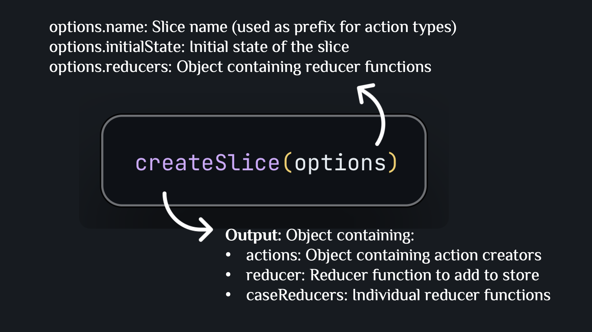

**Example**:

```typescript
import { createSlice, PayloadAction } from "@reduxjs/toolkit";
import { User } from "../../types";

export interface AuthState {
  isAuthenticated: boolean;
  user: User | null;
}

const initialState: AuthState = {
  isAuthenticated: false,
  user: null,
};

const authSlice = createSlice({
  name: "auth",
  initialState,
  reducers: {
    login: (state, action: PayloadAction<User>) => {
      state.isAuthenticated = true;
      state.user = action.payload;
    },
    logout: (state) => {
      state.isAuthenticated = false;
      state.user = null;
    },
  },
});

export const { login, logout } = authSlice.actions;
export default authSlice.reducer;
```

**Explanation**:

- `createSlice` automatically creates action types: `"auth/login"`, `"auth/logout"`
- Automatically creates action creators: `login(user)`, `logout()`
- Automatically creates reducer to handle those actions
- **Benefit**: Instead of writing separate action types, action creators, and reducer, you only need to define reducers in an object
- `PayloadAction<T>` helps TypeScript know the type of `action.payload`
- Can write "mutating" logic (like `state.isAuthenticated = true`) thanks to Immer automatically converting to immutable update

### Step 2: Setup Store

#### 2.1. Create Root Reducer with `combineReducers`

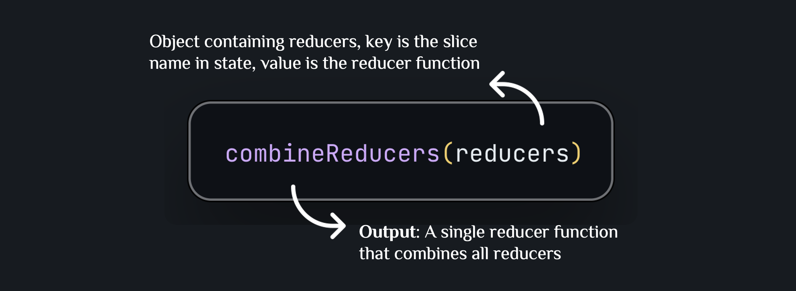

**Example**:

```typescript
import { combineReducers } from "@reduxjs/toolkit";
import authReducer from "../features/auth/authSlice";

export const rootReducer = combineReducers({
  auth: authReducer,
});
```

**Explanation**:

- `combineReducers` combines multiple reducers into a single reducer
- State will have the structure: `{ auth: {...} }`
- Each reducer only manages its own part of the state
- **Note**: You can add more reducers later (e.g., `articles: articlesReducer`)

#### 2.2. Create Store with `configureStore`

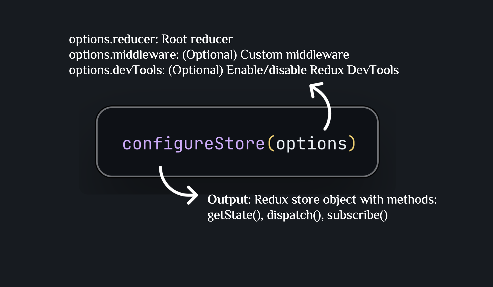

**Example**:

```typescript
import { configureStore } from "@reduxjs/toolkit";
import { rootReducer } from "./rootReducer";

export const store = configureStore({
  reducer: rootReducer,
});

export type RootState = ReturnType<typeof store.getState>;
export type AppDispatch = typeof store.dispatch;
```

**Explanation**:

- `configureStore` automatically sets up Redux DevTools and thunk middleware
- `RootState` type helps TypeScript know the state structure
- `AppDispatch` type helps TypeScript know which actions can be dispatched

#### 2.3. Setup Provider in App

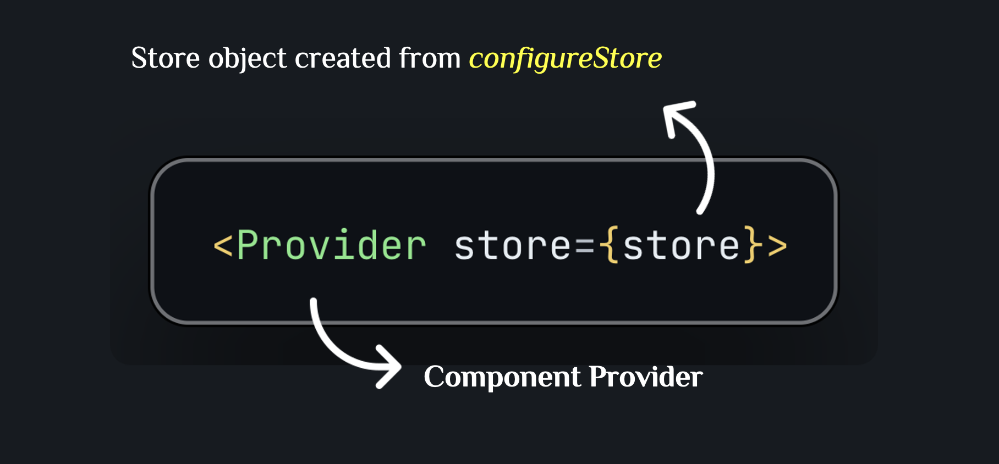

**Example**:

```typescript
import { Provider } from "react-redux";
import { store } from "./store/index.ts";

ReactDOM.createRoot(document.getElementById("root")!).render(
  <Provider store={store}>
    <App />
  </Provider>
);
```

**Explanation**: Provider makes the store accessible from all child components

#### 2.4. Create Typed Hooks

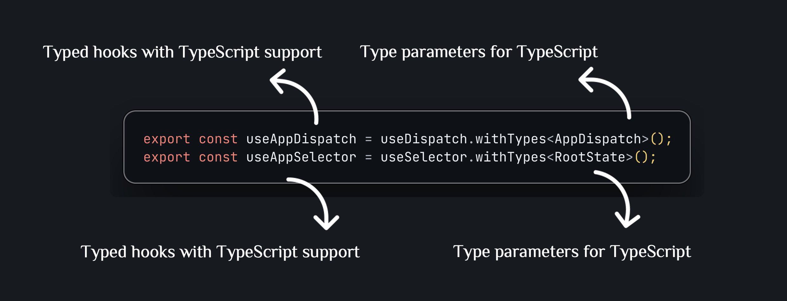

**Example**:

```typescript
import { useDispatch, useSelector } from "react-redux";
import type { RootState, AppDispatch } from "./index";

export const useAppDispatch = useDispatch.withTypes<AppDispatch>();
export const useAppSelector = useSelector.withTypes<RootState>();
```

**Explanation**:

- Helps TypeScript automatically suggest and check types when used
- Prevents type errors when dispatching actions or selecting state

### Step 3: Create Selectors with `createSelector`

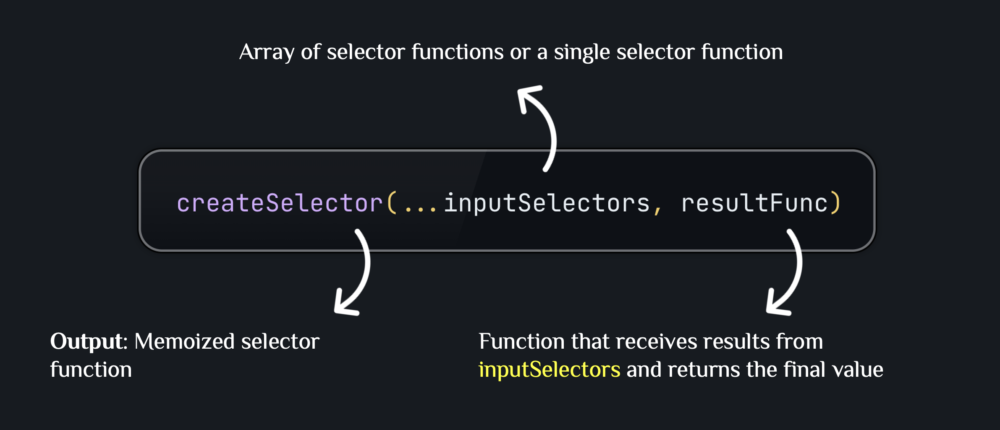

**Example**:

```typescript
import { createSelector } from "@reduxjs/toolkit";
import { RootState } from "../../store/index.ts";

export const selectIsAuthenticated = createSelector(
  (state: RootState) => state.auth.isAuthenticated,
  (isAuthenticated) => isAuthenticated
);

export const selectUser = createSelector(
  (state: RootState) => state.auth.user,
  (user) => user
);
```

**Explanation**:

- `createSelector` creates a memoized selector: only recalculates when input changes
- First parameter: selector that gets value from state
- Second parameter: transform function (here it's an identity function, doesn't change the value)
- **Benefit**: Optimizes performance, prevents unnecessary re-renders

### Step 4: Use in Component

#### 4.1. Dispatch Actions

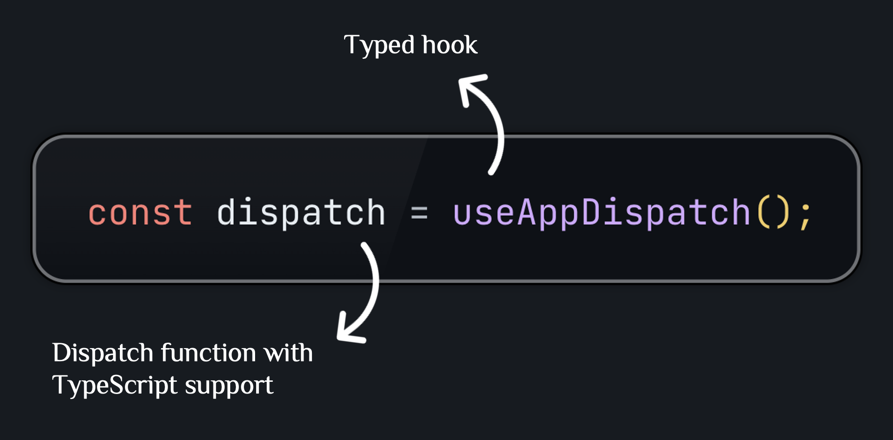

**Example**:

```typescript
import { useAppDispatch } from "../store/hooks";
import { login } from "../features/auth/authSlice";

const LoginPage = () => {
  const dispatch = useAppDispatch();

  const handleSubmit = (e: React.FormEvent) => {
    dispatch(
      login({
        id: Date.now(),
        username: "john",
        email: "john@example.com",
        name: "John Doe",
      })
    );
  };
};
```

**Explanation**:

- `dispatch(action)` sends action to store
- Action creator `login(user)` automatically creates action object with type `"auth/login"` and payload is user

#### 4.2. Select State

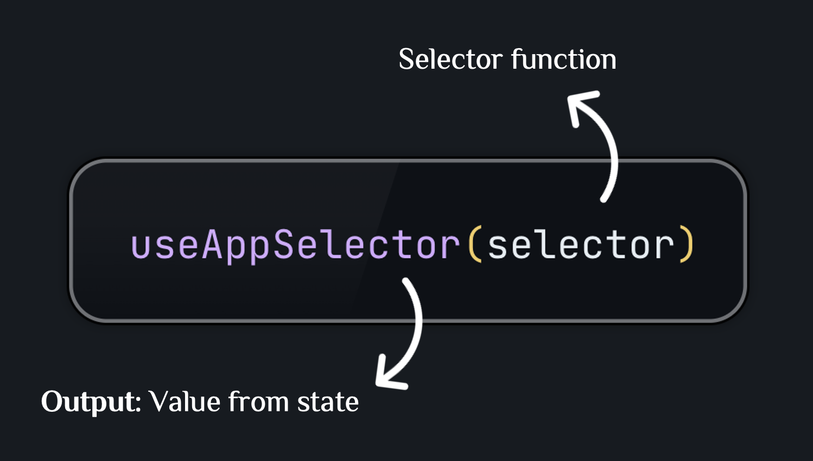

**Example**:

```typescript
import { useAppSelector } from "../store/hooks";
import {
  selectIsAuthenticated,
  selectUser,
} from "../features/auth/authSelectors";

const Component = () => {
  const isAuthenticated = useAppSelector(selectIsAuthenticated);
  const user = useAppSelector(selectUser);

  return <div>{isAuthenticated ? `Hello ${user?.name}` : "Please login"}</div>;
};
```

**Explanation**:

- `useAppSelector` automatically subscribes to state changes
- Component will re-render when value from selector changes
- Using memoized selector helps prevent re-render when value doesn't change

---

## Advanced: Implement Articles Feature

This section guides you through implementing a more complex feature with async operations and advanced selectors.

### Step 1: Create Async Thunks with `createAsyncThunk`

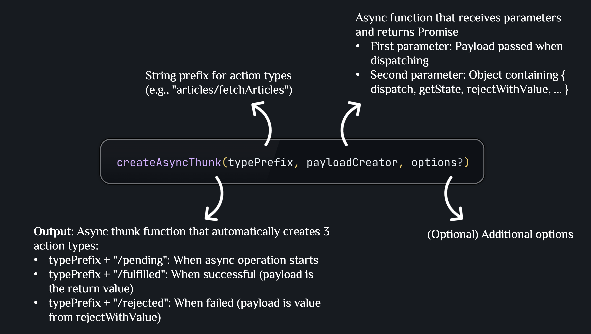

**Example**:

```typescript
import { createAsyncThunk } from "@reduxjs/toolkit";
import { newsApi } from "../../services/newsApi";

export const fetchArticles = createAsyncThunk(
  "articles/fetchArticles",
  async (
    params: {
      page: number;
      pageSize: number;
      filters?: {
        search?: string;
        category?: string;
        sortBy?: "date" | "title" | "author";
      };
    },
    { rejectWithValue }
  ) => {
    try {
      const response = await newsApi.fetchArticles(
        params.page,
        params.pageSize,
        params.filters
      );
      return response; // Return data → will be action.payload in fulfilled
    } catch (error: any) {
      return rejectWithValue(error.message || "Failed to fetch articles");
      // rejectWithValue → will be action.payload in rejected
    }
  }
);
```

**Explanation**:

- `createAsyncThunk` automatically creates 3 actions: `fetchArticles.pending`, `fetchArticles.fulfilled`, `fetchArticles.rejected`
- **Benefit**: No need to manually write action types and action creators for async operations
- `rejectWithValue` helps pass error message into action.payload instead of throwing error

### Step 2: Create Articles Slice with `extraReducers`

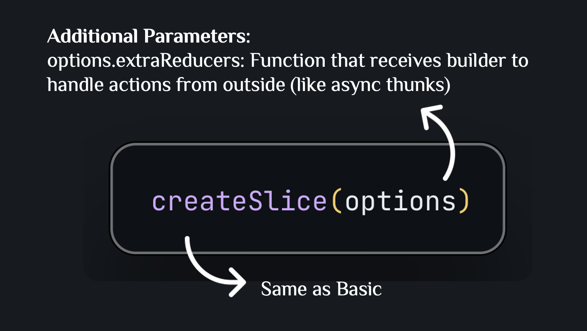

**Example**:

```typescript
import { createSlice, PayloadAction } from "@reduxjs/toolkit";
import { fetchArticles, fetchArticleById, searchArticles } from "./articlesApi";

const articlesSlice = createSlice({
  name: "articles",
  initialState,
  reducers: {
    // Synchronous reducers (same as Basic)
    setArticles: (state, action: PayloadAction<Article[]>) => {
      state.items = action.payload;
    },
    // ... other reducers
  },
  extraReducers: (builder) => {
    builder
      // Handle when fetchArticles.pending
      .addCase(fetchArticles.pending, (state) => {
        state.loading = true;
        state.error = null;
      })
      // Handle when fetchArticles.fulfilled
      .addCase(fetchArticles.fulfilled, (state, action) => {
        state.loading = false;
        state.items = action.payload.articles; // action.payload is the return value from async function
        state.pagination = action.payload.pagination;
        state.error = null;
      })
      // Handle when fetchArticles.rejected
      .addCase(fetchArticles.rejected, (state, action) => {
        state.loading = false;
        state.error = (action.payload as string) || "Failed to fetch articles";
        // action.payload is the value from rejectWithValue
      });
  },
});
```

**Explanation**:

- `extraReducers` is used to handle actions not created from `reducers` of this slice
- `builder.addCase(action, reducer)` adds a case handler for a specific action
- **Benefit**: Centralizes logic for handling async states (loading, error) in one place

### Step 3: Create Advanced Selectors

**Example with multiple input selectors**:

```typescript
import { createSelector } from "@reduxjs/toolkit";
import type { RootState } from "../../store";

// Base selector
const selectArticlesState = (state: RootState) => state.articles;

// Selector with 1 input
export const selectAllArticles = createSelector(
  [selectArticlesState],
  (articlesState) => articlesState.items
);

// Selector with multiple inputs (with parameters)
export const selectArticleById = createSelector(
  [selectAllArticles, (_state: RootState, id: number) => id],
  (articles, id) => articles.find((article) => article.id === id)
);

// Selector with filter
export const selectArticlesByCategory = createSelector(
  [selectAllArticles, (_state: RootState, category: string) => category],
  (articles, category) =>
    category === "All"
      ? articles
      : articles.filter((article) => article.category === category)
);
```

**Explanation**:

- Selector can receive multiple inputs: `[selector1, selector2, ...]`
- Selector can receive parameters: add function `(state, param) => param` to the inputs array
- **Benefit**: Create complex selectors with automatic memoization

### Step 4: Use Async Thunks in Component

**Example**:

```typescript
import { useAppDispatch, useAppSelector } from "../store/hooks";
import { fetchArticles } from "../features/articles/articlesApi";
import {
  selectAllArticles,
  selectArticlesLoading,
} from "../features/articles/articlesSelectors";

const HomePage = () => {
  const dispatch = useAppDispatch();
  const articles = useAppSelector(selectAllArticles);
  const loading = useAppSelector(selectArticlesLoading);

  useEffect(() => {
    dispatch(
      fetchArticles({
        page: 1,
        pageSize: 10,
        filters: {
          search: "react",
          category: "Technology",
          sortBy: "date",
        },
      })
    );
  }, [dispatch]);

  if (loading) return <div>Loading...</div>;
  return <div>{/* Render articles */}</div>;
};
```

**Explanation**:

- Dispatch async thunk is the same as dispatching a regular action
- Redux Toolkit automatically dispatches `pending` → `fulfilled`/`rejected`
- Component automatically re-renders when state changes (loading, articles, error)

---

## Summary

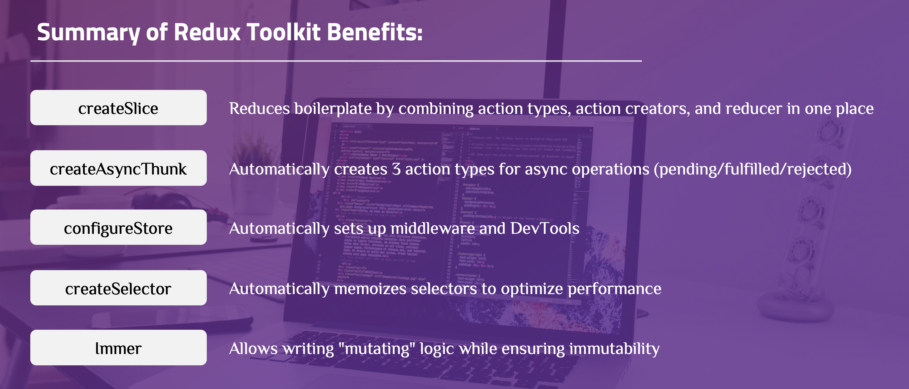

---

## Learn More

After mastering the basic and advanced concepts above, you can continue learning the following topics:

### 1. RTK Query - Data Fetching and Caching

**RTK Query** is a data fetching and caching solution built on Redux Toolkit that simplifies fetching data from APIs.

**Key Features**:

- Automatically generates API endpoints and hooks
- Automatically caches and refetches data
- Automatically manages loading and error states
- Supports optimistic updates
- Supports pagination, infinite scroll

**When to Use**:

- When you have many API calls
- Need to cache and sync data between components
- Want to reduce boilerplate code for data fetching

**Documentation**: [RTK Query Documentation](https://redux-toolkit.js.org/rtk-query/overview)

### 2. Middleware and Custom Middleware

**Middleware** are functions that run between dispatching actions and reducers, allowing you to:

- Log actions and state changes
- Perform async operations
- Transform actions before they reach the reducer
- Cancel or delay actions

**Common Middleware Examples**:

- `redux-logger`: Logs all actions and state changes
- `redux-persist`: Saves state to localStorage
- Custom middleware for authentication, error handling

**Documentation**: [Redux Middleware](https://redux.js.org/tutorials/fundamentals/part-4-store#middleware)

### 3. Normalizing State Shape

**Normalization** is a technique for organizing nested state into flat structure, helping to:

- Avoid duplicate data
- Easily update and delete items
- Optimize performance when selecting data
- Easily cache and sync data

**Example**:

```typescript
// ❌ Not normalized (nested)
{
  articles: [
    { id: 1, author: { id: 1, name: "John" } },
    { id: 2, author: { id: 1, name: "John" } }
  ]
}

// ✅ Normalized (flat)
{
  articles: {
    byId: { 1: {...}, 2: {...} },
    allIds: [1, 2]
  },
  authors: {
    byId: { 1: { id: 1, name: "John" } },
    allIds: [1]
  }
}
```

**Documentation**: [Normalizing State Shape](https://redux.js.org/usage/structuring-reducers/normalizing-state-shape)

### 4. Redux DevTools Extension

**Redux DevTools** is a browser extension that helps debug Redux applications:

- View entire action history
- Time-travel debugging (go back to previous state)
- Inspect state at any point in time
- Export/import state for testing
- Monitor performance

**Installation**: [Redux DevTools Extension](https://github.com/reduxjs/redux-devtools-extension)

### 5. Testing Redux Code

**Testing** Redux code includes:

- **Unit test** for reducers: Test state handling logic
- **Unit test** for selectors: Test calculations from state
- **Integration test** for async thunks: Test API calls and error handling
- **Component test**: Test components using Redux hooks

**Supporting Tools**:

- `@testing-library/react`: Test React components
- `@reduxjs/toolkit/query/react`: Test RTK Query
- Mock store for testing

**Documentation**: [Testing Redux](https://redux.js.org/usage/writing-tests)

### 6. Code Splitting and Lazy Loading

**Code splitting** helps optimize bundle size by:

- Splitting Redux code into small chunks
- Loading reducer and middleware when needed
- Using dynamic imports for large features

**Example**:

```typescript
// Lazy load reducer
const articlesReducer = await import("./features/articles/articlesSlice");
```

### 7. TypeScript Best Practices

**TypeScript** with Redux Toolkit:

- Use `PayloadAction<T>` for typed actions
- Create typed hooks with `useAppDispatch` and `useAppSelector`
- Use `ReturnType` to infer types from store
- Create utility types for complex state shapes

**Documentation**: [TypeScript Quick Start](https://redux-toolkit.js.org/usage/usage-with-typescript)

### 8. Performance Optimization

**Performance optimization** in Redux:

- Use `createSelector` to memoize expensive calculations
- Avoid unnecessary re-renders with `React.memo`
- Use `useMemo` and `useCallback` when needed
- Normalize state to avoid deep nesting
- Use RTK Query for automatic caching

---

**References**:

- [Redux Toolkit Documentation](https://redux-toolkit.js.org/)
- [Redux Essentials Tutorial](https://redux.js.org/tutorials/essentials/part-1-overview-concepts)
- [Redux Style Guide](https://redux.js.org/style-guide/)
