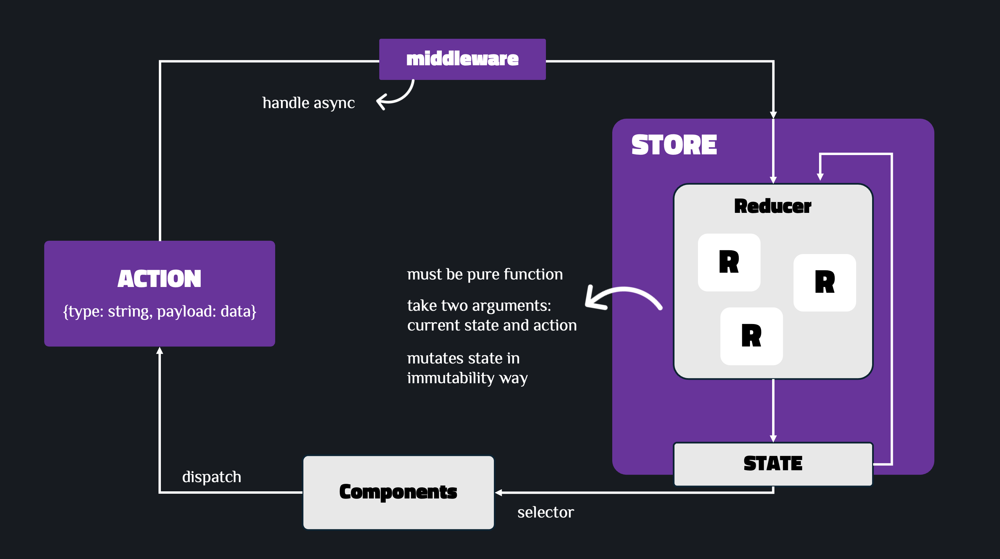

# React Redux Basics

A learning project to understand the fundamentals of Redux state management in React applications. This project demonstrates how to implement Redux from scratch using TypeScript, covering core concepts, folder structure, and best practices.

## Redux Data Flow

The diagram below illustrates the one-way data flow in Redux:



In Redux, data flows in one direction only: **Action → Reducer → State → Component**.

1. **User Interaction** → Component receives user input (e.g., button click)

2. **Dispatch Action** → Component uses **dispatch** (function that sends an action to update state) to send an **action** object (object describing what happened, must have a `type` property, may include `payload`). Actions are typically created by **action creators** (functions that create and return action objects, reducing boilerplate).

3. **Middleware Processing** (optional) → Action passes through **middleware** chain (extension mechanism for Redux. Examples: Redux Thunk, Redux Saga), which can:

   - Handle asynchronous operations (API calls, timers)
   - Log actions for debugging
   - Transform or filter actions
   - Dispatch additional actions based on conditions

4. **Reducer Processing** → Action reaches the **reducer** (pure function - no side effects, same input = same output), which:

   - Takes the current **state** (application data stored in a single Javascript object) and action as inputs
   - Computes and returns a new state object (**immutability**: must not mutate existing state, must return a new state object)

5. **State Update** → **Store** (container that holds the entire application state, only one store per application) updates with the new state returned by the reducer. The store is made available to all components via **Provider** (React context provider).

6. **Component Subscription** → Components subscribed to the store receive the updated state

7. **State Access via Selectors** → Components use **selectors** (functions that extract and derive data from the state, used to create derived state for components) to extract specific pieces of state they need

8. **Component Re-render** → Components automatically re-render with the new state

**Important**: Components never directly modify the state. They can only dispatch actions, which then flow through the system to update state.

## Folder Structure

```text
src/
├── actions/           # Action creators
│   ├── auth.ts       # Authentication actions
│   └── todo.ts       # Todo actions
├── components/        # React components
│   ├── Auth.tsx
│   ├── Header.tsx
│   ├── Todo.tsx
│   └── UserProfile.tsx
├── constants/         # Action type constants
│   ├── auth.ts
│   └── todo.ts
├── hooks/             # Custom React hooks
│   └── redux.ts      # Typed Redux hooks
├── reducers/          # Reducer functions
│   ├── authReducer.ts
│   ├── todoReducer.ts
│   └── index.ts       # Root reducer
├── selectors/         # State selectors
│   ├── authSelectors.ts
│   ├── todoSelectors.ts
│   └── index.ts
├── store/             # Redux store configuration
│   └── index.ts
├── types/             # TypeScript type definitions
│   └── index.ts
├── App.tsx            # Root component
└── index.tsx          # Application entry point
```

## How to Use Redux

This section demonstrates how to implement Redux using examples from this project (a Todo application with authentication). Follow these steps to set up Redux in your own project.

### Step 1: Define Your State Structure

Plan and define TypeScript interfaces for your application state. This project has two main features: authentication and todos:

```typescript
// types/index.ts
export interface Todo {
  id: number;
  text: string;
  isCompleted: boolean;
}

export interface AuthState {
  isAuthenticated: boolean;
}

export interface TodoState {
  todos: Todo[];
}

export interface RootState {
  auth: AuthState;
  todo: TodoState;
}
```

### Step 2: Create Action Type Constants

Define action type constants to avoid typos and ensure consistency:

```typescript
// constants/auth.ts
export const LOGIN = "LOGIN";
export const LOGOUT = "LOGOUT";

// constants/todo.ts
export const ADD_TODO = "ADD_TODO";
export const UPDATE_TODO = "UPDATE_TODO";
export const DELETE_TODO = "DELETE_TODO";
export const TOGGLE_TODO = "TOGGLE_TODO";
```

### Step 3: Define Action Types

Create TypeScript types for your actions:

```typescript
// types/index.ts
export type AuthAction = { type: "LOGIN" } | { type: "LOGOUT" };

export type TodoAction =
  | { type: "ADD_TODO"; payload: Todo }
  | { type: "UPDATE_TODO"; payload: Todo }
  | { type: "DELETE_TODO"; payload: number }
  | { type: "TOGGLE_TODO"; payload: { id: number; isCompleted: boolean } };

export type AppAction = AuthAction | TodoAction;
```

### Step 4: Create Action Creators

Write functions that create and return action objects:

```typescript
// actions/auth.ts
import { LOGIN, LOGOUT } from "../constants/auth";
import { AuthAction } from "../types";

export const login = (): AuthAction => {
  return { type: LOGIN };
};

export const logout = (): AuthAction => {
  return { type: LOGOUT };
};

// actions/todo.ts
import { ADD_TODO, DELETE_TODO, TOGGLE_TODO } from "../constants/todo";
import { TodoAction } from "../types";

export const addTodo = (text: string): TodoAction => {
  return {
    type: ADD_TODO,
    payload: { id: Date.now(), text, isCompleted: false },
  };
};

export const deleteTodo = (id: number): TodoAction => {
  return { type: DELETE_TODO, payload: id };
};

export const toggleTodo = (id: number, isCompleted: boolean): TodoAction => {
  return { type: TOGGLE_TODO, payload: { id, isCompleted: !isCompleted } };
};
```

### Step 5: Create Reducers

Implement reducer functions that handle state updates. Remember: reducers must be pure functions and return new state objects:

```typescript
// reducers/authReducer.ts
import { LOGIN, LOGOUT } from "../constants/auth";
import { AuthState, AuthAction } from "../types";

const initialState: AuthState = {
  isAuthenticated: false,
};

export const authReducer = (
  state: AuthState = initialState,
  action: AuthAction
): AuthState => {
  switch (action.type) {
    case LOGIN:
      return {
        ...state,
        isAuthenticated: true,
      };
    case LOGOUT:
      return {
        ...state,
        isAuthenticated: false,
      };
    default:
      return state;
  }
};

// reducers/todoReducer.ts
import { ADD_TODO, DELETE_TODO, TOGGLE_TODO } from "../constants/todo";
import { TodoState, TodoAction } from "../types";

const initialState: TodoState = {
  todos: [],
};

export const todoReducer = (
  state: TodoState = initialState,
  action: TodoAction
): TodoState => {
  switch (action.type) {
    case ADD_TODO:
      return {
        ...state,
        todos: [...state.todos, action.payload],
      };
    case DELETE_TODO:
      return {
        ...state,
        todos: state.todos.filter((todo) => todo.id !== action.payload),
      };
    case TOGGLE_TODO:
      return {
        ...state,
        todos: state.todos.map((todo) =>
          todo.id === action.payload.id
            ? { ...todo, isCompleted: action.payload.isCompleted }
            : todo
        ),
      };
    default:
      return state;
  }
};
```

### Step 6: Combine Reducers

Combine all reducers into a root reducer:

```typescript
// reducers/index.ts
import { combineReducers } from "redux";
import { authReducer } from "./authReducer";
import { todoReducer } from "./todoReducer";

export const rootReducer = combineReducers({
  auth: authReducer,
  todo: todoReducer,
});
```

### Step 7: Create the Store

Set up your Redux store with the root reducer:

```typescript
// store/index.ts
import { createStore } from "redux";
import { rootReducer } from "../reducers/index";

export const store = createStore(rootReducer);
export type AppDispatch = typeof store.dispatch;
```

### Step 8: Provide the Store

Wrap your root component with the Redux `Provider` to make the store available to all components:

```typescript
// index.tsx
import React from "react";
import ReactDOM from "react-dom/client";
import { Provider } from "react-redux";
import store from "./store";
import App from "./App";

const root = ReactDOM.createRoot(
  document.getElementById("root") as HTMLElement
);

root.render(
  <Provider store={store}>
    <App />
  </Provider>
);
```

### Step 9: Create Selectors (Recommended)

Create selector functions to extract and derive data from state. This improves reusability and makes components cleaner:

```typescript
// selectors/authSelectors.ts
import { RootState } from "../types";

export const selectIsAuthenticated = (state: RootState): boolean =>
  state.auth.isAuthenticated;

// selectors/todoSelectors.ts
import { RootState, Todo } from "../types";

export const selectAllTodos = (state: RootState): Todo[] => state.todo.todos;

export const selectCompletedTodos = (state: RootState): Todo[] =>
  state.todo.todos.filter((todo) => todo.isCompleted);
```

### Step 10: Create Typed Hooks (TypeScript)

For TypeScript projects, create typed versions of Redux hooks for better type safety:

```typescript
// hooks/redux.ts
import { TypedUseSelectorHook, useSelector, useDispatch } from "react-redux";
import type { RootState } from "../types";
import type { AppDispatch } from "../store";

export const useAppDispatch = () => useDispatch<AppDispatch>();
export const useAppSelector: TypedUseSelectorHook<RootState> = useSelector;
```

### Step 11: Connect Components to Redux

Use hooks in your components to access state and dispatch actions:

```typescript
// components/Auth.tsx
import { useAppDispatch } from "../hooks/redux";
import { login } from "../actions/auth";

const Auth = () => {
  const dispatch = useAppDispatch();

  const handleLogin = (event: React.FormEvent<HTMLFormElement>) => {
    event.preventDefault();
    dispatch(login());
  };

  return (
    <form onSubmit={handleLogin}>
      {/* Form fields */}
      <button type="submit">Login</button>
    </form>
  );
};

// components/Todo.tsx
import { useAppSelector, useAppDispatch } from "../hooks/redux";
import { selectAllTodos } from "../selectors";
import { addTodo, deleteTodo } from "../actions/todo";

const Todo = () => {
  const todos = useAppSelector(selectAllTodos);
  const dispatch = useAppDispatch();

  const handleAdd = (text: string) => {
    dispatch(addTodo(text));
  };

  const handleDelete = (id: number) => {
    dispatch(deleteTodo(id));
  };

  return <div>{/* Todo list UI */}</div>;
};
```

## Conclusion & Next Steps

This project demonstrates Redux fundamentals using the traditional approach. While this provides a solid foundation, **Redux Toolkit (RTK)** is the modern, recommended way to use Redux in production applications.

### Why Move to Redux Toolkit?

Redux Toolkit simplifies Redux development by:

1. **Less Boilerplate**: Reduces the amount of code needed for common Redux patterns
2. **Built-in Best Practices**: Includes Redux DevTools, immutability checks, and more
3. **createSlice**: Combines actions and reducers in one place
4. **configureStore**: Simplified store setup with good defaults
5. **RTK Query**: Built-in data fetching and caching solution
