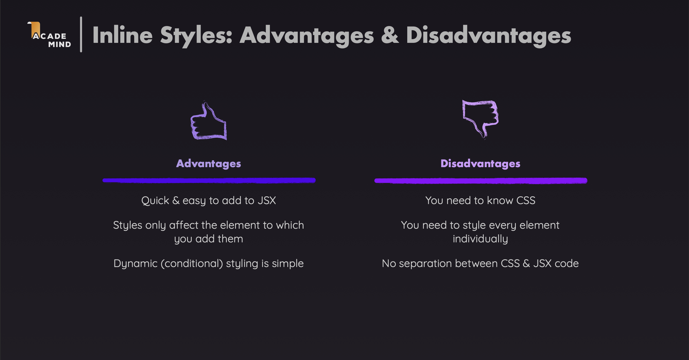
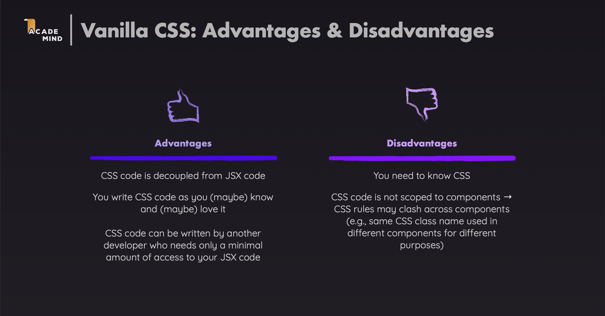
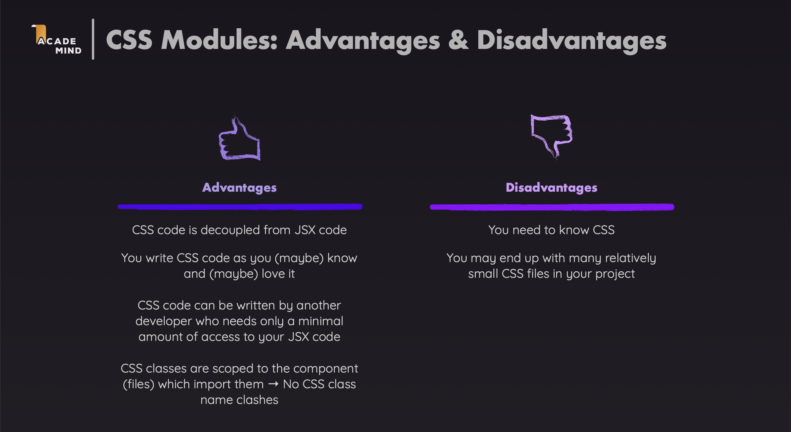
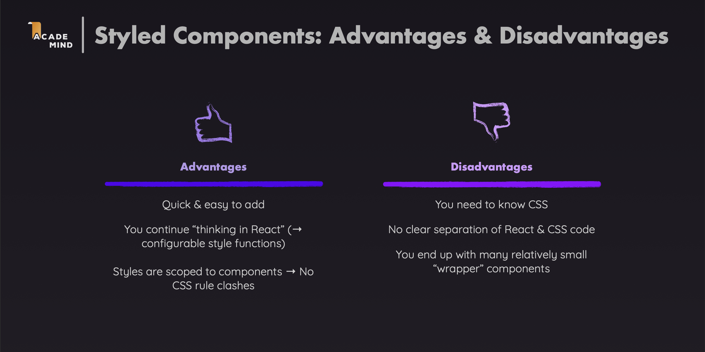
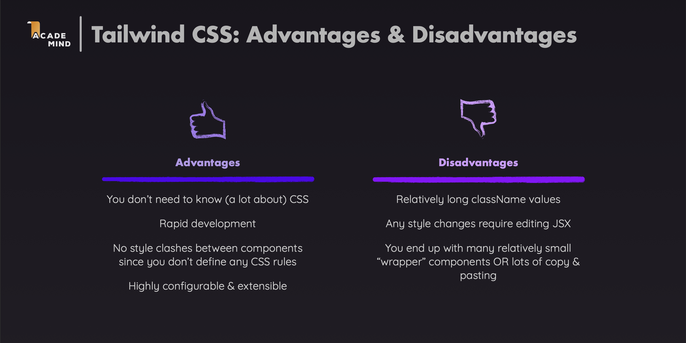

# Styling React Components

This module provides a comparison of different styling approaches in React. Each section includes examples and links to official documentation.

## Core Terminology

### CSS

- CSS (Cascading Style Sheets) is a stylesheet language used to describe the presentation of a document written in HTML or XML.
- CSS describes how HTML elements should be displayed on screen, on paper, in speech, or on other media.
- CSS is one of the core technologies of the World Wide Web, alongside HTML and JavaScript.

---

## 1. Inline Styling



**Example:**

```jsx
const Button = () => {
  return (
    <button
      style={{
        backgroundColor: "blue",
        color: "white",
        padding: "10px 20px",
        borderRadius: "5px",
      }}
    >
      Click Me
    </button>
  );
};
```

**Documentation:**

- [React Inline Styles](https://react.dev/reference/react-dom/components/common#applying-css-styles)

---

## 2. Vanilla CSS



**Example:**

```jsx
// Button.jsx
import "./Button.css";

const Button = () => {
  return <button className="btn-primary">Click Me</button>;
};
```

```css
/* Button.css */
.btn-primary {
  background-color: blue;
  color: white;
  padding: 10px 20px;
  border-radius: 5px;
}

.btn-primary:hover {
  background-color: darkblue;
}
```

**Documentation:**

- [MDN CSS Documentation](https://developer.mozilla.org/en-US/docs/Web/CSS)
- [CSS Tricks](https://css-tricks.com/)

---

## 3. CSS Modules



**Example:**

```jsx
// Button.jsx
import styles from "./Button.module.css";

const Button = () => {
  return <button className={styles.btnPrimary}>Click Me</button>;
};
```

```css
/* Button.module.css */
.btnPrimary {
  background-color: blue;
  color: white;
  padding: 10px 20px;
  border-radius: 5px;
}

.btnPrimary:hover {
  background-color: darkblue;
}
```

**Documentation:**

- [CSS Modules](https://github.com/css-modules/css-modules)
  
---

## 4. Styled Components



**Example:**

```jsx
import styled from "styled-components";

const Button = styled.button`
  background-color: ${(props) => (props.primary ? "blue" : "gray")};
  color: white;
  padding: 10px 20px;
  border-radius: 5px;

  &:hover {
    background-color: darkblue;
  }
`;

const App = () => {
  return (
    <>
      <Button primary>Primary Button</Button>
      <Button>Secondary Button</Button>
    </>
  );
};
```

**Documentation:**

- [Styled Components](https://styled-components.com/)
- [Styled Components Documentation](https://styled-components.com/docs)

---

## 5. Tailwind CSS



**Example:**

```jsx
const Button = ({ primary }) => {
  return (
    <button
      className={`
      px-5 py-2 rounded
      ${
        primary
          ? "bg-blue-500 hover:bg-blue-600 text-white"
          : "bg-gray-500 hover:bg-gray-600 text-white"
      }
    `}
    >
      Click Me
    </button>
  );
};
```

**Documentation:**

- [Tailwind CSS](https://tailwindcss.com/)
- [Tailwind CSS Documentation](https://tailwindcss.com/docs)
- [Tailwind CSS with React](https://tailwindcss.com/docs/guides/create-react-app)

---

## Summary

Each styling approach has its own strengths and weaknesses. Choose based on:

- **Project size**: Small projects might benefit from inline styles or vanilla CSS, while larger projects may need CSS Modules or styled-components
- **Team preferences**: Consider your team's familiarity with each approach
- **Performance requirements**: CSS Modules and Tailwind CSS offer better performance than CSS-in-JS solutions
- **Dynamic styling needs**: Styled Components excel at dynamic styling, while Tailwind CSS requires conditional classes
