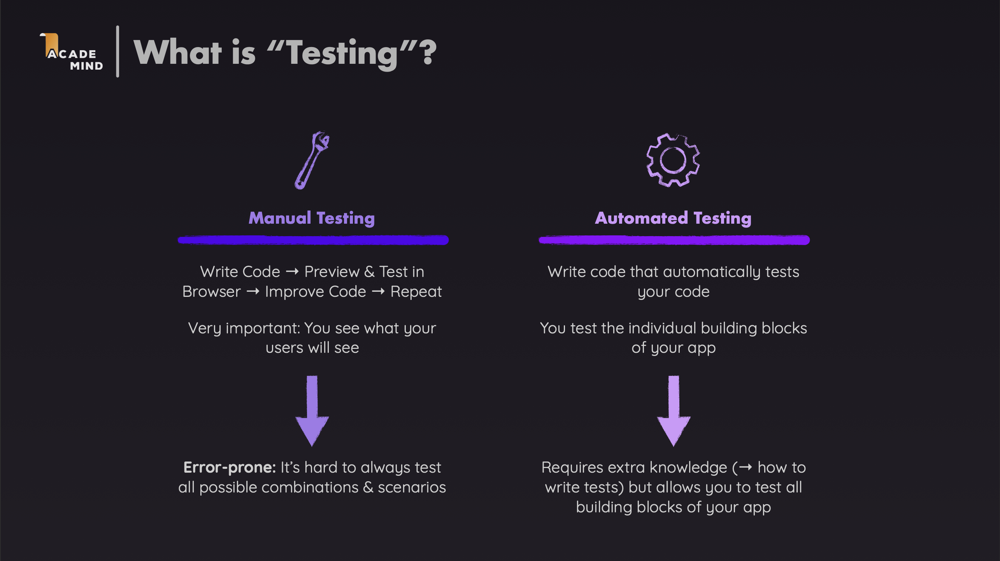
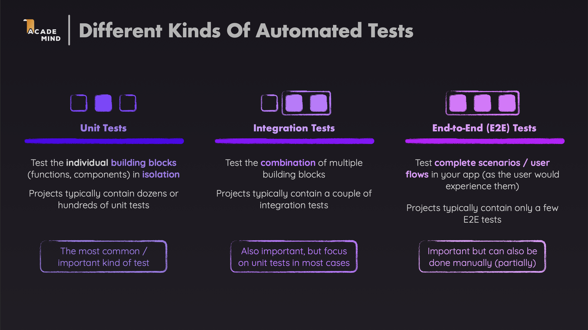
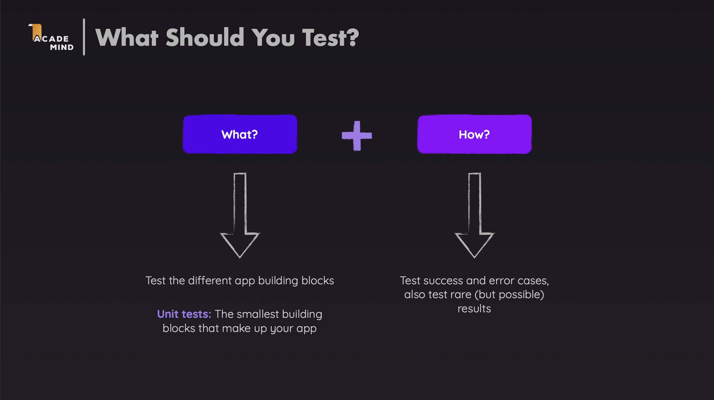
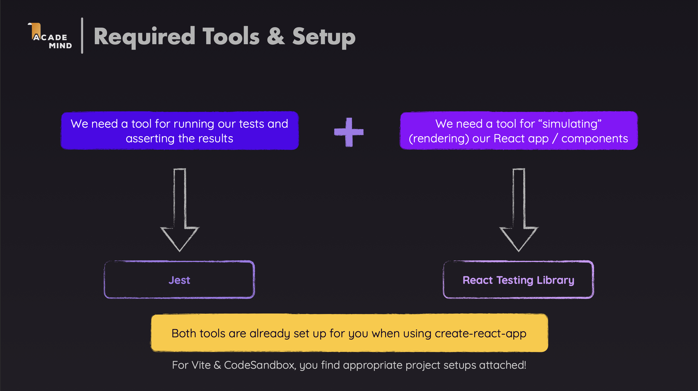
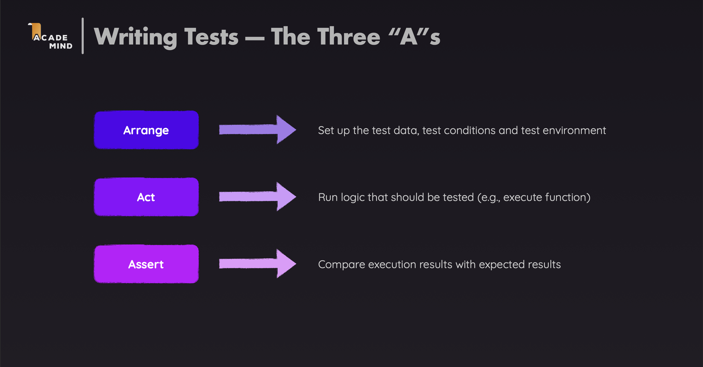

# React Unit Testing with TypeScript

A comprehensive demo application demonstrating **Unit Testing** patterns and best practices in React with **TypeScript**, using React Testing Library and Jest.

---

## Core Terminology

### Overview of Testing

**Testing** is the process of verifying that software works as expected. There are two main approaches:



### Types of Automated Testing

Automated testing can be categorized into different levels:



### What to Test and How to Test

**What to Test**: Test the different app building blocks. **Unit tests** focus on the smallest building blocks that make up your app, such as individual components, functions, and hooks. These are the fundamental pieces that work together to create your application.

**How to Test**: Test success and error cases, and also test rare (but possible) results. This means verifying that your code handles both expected scenarios (happy paths) and unexpected situations (error handling, edge cases, boundary conditions). By testing various outcomes, you ensure your application is robust and reliable.



### Testing Tools

**Jest** is a JavaScript testing framework that provides a test runner to execute tests and report results, assertions (like `expect()`) to verify expected outcomes, mocking capabilities for functions and modules, code coverage reports, and snapshot testing to capture component output for comparison. **Key Jest Functions**:

- `describe(name, fn)`: Groups related tests together (test suite)
- `test(name, fn)` or `it(name, fn)`: Defines a single test case
- `expect(value)`: Creates an assertion about a value
- `beforeEach(fn)`: Runs before each test in the suite
- `afterEach(fn)`: Runs after each test in the suite
- `jest.fn()`: Creates a mock function
- `jest.mock()`: Mocks a module

**React Testing Library** is a testing utility for React components that encourages testing from the user's perspective, provides utilities to render components and query the DOM, focuses on accessibility and user interactions, and works seamlessly with Jest. **Key React Testing Library Functions**:

- `render(component)`: Renders a React component into a virtual DOM

  - **Input**: React component (JSX element)
  - **Returns**: Object with utilities and container element

- `screen`: Object containing query methods to find elements

  - `screen.getByText(text, options?)`: Finds element by text content
  - `screen.getByRole(role, options?)`: Finds element by accessible role
  - `screen.getByLabelText(text, options?)`: Finds input by label text
  - `screen.queryByText(text, options?)`: Returns null if not found (doesn't throw)
  - `screen.findByText(text, options?)`: Async, waits for element to appear

- `waitFor(fn, options?)`: Waits for async updates to complete

  - **Input**: Function that returns a promise or throws
  - **Options**: `{ timeout?: number }`

- `userEvent`: Library for simulating user interactions
  - `userEvent.setup()`: Creates a user instance
  - `user.click(element)`: Simulates a click (async)
  - `user.type(element, text)`: Simulates typing (async)



### Query Types: getBy vs queryBy vs findBy

Understanding the difference between query types is crucial for writing effective tests:

- **getBy**: Throws error if element not found - use when you expect the element to exist
- **queryBy**: Returns `null` if element not found (doesn't throw) - use when testing for element absence
- **findBy**: Async query that waits for element to appear - use for elements that appear after async operations

The same pattern applies to `getAllBy`, `queryAllBy`, and `findAllBy` for multiple elements.

### Test Suite and Test Case

**Test Suite**: A collection of related test cases grouped together using `describe()`. It helps organize tests and provides a shared context.

```typescript
describe("Greeting component", () => {
  // All tests related to Greeting component
});
```

**Test Case**: A single test that verifies a specific behavior using `test()` or `it()`.

```typescript
test("renders Hello World as a text", () => {
  // Test implementation
});
```

---

## Installation & Running Tests

### Installation

For detailed installation and setup instructions, refer to the official documentation:

- [Jest Documentation](https://jestjs.io/docs/getting-started)
- [React Testing Library Documentation](https://testing-library.com/react)

### Running Tests

Run all tests:

```bash
npm test
```

Run tests in watch mode (automatically re-runs when files change):

```bash
npm test -- --watch
```

Run tests with coverage report:

```bash
npm test -- --coverage
```

Run tests for a specific file:

```bash
npm test -- Greeting.test.tsx
```

---

## Basic: Basic Testing Concepts

### The AAA Pattern (Arrange-Act-Assert)



### Example 1: Rendering and Querying Components

**When to use**: When you need to test basic component rendering and text content.

**File: `src/components/Greeting.test.tsx`**

```typescript
import { render, screen } from "@testing-library/react";
import Greeting from "./Greeting";

test("renders Hello World as a text", () => {
  // Arrange: Render the component
  render(<Greeting />);

  // Act: Query for the element (implicit - component already rendered)
  const helloWorldElement = screen.getByText("Hello World!");

  // Assert: Verify the element exists
  expect(helloWorldElement).toBeInTheDocument();
});
```

**Explanation**:

- `render(<Greeting />)` renders the component into a virtual DOM
- `screen.getByText("Hello World!")` queries for an element containing the text (input: `text` string, optional `options` object; returns HTMLElement or throws if not found)
- Use `getBy*` when you expect the element to exist
- `toBeInTheDocument()` is a custom matcher from `@testing-library/jest-dom` that verifies element existence

### Example 2: Testing User Interactions

**When to use**: When you need to test user interactions like clicks, typing, etc.

**File: `src/components/Greeting.test.tsx`**

```typescript
import userEvent from "@testing-library/user-event";

test('renders "Changed!" if the button was clicked', async () => {
  // Arrange: Set up user instance and render component
  const user = userEvent.setup();
  render(<Greeting />);
  const buttonElement = screen.getByRole("button");

  // Act: Simulate user clicking the button
  await user.click(buttonElement);

  // Assert: Verify the text changed
  const outputElement = screen.getByText("Changed!", { exact: true });
  expect(outputElement).toBeInTheDocument();
});
```

**Explanation**:

- `userEvent.setup()` creates a user instance for simulating interactions (required in v14+)
- `screen.getByRole("button")` finds elements by accessible role (input: `role` string, optional `options` with `name`, `hidden`; returns HTMLElement)
- `getByRole` is recommended as it encourages accessible code
- `user.click(buttonElement)` simulates a click (input: HTMLElement; returns Promise)
- The `await` is necessary because `userEvent` v14+ uses async APIs to simulate real browser behavior

### Example 3: Testing Conditional Rendering

**When to use**: When you need to test components that render different content based on state.

**File: `src/components/Greeting.test.tsx`**

```typescript
test('does not render "Good to see you!" if the button was clicked', async () => {
  // Arrange: Set up and render component
  const user = userEvent.setup();
  render(<Greeting />);
  const buttonElement = screen.getByRole("button");

  // Act: Click the button to change state
  await user.click(buttonElement);

  // Assert: Verify the element is no longer present
  const outputElement = screen.queryByText("Good to see you!");
  expect(outputElement).toBeNull();
});
```

**Explanation**:

- `screen.queryByText("Good to see you!")` queries for an element but returns `null` instead of throwing if not found (input: `text` string, optional `options`; returns HTMLElement or `null`)
- Use `queryBy*` when testing for element absence, and `getBy*` when testing for presence
- `expect(outputElement).toBeNull()` verifies the element is not in the DOM

### Example 4: Testing Async Operations

**When to use**: When you need to test components that fetch data asynchronously.

**File: `src/components/Async.test.tsx`**

```typescript
test("renders posts if request succeeds", async () => {
  // Arrange: Mock the fetch API
  window.fetch = jest.fn();
  (window.fetch as jest.Mock).mockResolvedValueOnce({
    json: async () => [{ id: "p1", title: "First Post" }],
  });

  // Act: Render component (triggers useEffect with fetch)
  render(<Async />);

  // Assert: Wait for async elements to appear
  const listItems = await screen.findAllByRole("listitem");
  expect(listItems).not.toHaveLength(0);
});
```

**Explanation**:

- We mock API calls because real network requests are slow, unreliable, and tests should be independent
- `jest.fn()` creates a mock function that tracks calls and return values
- `window.fetch = jest.fn()` replaces the global fetch to prevent actual network requests
- `mockResolvedValueOnce(value)` configures the mock to return a resolved promise (only affects the next call)
- `screen.findAllByRole("listitem")` waits for async elements to appear (input: `role` string, optional `options`; returns Promise<HTMLElement[]>)
- Use `findBy*` or `findAllBy*` for elements that appear after async operations
- It retries until elements are found or timeout (default: 1000ms)

---

## Advanced: Advanced Testing Patterns

This section covers more complex testing scenarios and patterns.

### Example 1: Testing Forms and Validation

**When to use**: When you need to test form submission, validation errors, and user input.

**File: `src/components/LoginForm.test.tsx`**

```typescript
import { render, screen, waitFor } from "@testing-library/react";
import userEvent from "@testing-library/user-event";
import LoginForm from "./LoginForm";

test("shows validation errors when fields are empty", async () => {
  const user = userEvent.setup();
  const mockOnSubmit = jest.fn();
  render(<LoginForm onSubmit={mockOnSubmit} />);

  const submitButton = screen.getByRole("button", { name: /submit/i });
  await user.click(submitButton);

  await waitFor(() => {
    expect(screen.getByText(/email is required/i)).toBeInTheDocument();
    expect(screen.getByText(/password is required/i)).toBeInTheDocument();
  });

  expect(mockOnSubmit).not.toHaveBeenCalled();
});
```

**Explanation**:

- `waitFor(fn, options?)` waits for an assertion to pass, retrying until it succeeds or times out (input: `fn` function, optional `options` with `timeout` and `interval`; returns Promise)
- Use it when testing async state updates like validation errors
- `jest.fn()` creates a mock for the `onSubmit` callback to verify it's called with correct arguments
- Use `mockClear()` in `beforeEach` to reset call history between tests

**File: `src/components/LoginForm.test.tsx`**

```typescript
test("calls onSubmit with correct values when form is valid", async () => {
  const user = userEvent.setup();
  const mockOnSubmit = jest.fn();
  render(<LoginForm onSubmit={mockOnSubmit} />);

  const emailInput = screen.getByLabelText(/email/i);
  const passwordInput = screen.getByLabelText(/password/i);

  await user.type(emailInput, "test@example.com");
  await user.type(passwordInput, "password123");
  await user.click(screen.getByRole("button", { name: /submit/i }));

  await waitFor(() => {
    expect(mockOnSubmit).toHaveBeenCalledWith(
      "test@example.com",
      "password123"
    );
  });
});
```

**Explanation**:

- `screen.getByLabelText(/email/i)` finds inputs by their label (input: `text` string or RegExp; returns HTMLElement)
- It's more accessible than `getByPlaceholderText` and encourages proper form labeling
- `user.type(element, text)` simulates typing character by character (input: HTMLElement and `text` string; returns Promise)
- It fires keyboard events for each character
- `waitFor()` is needed because form submission triggers async validation, and `onSubmit` may be called asynchronously

### Example 2: Testing Error Handling and Loading States

**When to use**: When you need to test components with loading and error states.

**File: `src/components/UserProfile.test.tsx`**

```typescript
test("shows loading state initially", () => {
  (global.fetch as jest.Mock).mockImplementation(
    () =>
      new Promise(() => {
        // Never resolves to keep loading state
      })
  );

  render(<UserProfile userId={1} />);
  expect(screen.getByRole("status")).toHaveTextContent("Loading...");
});
```

**Explanation**:

- `mockImplementation(fn)` replaces the mock's implementation (input: `fn` function; returns mock)
- By returning a promise that never resolves, the component stays in loading state, allowing us to test the loading UI
- `screen.getByRole("status")` finds elements with the "status" ARIA role (input: `role` string; returns HTMLElement)
- The "status" role is semantic and encourages accessible code

**File: `src/components/UserProfile.test.tsx`**

```typescript
test("displays error message when fetch fails", async () => {
  (global.fetch as jest.Mock).mockResolvedValueOnce({
    ok: false,
  });

  render(<UserProfile userId={1} />);

  await waitFor(() => {
    expect(screen.getByRole("alert")).toHaveTextContent(
      /error: failed to fetch user/i
    );
  });
});
```

**Explanation**:

- `mockResolvedValueOnce({ ok: false })` mocks a failed HTTP response (the `ok: false` simulates a non-2xx status)
- This allows testing error handling without network failures
- `screen.getByRole("alert")` finds elements with the "alert" ARIA role (input: `role` string; returns HTMLElement), which indicates important error messages
- `waitFor()` is necessary because error states are set asynchronously after the fetch promise resolves

### Example 3: Testing with Context API

**When to use**: When you need to test components that use Context.

**File: `src/components/ThemeToggle.test.tsx`**

```typescript
import { ThemeProvider } from "../context/ThemeContext";
import ThemeToggle from "./ThemeToggle";

// Helper function to render with providers
const renderWithTheme = (ui: React.ReactElement) => {
  return render(<ThemeProvider>{ui}</ThemeProvider>);
};

test("toggles theme when button is clicked", async () => {
  const user = userEvent.setup();
  renderWithTheme(<ThemeToggle />);

  const toggleButton = screen.getByRole("button", { name: /toggle theme/i });
  await user.click(toggleButton);

  expect(screen.getByText(/current theme: dark/i)).toBeInTheDocument();
});
```

**Explanation**:

- `renderWithTheme(ui)` is a custom render helper that wraps components with providers (input: `ui` ReactElement; returns same as `render()`)
- It's reusable, ensures consistent setup, and makes tests cleaner
- Components using `useContext` require a Provider in the tree; without it, `useContext` returns `undefined`
- Create helpers for common provider combinations, especially when testing components with multiple contexts

### Example 4: Testing Custom Hooks

**When to use**: When you need to test custom hooks independently.

**File: `src/hooks/useCounter.test.ts`**

```typescript
import { renderHook, act } from "@testing-library/react";
import { useCounter } from "./useCounter";

test("increments count", () => {
  const { result } = renderHook(() => useCounter(0));

  act(() => {
    result.current.increment();
  });

  expect(result.current.count).toBe(1);
});
```

**Explanation**:

- `renderHook(hook)` renders a hook in isolation without a component (input: `hook` function; returns object with `result`, `rerender`, `unmount`)
- It allows testing hook logic independently
- `act(fn)` wraps state updates to ensure React processes them before assertions (input: `fn` function; returns void)
- React batches updates, so `act` ensures all updates and effects are flushed
- Always wrap state updates when testing hooks
- Access hook return values through `result.current`

**File: `src/hooks/useCounter.test.ts`**

```typescript
test("resets count to initial value", () => {
  const { result } = renderHook(() => useCounter(10));

  act(() => {
    result.current.increment();
    result.current.increment();
  });

  expect(result.current.count).toBe(12);

  act(() => {
    result.current.reset();
  });

  expect(result.current.count).toBe(10);
});
```

**Explanation**:

- Multiple `act()` calls test sequences of state updates, with each ensuring updates are processed before the next
- `result.current` updates after each `act()`, allowing verification of intermediate states
- Testing hooks independently is faster (no DOM rendering), focuses on logic, and makes edge cases easier to test

---

## Summary

React Unit Testing with TypeScript enables you to write reliable and maintainable tests:

1. **Basic Testing**: Render components, query elements, test user interactions
2. **Async Testing**: Mock fetch, test loading/error states, use `findBy*` queries
3. **Form Testing**: Test validation, form submission, user input
4. **Context Testing**: Create custom render functions with providers
5. **Hook Testing**: Use `renderHook` and `act` wrapper

---

## Learn More

After mastering the basic and advanced concepts above, you can continue learning the following topics:

### 1. Testing Performance

**Performance Testing** includes testing component re-renders, memoization, lazy loading, and measuring render performance. These techniques help ensure your application performs well under various conditions and user interactions.

**Documentation**: [React Performance Testing](https://react.dev/learn/render-and-commit)

### 2. Testing Accessibility

**Accessibility Testing** includes testing ARIA attributes, keyboard navigation, screen reader compatibility, and using `@testing-library/jest-dom` matchers. Ensuring your components are accessible makes your application usable by everyone, including users with disabilities.

**Documentation**: [Testing Accessibility](https://testing-library.com/docs/dom-testing-library/api-accessibility)

### 3. Code Coverage

**Code Coverage** helps identify untested code by running tests with coverage using `npm test -- --coverage`. While aiming for high coverage is good, focus on critical paths and use coverage reports to find gaps in your test suite.

**Documentation**: [Jest Coverage](https://jestjs.io/docs/cli#--coverage)

### 4. Mocking Strategies

**Mocking** techniques include mocking modules with `jest.mock()`, functions with `jest.fn()`, API calls with `fetch` mocking, and timers with `jest.useFakeTimers()`. These strategies allow you to isolate units under test and control external dependencies.

**Documentation**: [Jest Mocking](https://jestjs.io/docs/mock-functions)

### 5. Integration Testing

**Integration Testing** tests multiple components together, including component interactions, data flow between components, routing and navigation, and complete user flows. This type of testing ensures that different parts of your application work correctly when combined.

**Documentation**: [Testing Library Best Practices](https://kentcdodds.com/blog/common-mistakes-with-react-testing-library)

---

## References

- [React Testing Library Docs](https://testing-library.com/react)
- [Jest Docs](https://jestjs.io/docs/getting-started)
- [Testing Library Best Practices](https://kentcdodds.com/blog/common-mistakes-with-react-testing-library)
- [React Testing Guide](https://react.dev/learn/testing)
- [TypeScript Testing](https://www.typescriptlang.org/docs/)
