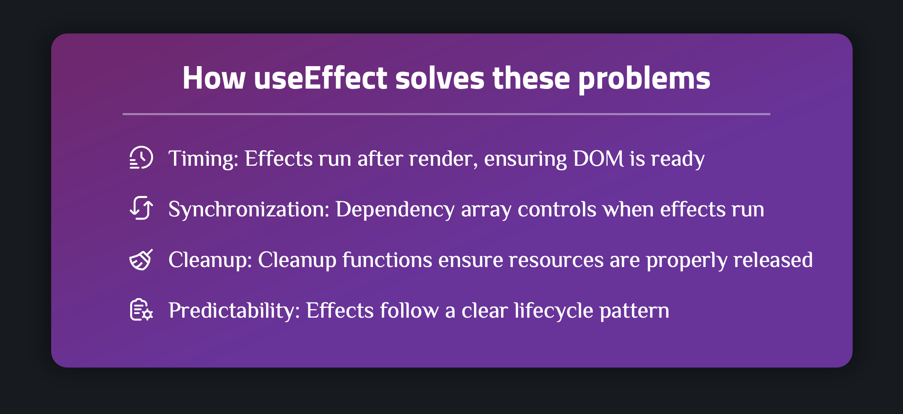
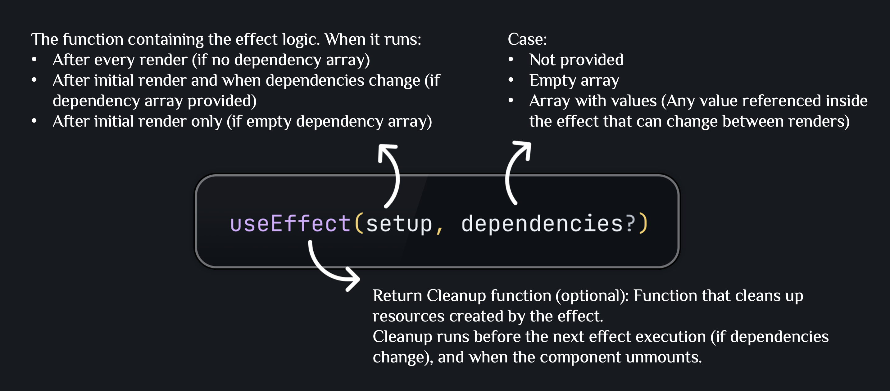
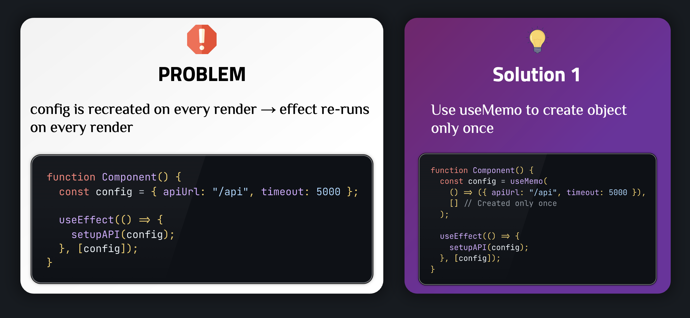
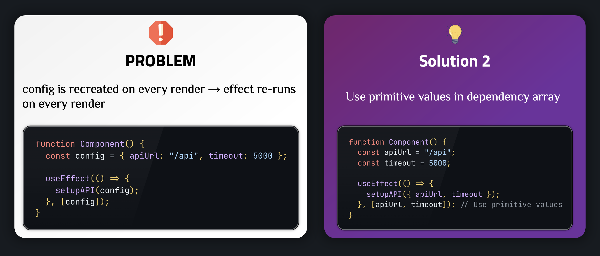
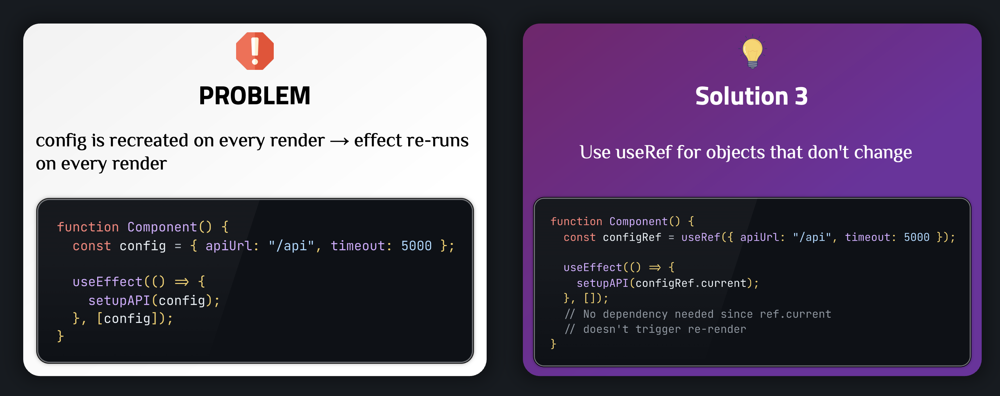
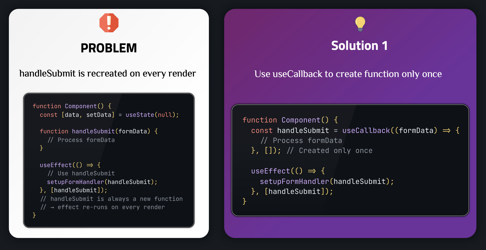
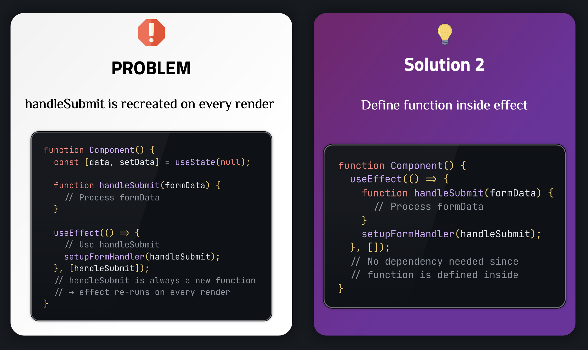
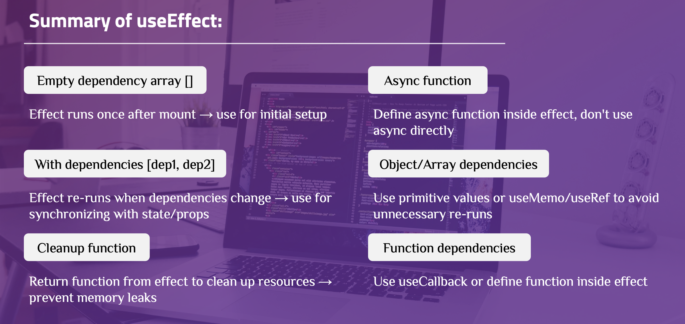

# useEffect hook

## Core terminology

**Side Effects**:

Side effects are operations that occur outside the normal React rendering flow. They are called "side effects" because they can affect other components or systems, and they don't directly contribute to the component's output (JSX).

**Common types of side effects**:

- **Data fetching**: API calls, fetching data from external sources
- **Subscriptions**: WebSocket connections, event listeners, observables
- **Timers**: `setTimeout`, `setInterval`
- **DOM manipulation**: Direct DOM updates, focusing elements, scrolling
- **Local storage**: Reading/writing to `localStorage` or `sessionStorage`
- **Analytics**: Tracking user interactions, page views
- **Third-party integrations**: Initializing libraries, widgets

**Why side effects are problematic**:

1. **Timing issues**: Must run after render, not during, to avoid bugs like infinite loops or race conditions.

2. **Sync issues**: Effects use props/state—if dependencies aren’t accurate, they may run at the wrong time or with stale data.

3. **Cleanup needed**: Effects often create resources (timers, subscriptions, listeners) that must be cleaned up to prevent leaks.

4. **Testing harder**: Side effects rely on outside systems and timing, so they’re tougher to test reliably.



## useEffect Syntax



---

## Basic: Basic useEffect Usage

### Example 1: Effect runs once on mount (Empty Dependency Array)

```javascript
import { useState, useEffect } from "react";

function App() {
  const [availablePlace, setAvailablePlace] = useState([]);

  useEffect(() => {
    navigator.geolocation.getCurrentPosition((position) => {
      const sortedPlaces = sortPlacesByDistance(
        AVAILABLE_PLACES,
        position.coords.latitude,
        position.coords.longitude
      );
      setAvailablePlace(sortedPlaces);
    });
  }, []); // Empty array → runs only once on mount

  return <div>{/* Render places */}</div>;
}
```

**Explanation**:

- `useEffect` takes 2 parameters: effect function and dependency array
- Empty dependency array `[]` → effect runs only once after component mounts
- Suitable for: initial data fetching, setting up subscriptions, getting geolocation

### Example 2: Effect runs when dependency changes

```javascript
import { useRef, useEffect } from "react";

function Modal({ open, onClose, children }) {
  const dialog = useRef();

  useEffect(() => {
    if (open) {
      dialog.current.showModal();
    } else {
      dialog.current.close();
    }
  }, [open]); // Effect re-runs whenever `open` changes

  return (
    <dialog ref={dialog} onClose={onClose}>
      {open ? children : null}
    </dialog>
  );
}
```

**Explanation**:

- Dependency array contains `[open]` → effect re-runs whenever `open` changes
- Suitable for: synchronizing with props/state, updating DOM based on state

### Example 3: Cleanup Function - Cleaning up resources

**Example with setTimeout**:

```javascript
import { useEffect } from "react";

function DeleteConfirmation({ onConfirm, onCancel }) {
  const TIMER = 3000;

  useEffect(() => {
    const timer = setTimeout(() => {
      onConfirm();
    }, TIMER);

    // Cleanup function: runs before effect re-runs or component unmounts
    return () => {
      clearTimeout(timer);
    };
  }, [onConfirm]);

  return <div>{/* Confirmation UI */}</div>;
}
```

**Example with setInterval**:

```javascript
import { useState, useEffect } from "react";

function ProgressBar() {
  const [remainingTime, setRemainingTime] = useState(3000);

  useEffect(() => {
    const interval = setInterval(() => {
      setRemainingTime((prevTime) => prevTime - 10);
    }, 10);

    // Cleanup function: clear interval when component unmounts
    return () => {
      clearInterval(interval);
    };
  }, []); // Runs only once on mount

  return <progress value={remainingTime} max={3000} />;
}
```

**Explanation**:

- Cleanup function is returned from effect
- Runs before effect re-runs (when dependency changes) or component unmounts
- **Important**: Always cleanup timers, subscriptions to avoid memory leaks

### Example 4: Effect runs after every render (no dependency array)

**When to use**: Rarely needed. Usually only for logging or non-critical operations.

**Example**:

```javascript
function Component() {
  const [count, setCount] = useState(0);

  useEffect(() => {
    // Runs after every render
    console.log("Component rendered");
  }); // No dependency array

  return <button onClick={() => setCount(count + 1)}>Count: {count}</button>;
}
```

**Explanation**:

- No dependency array → effect runs after every render
- **Warning**: Can cause performance issues if effect performs heavy operations
- **Best practice**: Always have dependency array unless truly necessary

---

## Advanced: Advanced useEffect Usage

### Example 1: Effect with multiple dependencies

**Example**:

```javascript
import { useState, useEffect } from "react";

function SearchResults({ query, filters }) {
  const [results, setResults] = useState([]);
  const [loading, setLoading] = useState(false);

  useEffect(() => {
    async function fetchResults() {
      setLoading(true);
      const data = await searchAPI(query, filters);
      setResults(data);
      setLoading(false);
    }

    fetchResults();
  }, [query, filters]); // Effect re-runs when query OR filters change

  return <div>{/* Render results */}</div>;
}
```

**Explanation**:

- Dependency array has multiple values: `[query, filters]`
- Effect re-runs when any value changes
- **Note**: Ensure all values used in effect are included in dependency array

### Example 2: Effect with async function

**Example**:

```javascript
import { useEffect, useState } from "react";

function UserProfile({ userId }) {
  const [user, setUser] = useState(null);
  const [error, setError] = useState(null);

  useEffect(() => {
    let cancelled = false; // Flag to prevent state update after unmount

    async function fetchUser() {
      try {
        const userData = await fetch(`/api/users/${userId}`).then((res) =>
          res.json()
        );
        if (!cancelled) {
          setUser(userData);
        }
      } catch (err) {
        if (!cancelled) {
          setError(err.message);
        }
      }
    }

    fetchUser();

    // Cleanup: mark request as cancelled
    return () => {
      cancelled = true;
    };
  }, [userId]);

  if (error) return <div>Error: {error}</div>;
  if (!user) return <div>Loading...</div>;
  return <div>{user.name}</div>;
}
```

**Explanation**:

- Cannot use async function directly as effect function
- Solution: define async function inside effect and call it
- Use cleanup with `cancelled` flag to prevent state update after component unmounts

### Example 3: Effect with object/array dependencies

**Problem**: Objects and arrays are recreated on every render → effect re-runs unnecessarily.







**Explanation**:

- Objects and arrays are compared by reference, not by value
- Each render creates new object/array → different reference → effect re-runs
- **Best practice**: Use primitive values in dependency array or use `useMemo`/`useRef`

### Example 4: Effect with function dependencies

**Problem**: Functions are recreated on every render → effect re-runs unnecessarily.





**Explanation**:

- Functions are compared by reference
- **Best practice**: Use `useCallback` or define function inside effect

---

## Summary



---

## Learn More

After mastering the basic and advanced concepts above, you can continue learning the following topics:

### 1. useLayoutEffect - Synchronous with DOM updates

**useLayoutEffect** is similar to `useEffect` but runs synchronously after DOM updates but before browser paint.

**When to use**:

- When you need to measure DOM (size, position)
- When you need to update DOM before browser paint to avoid flicker
- When you need to read layout and trigger synchronous re-render

**Example**:

```javascript
import { useLayoutEffect, useRef, useState } from "react";

function Tooltip({ children }) {
  const [height, setHeight] = useState(0);
  const ref = useRef();

  useLayoutEffect(() => {
    // Measure DOM after update but before paint
    setHeight(ref.current.offsetHeight);
  }, [children]);

  return (
    <div ref={ref} style={{ height }}>
      {children}
    </div>
  );
}
```

**Documentation**: [useLayoutEffect](https://react.dev/reference/react/useLayoutEffect)

### 2. useEffect with Event Listeners

**Pattern** for adding and removing event listeners:

**Example**:

```javascript
function useKeyPress(targetKey) {
  const [keyPressed, setKeyPressed] = useState(false);

  useEffect(() => {
    function downHandler({ key }) {
      if (key === targetKey) {
        setKeyPressed(true);
      }
    }

    function upHandler({ key }) {
      if (key === targetKey) {
        setKeyPressed(false);
      }
    }

    window.addEventListener("keydown", downHandler);
    window.addEventListener("keyup", upHandler);

    return () => {
      window.removeEventListener("keydown", downHandler);
      window.removeEventListener("keyup", upHandler);
    };
  }, [targetKey]);

  return keyPressed;
}
```

### 3. useEffect with localStorage/sessionStorage

**Pattern** for synchronizing state with localStorage:

**Example**:

```javascript
function useLocalStorage(key, initialValue) {
  const [storedValue, setStoredValue] = useState(() => {
    try {
      const item = window.localStorage.getItem(key);
      return item ? JSON.parse(item) : initialValue;
    } catch (error) {
      return initialValue;
    }
  });

  useEffect(() => {
    try {
      window.localStorage.setItem(key, JSON.stringify(storedValue));
    } catch (error) {
      console.error(error);
    }
  }, [key, storedValue]);

  return [storedValue, setStoredValue];
}
```

### 4. Performance Optimization with useEffect

**Techniques**:

- Avoid unnecessary effect re-runs with correct dependency array
- Use cleanup to prevent memory leaks
- Debounce/throttle for expensive operations
- Use `useMemo` and `useCallback` to stabilize dependencies

**Example - Debounce**:

```javascript
function useDebounce(value, delay) {
  const [debouncedValue, setDebouncedValue] = useState(value);

  useEffect(() => {
    const handler = setTimeout(() => {
      setDebouncedValue(value);
    }, delay);

    return () => {
      clearTimeout(handler);
    };
  }, [value, delay]);

  return debouncedValue;
}
```

### 5. Testing Components with useEffect

**Testing** components using useEffect:

- Mock timers with `jest.useFakeTimers()`
- Test cleanup functions
- Test effect runs with different dependencies
- Test async operations in effects

**Example**:

```javascript
import { render, waitFor } from "@testing-library/react";
import { jest } from "@jest/globals";

test("effect runs on mount", async () => {
  jest.useFakeTimers();
  const { getByText } = render(<Component />);

  await waitFor(() => {
    expect(getByText("Loaded")).toBeInTheDocument();
  });

  jest.useRealTimers();
});
```

**Documentation**: [Testing React Components](https://react.dev/learn/testing)

---

**References**:

- [React useEffect Documentation](https://react.dev/reference/react/useEffect)
- [React Hooks API Reference](https://react.dev/reference/react)
- [A Complete Guide to useEffect](https://overreacted.io/a-complete-guide-to-useeffect/)
- [React Hooks Best Practices](https://react.dev/learn/escape-hatches)
