# useRef and Portal

## Core Terminology

**Refs**:

Refs (references) are a way to access DOM elements or store mutable values that persist across renders without causing re-renders. Unlike state, updating a ref does not trigger a component re-render.

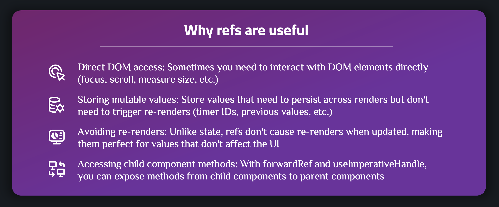

**useRef Syntax**:

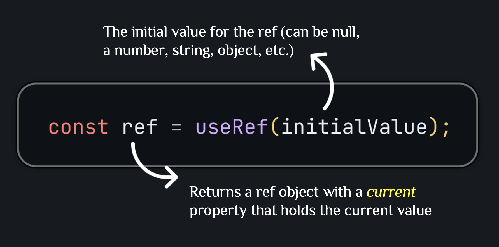

**useRef vs useState**:

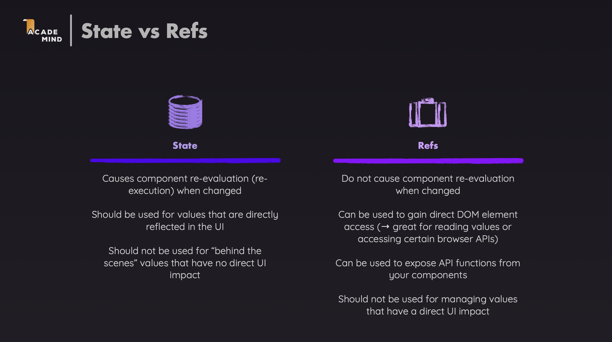

---

## Basic: Basic useRef Usage

This section guides you through using useRef in the most basic scenarios.

### Example 1: Accessing DOM Elements

**When to use**: When you need to directly interact with a DOM element (focus, scroll, measure, etc.)

**Example from project**:

```1:24:src/components/Player.tsx
import { useState, useRef } from "react";

export default function Player() {
  const name = useRef<HTMLInputElement>(null);
  const [playerName, setPlayerName] = useState<string>("Unknown");

  function handleClick() {
    if (name.current) {
      setPlayerName(name.current.value || "Unknown");
      name.current.value = "";
    }
  }

  return (
    <section id="player">
      <h2>Welcome {playerName || "Unknown"}</h2>
      <p>
        <input type="text" ref={name} />
        <button onClick={handleClick}>Set Name</button>
      </p>
    </section>
  );
}
```

**Explanation**:

- `useRef<HTMLInputElement>(null)` creates a typed ref object
- `ref={name}` attaches the ref to the input element
- `name.current` gives direct access to the DOM element (may be null)
- Always check `if (name.current)` before accessing properties
- `name.current.value` accesses/modifies the input value
- Updating `name.current.value` does NOT trigger re-render

**Common DOM operations**:

- `ref.current?.focus()` - Focus the element (with optional chaining)
- `ref.current?.scrollIntoView()` - Scroll element into view
- `ref.current?.value` - Get/set input value
- `ref.current?.offsetHeight` - Measure element height

### Example 2: Storing Mutable Values (Timer IDs)

**When to use**: When you need to store values that persist across renders but don't need to trigger re-renders.

**Example from project**:

```1:73:src/components/TimeChallenge.tsx
import { useState, useRef } from "react";
import ResultModal, { ModalRef } from "./ResultModal";

interface TimeChallengeProps {
  title: string;
  targetime: number;
}

export default function TimeChallenge({
  title,
  targetime,
}: TimeChallengeProps) {
  const timer = useRef<number | undefined>(undefined);
  const dialog = useRef<ModalRef | null>(null);

  const [timeRemaining, setTimeRemaining] = useState<number>(
    targetime * 1000
  );

  const isTimerActive =
    timeRemaining > 0 && timeRemaining < targetime * 1000;

  if (timeRemaining <= 0) {
    if (timer.current) {
      clearInterval(timer.current);
    }
    dialog.current?.open();
  }

  function handleReset() {
    setTimeRemaining(targetime * 1000);
  }

  function handleStart() {
    timer.current = setInterval(() => {
      setTimeRemaining((prevTimeRemaining) => prevTimeRemaining - 10);
    }, 10);
  }

  function handleStop() {
    if (timer.current) {
      clearInterval(timer.current);
    }
    dialog.current?.open();
  }

  return (
    <>
      <ResultModal
        ref={dialog}
        targetTime={targetime}
        remainingTime={timeRemaining}
        onReset={handleReset}
      />
      <section className="challenge">
        <h2>{title}</h2>
        <p className="challenge-time">
          {targetime} second{targetime > 1 ? "s" : ""}
        </p>
        <p>
          <button onClick={isTimerActive ? handleStop : handleStart}>
            {isTimerActive ? "Stop" : "Start"} challenge
          </button>
        </p>
        <p className={isTimerActive ? "active" : undefined}>
          {isTimerActive ? "Timer is running..." : "Timer inactive"}
        </p>
      </section>
    </>
  );
}
```

**Explanation**:

- `timer.current` stores the interval ID returned by `setInterval`
- Type `useRef<number | undefined>` ensures type safety
- The interval ID persists across renders without causing re-renders
- `clearInterval(timer.current)` cleans up the timer (with null check)
- `dialog.current` stores a reference to the child component (ref can be passed as a prop in React 19)
- Use optional chaining `?.` to safely call methods

**Why not useState?**:

- Timer ID doesn't affect UI rendering
- Storing in state would cause unnecessary re-renders
- Ref persists the value without triggering updates

### Example 3: Storing Previous Values

**When to use**: When you need to compare current value with previous value.

**Example**:

```typescript
import { useState, useRef, useEffect } from "react";

function Counter() {
  const [count, setCount] = useState<number>(0);
  const prevCountRef = useRef<number | undefined>(undefined);

  useEffect(() => {
    prevCountRef.current = count;
  });

  const prevCount = prevCountRef.current;

  return (
    <div>
      <p>Current: {count}</p>
      <p>Previous: {prevCount ?? "N/A"}</p>
      <button onClick={() => setCount(count + 1)}>Increment</button>
    </div>
  );
}
```

**Explanation**:

- `prevCountRef.current` stores the previous count value
- Type `useRef<number | undefined>` ensures type safety
- Updated in `useEffect` to run after render
- Doesn't trigger re-render when updated
- Useful for tracking changes
- Use nullish coalescing `??` to handle undefined values

---

## Advanced: Advanced useRef Usage

This section guides you through more advanced patterns with useRef, including `useImperativeHandle`.

### Example 1: useImperativeHandle - Exposing Methods to Parent

**When to use**: When you want to expose specific methods from a child component to its parent via ref.

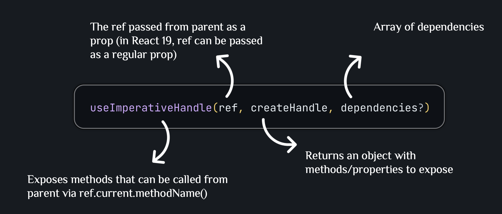

**Example from project** (React 19 - ref as prop):

```1:63:src/components/ResultModal.tsx
import { useImperativeHandle, useRef } from "react";
import { createPortal } from "react-dom";

interface ResultModalProps {
  targetTime: number;
  remainingTime: number;
  onReset: () => void;
  ref: React.Ref<ModalRef>;
}

export interface ModalRef {
  open: () => void;
}

function ResultModal({
  targetTime,
  remainingTime,
  onReset,
  ref,
}: ResultModalProps) {
  const dialog = useRef<HTMLDialogElement>(null);

  const userLost = remainingTime <= 0;
  const formattedRemainingTime = (remainingTime / 1000).toFixed(2);
  const score = Math.round((1 - remainingTime / (targetTime * 1000)) * 100);

  useImperativeHandle(ref, () => {
    return {
      open() {
        dialog.current?.showModal();
      },
    };
  });

  const modalContainer = document.getElementById("modal");

  if (!modalContainer) {
    console.error("Modal container not found");
    return null;
  }

  return createPortal(
    <dialog ref={dialog} className="result-modal" onClose={onReset}>
      {userLost && <h2>You lost</h2>}
      {!userLost && <h2>You score: {score}</h2>}
      <p>
        The target time was <strong>{targetTime} seconds.</strong>
      </p>
      <p>
        You stopped the timer with{" "}
        <strong>{formattedRemainingTime} second left.</strong>
      </p>
      <form method="dialog" onSubmit={onReset}>
        <button>Close</button>
      </form>
    </dialog>,
    modalContainer
  );
}

export default ResultModal;
```

**Note**: In React 19, you can pass `ref` as a regular prop. No need for `forwardRef` anymore.

**Explanation**:

- `useImperativeHandle` customizes what the parent can access via ref
- Returns an object with `open()` method typed via `ModalRef` interface
- Parent can call `dialog.current?.open()` to open the modal (with optional chaining)
- Only exposes what you want, not the entire component instance
- Always check if modal container exists before using `createPortal`

**Usage in parent**:

```19:23:src/components/TimeChallenge.tsx
  if (timeRemaining <= 0) {
    if (timer.current) {
      clearInterval(timer.current);
    }
    dialog.current?.open();
  }
```

```40:45:src/components/TimeChallenge.tsx
  function handleStop() {
    if (timer.current) {
      clearInterval(timer.current);
    }
    dialog.current?.open();
  }
```

**Why use useImperativeHandle?**:

- Control what parent can access (encapsulation)
- Expose only necessary methods
- Better than exposing entire component instance
- TypeScript ensures type safety with interfaces

**TypeScript key points**:

- Define `ModalRef` interface to type the exposed methods
- Export `ModalRef` interface for use in parent component
- Use `React.Ref<ModalRef>` to type the ref prop
- `useRef<HTMLDialogElement>(null)` for dialog element
- Always check if container exists before using `createPortal`
- Optional chaining `?.` for safe method calls

### Example 2: Portal - Rendering Outside Parent DOM

**Portals**:

Portals provide a way to render children into a DOM node that exists outside the parent component's DOM hierarchy. This is useful for modals, tooltips, and other UI elements that need to break out of their parent's styling constraints.

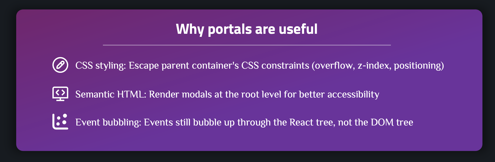
**When to use**: When you need to render content outside the parent component's DOM hierarchy (modals, tooltips, dropdowns).

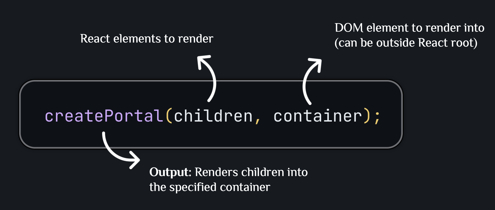

**Example from project**:

```47:62:src/components/ResultModal.tsx
  return createPortal(
    <dialog ref={dialog} className="result-modal" onClose={onReset}>
      {userLost && <h2>You lost</h2>}
      {!userLost && <h2>You score: {score}</h2>}
      <p>
        The target time was <strong>{targetTime} seconds.</strong>
      </p>
      <p>
        You stopped the timer with{" "}
        <strong>{formattedRemainingTime} second left.</strong>
      </p>
      <form method="dialog" onSubmit={onReset}>
        <button>Close</button>
      </form>
    </dialog>,
    modalContainer
  );
```

**HTML structure**:

```10:16:index.html
    <div id="modal"></div>
    <div id="content">
      <header>
        <h1>The <em>Almost</em> Final Countdown</h1>
        <p>Stop the timer once you estimate that time is (almost) up</p>
      </header>
      <div id="root"></div>
    </div>
```

**Explanation**:

- Modal is rendered into `<div id="modal">` instead of inside the component tree
- Modal appears at root level, outside `#content` container
- Escapes parent's CSS constraints (overflow, z-index, positioning)
- Events still bubble through React component tree (not DOM tree)
- Always check if container exists before using `createPortal` (TypeScript safety)

**Common use cases**:

- Modals and dialogs
- Tooltips
- Dropdown menus
- Loading overlays
- Notifications

---

## Summary of useRef and Portal

### useRef

1. **Creating refs**: `const ref = useRef<Type>(initialValue)` - Creates a typed ref object
2. **Accessing value**: `ref.current` - Read or write the current value (may be null/undefined)
3. **DOM access**: Attach ref to element with `ref={myRef}` to access DOM directly
4. **Storing mutable values**: Store values that persist without causing re-renders
5. **No re-renders**: Updating `ref.current` does NOT trigger component re-render
6. **Type safety**: Always check `if (ref.current)` or use optional chaining `?.` before access

### useImperativeHandle

1. **Syntax**: `useImperativeHandle(ref, () => ({ method() { ... } }))`
2. **Purpose**: Expose specific methods from child to parent via ref
3. **Control**: Only expose what you want, not entire component instance
4. **TypeScript**: Define interface for exposed methods: `interface ModalRef { open: () => void }`
5. **Type ref prop**: Use `React.Ref<ModalRef>` to type the ref prop

### Portal

1. **Syntax**: `createPortal(children, container)`
2. **Purpose**: Render children into DOM node outside parent hierarchy
3. **Benefits**: Escape CSS constraints, better semantic HTML, improved accessibility
4. **Events**: React events still bubble through component tree

### TypeScript Best Practices

1. **Always type refs**: `useRef<ElementType>(null)` for DOM elements
2. **Check null before access**: Use `if (ref.current)` or optional chaining `?.`
3. **Define interfaces**: Create interfaces for ref types with `useImperativeHandle`
4. **Type props**: Always type component props for better type safety
5. **Generic hooks**: Use generics for reusable hooks like `usePrevious<T>`

---

## Common Patterns and Best Practices

### Pattern 1: Ref for DOM Element with useEffect

**Example**:

```typescript
import { useRef, useEffect } from "react";

function AutoFocusInput() {
  const inputRef = useRef<HTMLInputElement>(null);

  useEffect(() => {
    inputRef.current?.focus();
  }, []);

  return <input ref={inputRef} type="text" />;
}
```

**When to use**: When you need to perform DOM operations after component mounts.

**TypeScript key points**:

- `useRef<HTMLInputElement>(null)` - Type the DOM element
- Use optional chaining `?.` to safely call methods
- TypeScript ensures type safety for DOM operations

### Pattern 2: Ref for Previous Value

**Example**:

```typescript
import { useRef, useEffect } from "react";

function usePrevious<T>(value: T): T | undefined {
  const ref = useRef<T | undefined>(undefined);

  useEffect(() => {
    ref.current = value;
  });

  return ref.current;
}

// Usage
function Counter() {
  const [count, setCount] = useState<number>(0);
  const prevCount = usePrevious<number>(count);

  return (
    <div>
      <p>Current: {count}</p>
      <p>Previous: {prevCount ?? "N/A"}</p>
      <button onClick={() => setCount(count + 1)}>Increment</button>
    </div>
  );
}
```

**When to use**: When you need to track previous values for comparison.

**TypeScript key points**:

- Generic function `<T>` makes it reusable for any type
- Return type `T | undefined` handles initial undefined state
- Type-safe for any value type
- Use nullish coalescing `??` to handle undefined values

### Pattern 3: Ref Callback Pattern

**Example**:

```typescript
import { useState } from "react";

function Component() {
  const [node, setNode] = useState<HTMLDivElement | null>(null);

  return (
    <div ref={(el) => setNode(el)}>
      {node && <p>Element mounted: {node.offsetHeight}px</p>}
    </div>
  );
}
```

**When to use**: When you need to do something when ref is attached/detached.

**TypeScript key points**:

- Type the state: `useState<HTMLDivElement | null>(null)`
- TypeScript infers the ref callback parameter type
- Type-safe DOM measurements

### Pattern 4: Multiple Refs

**Example**:

```typescript
function Form() {
  const nameRef = useRef<HTMLInputElement>(null);
  const emailRef = useRef<HTMLInputElement>(null);
  const messageRef = useRef<HTMLTextAreaElement>(null);

  function handleSubmit(e: React.FormEvent) {
    e.preventDefault();

    if (nameRef.current && emailRef.current && messageRef.current) {
      const data = {
        name: nameRef.current.value,
        email: emailRef.current.value,
        message: messageRef.current.value,
      };
      // Submit data
    }
  }

  return (
    <form onSubmit={handleSubmit}>
      <input ref={nameRef} type="text" />
      <input ref={emailRef} type="email" />
      <textarea ref={messageRef} />
      <button type="submit">Submit</button>
    </form>
  );
}
```

**When to use**: When you need to access multiple DOM elements.

**TypeScript key points**:

- Different element types: `HTMLInputElement`, `HTMLTextAreaElement`
- Type the form event: `React.FormEvent`
- Check all refs before accessing to satisfy TypeScript
- Type-safe form handling

### Pattern 5: Portal with Backdrop

**Example**:

```typescript
import { createPortal } from "react-dom";

interface ModalProps {
  isOpen: boolean;
  onClose: () => void;
  children: React.ReactNode;
}

function Modal({ isOpen, onClose, children }: ModalProps) {
  if (!isOpen) return null;

  const container = document.body;

  return createPortal(
    <>
      <div className="backdrop" onClick={onClose} />
      <div className="modal">{children}</div>
    </>,
    container
  );
}
```

**When to use**: When creating modals with backdrop overlays.

**TypeScript key points**:

- Type props with interface
- `React.ReactNode` for children prop
- `document.body` is always available, no null check needed
- Type-safe component props

---

## TypeScript Types Reference

### Common useRef Types

**DOM Element Refs**:

```typescript
// Input elements
const inputRef = useRef<HTMLInputElement>(null);
const textareaRef = useRef<HTMLTextAreaElement>(null);
const selectRef = useRef<HTMLSelectElement>(null);

// Form elements
const formRef = useRef<HTMLFormElement>(null);
const buttonRef = useRef<HTMLButtonElement>(null);

// Container elements
const divRef = useRef<HTMLDivElement>(null);
const sectionRef = useRef<HTMLElement>(null);

// Media elements
const videoRef = useRef<HTMLVideoElement>(null);
const audioRef = useRef<HTMLAudioElement>(null);

// Dialog/Modal
const dialogRef = useRef<HTMLDialogElement>(null);
```

**Value Refs**:

```typescript
// Numbers
const countRef = useRef<number>(0);
const timerRef = useRef<number | undefined>(undefined);

// Strings
const nameRef = useRef<string>("");

// Objects
interface User {
  name: string;
  age: number;
}
const userRef = useRef<User | null>(null);

// Arrays
const itemsRef = useRef<string[]>([]);
```

**Component Refs with useImperativeHandle**:

```typescript
// Define the exposed interface
interface ChildRef {
  open: () => void;
  close: () => void;
  reset: () => void;
}

// In parent component
const childRef = useRef<ChildRef | null>(null);

// In child component
useImperativeHandle(ref, () => ({
  open() {
    /* ... */
  },
  close() {
    /* ... */
  },
  reset() {
    /* ... */
  },
}));
```

**Type Guards for Safe Access**:

```typescript
// Check before accessing
if (inputRef.current) {
  inputRef.current.focus();
}

// Optional chaining
inputRef.current?.focus();

// Non-null assertion (use carefully!)
inputRef.current!.focus();
```

---

## Common Mistakes and How to Avoid Them

### Mistake 1: Reading ref.current During Render

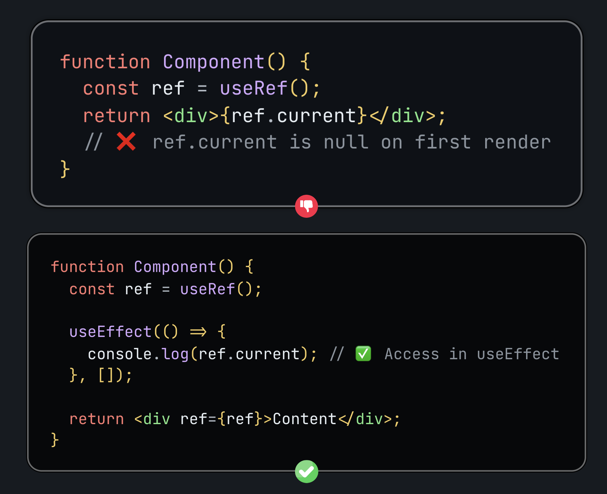

### Mistake 2: Mutating ref.current During Render

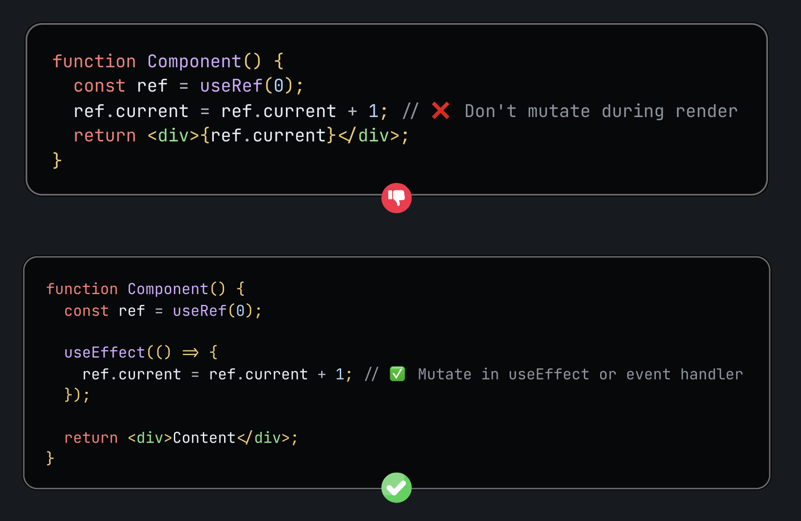

### Mistake 3: Using ref Instead of state

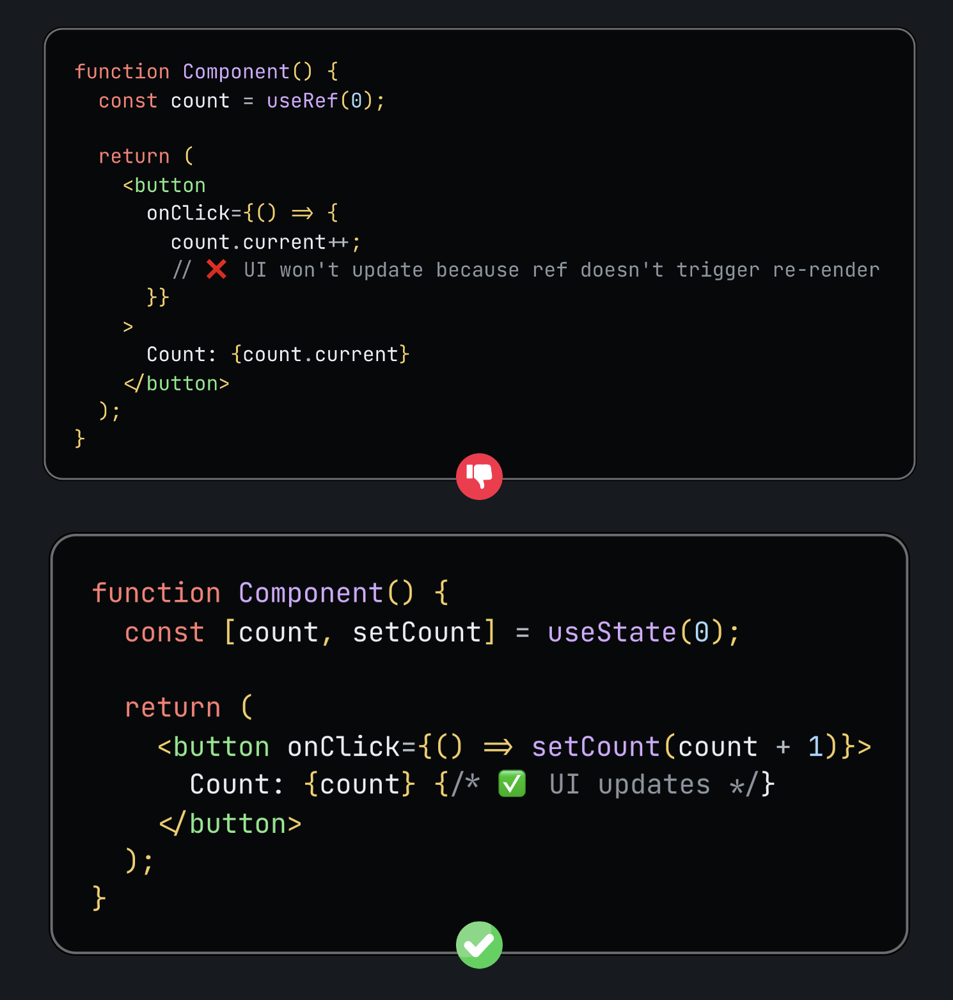

### Mistake 4: Passing ref to Child Component (React 19)

**Note**: In React 19, `ref` can be passed as a regular prop. No need for `forwardRef`.

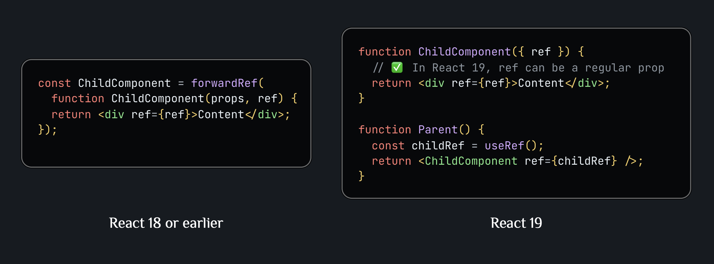

### Mistake 5: Portal Container Not Found

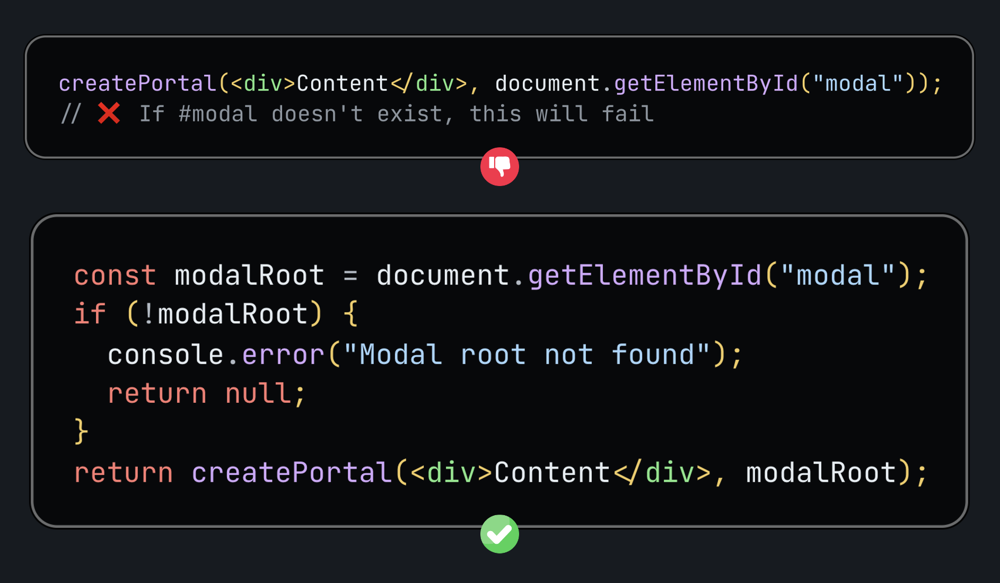

---

**References**:

- [React useRef Documentation](https://react.dev/reference/react/useRef)
- [React useImperativeHandle Documentation](https://react.dev/reference/react/useImperativeHandle)
- [React Portal Documentation](https://react.dev/reference/react-dom/createPortal)
- [React Hooks API Reference](https://react.dev/reference/react)
- [When to Use Refs](https://react.dev/learn/manipulating-the-dom-with-refs)
- [React 19: Ref as a Prop](https://react.dev/blog/2024/04/25/react-19)
